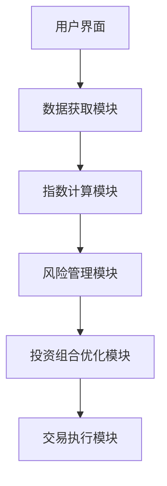
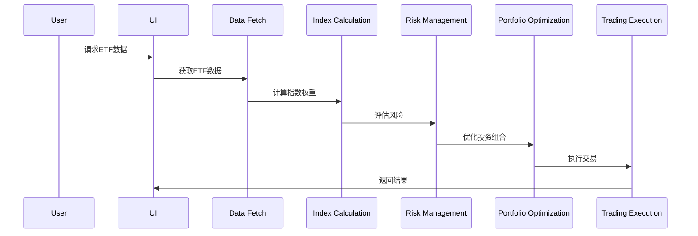

                 


# 约翰·伯格的ETF革命：新一代指数投资工具

> 关键词：ETF, 指数投资, 约翰·伯格, 被动投资, 交易所交易基金

> 摘要：本文深入探讨了约翰·伯格的ETF革命，分析了指数投资工具的核心概念、算法原理、系统架构以及实战案例，帮助读者全面理解ETF的投资价值和应用场景。

---

## 第1章 ETF革命的背景与起源

### 1.1 ETF的起源与发展

#### 1.1.1 ETF的起源

交易所交易基金（ETF）是一种在交易所上市交易的开放式基金，结合了封闭式基金和开放式基金的优点。ETF的起源可以追溯到20世纪70年代，当时投资者开始寻找一种更高效、更透明的投资工具。1975年，约翰·伯格（John C. Bogle）创立了第一只现代意义上的指数基金——先锋500指数基金（Vanguard 500 Index Fund），这为ETF的发展奠定了基础。

#### 1.1.2 约翰·伯格的贡献

约翰·伯格不仅是ETF的先驱，也是指数投资理论的倡导者。他通过降低管理费用和减少交易成本，使得普通投资者能够以更低的成本参与市场投资。伯格的创新理念推动了ETF的普及，使其成为现代投资组合管理中的重要工具。

#### 1.1.3 ETF的定义与特点

ETF是一种追踪特定指数或资产篮子价格的基金，可以在交易所像股票一样买卖。其特点是透明度高、分散风险、费用低，适合长期投资。

### 1.2 ETF的现状与发展趋势

#### 1.2.1 ETF的现状

截至2023年，全球ETF的资产管理规模已超过数万亿美元，成为投资领域的重要组成部分。ETF的种类也不断丰富，涵盖了股票、债券、商品等多种资产类别。

#### 1.2.2 ETF的未来发展趋势

随着技术的进步和投资者对低成本、高透明度投资工具的需求增加，ETF将继续保持增长。特别是智能Beta ETF和因子投资的兴起，进一步拓展了ETF的应用场景。

#### 1.2.3 ETF在投资组合中的重要性

ETF作为分散风险和优化投资组合的重要工具，已成为机构投资者和散户的首选。通过合理配置ETF，投资者可以降低投资风险并提高收益。

---

## 第2章 ETF的核心概念与原理

### 2.1 ETF的核心概念

#### 2.1.1 指数跟踪

ETF的核心原理是通过跟踪特定指数的表现来实现投资收益。例如，标普500指数ETF会跟踪标普500指数的成分股表现。

#### 2.1.2 被动投资策略

ETF采用被动投资策略，即复制指数成分股的权重，减少主动管理的干扰。这种策略降低了管理费用和交易成本。

#### 2.1.3 ETF与传统投资方式的对比

| 对比维度 | ETF | 主动管理型基金 |
|----------|------|----------------|
| 管理方式 | 被动跟踪指数 | 主动选股和择时 |
| 费用 | 低 | 高 |
| 风险 | 分散 | 集中 |

### 2.2 ETF的类型与分类

#### 2.2.1 按指数类型分类

- 股票型ETF：跟踪股票指数。
- 债券型ETF：跟踪债券指数。
- 商品型ETF：跟踪黄金、原油等商品价格。

#### 2.2.2 按投资策略分类

- 市值加权ETF：按成分股的市值权重配置。
- 等权重ETF：按相等权重配置成分股。

---

## 第3章 ETF的算法与数学模型

### 3.1 ETF的指数构建算法

#### 3.1.1 市值加权法

市值加权法是将成分股的权重与其市值成正比分配。公式为：

$$ w_i = \frac{MarketCap_i}{\sum MarketCap_j} $$

其中，\( w_i \) 表示第i只股票的权重，\( MarketCap_i \) 表示第i只股票的市值。

#### 3.1.2 等权重法

等权重法将成分股的权重平均分配。公式为：

$$ w_i = \frac{1}{N} $$

其中，\( N \) 是成分股的数量。

### 3.2 ETF的风险与收益模型

#### 3.2.1 夏普比率

夏普比率衡量了投资组合的风险调整后收益。公式为：

$$ \text{夏普比率} = \frac{E[r] - r_f}{\sigma} $$

其中，\( E[r] \) 是预期收益，\( r_f \) 是无风险利率，\( \sigma \) 是收益的标准差。

---

## 第4章 ETF投资管理系统的设计与实现

### 4.1 系统架构设计

#### 4.1.1 系统功能模块



#### 4.1.2 系统架构图


### 4.2 接口设计与交互流程

#### 4.2.1 系统交互流程



---

## 第5章 ETF项目实战与案例分析

### 5.1 项目环境安装

#### 5.1.1 环境要求

- Python 3.8+
- pandas库
- matplotlib库

### 5.2 核心代码实现

#### 5.2.1 ETF指数计算代码

```python
import pandas as pd

# 加载指数成分股数据
data = pd.read_csv('index_components.csv')

# 计算市值加权权重
data['MarketCap'] = data['MarketCap'].fillna(0)
total_market_cap = data['MarketCap'].sum()
data['Weight'] = data['MarketCap'] / total_market_cap

# 输出权重
print(data[['Ticker', 'Weight']])
```

#### 5.2.2 风险评估代码

```python
import pandas as pd
import numpy as np

# 加载ETF回报数据
returns = pd.read_csv('etf_returns.csv')

# 计算波动率
volatility = returns.std()

print("波动率:", volatility)
```

### 5.3 案例分析

#### 5.3.1 投资组合构建

假设我们有以下两只ETF：

- ETF A：跟踪标普500指数
- ETF B：跟踪纳指100指数

我们计划将资产分配为60%ETF A和40%ETF B。通过计算两只ETF的历史回报率和波动率，评估其风险收益比。

---

## 第6章 最佳实践与投资策略

### 6.1 最佳实践

- **定期再平衡**：定期调整投资组合以维持目标权重。
- **分散投资**：通过投资多种ETF降低风险。
- **长期持有**：避免频繁交易，降低交易成本。

### 6.2 小结

ETF作为一种高效的投资工具，凭借其低成本、高透明度和分散风险的特点，已经成为现代投资组合管理的重要组成部分。通过合理配置ETF，投资者可以实现长期稳健的收益。

### 6.3 注意事项

- **费用问题**：注意ETF的管理费和交易费用。
- **流动性风险**：确保投资的ETF具有足够的流动性。
- **市场风险**：ETF的表现受市场波动影响。

### 6.4 拓展阅读

- 《指数投资：从入门到精通》
- 《ETF投资策略与风险管理》

---

## 作者信息

作者：AI天才研究院/AI Genius Institute & 禅与计算机程序设计艺术 /Zen And The Art of Computer Programming

---

以上是关于《约翰·伯格的ETF革命：新一代指数投资工具》的详细目录大纲和部分章节内容。希望对您有所帮助！

