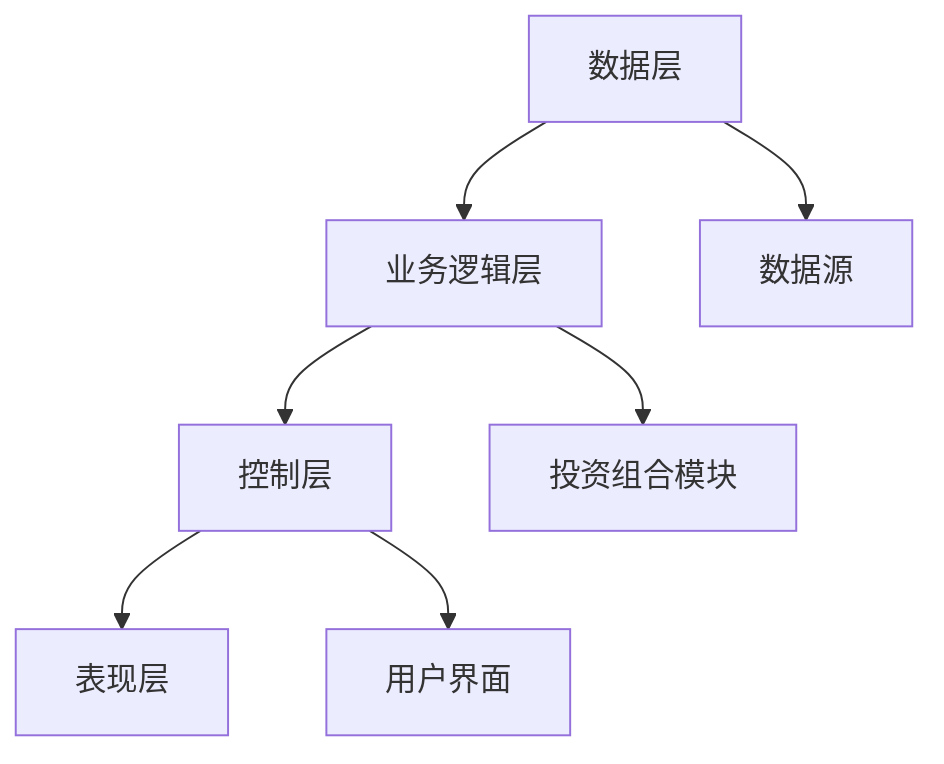

                 

## 第4章：低成本投资系统的架构设计

### 第4.2节：系统架构设计

#### 4.2.1 分层架构设计

系统架构采用分层架构，将系统分为数据层、业务逻辑层、控制层和表现层。

- **数据层**：负责数据的存储和管理，包括市场数据、投资组合数据等。
- **业务逻辑层**：处理核心业务逻辑，如投资组合优化、风险评估等。
- **控制层**：处理用户输入，协调各层交互。
- **表现层**：向用户展示结果和操作界面。

#### 4.2.2 模块之间的关系

模块之间通过接口进行交互，确保各层之间松耦合，便于维护和扩展。

- **数据层与业务逻辑层**：业务逻辑层通过数据访问接口与数据层交互。
- **业务逻辑层与控制层**：控制层通过服务接口调用业务逻辑层的方法。
- **控制层与表现层**：表现层通过控制器处理用户输入，并将请求传递给控制层。

#### 4.2.3 系统的可扩展性设计

系统采用松耦合设计，通过定义良好的接口，使得新增功能模块能够轻松集成到现有架构中。

- **模块化设计**：每个功能模块独立开发和测试，便于替换和升级。
- **插件机制**：支持通过插件方式扩展系统功能，如添加新的投资策略模块。

### Mermaid架构图

### 系统架构设计总结

系统的分层架构确保了各部分职责分明，模块之间的依赖关系清晰，便于维护和扩展。通过合理的设计和接口管理，系统能够适应不同的投资策略和市场变化，保持高效稳定运行。

---

通过以上思考，确保系统架构设计部分清晰明了，便于读者理解和应用。

