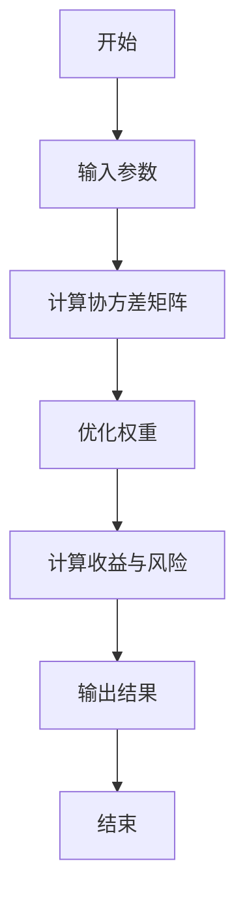
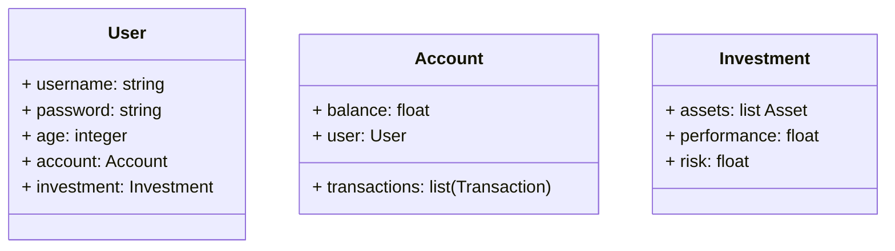
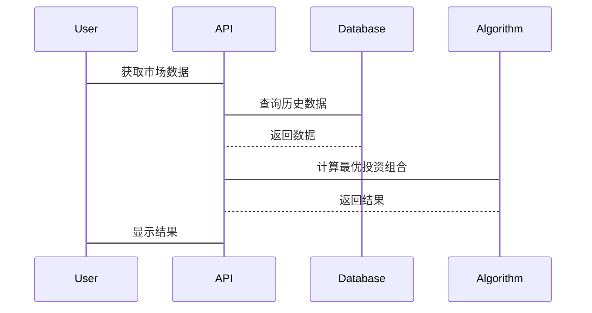

                 


# 约翰·伯格的养老金投资管理原则

## 关键词：养老金投资，约翰·伯格，投资管理，风险管理，资产配置，长期投资

## 摘要：本文系统地介绍约翰·伯格的养老金投资管理原则，涵盖其核心理念、数学模型、算法实现和系统架构设计，旨在为读者提供全面的理论与实践指导。

---

# 第1章: 养老金投资管理的背景与现状

## 1.1 养老金的基本概念与重要性

### 1.1.1 养老金的定义与分类
养老金是为 retired individuals 提供经济支持的制度，分为 Defined Benefit (DB) 和 Defined Contribution (DC) 两类。

### 1.1.2 养老金在个人与社会中的作用
养老金确保退休后的生活质量，减轻社会福利负担。

### 1.1.3 养老金投资管理的必要性
通过投资实现资金保值增值，确保养老金的可持续性。

## 1.2 养老金投资管理的现状

### 1.2.1 全球养老金投资的现状分析
全球养老金规模庞大，投资品种多样化。

### 1.2.2 我国养老金投资管理的特点
起步较晚，但发展迅速，政策支持强烈。

### 1.2.3 养老金投资管理中的主要问题
收益不稳定，投资风险高，监管力度需加强。

## 1.3 约翰·伯格的养老金投资管理原则概述

### 1.3.1 伯格的生平与学术贡献
伯格是著名投资专家，专注于长期投资策略。

### 1.3.2 伯格的核心投资理念
强调长期投资、分散投资和成本控制。

### 1.3.3 伯格原则在养老金管理中的应用
通过分散投资降低风险，实现长期稳定收益。

## 1.4 本章小结
养老金投资管理是保障退休生活的重要手段，伯格的原则提供了科学的指导。

---

# 第2章: 养老金投资管理的核心概念与联系

## 2.1 养老金投资管理的系统架构

### 2.1.1 系统架构的定义
系统架构是整体设计的蓝图。

### 2.1.2 养老金投资管理系统的模块划分
模块包括数据采集、风险评估和投资决策。

### 2.1.3 系统架构的ER图

```mermaid
erDiagram
+-----+      +-----+      +-----+
| User |<--|  Role  |<--| Pension Fund |
+-----+      +-----+      +-----+
```

## 2.2 核心概念的联系与对比

### 2.2.1 养老金与投资收益的关系
通过投资实现资金增值，确保养老金的可持续性。

### 2.2.2 不同投资策略的优劣势对比

| 投资策略 | 优点 | 缺点 |
|----------|------|------|
| 股票投资 | 高收益 | 高风险 |
| 债券投资 | 稳定收益 | 低收益 |

### 2.2.3 投资风险与收益的权衡
高风险可能带来高收益，需根据目标调整风险承受能力。

## 2.3 伯格原则的核心要素

### 2.3.1 长期投资的重要性
分散投资降低风险，实现长期稳定收益。

### 2.3.2 分散投资的风险管理
通过多样化投资降低市场波动影响。

### 2.3.3 成本控制的优化策略
降低管理费用，提高净收益。

## 2.4 本章小结
理解核心概念和伯格原则是有效管理养老金的关键。

---

# 第3章: 养老金投资管理的算法原理

## 3.1 投资组合优化的数学模型

### 3.1.1 现代投资组合理论（MPT）概述
通过优化投资组合降低风险。

### 3.1.2 投资组合优化的数学公式

$$
\text{目标函数：} \quad \min_{w} w^T \Sigma w \\
\text{约束条件：} \quad \sum_{i=1}^n w_i = 1, \quad w_i \geq 0
$$

### 3.1.3 算法流程图



## 3.2 基于伯格原则的优化算法

### 3.2.1 算法的输入与输出
输入：资产列表、目标收益；输出：优化权重。

### 3.2.2 算法的实现步骤

```python
import numpy as np

def optimize_portfolio(assets, target_return):
    # 计算协方差矩阵
    cov_matrix = np.cov(assets)
    # 使用拉格朗日乘数法求解
    # （具体实现可参考投资组合理论）
    return optimized_weights
```

### 3.2.3 算法的Python代码实现
详细实现步骤，包括数据预处理和优化模型。

## 3.3 数学模型和公式

### 3.3.1 夏普比率公式

$$
\text{夏普比率} = \frac{E(r_i - r_f)}{\sigma_i}
$$

### 3.3.2 资本资产定价模型（CAPM）

$$
E(r_i) = r_f + \beta_i (E(r_m) - r_f)
$$

### 3.3.3 投资组合收益公式

$$
E(r_p) = \sum_{i=1}^n w_i E(r_i)
$$

## 3.4 本章小结
数学模型和算法是实现伯格原则的重要工具。

---

# 第4章: 养老金投资管理的系统分析与架构设计

## 4.1 问题场景介绍
构建一个养老金投资管理系统，实现投资决策和风险管理。

## 4.2 项目介绍

### 4.2.1 项目目标
实现养老金投资的智能化管理。

### 4.2.2 项目范围
包括数据采集、风险评估和投资决策模块。

## 4.3 系统功能设计

### 4.3.1 领域模型



### 4.3.2 系统架构设计


## 4.4 系统接口设计

### 4.4.1 API接口设计
包括数据获取、计算服务和决策服务接口。

### 4.4.2 接口交互流程



## 4.5 本章小结
系统架构设计是实现伯格原则的重要保障。

---

# 第5章: 养老金投资管理的项目实战

## 5.1 环境安装

### 5.1.1 安装Python和相关库
安装NumPy、Pandas、SciPy和Matplotlib。

## 5.2 系统核心实现源代码

### 5.2.1 核心代码实现

```python
import numpy as np
import pandas as pd

def compute Sharpe Ratio(returns, risk_free_rate):
    excess_return = returns - risk_free_rate
    sharpe_ratio = excess_return.mean() / excess_return.std()
    return sharpe_ratio

# 示例数据
returns = pd.Series([0.05, 0.02, -0.03, 0.06])
risk_free_rate = 0.02
print(compute Sharpe Ratio(returns, risk_free_rate))
```

### 5.2.2 代码解读与分析
解释代码的功能和实现细节。

## 5.3 实际案例分析

### 5.3.1 案例分析
以某公司为例，分析如何应用伯格原则优化投资组合。

### 5.3.2 案例总结
总结案例中的关键点和经验教训。

## 5.4 本章小结
项目实战是理解伯格原则的重要方式。

---

# 第6章: 养老金投资管理的最佳实践

## 6.1 小结
总结全文内容，强调伯格原则的重要性。

## 6.2 注意事项
提醒读者注意风险管理和长期投资的重要性。

## 6.3 拓展阅读
推荐相关书籍和资源，供读者进一步学习。

---

# 作者：AI天才研究院/AI Genius Institute & 禅与计算机程序设计艺术 /Zen And The Art of Computer Programming

---

通过以上结构，文章系统地介绍了约翰·伯格的养老金投资管理原则，涵盖了从理论到实践的各个方面，为读者提供了全面的指导。

