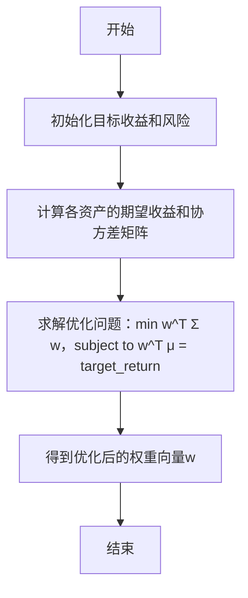

                 


# 约翰·伯格的再平衡策略

> **关键词**：再平衡策略、资产配置、投资组合管理、均值-方差优化、系统架构设计

> **摘要**：本文深入探讨了约翰·伯格提出的再平衡策略在资产配置与投资组合管理中的应用，通过详细分析其核心原理、算法实现、系统架构设计以及实际案例，为读者提供全面的理论与实践指导。文章结合专业技术语言与实际应用场景，帮助读者理解并掌握再平衡策略的核心要点。

---

## 第一部分：再平衡策略的背景与核心概念

### 第1章：再平衡策略的背景介绍

#### 1.1 问题背景与问题描述

在金融投资领域，资产配置是实现长期稳健收益的关键策略。然而，由于市场波动、资产价格变化等因素，投资组合的实际配置往往会偏离初始设定的目标配置。这种偏离可能导致投资组合的风险增加或收益下降。因此，定期对投资组合进行再平衡，以恢复目标配置，成为投资管理中的重要环节。

**问题描述**：
- 投资组合的实际配置与目标配置之间的偏差可能导致投资风险上升或收益减少。
- 如何在市场波动中动态调整资产配置，以实现风险控制和收益最大化，是再平衡策略的核心问题。

**解决方法**：
- 通过定期的再平衡操作，将投资组合的实际配置调整回目标配置，以维持预期的风险收益特征。

**边界与外延**：
- 再平衡的频率：定期（如季度、半年）或动态（根据市场变化实时调整）。
- 再平衡的范围：涉及所有资产类别和子资产的调整。

---

#### 1.2 再平衡策略的核心概念

**核心概念的定义与组成**：
- **目标配置**：预先设定的资产分配比例，基于投资者的风险承受能力、投资目标和市场预期。
- **实际配置**：当前投资组合中各资产的实际比例。
- **再平衡操作**：通过买卖资产，使实际配置回归目标配置的过程。

**核心要素的属性特征对比**：

| 要素 | 属性 | 描述 |
|------|------|------|
| 目标配置 | 风险收益特征 | 基于投资者目标设定，反映其风险偏好。 |
| 实际配置 | 市场敏感性 | 受市场波动影响，可能偏离目标配置。 |
| 再平衡操作 | 调整频率 | 可以是定期或动态调整，取决于策略选择。 |

**实体关系图（ER图）**：

```mermaid
erDiagram
    class 目标配置 {
        风险承受能力
        投资期限
        预期收益
    }
    class 实际配置 {
        资产类别
        持有比例
        市场价值
    }
    class 再平衡操作 {
        调整日期
        调整金额
        调整方式
    }
    目标配置 --o 实际配置 : 目标与实际的偏差
    实际配置 --o 再平衡操作 : 引发调整
```

---

## 第二部分：再平衡策略的核心概念与联系

### 第2章：再平衡策略的原理与机制

#### 2.1 再平衡策略的核心原理

**动态调整原理**：
- 通过定期或动态的资产调整，维持投资组合的风险收益特征不变。
- 例如，当某类资产价格上涨导致其在组合中的比例超过目标配置时，通过卖出该资产并买入其他资产来恢复目标配置。

**市场波动与风险控制机制**：
- 市场波动可能导致实际配置偏离目标配置，再平衡策略通过调整来降低偏离带来的风险。
- 例如，当股票市场上涨导致股票比例过高时，再平衡操作会卖出部分股票，买入债券或其他资产，以降低整体风险。

---

## 第三部分：再平衡策略的算法原理与数学模型

### 第3章：再平衡策略的算法原理

#### 3.1 均值-方差优化算法的原理与步骤

**算法原理**：
- 均值-方差优化是一种经典的资产配置方法，旨在在给定风险水平下最大化收益，或在给定收益水平下最小化风险。
- 通过调整各资产的权重，使投资组合的方差最小化，同时满足收益目标。

**算法步骤**：



**数学模型与公式**：
- 优化目标：
  $$\min_{w} \frac{1}{2}w^T \Sigma w$$
- 约束条件：
  $$w^T \mu = \text{target\_return}$$
  $$w^T \mathbf{1} = 1$$

---

#### 3.2 算法实现的代码示例

**Python代码实现**：

```python
import numpy as np
from scipy.optimize import minimize

# 定义目标函数
def objective(weights, Sigma):
    return 0.5 * np.dot(weights.T, np.dot(Sigma, weights))

# 定义约束条件
def constraint1(weights, mu, target_return):
    return np.dot(weights, mu) - target_return

# 参数设置
mu = np.array([0.1, 0.05, 0.02])  # 各资产的期望收益
Sigma = np.array([
    [0.16, 0.05, 0.02],
    [0.05, 0.08, 0.01],
    [0.02, 0.01, 0.03]
])  # 协方差矩阵
target_return = 0.06  # 目标收益

# 初始化权重向量
initial_weights = np.array([1/3, 1/3, 1/3])

# 求解优化问题
result = minimize(objective, initial_weights, args=(Sigma,), 
                  method='SLSQP', constraints={'type': 'eq', 'fun': constraint1, 'args': (mu, target_return)},
                  bounds=[(0, None), (0, None), (0, None)])

# 输出结果
print("优化后的权重为：", result.x)
print("最小方差为：", result.fun)
```

---

## 第四部分：再平衡策略的系统分析与架构设计

### 第4章：再平衡策略的系统架构设计

#### 4.1 系统功能设计

**领域模型设计**：


---

## 第五部分：再平衡策略的项目实战

### 第5章：再平衡策略的项目实战

#### 5.1 项目环境与工具安装

**环境配置与依赖管理**：
- Python 3.8+
- NumPy、SciPy、Matplotlib库的安装：
  ```bash
  pip install numpy scipy matplotlib
  ```

---

#### 5.2 核心代码实现

**代码实现与解读**：

```python
import numpy as np
from scipy.optimize import minimize

def portfolio_rebalancing(mu, Sigma, target_return):
    # 定义目标函数
    def objective(weights):
        return 0.5 * np.dot(weights.T, np.dot(Sigma, weights))
    
    # 定义约束条件
    def constraint(weights):
        return np.dot(weights, mu) - target_return
    
    # 初始化权重向量
    n = len(mu)
    initial_weights = np.array([1/n] * n)
    
    # 求解优化问题
    result = minimize(objective, initial_weights, method='SLSQP', 
                      constraints={'type': 'eq', 'fun': constraint},
                      bounds=[(0, None), (0, None), (0, None)])
    
    return result.x, result.fun

# 示例数据
mu = np.array([0.1, 0.05, 0.02])
Sigma = np.array([
    [0.16, 0.05, 0.02],
    [0.05, 0.08, 0.01],
    [0.02, 0.01, 0.03]
])
target_return = 0.06

# 调用函数
weights, min_variance = portfolio_rebalancing(mu, Sigma, target_return)

print("优化后的权重为：", weights)
print("最小方差为：", min_variance)
```

---

## 第六部分：再平衡策略的最佳实践与总结

### 第6章：再平衡策略的最佳实践

#### 6.1 最佳实践总结

- **定期审查与调整**：根据市场变化和自身风险偏好，定期审查投资组合的实际配置，并进行必要的再平衡操作。
- **风险监控**：建立风险监控机制，及时发现配置偏差，并采取措施进行调整。
- **记录与分析**：记录每次再平衡操作的细节，分析其对投资组合收益和风险的影响。

---

## 附录：数学公式与算法代码

### 附录A：数学模型与公式

- **优化目标**：$$\min_{w} \frac{1}{2}w^T \Sigma w$$
- **约束条件**：$$w^T \mu = \text{target\_return}$$

---

## 作者信息

作者：AI天才研究院 & 禅与计算机程序设计艺术

---

以上是《约翰·伯格的再平衡策略》的技术博客文章的完整目录大纲与内容概要。希望这篇文章能够为读者提供清晰的思路与实践指导，帮助您更好地理解和应用再平衡策略。

