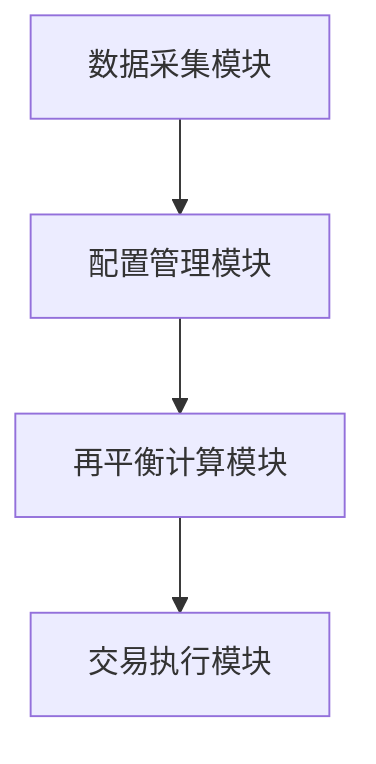

                 


# 《约翰·伯格的再平衡策略：保持投资组合平衡》

---

## 关键词：
投资组合再平衡、约翰·伯格、动态再平衡、资产配置、风险管理

---

## 摘要：
本文详细探讨了约翰·伯格的再平衡策略，这是一种通过定期调整投资组合以保持目标资产配置的方法。文章从再平衡的背景和重要性入手，分析了其核心概念、算法原理、系统设计以及实际应用，最后提供了最佳实践和未来展望。通过案例分析和系统架构设计，本文为投资者提供了理论支持和实践指导，帮助他们在复杂多变的市场环境中实现投资目标。

---

## 第一部分：引言

### 第1章：再平衡策略的背景与重要性

#### 1.1 投资组合再平衡的定义
投资组合再平衡是指定期调整投资组合，使其维持预定的目标资产配置。例如，目标配置为60%股票、30%债券、10%现金，但市场波动可能导致股票比例上升到70%，债券下降到20%，此时需要通过卖出股票、买入债券来恢复原配置。

#### 1.2 再平衡的必要性
市场波动会导致资产价格变化，从而使实际资产配置偏离目标。如果不进行再平衡，投资组合的风险和收益可能不符合预期。例如，当股票市场上涨，股票在投资组合中的比例可能超过目标，而债券比例下降，导致整体风险增加。

#### 1.3 约翰·伯格的再平衡策略
约翰·伯格提倡定期再平衡策略，以保持投资组合的稳定性。他的策略强调长期投资和分散化，通过定期再平衡来维持目标资产配置。例如，他建议每年至少进行一次再平衡，以应对市场波动和投资目标的变化。

---

## 第二部分：投资组合再平衡的核心概念

### 第2章：再平衡策略的核心原理

#### 2.1 资产配置与再平衡的关系
资产配置是根据投资目标确定各类资产的比例，而再平衡是确保实际投资组合与目标配置一致的过程。例如，目标配置是50%股票，40%债券，10%现金，但市场下跌导致股票比例降至40%，债券升至50%，现金保持10%。此时，需要卖出债券，买入股票，恢复目标配置。

#### 2.2 再平衡的数学模型
再平衡的数学模型如下：

$$
\text{调整后的权重} = \frac{\text{目标权重} \times \text{投资组合总价值}}{\text{当前资产价值}}
$$

例如，目标权重为60%股票，当前股票价值为$120,000，目标总价值为$200,000，则调整后的股票价值应为$120,000。

#### 2.3 再平衡的实施步骤
1. 确定目标资产配置。
2. 计算当前各资产的权重。
3. 识别偏离目标的资产。
4. 制定调整计划。
5. 执行交易以恢复目标配置。

---

## 第三部分：约翰·伯格再平衡策略的实现方法

### 第3章：动态再平衡策略

#### 3.1 动态再平衡的定义与特点
动态再平衡是指根据市场变化和投资者目标的变化，灵活调整再平衡的频率和方式。例如，当市场波动加剧时，增加再平衡的频率以应对风险。

#### 3.2 动态再平衡的算法实现
动态再平衡的算法如下：

1. 监测投资组合的实际权重。
2. 当某类资产的偏离超过阈值时，计算需要调整的金额。
3. 执行交易以恢复目标配置。

例如，当股票偏离目标比例超过5%时，触发再平衡机制，卖出股票，买入债券。

#### 3.3 动态再平衡的案例分析
假设目标配置是50%股票，40%债券，10%现金。市场下跌导致股票比例降至40%，债券升至50%，现金保持10%。此时，需要卖出债券，买入股票，恢复目标配置。

---

## 第四部分：系统分析与架构设计

### 第4章：系统架构设计

#### 4.1 系统功能设计
系统可能包括以下模块：

- 数据采集模块：获取市场数据。
- 配置管理模块：设定目标配置。
- 再平衡计算模块：计算调整金额。
- 交易执行模块：执行买卖交易。

#### 4.2 系统架构设计
使用Mermaid绘制系统架构图：



#### 4.3 系统接口设计
各模块之间的接口：

- 数据采集模块向配置管理模块传递市场数据。
- 配置管理模块传递目标配置到再平衡计算模块。
- 计算模块生成调整指令传递给交易模块。

---

## 第五部分：项目实战

### 第5章：项目实战

#### 5.1 环境安装
安装必要的工具，如Python、Pandas、Matplotlib，以及金融数据API（如Yahoo Finance）。

#### 5.2 核心实现源代码
提供Python代码实现再平衡策略：

```python
import pandas as pd
import numpy as np

# 示例数据
data = {'股票': [100, 90, 80, 70, 60], '债券': [50, 60, 70, 80, 90]}
df = pd.DataFrame(data)

# 目标配置
target_weights = {'股票': 0.6, '债券': 0.3, '现金': 0.1}

# 计算当前权重
current_weights = df.iloc[-1] / df.iloc[-1].sum()

# 触发再平衡
if abs(current_weights['股票'] - target_weights['股票']) > 0.05:
    # 计算调整金额
    adjustment = (target_weights['股票'] - current_weights['股票']) * df.iloc[-1].sum()
    # 执行交易
    df.loc[df.index[-1] + 1, '股票'] = df.iloc[-1]['股票'] + adjustment
```

#### 5.3 实际案例分析
通过具体数据展示再平衡策略的效果，比较有无再平衡情况下的投资收益和风险。

---

## 第六部分：最佳实践与总结

### 第6章：最佳实践

#### 6.1 再平衡策略的注意事项
- 交易成本和税务影响。
- 市场流动性对再平衡的影响。
- 定期评估再平衡策略的有效性。

#### 6.2 未来趋势
- 人工智能在再平衡中的应用。
- 算法优化和自动化再平衡。

#### 6.3 总结
再平衡策略是投资组合管理的重要工具，帮助投资者在复杂多变的市场环境中实现投资目标。通过定期调整投资组合，投资者可以降低风险，提高收益。未来，随着技术的发展，再平衡策略将更加智能化和自动化。

---

## 结尾

感谢您的阅读！如果您有任何问题或建议，请随时联系我。希望这篇文章能为您提供有价值的信息，帮助您更好地理解约翰·伯格的再平衡策略及其应用。

---

## 作者：AI天才研究院/AI Genius Institute & 禅与计算机程序设计艺术 /Zen And The Art of Computer Programming

---

