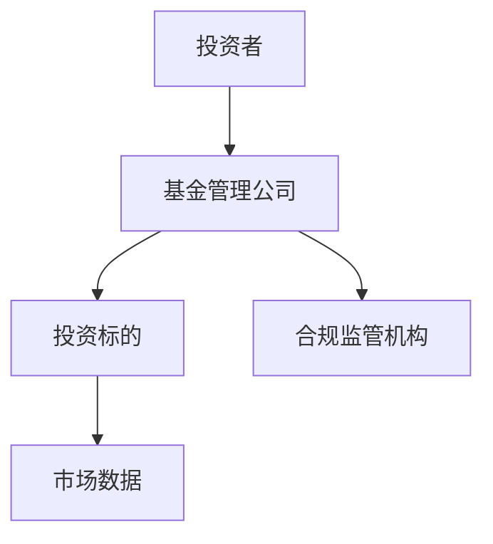
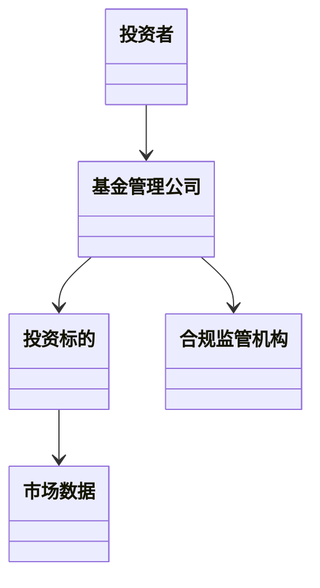
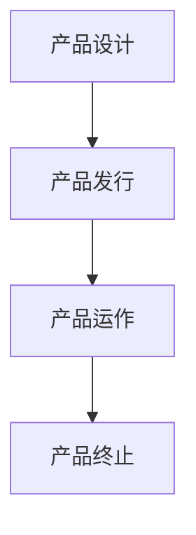
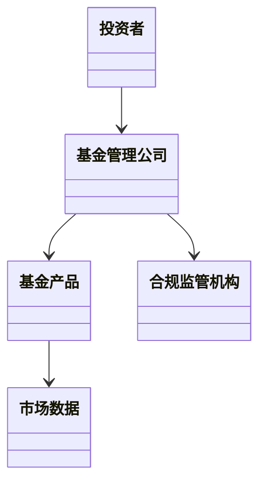
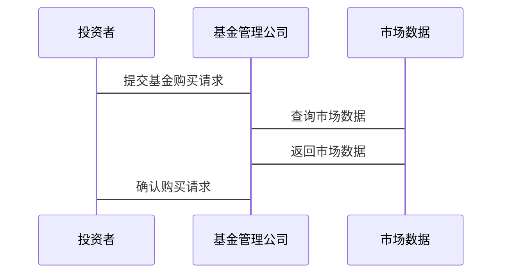

                 


# 约翰·伯格的基金业批评

> **关键词**：约翰·伯格、基金行业、主动管理、指数基金、量化投资、风险管理、金融监管

> **摘要**：本文深入分析了约翰·伯格对基金行业的批评，探讨了基金行业的现状、核心问题及伯格的核心观点。通过详细阐述基金行业的运作机制、数学模型与量化方法，结合实际案例和系统架构设计，全面剖析了伯格对主动管理与指数基金的立场，并提出了优化基金行业的建议。

---

## 第1章：基金行业的概述

### 1.1 基金行业的定义与重要性

基金行业是金融体系中的重要组成部分，主要通过集合投资者资金，由专业管理人进行投资运作，旨在实现资产增值。基金行业不仅为个人投资者提供了多样化的投资选择，还为机构投资者提供了重要的资金配置渠道。

#### 1.1.1 基金的定义与分类

基金是一种集合投资工具，通过汇集众多投资者的资金，由专业管理人进行投资运作。根据运作方式，基金可分为封闭式基金和开放式基金；根据投资标的，可分为股票型基金、债券型基金、混合型基金等。

#### 1.1.2 基金行业在金融体系中的地位

基金行业是金融体系的重要支柱，连接了资本市场中的资金供需双方，促进了资本的流动和优化配置。同时，基金行业也为投资者提供了间接参与资本市场的渠道。

#### 1.1.3 基金行业的现状与发展趋势

近年来，基金行业经历了快速发展，市场规模不断扩大。然而，行业内也存在一些问题，如管理费用过高、主动管理基金表现不佳等，这些问题引发了行业内外的广泛批评。

---

### 1.2 基金行业的运作机制

#### 1.2.1 基金管理的基本流程

基金的运作流程主要包括资金募集、投资决策、资产配置、风险控制和收益分配等环节。每个环节都需要专业的团队和高效的管理系统。

#### 1.2.2 基金管理公司的组织架构

基金管理公司通常设有投资部、研究部、市场部、合规部等部门。各部门协同合作，确保基金产品的顺利运作和合规管理。

#### 1.2.3 基金产品的设计与发行

基金产品的设计需要考虑市场需求、投资策略和合规要求。发行流程包括产品报备、资金募集和市场推广等步骤。

---

### 1.3 基金行业的核心问题

#### 1.3.1 行业的主要问题与挑战

当前基金行业面临的主要问题包括：主动管理基金表现不佳、管理费用过高、投资者教育不足等。

#### 1.3.2 基金行业与投资者利益的冲突

部分基金管理公司过于关注自身利益，忽视了投资者的需求，导致投资者利益受损。

#### 1.3.3 基金行业的监管与合规问题

尽管监管机构对基金行业实施了严格的监管，但仍存在一些合规问题，如信息披露不透明、内部交易等。

---

## 第2章：约翰·伯格的核心观点与批评

### 2.1 约翰·伯格的背景与思想

#### 2.1.1 伯格的个人经历与职业历程

约翰·伯格是美国著名投资专家，曾担任先锋集团的董事长和首席执行官。他以倡导低成本指数基金而闻名。

#### 2.1.2 伯格在基金行业中的影响力

伯格通过其著作和实践，推动了指数基金的发展，改变了传统主动管理基金的主导地位。

#### 2.1.3 伯格的主要著作与思想体系

伯格的代表作《投资之道》中，他强调了长期投资、低成本和分散投资的重要性。

---

### 2.2 伯格对基金行业的批评

#### 2.2.1 伯格对主动管理的质疑

伯格认为，大多数主动管理基金无法长期跑赢市场指数，其高昂的管理费用进一步削弱了投资者的收益。

#### 2.2.2 伯格对指数基金的推崇

伯格主张通过投资低成本指数基金实现长期稳定的收益，这种方式简单有效，适合大多数普通投资者。

#### 2.2.3 伯格对基金行业收费模式的批评

伯格批评基金行业的收费模式不合理，尤其是主动管理基金的高 fees，他认为这违背了投资者利益最大化的原则。

---

## 第3章：基金行业的核心概念与原理

### 3.1 基金行业的核心概念

#### 3.1.1 基金的类型与特点

- 股票型基金：主要投资于股票，风险较高，收益潜力大。
- 债券型基金：主要投资于债券，风险较低，收益相对稳定。
- 混合型基金：同时投资股票和债券，风险和收益介于两者之间。

#### 3.1.2 基金管理的原理与方法

基金管理的核心在于资产配置、风险控制和绩效评估。科学的资产配置能够有效分散风险，提高收益。

#### 3.1.3 基金市场的供需关系

基金市场的供需关系受到投资者需求、市场环境和政策监管的影响。供需关系的变化会影响基金产品的发行和价格。

---

### 3.2 基金行业的核心要素

#### 3.2.1 基金产品的设计要素

基金产品的设计需要考虑投资目标、风险承受能力、市场环境等因素，确保产品符合投资者需求。

#### 3.2.2 基金管理的核心能力

基金管理的核心能力包括研究能力、投资能力、风险控制能力和客户服务能力。这些能力决定了基金产品的表现和投资者满意度。

#### 3.2.3 基金行业的关键绩效指标

常用的基金行业绩效指标包括基金净值增长率、夏普比率、最大回撤等，这些指标能够全面评估基金产品的表现。

---

## 第4章：基金行业的系统架构与流程

### 4.1 基金行业的系统架构

#### 4.1.1 基金行业的整体架构图



#### 4.1.2 基金管理公司的内部架构



#### 4.1.3 基金产品的生命周期管理



---

### 4.2 基金行业的核心流程

#### 4.2.1 基金产品的设计与发行流程

1. **产品设计**：明确投资目标、风险承受能力、投资策略等。
2. **产品发行**：完成产品报备、资金募集和市场推广。
3. **产品运作**：进行投资决策、风险控制和收益分配。

#### 4.2.2 基金管理的运作流程

1. **资产配置**：根据市场环境和投资者需求进行资产配置。
2. **投资决策**：基于研究分析做出投资决策。
3. **风险控制**：实时监控和调整投资组合，控制风险。

#### 4.2.3 基金销售与客户服务流程

1. **销售流程**：通过渠道销售基金产品，提供销售支持和服务。
2. **客户服务**：包括客户咨询、信息披露和客户关系管理。

---

## 第5章：基金行业的数据分析与量化方法

### 5.1 基金行业的数据分析

#### 5.1.1 数据采集与处理

数据来源包括市场数据、基金净值、投资者行为数据等。数据处理包括清洗、转换和存储。

#### 5.1.2 数据分析的基本方法

常用的分析方法包括描述性分析、诊断性分析、预测性分析和规范性分析。

#### 5.1.3 数据可视化与解读

通过图表和可视化工具，将数据转化为易于理解的信息，帮助决策者做出科学决策。

---

### 5.2 基金行业的量化投资模型

#### 5.2.1 量化投资的基本原理

量化投资基于数学模型和算法，通过数据驱动的方式进行投资决策。

#### 5.2.2 常用的量化投资策略

- 均值回归策略：利用资产价格的回归特性进行投资。
- 动量策略：基于资产价格动量效应进行投资。

#### 5.2.3 量化模型的优缺点分析

优点包括高效性、客观性和可重复性，缺点包括模型风险和数据依赖性。

---

## 第6章：数学模型与公式

### 6.1 基金行业的基本数学模型

#### 6.1.1 基金的收益率计算公式

$$
\text{收益率} = \frac{\text{期末净值} - \text{期初净值}}{\text{期初净值}} \times 100\%
$$

#### 6.1.2 基金的风险评估模型

夏普比率（Sharpe Ratio）：
$$
\text{夏普比率} = \frac{\text{平均收益} - \text{无风险收益}}{\text{收益的标准差}}
$$

#### 6.1.3 基金的绩效评估指标

净收益：
$$
\text{净收益} = \text{总收益} - \text{费用} - \text{税收}
$$

---

### 6.2 量化投资的数学公式

#### 6.2.1 CAPM模型的公式与应用

资本资产定价模型（CAPM）：
$$
E(r_i) = r_f + \beta_i (E(r_m) - r_f)
$$

其中，$E(r_i)$ 是资产 $i$ 的预期收益率，$r_f$ 是无风险利率，$\beta_i$ 是资产 $i$ 的贝塔系数，$E(r_m)$ 是市场预期收益率。

#### 6.2.2 风险调整后的收益计算公式

$$
\text{风险调整后收益} = \text{预期收益} - \text{风险溢价}
$$

#### 6.2.3 投资组合优化

Markowitz有效前沿模型：
$$
\text{Minimize } \sigma \text{ subject to } E(r) \text{ and } \omega_i \text{的约束}
$$

---

## 第7章：基金行业的系统分析与架构设计方案

### 7.1 问题场景介绍

假设我们正在设计一个基金管理系统，需要实现基金产品的设计、发行、运作和客户服务等功能。

### 7.2 系统功能设计

#### 7.2.1 领域模型mermaid类图



---

### 7.3 系统架构设计mermaid架构图


---

### 7.4 系统接口设计

- 投资者接口：提供基金产品信息查询、购买和赎回等功能。
- 基金管理公司接口：实现基金产品的设计、发行和运作管理。
- 合规监管机构接口：提供监管数据报送和合规检查功能。

---

### 7.5 系统交互mermaid序列图



---

## 第8章：项目实战

### 8.1 环境安装

#### 8.1.1 安装Python环境

使用Anaconda安装Python 3.8及以上版本。

#### 8.1.2 安装必要的库

```bash
pip install pandas numpy matplotlib
```

---

### 8.2 系统核心实现源代码

#### 8.2.1 数据分析代码

```python
import pandas as pd
import numpy as np

# 数据加载
data = pd.read_csv('market_data.csv')

# 数据处理
data = data.dropna()
data['return'] = data['close'].pct_change()

# 数据可视化
import matplotlib.pyplot as plt
plt.plot(data['date'], data['return'])
plt.title('Market Returns')
plt.xlabel('Date')
plt.ylabel('Return')
plt.show()
```

#### 8.2.2 量化投资策略代码

```python
def calculate_sharpe_ratio(returns, risk_free_rate):
    excess_return = returns - risk_free_rate
    sharpe_ratio = excess_return.mean() / excess_return.std()
    return sharpe_ratio

# 示例数据
returns = pd.Series([0.01, -0.02, 0.03, -0.01], index=['2023-01', '2023-02', '2023-03', '2023-04'])
risk_free_rate = 0.01

# 计算夏普比率
sharpe_ratio = calculate_sharpe_ratio(returns, risk_free_rate)
print(f"夏普比率: {sharpe_ratio}")
```

---

### 8.3 实际案例分析

#### 8.3.1 案例分析

假设我们分析一只股票型基金，过去一年的收益率为15%，同期市场指数收益率为10%，无风险利率为2%。计算该基金的夏普比率：

$$
\text{夏普比率} = \frac{15\% - 2\%}{\sigma}
$$

假设收益率的标准差为5%，则夏普比率为：

$$
\text{夏普比率} = \frac{13\%}{5\%} = 2.6
$$

---

## 第9章：总结与展望

### 9.1 总结

本文深入分析了约翰·伯格对基金行业的批评，探讨了基金行业的运作机制、核心问题及优化建议。通过数学模型和实际案例的分析，我们发现，低成本指数基金的投资策略更符合长期投资者的利益。

### 9.2 展望

未来，基金行业需要进一步优化收费模式，提升透明度，更好地服务于投资者。同时，随着技术的发展，量化投资和人工智能的应用将为基金行业带来更多的创新和变革。

---

## 第10章：最佳实践 tips

- **投资者**：选择低成本指数基金，长期持有，避免频繁交易。
- **基金管理公司**：优化内部管理，降低运营成本，提高透明度。
- **行业监管**：加强监管力度，规范行业行为，保护投资者利益。

---

## 作者

作者：AI天才研究院/AI Genius Institute & 禅与计算机程序设计艺术/Zen And The Art of Computer Programming

