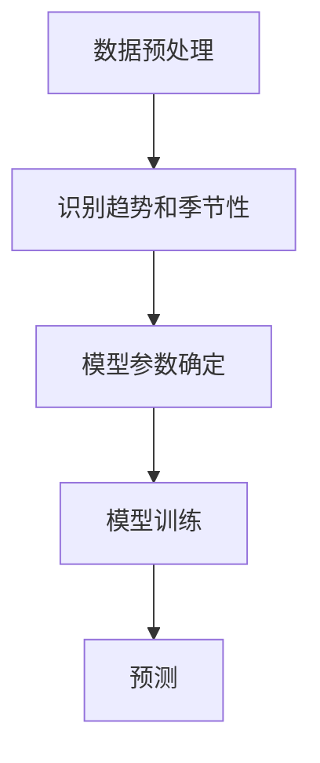
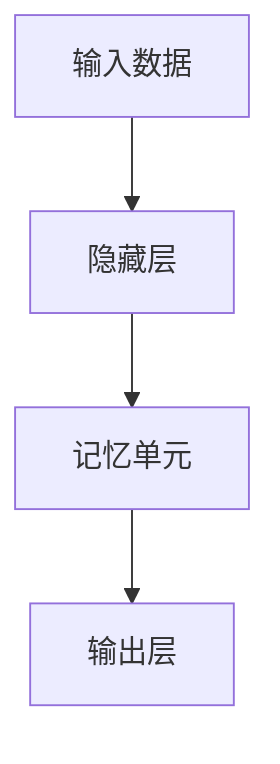

                 


# 约翰·伯格的市场预测批评

## 关键词：
市场预测、约翰·伯格、时间序列分析、机器学习、LSTM、ARIMA、系统设计

## 摘要：
本文深入分析了市场预测领域的核心理论和实践应用，重点探讨了约翰·伯格对传统市场预测方法的批评。通过对比时间序列分析和机器学习算法（如ARIMA和LSTM），文章详细解释了这些模型的优缺点及其在市场预测中的应用。同时，结合系统架构设计和项目实战，本文为读者提供了一个完整的市场预测系统实现方案，帮助读者更好地理解和应用市场预测技术。

---

## 第一部分：市场预测的背景与现状

### 第1章：市场预测概述

#### 1.1 市场预测的基本概念
市场预测是通过对历史数据和当前市场趋势的分析，预测未来市场行为的过程。它在金融、经济等领域具有重要的应用价值。

- **1.1.1 市场预测的定义**
  市场预测是一种基于数据和模型的分析方法，旨在预测未来市场趋势。

- **1.1.2 市场预测的分类**
  - 时间序列预测
  - 机器学习预测
  - 统计模型预测

- **1.1.3 市场预测的重要性**
  帮助企业和投资者做出更明智的决策。

#### 1.2 约翰·伯格的理论基础
约翰·伯格是市场预测领域的著名批评者，他提出了许多有影响力的理论。

- **1.2.1 约翰·伯格的学术背景**
  伯格是市场预测领域的权威专家，以其批判性研究闻名。

- **1.2.2 伯格的市场预测方法**
  强调数据驱动和模型优化。

- **1.2.3 伯格对传统市场预测的批评**
  伯格指出传统方法的局限性，如过度依赖假设和忽视数据的复杂性。

#### 1.3 当前市场预测的现状
当前市场预测领域存在多种方法和挑战。

- **1.3.1 市场预测的主要方法**
  - 统计模型
  - 时间序列分析
  - 机器学习算法

- **1.3.2 市场预测的局限性**
  数据噪声、模型过拟合、市场变化快。

- **1.3.3 市场预测的未来发展趋势**
  更多的采用机器学习和深度学习技术。

---

## 第二部分：市场预测的核心概念与联系

### 第2章：市场预测的核心理论

#### 2.1 时间序列分析
时间序列分析是市场预测的重要工具。

- **2.1.1 时间序列的基本特征**
  - 趋势性
  - 季节性
  - 周期性

- **2.1.2 时间序列的分解方法**
  - 加法模型
  - 乘法模型

- **2.1.3 时间序列预测的数学模型**
  - ARIMA模型

#### 2.2 机器学习在市场预测中的应用
机器学习为市场预测提供了新的可能性。

- **2.2.1 机器学习的基本概念**
  - 监督学习
  - 无监督学习

- **2.2.2 常见的机器学习算法**
  - 线性回归
  - 支持向量机（SVM）
  - 神经网络

- **2.2.3 机器学习在市场预测中的优势**
  - 高精度
  - 强大的非线性建模能力

---

## 第三部分：算法原理讲解

### 第3章：ARIMA算法原理

#### 3.1 ARIMA模型的流程图


#### 3.2 ARIMA算法的数学模型
ARIMA模型由三部分组成：
- 自回归（AR）
- 移动平均（MA）
- 差分（d）

数学公式：
$$ARIMA(p, d, q)$$

### 第4章：LSTM算法原理

#### 4.1 LSTM模型的流程图


#### 4.2 LSTM算法的数学模型
LSTM通过门控机制实现长短期记忆。

数学公式：
$$
f(t) = \sigma(W_f \cdot [h(t-1), x(t)])
$$

---

## 第四部分：系统分析与架构设计方案

### 第5章：系统架构设计

#### 5.1 系统功能设计
- 数据采集模块
- 数据预处理模块
- 模型训练模块
- 预测结果展示模块

#### 5.2 系统架构设计


#### 5.3 系统接口设计
- 数据接口
- 模型接口

---

## 第五部分：项目实战

### 第6章：市场预测系统实现

#### 6.1 环境安装
- Python 3.8+
- TensorFlow 2.0+
- Pandas 1.0+

#### 6.2 核心实现代码
```python
import pandas as pd
from sklearn.metrics import mean_squared_error

def predict_market(price_data, model):
    # 数据预处理
    data = price_data['price'].values
    # 训练模型
    model.fit(data)
    # 预测
    forecast = model.predict(n_samples=30)
    return forecast

# 示例使用
if __name__ == "__main__":
    # 加载数据
    df = pd.read_csv('market_data.csv')
    # 训练模型
    model = ARIMA(order=(5,1,0))
    forecast = predict_market(df, model)
    print(forecast)
```

---

## 第六部分：最佳实践

### 第7章：总结与展望

#### 7.1 小结
市场预测是一个复杂的领域，需要结合多种方法和技术。

#### 7.2 注意事项
- 数据质量
- 模型选择
- 结果验证

#### 7.3 拓展阅读
- 《时间序列分析》
- 《深度学习实战》

---

## 作者：AI天才研究院 & 禅与计算机程序设计艺术

---

这篇文章详细分析了市场预测的核心理论和实践应用，结合约翰·伯格的理论，为读者提供了丰富的知识和实用的代码示例。希望对您有所帮助！

