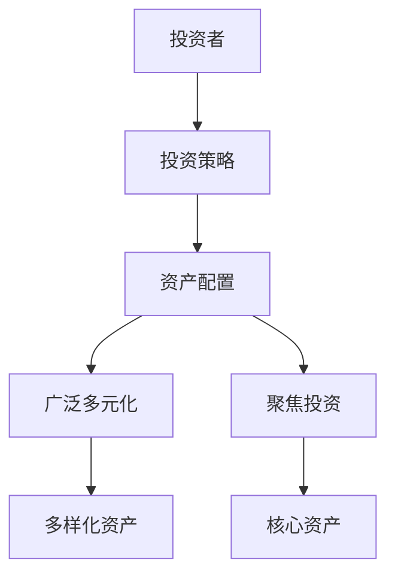
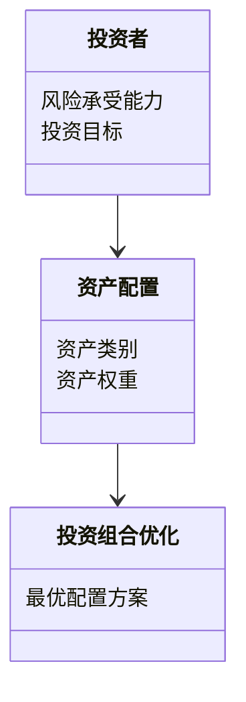
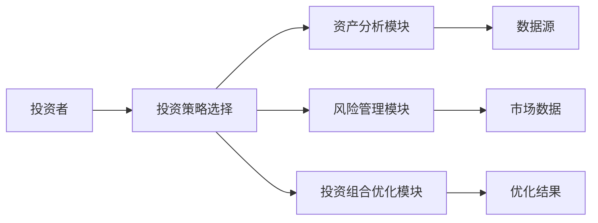

                 


# 约翰·伯格的广泛多元化 vs 聚焦投资：策略与实践

> 关键词：投资策略、广泛多元化、聚焦投资、风险管理、资产配置、约翰·伯格

> 摘要：本文详细探讨了两种投资策略——广泛多元化与聚焦投资——的核心理念、优缺点、适用场景及风险控制方法。通过对比分析，帮助投资者在不同的市场环境下选择最优策略，并提供实际案例和系统设计的指导。

---

# 引言

投资是个人和机构财务管理中的核心活动之一。在众多投资策略中，广泛多元化与聚焦投资是两种截然不同的方法。本文将深入分析这两种策略的理论基础、应用场景及相互关系，帮助读者在复杂多变的市场环境中做出明智的投资决策。

---

# 第一部分：投资策略概述

## 第1章：投资策略的背景与定义

### 1.1 投资的基本概念
投资是指将资金投入到各种资产中，以期望在未来获得超过初始投入的收益。投资的核心目标是实现资产增值，同时控制风险。投资策略是投资者在不同市场环境下选择和配置资产的具体方法。

### 1.2 广泛多元化投资的背景
广泛多元化是一种通过投资多种不同资产或资产类别来分散风险的投资策略。这种方法起源于20世纪中期，随着金融理论的发展而逐渐成熟。广泛多元化的核心思想是通过分散投资来降低非系统性风险，从而提高投资组合的整体稳定性。

### 1.3 聚焦投资的背景
聚焦投资是一种集中投资于少数高质量资产或资产类别的策略。这种方法强调对特定资产的深入研究和长期持有，以获得超额收益。聚焦投资的理念源于价值投资和基本面分析，强调选择具有强大竞争优势和长期增长潜力的企业。

### 1.4 广泛多元化与聚焦投资的对比
- **广泛多元化**：通过分散投资降低风险，适合风险承受能力较低的投资者。
- **聚焦投资**：通过集中投资于优质资产追求超额收益，适合风险承受能力较高的投资者。

---

# 第二部分：核心概念与联系

## 第2章：广泛多元化与聚焦投资的核心概念

### 2.1 广泛多元化的核心要素
- **资产配置多样性**：投资于股票、债券、房地产等多种资产类别，以分散风险。
- **风险分散原理**：通过多样化投资，降低特定资产或行业带来的风险。
- **投资组合优化**：通过数学模型优化资产配置，以最大化收益并最小化风险。

### 2.2 聚焦投资的核心要素
- **核心资产选择**：投资于具有强大竞争优势和长期增长潜力的企业。
- **投资集中度控制**：集中投资于少数优质资产，减少交易频率，降低交易成本。
- **高质量资产筛选**：通过基本面分析和估值指标选择具有长期增值潜力的资产。

### 2.3 两种策略的联系与区别
| **方面**       | **广泛多元化**                              | **聚焦投资**                              |
|-----------------|--------------------------------------------|--------------------------------------------|
| 投资范围         | 多样化，涵盖多种资产类别                   | 集中，专注于少数优质资产                   |
| 风险控制         | 通过分散投资降低非系统性风险              | 通过长期持有优质资产降低系统性风险         |
| 收益目标         | 追求稳定收益，避免重大损失               | 追求超额收益，承担更高的波动性             |
| 适用场景         | 风险厌恶型投资者，适合中长期稳健投资       | 风险偏好型投资者，适合长期看好特定资产的投资者 |

### 2.4 ER实体关系图


---

# 第三部分：算法原理讲解

## 第3章：投资策略选择算法

### 3.1 广泛多元化算法

#### 3.1.1 资产配置算法
- **输入**：投资者的风险承受能力、投资期限、资产类别权重。
- **输出**：最优资产配置方案。

```python
def diversified_asset_allocation(risk_tolerance, investment_horizon):
    # 根据风险承受能力和投资期限确定各类别权重
    asset_classes = ['股票', '债券', '房地产', '现金']
    weights = [0.4, 0.3, 0.2, 0.1]
    return asset_classes, weights
```

#### 3.1.2 风险分散算法
- **输入**：投资组合的资产列表。
- **输出**：分散后的投资组合。

```python
def diversification_strategy(portfolio_assets):
    # 计算各资产的协方差矩阵
    # 优化投资组合权重以最小化风险
    return optimized_weights
```

### 3.2 聚焦投资算法

#### 3.2.1 核心资产筛选算法
- **输入**：市场数据、财务指标。
- **输出**：筛选出的优质资产列表。

```python
def focused_asset_selection(market_data, financial_metrics):
    # 基于ROE、PEG等指标筛选优质企业
    return selected_assets
```

#### 3.2.2 投资集中度控制算法
- **输入**：筛选出的优质资产列表。
- **输出**：优化后的投资组合。

```python
def concentration_control(selected_assets):
    # 确定最优的集中度（如前5大资产）
    return optimized_portfolio
```

### 3.3 算法对比与选择
- **算法原理对比**：广泛多元化算法注重分散风险，而聚焦投资算法注重集中优质资产。
- **优缺点分析**：广泛多元化风险低但收益有限，聚焦投资风险高但收益潜力大。

---

## 第4章：投资策略的数学模型

### 4.1 广泛多元化模型

#### 投资组合风险公式
$$ \text{风险} = \sqrt{\sum_{i=1}^{n} w_i^2 \sigma_i^2 + 2 \sum_{i<j} w_i w_j \sigma_i \sigma_j \rho_{ij}} $$

#### 投资组合收益公式
$$ \text{收益} = \sum_{i=1}^{n} w_i \mu_i $$

### 4.2 聚焦投资模型

#### 核心资产收益公式
$$ \text{收益} = \sum_{i=1}^{m} w_i \mu_i $$

#### 核心资产风险公式
$$ \text{风险} = \sum_{i=1}^{m} w_i^2 \sigma_i^2 $$

---

# 第四部分：系统分析与架构设计方案

## 第4章：投资决策系统设计

### 4.1 问题场景介绍
投资者需要在广泛多元化和聚焦投资之间做出选择，以实现投资目标。

### 4.2 系统功能设计（领域模型）



### 4.3 系统架构设计



---

# 第五部分：项目实战

## 第5章：投资策略选择工具实现

### 5.1 环境安装
- Python 3.8+
- 数据处理库：Pandas、NumPy
- 可视化库：Matplotlib、Seaborn
- 优化库：Scipy

### 5.2 核心代码实现

```python
import pandas as pd
import numpy as np
from scipy.optimize import minimize

def portfolio_return(weights, returns):
    return np.dot(weights, returns)

def portfolio_variance(weights, cov_matrix):
    return np.dot(weights.T, np.dot(cov_matrix, weights))

def optimized_portfolio(returns, cov_matrix, target_return):
    n = len(weights)
    # 目标函数
    obj = {'type': 'eq', 'fun': lambda w: portfolio_return(w, returns) - target_return}
    # 约束条件
    bounds = [(0, 1) for _ in range(n)]
    # 优化问题
    result = minimize(portfolio_variance, np.ones(n)/n, args=(cov_matrix,), 
                      method='SLSQP', constraints=obj, bounds=bounds)
    return result.x
```

### 5.3 案例分析
假设我们有两只股票，预期收益率分别为0.1和0.2，协方差矩阵为：
```
[[0.05, 0.02],
 [0.02, 0.08]]
```
目标是实现8%的预期收益。

```python
returns = np.array([0.1, 0.2])
cov_matrix = np.array([[0.05, 0.02], [0.02, 0.08]])
target_return = 0.08

weights = optimized_portfolio(returns, cov_matrix, target_return)
print("最优权重:", weights)
```

### 5.4 小结
通过实际案例分析，展示了如何使用数学优化方法选择最优投资组合。

---

# 结论

在投资领域，广泛多元化与聚焦投资各有优劣。广泛多元化适合风险厌恶型投资者，而聚焦投资适合长期看好特定资产的投资者。投资者应根据自身的风险承受能力、投资目标和市场环境选择合适的策略。通过系统化的方法和工具，可以更好地实现投资目标。

---

# 作者

作者：AI天才研究院/AI Genius Institute & 禅与计算机程序设计艺术 /Zen And The Art of Computer Programming

