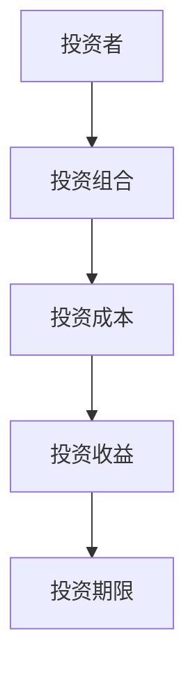
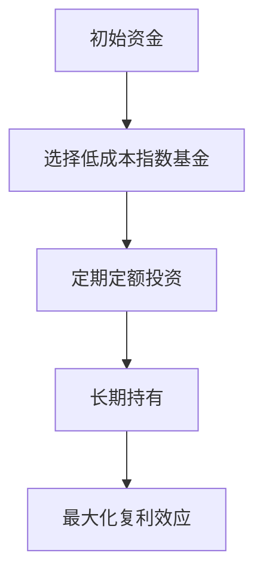
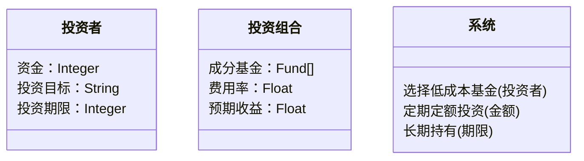
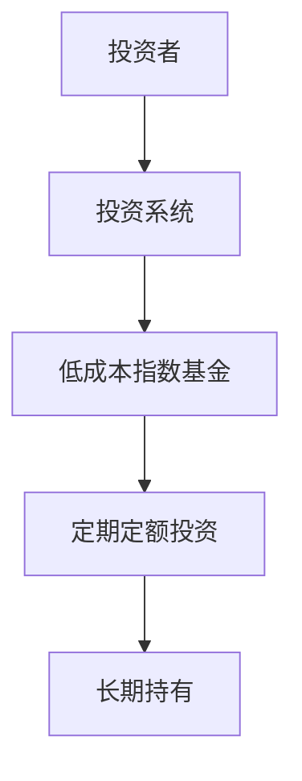

                 


# 约翰·伯格的成本意识投资策略

## 关键词：成本意识投资，约翰·伯格，投资策略，指数基金，复利效应

## 摘要：  
本文深入探讨了约翰·伯格的成本意识投资策略，从其核心理念到实际应用，系统地分析了如何通过降低投资成本、长期持有和复利效应实现稳健的投资收益。文章结合数学模型、算法流程图和实际案例，为读者提供了全面的理解和实践指导。

---

# 第一部分：成本意识投资策略的背景与核心理念

## 第1章：成本意识投资的起源与核心理念

### 1.1 约翰·伯格的背景与投资理念  
约翰·伯格是成本意识投资策略的代表人物，他是指数基金之父，创立了先锋集团（Vanguard）。他倡导低成本、长期持有的投资策略，认为市场的随机性使得个股选择难以持续，而指数基金能够有效分散风险并降低费用。  

### 1.2 成本意识投资的核心思想  
成本意识投资的核心理念是通过降低投资成本和避免频繁交易，实现长期稳定的收益。伯格强调，费用率低的基金长期表现更优，因为高昂的管理费会侵蚀投资者的收益。  

### 1.3 成本在投资中的重要性  
- **费用率对收益的影响**：假设两只基金，一只费用率为1%，另一只为2%，长期来看，费用率较低的基金将积累更多的收益。  
- **复利效应**：低成本投资能够最大化复利效应，使资金长期增值。  

---

## 第2章：成本意识投资的核心概念与联系  

### 2.1 成本意识投资的原理  
成本意识投资的原理基于以下几点：  
1. **市场有效性**：股票市场是有效的，普通投资者难以通过基本面分析或技术分析持续战胜市场。  
2. **分散投资**：通过指数基金分散投资，降低个股风险。  
3. **低成本**：降低管理费用和交易费用，将更多收益留在投资者手中。  

### 2.2 成本与收益的对比分析  
以下是不同费用率对长期收益的影响对比表：  

| 费用率（%） | 10年收益（%） | 20年收益（%） |
|-------------|----------------|----------------|
| 0           | 214.4          | 938.7           |
| 1           | 182.1          | 735.1           |
| 2           | 154.5          | 570.1           |  

从表中可以看出，费用率的高低对长期收益的影响巨大。  

### 2.3 ER实体关系图  
以下是成本意识投资的核心要素关系图：  



---

## 第3章：成本意识投资的算法原理与数学模型  

### 3.1 成本意识投资的算法原理  
以下是成本意识投资的算法流程图：  



### 3.2 投资成本对收益的影响公式  
总收益计算公式：  

$$ \text{总收益} = \text{初始金额} \times (1 - \text{年均费用率})^\text{投资年数} $$  

例如，初始金额为10万元，年均费用率为1%，投资期限为10年，则：  

$$ \text{总收益} = 100,000 \times (1 - 0.01)^{10} \approx 90,438 \text{元} $$  

### 3.3 复利计算公式  
复利计算公式：  

$$ \text{终值} = P \times (1 + r)^n $$  

其中，\( P \) 是本金，\( r \) 是年化收益率，\( n \) 是投资年数。  

---

## 第4章：系统分析与架构设计方案  

### 4.1 问题场景介绍  
假设我们希望构建一个成本意识投资系统，帮助投资者选择低成本指数基金并进行长期定投。  

### 4.2 系统功能设计  
以下是系统功能模块图：  



### 4.3 系统架构设计  
以下是系统架构图：  



---

## 第5章：项目实战  

### 5.1 环境安装  
- **Python环境**：安装Python 3.8及以上版本。  
- **依赖库**：安装`numpy`和`pandas`用于数据计算。  

### 5.2 核心代码实现  

```python
import numpy as np
import pandas as pd

# 初始化参数
initial_amount = 100000  # 初始金额
annual_fee_rate = 0.01  # 年费率
investment_period = 10   # 投资年数

# 计算总收益
total_return = initial_amount * (1 - annual_fee_rate) ** investment_period

# 输出结果
print(f"10年后的总收益为：{total_return:.2f}元")
```

### 5.3 实际案例分析  
假设投资者投入10万元，年费率为1%，投资期限为20年：  

$$ \text{总收益} = 100,000 \times (1 - 0.01)^{20} \approx 382,553 \text{元} $$  

通过对比，低成本投资在20年后的收益显著高于高费用投资。  

---

## 第6章：最佳实践与小结  

### 6.1 投资建议  
1. **选择低成本基金**：优先选择费用率低的指数基金。  
2. **长期持有**：避免频繁交易，降低交易成本。  
3. **定期定额投资**：通过定投分散风险，平滑市场波动。  

### 6.2 风险管理技巧  
1. **分散投资**：通过投资多个低成本基金降低风险。  
2. **定期 rebalancing**：定期调整投资组合，确保符合投资目标。  

### 6.3 小结  
约翰·伯格的成本意识投资策略强调低成本、长期持有的理念，通过指数基金实现稳健的复利收益。投资者应注重费用控制，避免追求短期收益，以实现长期财富增长。

---

# 作者：AI天才研究院/AI Genius Institute & 禅与计算机程序设计艺术 /Zen And The Art of Computer Programming

