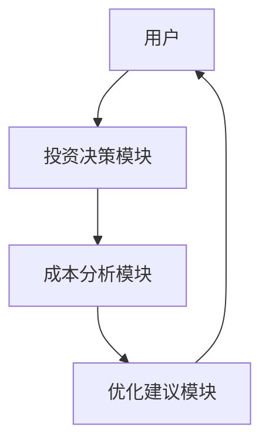

                 

# 约翰·伯格的成本意识：为什么每一分钱都重要

> 关键词：约翰·伯格，成本意识，投资理念，价值投资，系统架构，项目实战

> 摘要：约翰·伯格是投资界的传奇人物，他强调成本意识的重要性，认为每一分钱都值得珍惜。本文将从背景介绍、核心概念、数学模型、系统架构、项目实战等方面详细探讨约翰·伯格的成本意识，帮助读者理解如何在投资和管理中应用这一理念。

---

## 第一部分：引言

### 第1章：约翰·伯格与成本意识概述

#### 1.1 约翰·伯格的背景介绍

约翰·伯格（John Bogle）是投资界的传奇人物，被誉为“指数基金之父”。他于1949年创立了先锋集团（Vanguard Group），并推出了一系列低成本指数基金，彻底改变了投资行业。伯格的投资理念强调长期投资、分散投资和低成本运作，他坚信长期来看，低成本指数基金能够为投资者带来稳定的收益。

#### 1.2 成本意识的定义与特征

成本意识是指在投资或管理过程中，对每一分钱的成本进行细致分析和优化，以实现最大化的收益或效率提升。其核心在于通过降低不必要的开支，优化资源配置，从而提高整体的性价比。

#### 1.3 成本意识的重要性

在投资领域，成本意识直接关系到投资收益。高成本意味着更多的费用扣除，长期来看会显著影响收益。对于个人投资者和机构投资者而言，低成本策略是实现长期稳健回报的关键。

---

### 第2章：成本意识的核心概念与联系

#### 2.1 成本意识的定义与特征

成本意识不仅仅是对费用的关注，更是一种系统性的思维方式。它要求投资者在决策过程中，全面考虑每一笔资金的使用效率，避免浪费，追求最优的资源配置。

#### 2.2 成本意识与其他投资理念的对比

| 概念         | 成本意识                 | 价值投资                 |
|--------------|--------------------------|--------------------------|
| 核心理念     | 降低成本，提高收益       | 买入优质资产，长期持有   |
| 投资策略     | 低成本指数基金           | 选择优秀企业，长期投资   |
| 风险控制     | 通过分散投资降低风险     | 通过企业质量控制风险     |

从上表可以看出，成本意识和价值投资在核心理念和策略上有所不同，但它们都强调长期稳健的投资回报。

---

### 第3章：成本意识的数学模型与分析方法

#### 3.1 成本意识的数学模型

在投资分析中，成本意识通常通过成本-收益分析模型来体现。模型的基本公式如下：

$$ \text{总成本} = \text{显性成本} + \text{隐性成本} $$

其中，显性成本包括管理费、托管费等，隐性成本则包括交易成本、机会成本等。

#### 3.2 成本意识的算法原理

以下是一个简化的成本优化算法：

1. **输入**：各项投资成本（显性和隐性）。
2. **计算**：总成本 = 显性成本 + 隐性成本。
3. **优化**：通过分散投资或选择低成本基金，降低总成本。
4. **输出**：优化后的投资组合。

**示例**：假设显性成本为100元，隐性成本为50元，总成本为150元。通过选择低成本指数基金，显性成本降低到80元，隐性成本降低到30元，总成本优化为110元。

---

### 第4章：系统架构与方法论

#### 4.1 成本意识的系统架构设计

以下是一个成本意识系统的架构图：

#### 4.2 实施步骤

1. **需求分析**：明确投资目标和风险承受能力。
2. **系统设计**：选择适合的成本优化工具或平台。
3. **实施优化**：根据分析结果调整投资组合。
4. **监控评估**：定期评估优化效果，持续改进。

---

## 第五部分：项目实战

### 第5章：投资案例分析

#### 5.1 案例介绍

假设一位投资者有10万元可用于投资。传统投资方式下，年管理费为2%，即每年支付2000元。通过选择低成本指数基金，管理费降低到0.5%，即每年支付500元，节省了1500元。

#### 5.2 分析过程

1. **成本计算**：
   - 传统基金总成本：2% × 100,000 = 2,000元。
   - 低成本指数基金总成本：0.5% × 100,000 = 500元。
2. **收益比较**：
   - 假设年收益率为7%，传统基金净收益 = 7% - 2% = 5%。
   - 低成本指数基金净收益 = 7% - 0.5% = 6.5%。
3. **长期影响**：
   - 传统基金10年后的收益约为19,675元。
   - 低成本指数基金10年后的收益约为23,670元，多出约3,995元。

---

### 第6章：总结与展望

#### 6.1 全书总结

约翰·伯格的成本意识理念强调了在投资和管理中对每一分钱的珍惜。通过降低成本，优化资源配置，投资者可以实现更高效的收益增长。本文从背景、概念、数学模型、系统架构到项目实战，全面探讨了成本意识的应用。

#### 6.2 未来展望

随着投资环境的不断变化，成本意识的重要性将更加凸显。未来，投资者需要更加精细地分析和优化每一分钱的使用，以应对市场的不确定性。同时，随着技术的进步，低成本投资工具和平台将更加普及，为投资者提供更多选择。

---

## 附录

### 附录A：相关术语解释

- **指数基金**：一种跟踪特定市场指数的基金，旨在复制指数的表现。
- **显性成本**：直接可见的费用，如管理费、托管费。
- **隐性成本**：间接费用，如交易成本、机会成本。

### 附录B：推荐阅读

- 《约翰·伯格的投资哲学》
- 《指数基金投资指南》

---

## 作者

作者：AI天才研究院 & 禅与计算机程序设计艺术

---

通过本文，读者可以深入理解约翰·伯格的成本意识理念，并将其应用于实际投资和管理中，从而实现更高效的资源配置和收益增长。

