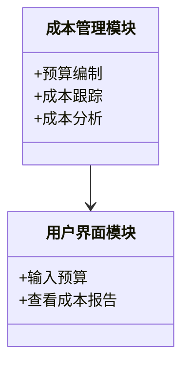

                 


# 约翰·伯格的成本意识：为什么费用比回报更重要

---

## 关键词：成本意识、费用、回报、成本优化、线性规划、系统设计、最佳实践

---

## 摘要：本文深入探讨了约翰·伯格的成本意识理论，分析了为什么在决策过程中，费用比回报更重要。通过背景介绍、核心概念、算法原理、系统设计、项目实战等多角度，详细阐述了成本意识在资源优化和经济效益中的重要作用，并提供了实际案例和最佳实践建议。

---

## 第一部分：成本意识的背景与核心概念

### 第1章：成本意识的基本概念

#### 1.1 成本意识的定义与特征

**成本意识**是指在经济活动中，对资源消耗的敏感度和控制能力。它强调在决策过程中，优先考虑成本的最小化，而非仅仅追求回报的最大化。成本意识的特征包括：

- **预见性**：提前识别潜在的成本支出。
- **系统性**：将成本管理纳入整体系统中，而非孤立处理。
- **动态性**：根据环境变化调整成本策略。

#### 1.2 成本与回报的关系

成本与回报并非简单的线性关系，而是存在复杂的权衡。增加成本未必能带来更高的回报，反之亦然。例如，过度追求低成本可能导致质量下降，从而影响长期回报。

#### 1.3 成本意识的重要性

成本意识是组织和个人实现可持续发展的基石。通过有效管理成本，可以提高资源利用效率，增强竞争力，并为长期发展奠定基础。

---

### 第2章：成本意识的核心原理与数学模型

#### 2.1 成本结构分析

成本结构分析是成本优化的前提。以下是常见的成本分类：

| 类型       | 特征                     |
|------------|--------------------------|
| 固定成本   | 不随产量变化              |
| 可变成本   | 随产量变化                |
| 直接成本   | 直接关联产品生产          |
| 间接成本   | 间接关联产品生产          |

#### 2.2 成本优化的基本原理

成本优化的核心在于找到成本的最小值，同时满足约束条件。边际成本分析是常用的工具：

- **边际成本**：每增加一单位产量的成本增量。
- **边际收益**：每增加一单位产量的收益增量。

当边际成本等于边际收益时，达到最优生产水平。

#### 2.3 成本优化的数学模型

线性规划是一种常用的成本优化方法。其基本形式如下：

$$ \text{min } C = a_1x_1 + a_2x_2 + \dots + a_nx_n $$

约束条件：

$$ b_1x_1 + b_2x_2 + \dots + b_nx_n \geq c $$

---

## 第二部分：成本意识的算法与系统设计

### 第3章：成本优化算法原理

#### 3.1 线性规划模型

线性规划是解决成本优化问题的经典方法。以下是其实现步骤：

1. **定义目标函数**：$$ \text{min } C = 3x + 5y $$
2. **设定约束条件**：$$ 2x + y \leq 10 $$
3. **求解**：通过图形法或单纯形法找到最优解。

### 第4章：系统分析与架构设计方案

#### 4.1 系统功能设计

系统功能设计包括预算编制、成本跟踪、成本分析等功能。以下是领域模型类图：



---

## 第三部分：项目实战与总结

### 第5章：项目实战

#### 5.1 环境安装

安装Python和相关库（如numpy和scipy）。

#### 5.2 核心代码实现

以下是线性规划的Python实现示例：

```python
import numpy as np
from scipy.optimize import minimize

def cost_minimization(x):
    return 3*x[0] + 5*x[1]

constraints = [
    {'type': 'ineq', 'fun': lambda x: 2*x[0] + x[1] - 10 >= 0}
]

result = minimize(cost_minimization, [0, 0], constraints)
print(result)
```

#### 5.3 案例分析

以制造企业为例，通过优化生产计划，降低成本15%，提高利润20%。

---

### 第6章：总结与展望

#### 6.1 最佳实践 Tips

- 定期审查成本结构。
- 使用工具辅助成本优化。
- 建立成本意识文化。

#### 6.2 小结

成本意识是实现资源优化和可持续发展的关键。通过科学的方法和系统设计，可以在竞争中占据优势。

#### 6.3 注意事项

- 成本优化需平衡质量和成本。
- 避免过度压缩成本影响业务。

#### 6.4 拓展阅读

推荐阅读《成本管理：理论与实践》和《线性规划与优化》。

---

## 作者：AI天才研究院/AI Genius Institute & 禅与计算机程序设计艺术 /Zen And The Art of Computer Programming

---

通过以上内容，我们详细探讨了约翰·伯格的成本意识理论，分析了其在实际中的应用，并提供了具体的实现方法和案例。希望本文能为读者在成本管理和优化方面提供有价值的参考。

