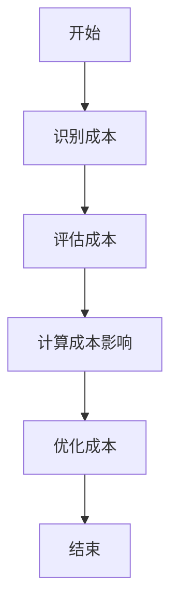
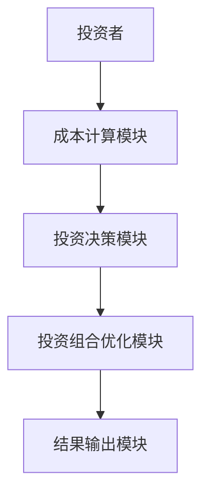
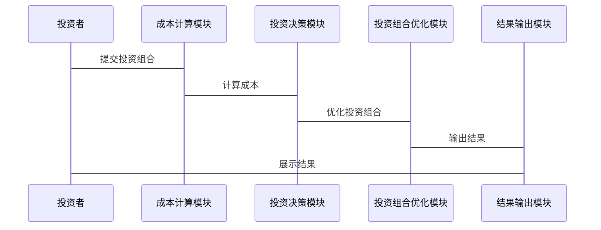

                 


# 约翰·伯格的成本意识：在零售投资者时代的重要性

> 关键词：约翰·伯格，成本意识，零售投资者，投资决策，算法原理，系统架构

> 摘要：本文深入探讨了约翰·伯格的成本意识在零售投资者时代的重要性，分析了成本意识的核心概念、算法原理、系统架构以及实际应用。通过详细的技术分析和案例解读，本文揭示了如何在复杂的投资环境中，利用成本意识制定科学的投资策略，实现长期稳健的投资回报。

---

## 第一部分：成本意识的背景与重要性

### 第1章：成本意识的定义与核心概念

#### 1.1 成本意识的定义
- **1.1.1 成本意识的定义**  
  成本意识是指在投资过程中，对各种成本因素的识别、评估和控制的意识。它不仅包括显性成本（如交易费用、管理费等），还包括隐性成本（如时间成本、机会成本等）。

- **1.1.2 成本意识的核心要素**  
  成本意识的核心要素包括：  
  - 成本识别：准确识别影响投资决策的所有成本因素。  
  - 成本评估：量化和评估每种成本对投资回报的影响。  
  - 成本控制：制定策略以最小化不必要的成本支出。

- **1.1.3 成本意识的边界与外延**  
  成本意识的边界在于其适用范围，即仅关注与投资决策直接相关的成本因素。其外延则扩展到更广泛的投资领域，如股票、基金、债券等。

#### 1.2 成本意识的重要性
- **1.2.1 零售投资者的成本意识**  
  零售投资者通常面临信息不对称和资源有限的问题，成本意识可以帮助他们做出更明智的投资决策，降低投资成本，提高投资收益。

- **1.2.2 成本意识与投资决策的关系**  
  成本意识直接影响投资决策。例如，在选择基金时，低费率的基金通常更具吸引力，因为它们能够为投资者节省更多成本。

- **1.2.3 成本意识在投资组合中的作用**  
  成本意识可以帮助投资者优化投资组合，平衡风险与收益，同时降低整体投资成本。

#### 1.3 约翰·伯格的成本意识理论
- **1.3.1 约翰·伯格的生平简介**  
  约翰·伯格是美国著名投资家，被誉为“指数基金之父”。他的投资理念强调低成本、长期投资和分散化。

- **1.3.2 成本意识在伯格投资理念中的地位**  
  伯格认为，长期投资的成本（如管理费、交易费用等）会对投资回报产生显著影响。因此，他提倡选择低成本的指数基金，以最大化投资收益。

- **1.3.3 成本意识的实践意义**  
  成本意识不仅是理论上的概念，更是实践中的重要工具。通过降低成本，投资者可以实现更高的净收益。

#### 1.4 本章小结
本章从成本意识的定义、核心要素和边界出发，详细阐述了其在投资决策中的重要性，并以约翰·伯格的成本意识理论为例，说明了成本意识在实践中的应用。

---

## 第二部分：成本意识的核心概念与联系

### 第2章：成本意识的核心原理

#### 2.1 成本意识的原理
- **2.1.1 成本的分类与属性**  
  成本可以分为显性成本和隐性成本。显性成本包括交易费用、管理费等，隐性成本包括时间成本、机会成本等。

- **2.1.2 成本与收益的关系**  
  成本与收益呈反比关系。降低成本通常意味着更高的净收益，但需要在成本和收益之间找到平衡点。

- **2.1.3 成本的可控性与不可控性**  
  部分成本是可控的（如交易费用），而部分成本是不可控的（如市场波动带来的机会成本）。

#### 2.2 成本意识与投资决策的联系
- **2.2.1 成本意识对投资决策的影响**  
  成本意识直接影响投资决策。例如，在选择基金时，投资者会优先考虑低费率的基金。

- **2.2.2 成本意识与风险管理的关系**  
  成本意识可以帮助投资者更好地管理风险。例如，通过分散投资降低单一资产的风险。

- **2.2.3 成本意识与长期投资策略的结合**  
  长期投资策略通常强调分散化和低成本，成本意识是实现这一策略的重要工具。

#### 2.3 成本意识的核心要素对比表
以下是一个对比表，展示了成本意识的核心要素：

| 成本类型 | 定义 | 示例 | 可控性 |
|----------|------|------|--------|
| 显性成本 | 直接支付的费用 | 交易费用、管理费 | 可控 |
| 隐性成本 | 未直接支付的费用 | 时间成本、机会成本 | 部分可控 |

#### 2.4 成本意识的ER实体关系图
以下是成本意识的ER实体关系图：

```mermaid
erDiagram
    actor 投资者 {
       OID : string
       姓名 : string
       投资金额 : decimal
    }
    class 成本 {
        OID : string
        类型 : string
        数额 : decimal
        影响 : decimal
    }
    class 投资决策 {
        OID : string
        类型 : string
        时间 : date
        成本影响 : decimal
    }
    投资者 --> 成本 : 支付
    投资者 --> 投资决策 : 做出
    成本 --> 投资决策 : 影响
```

#### 2.5 本章小结
本章详细探讨了成本意识的核心原理，分析了成本的分类、属性以及与投资决策的关系，并通过对比表和ER实体关系图，进一步阐述了成本意识的复杂性和重要性。

---

## 第三部分：成本意识的算法原理与数学模型

### 第3章：成本意识的算法原理

#### 3.1 成本意识的算法模型
- **3.1.1 成本计算模型**  
  成本计算模型用于量化每种成本对投资回报的影响。以下是成本计算模型的mermaid流程图：



- **3.1.2 成本优化算法**  
  成本优化算法通过调整投资组合中的资产配置，以最小化总成本。以下是Python代码示例：

```python
def calculate_cost(portfolio):
    total_cost = 0
    for asset in portfolio:
        total_cost += asset.cost
    return total_cost

def optimize_cost(portfolio):
    optimized_portfolio = []
    for asset in portfolio:
        if asset.cost < threshold:
            optimized_portfolio.append(asset)
    return optimized_portfolio
```

- **3.1.3 成本分析方法**  
  成本分析方法包括定性和定量分析。定量分析通常使用数学模型，如：

$$
\text{净收益} = \text{总收益} - \text{总成本}
$$

#### 3.2 成本意识的数学模型
- **3.2.1 成本计算公式**  
  成本计算公式用于量化每种成本对投资回报的影响。例如：

$$
\text{总成本} = \sum (\text{交易费用} + \text{管理费})
$$

- **3.2.2 成本优化公式**  
  成本优化公式通过调整投资组合中的资产配置，以最小化总成本。例如：

$$
\text{最优投资组合} = \argmin_{p} \sum_{i=1}^{n} p_i \cdot c_i
$$

其中，\( p_i \) 是第 \( i \) 项资产的投资比例，\( c_i \) 是第 \( i \) 项资产的成本。

- **3.2.3 成本影响因素的数学表达**  
  成本影响因素的数学表达可以表示为：

$$
\text{总成本} = \sum_{i=1}^{m} f_i \cdot c_i
$$

其中，\( f_i \) 是第 \( i \) 个成本影响因素的权重，\( c_i \) 是第 \( i \) 个成本因素。

#### 3.3 成本意识的数学模型
以下是一个简单的数学模型，用于计算投资组合的总成本：

$$
\text{总成本} = \sum_{i=1}^{n} (\text{交易费用}_i + \text{管理费}_i)
$$

---

## 第四部分：系统分析与架构设计

### 第4章：系统分析与架构设计

#### 4.1 系统分析
- **4.1.1 问题场景介绍**  
  在零售投资者时代，投资者需要一个工具来帮助他们计算和优化投资成本。以下是一个简单的系统架构图：



- **4.1.2 系统功能设计**  
  系统功能设计包括以下几个模块：  
  - 成本计算模块：用于计算每种资产的成本。  
  - 投资决策模块：根据成本计算结果，制定投资决策。  
  - 投资组合优化模块：通过调整资产配置，优化投资组合。  
  - 结果输出模块：输出优化后的投资组合及其成本。

#### 4.2 系统架构设计
以下是系统的架构图：


#### 4.3 系统接口设计
- **4.3.1 接口描述**  
  系统接口设计包括以下几个接口：  
  - 成本计算接口：用于计算每种资产的成本。  
  - 投资决策接口：根据成本计算结果，制定投资决策。  
  - 投资组合优化接口：通过调整资产配置，优化投资组合。  
  - 结果输出接口：输出优化后的投资组合及其成本。

- **4.3.2 交互序列图**  
  以下是系统的交互序列图：



---

## 第五部分：项目实战

### 第5章：项目实战

#### 5.1 环境安装
- **5.1.1 环境需求**  
  本项目需要以下环境：  
  - Python 3.8 或更高版本  
  - Mermaid 安装工具  
  - 数据库连接工具

- **5.1.2 安装步骤**  
  1. 安装Python：  
     ```bash
     sudo apt-get install python3
     ```
  2. 安装Mermaid：  
     ```bash
     npm install -g mermaid
     ```

#### 5.2 核心代码实现
- **5.2.1 成本计算模块**  
  以下是成本计算模块的代码示例：

```python
def calculate_cost(portfolio):
    total_cost = 0
    for asset in portfolio:
        total_cost += asset.cost
    return total_cost
```

- **5.2.2 投资组合优化模块**  
  以下是投资组合优化模块的代码示例：

```python
def optimize_portfolio(portfolio):
    optimized_portfolio = []
    for asset in portfolio:
        if asset.cost < threshold:
            optimized_portfolio.append(asset)
    return optimized_portfolio
```

- **5.2.3 投资决策模块**  
  以下是投资决策模块的代码示例：

```python
def make_investment_decision(portfolio):
    decisions = []
    for asset in portfolio:
        if asset.cost < threshold:
            decisions.append("买入")
        else:
            decisions.append("卖出")
    return decisions
```

#### 5.3 案例分析
- **5.3.1 案例背景**  
  假设投资者有一个包含10只股票的投资组合，每只股票的交易费用和管理费不同。

- **5.3.2 分析过程**  
  使用上述代码计算每只股票的总成本，并优化投资组合。

- **5.3.3 结果解读**  
  根据计算结果，投资者可以选择成本最低的股票进行投资。

#### 5.4 本章小结
本章通过实际案例，展示了如何在零售投资者时代应用成本意识，优化投资组合，降低投资成本。

---

## 第六部分：总结与展望

### 第6章：总结与展望

#### 6.1 总结
本文深入探讨了约翰·伯格的成本意识在零售投资者时代的重要性，分析了成本意识的核心概念、算法原理、系统架构以及实际应用。通过详细的技术分析和案例解读，本文揭示了如何在复杂的投资环境中，利用成本意识制定科学的投资策略，实现长期稳健的投资回报。

#### 6.2 展望
未来，随着技术的进步，成本意识的应用将更加广泛。投资者可以通过人工智能和大数据技术，进一步优化投资组合，降低成本，实现更高的投资收益。

---

## 作者：AI天才研究院/AI Genius Institute & 禅与计算机程序设计艺术/Zen And The Art of Computer Programming

---

通过本文的分析，读者可以更好地理解约翰·伯格的成本意识在零售投资者时代的重要性，并能够在实际投资中应用这些理念，制定科学的投资策略，实现长期稳健的投资回报。

