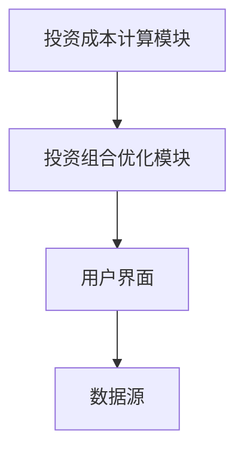

                 


# 约翰·伯格的成本敏感型投资：长期累积的力量

> 关键词：成本敏感型投资，约翰·伯格，长期投资，低成本工具，投资组合优化

> 摘要：本文深入探讨了约翰·伯格的成本敏感型投资理念，分析了其核心策略、系统设计、实战案例及风险管理，揭示了长期累积力量的奥秘。通过理论与实践相结合的方式，为投资者提供科学的投资指导。

---

## 第一部分：成本敏感型投资的理论基础

### 第1章：投资的基本概念与成本敏感型投资的定义

#### 1.1 投资的基本概念

投资是指将资金投入某种资产或项目，以期获得未来收益的行为。投资的核心在于平衡风险与收益，追求长期稳定的回报。在现代金融体系中，投资工具多样化，包括股票、债券、基金、房地产等。

**成本敏感型投资**是一种注重长期收益并控制投资成本的投资策略。其核心理念是通过降低投资成本，最大化长期收益。这种策略强调长期持有优质资产，避免频繁交易带来的额外成本。

#### 1.2 约翰·伯格的投资理念

约翰·伯格是成本敏感型投资的代表人物，他强调以下几点：

1. **长期投资的重要性**：市场波动短期不可预测，但长期趋势可以通过优质资产实现稳定增长。
2. **低成本投资工具**：选择低成本的投资工具（如指数基金）可以减少费用对收益的侵蚀。
3. **分散投资**：通过分散投资降低风险，避免单一资产的价格波动带来的损失。

---

### 第2章：成本敏感型投资的核心要素

#### 2.1 投资成本的构成

投资成本包括显性和隐性成本：

- **显性成本**：如管理费、交易佣金、基金费用等。
- **隐性成本**：如机会成本（因投资某项目而错失其他更高收益的机会）和时间成本（长期投资的机会成本）。

#### 2.2 成本敏感型投资的决策模型

成本敏感型投资的决策模型基于以下原则：

1. **成本-收益分析**：在决策时，全面评估投资成本与预期收益之间的关系。
2. **投资组合优化模型**：通过优化投资组合的构成，降低整体成本，提高收益。

---

## 第二部分：成本敏感型投资的核心策略

### 第3章：买入并持有策略

#### 3.1 买入并持有的策略概述

买入并持有策略是一种长期投资策略，强调选择优质资产并长期持有，避免频繁交易。

- **优点**：避免交易费用，减少市场波动的影响，利用复利效应实现长期收益。
- **缺点**：在市场剧烈波动时可能面临短期亏损。

#### 3.2 成本在买入并持有策略中的影响

买入并持有策略的核心在于降低交易成本和管理费用：

- **低成本投资工具**：选择管理费低的指数基金或ETF，降低长期费用累积效应。
- **长期持有优势**：通过长期持有，复利效应可以抵消部分初始成本。

---

### 第4章：低成本投资工具的选择

#### 4.1 低成本投资工具的类型

- **指数基金**：跟踪市场指数，费用低，风险分散。
- **ETF（交易所交易基金）**：交易灵活，费用低，适合长期投资。

#### 4.2 如何选择低成本投资工具

- **比较费用**：选择管理费和交易佣金较低的工具。
- **选择基金公司**：选择信誉良好、规模较大的基金公司，通常能提供更低的费用。

---

## 第三部分：系统分析与架构设计方案

### 第5章：系统功能设计

#### 5.1 系统功能模块

- **投资成本计算模块**：计算投资组合的总成本。
- **投资组合优化模块**：优化投资组合以降低成本。

#### 5.2 系统功能流程

1. 用户输入投资参数。
2. 系统计算最优投资组合。
3. 输出投资建议。

---

### 第6章：系统架构设计

#### 6.1 系统架构图



#### 6.2 关键模块设计

- **成本计算模块**：计算投资组合的显性和隐性成本。
- **投资组合优化模块**：优化投资组合以降低总成本。

---

## 第四部分：项目实战

### 第7章：成本敏感型投资的实践

#### 7.1 环境安装

- 安装投资分析软件。
- 获取历史数据和市场信息。

#### 7.2 核心代码实现

```python
import pandas as pd
import numpy as np

def calculate_cost(portfolio, fees):
    return np.sum(portfolio * fees)

def optimize_portfolio(portfolio, fees, returns):
    return np.argmin(calculate_cost(portfolio, fees) - returns)
```

#### 7.3 案例分析

案例：某投资者选择低成本指数基金，长期持有，年回报率稳定。

---

## 第五部分：风险管理与投资组合优化

### 第8章：风险管理

- **风险识别**：市场波动、经济周期等。
- **风险管理策略**：分散投资、定期 rebalancing。

---

## 第六部分：未来趋势与最佳实践

### 第9章：未来趋势

- **技术驱动投资**：大数据、AI在投资决策中的应用。
- **低成本工具的普及**：ETF和指数基金的进一步发展。

---

## 结论

约翰·伯格的成本敏感型投资理念强调长期、低成本、分散投资。通过优化投资组合，降低投资成本，投资者可以实现长期稳定的收益。未来，随着技术进步，低成本投资工具将更加普及，投资者需注重风险管理，保持长期投资策略。

---

## 作者

作者：AI天才研究院/AI Genius Institute & 禅与计算机程序设计艺术 /Zen And The Art of Computer Programming

