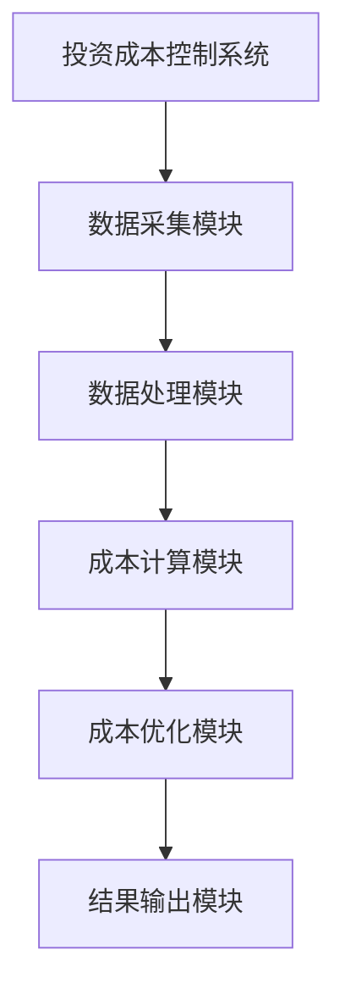

                 


```markdown
# 约翰·伯格的投资成本控制理论

> 关键词：投资成本控制，成本优化，约翰·伯格，投资理论，数学模型

> 摘要：本文深入探讨了约翰·伯格的投资成本控制理论，分析其核心概念、数学模型、算法原理、系统架构及实际应用。通过结合理论与实践，本文旨在为投资者和研究人员提供一套科学的投资成本控制方法，帮助他们在复杂的金融市场中实现高效的投资决策。

---

## 第一部分: 投资成本控制理论概述

### 第1章: 投资成本控制的基本概念

#### 1.1 投资成本的定义与构成
投资成本是指在投资活动中所发生的各项费用总和，包括显性成本（如交易费用、税费）和隐性成本（如时间成本、机会成本）。投资成本的构成主要包括以下几个方面：
- **显性成本**：交易手续费、佣金、税费等直接费用。
- **隐性成本**：信息获取成本、决策成本、心理成本等间接费用。

#### 1.2 投资成本控制的必要性
在金融市场中，投资成本的高低直接影响投资收益。通过有效的成本控制，投资者可以最大化投资回报，降低资金浪费，增强市场竞争力。投资成本控制的必要性体现在以下几个方面：
- **降低投资损失**：通过控制成本，减少不必要的支出，避免因成本过高导致的投资亏损。
- **提高投资效率**：优化资源配置，确保资金用于最能产生收益的项目。
- **增强市场竞争力**：在相同条件下，成本控制能力强的投资者更具竞争优势。

---

### 第2章: 投资成本控制理论的发展与应用

#### 2.1 投资成本控制理论的演进
投资成本控制理论经历了从简单到复杂的演变过程：
- **传统成本控制方法**：基于经验判断，缺乏系统性和科学性。
- **现代成本控制理论**：引入数学模型和优化算法，实现成本的量化分析。
- **最新发展**：结合大数据和人工智能技术，实现智能化的成本预测和控制。

#### 2.2 投资成本控制理论的实际应用
投资成本控制理论在金融、企业管理等领域得到广泛应用：
- **企业投资决策**：帮助企业优化资本预算，降低投资成本。
- **金融投资策略**：指导投资者在股票、基金等资产配置中实现成本最小化。
- **风险管理**：通过成本控制，降低投资组合的风险暴露。

---

### 第3章: 投资成本控制的核心概念与联系

#### 3.1 投资成本控制的核心要素
投资成本控制的核心要素包括：
- **成本构成**：明确各项成本的具体内容和比例。
- **控制方法**：选择适合的控制手段，如预算控制、过程监控。
- **优化策略**：制定长期的成本降低策略，如技术创新、流程优化。

#### 3.2 投资成本控制的关联概念
投资成本控制与多个领域密切相关：
- **风险管理**：投资成本控制是风险管理的重要组成部分。
- **投资决策**：成本控制影响投资决策的制定和执行。
- **项目管理**：通过成本控制，优化项目实施过程。

---

### 第4章: 投资成本控制的数学模型与算法原理

#### 4.1 投资成本控制的数学模型
投资成本控制的数学模型主要包括线性规划和非线性规划两种形式：
- **线性规划模型**：适用于目标函数和约束条件均为线性的情况。
  $$ \text{目标函数：} \min Z = c_1x_1 + c_2x_2 + \dots + c_nx_n $$
  $$ \text{约束条件：} \sum a_{ij}x_j \leq b_i \quad (i=1,2,\dots,m) $$
- **非线性规划模型**：适用于目标函数或约束条件为非线性的情况。
  $$ \text{目标函数：} \min Z = f(x) $$
  $$ \text{约束条件：} g(x) \leq 0 $$

#### 4.2 投资成本控制的算法实现
以下是线性规划算法的Python实现示例：

```python
import numpy as np
from scipy.optimize import linprog

# 定义目标函数
c = [-1, -2]

# 定义约束条件
A = [[1, 1], [0, 1]]
b = [2, 1]

# 定义变量的非负约束
x_bounds = (0, None)
y_bounds = (0, None)

# 求解线性规划问题
result = linprog(c, A, b, bounds=[x_bounds, y_bounds], method='highs')

# 输出结果
print("最优解为：", result.x)
print("最优值为：", -result.fun)
```

---

### 第5章: 投资成本控制的系统分析与架构设计

#### 5.1 投资成本控制系统的需求分析
- **系统目标**：实现投资成本的实时监控和优化。
- **功能需求**：包括成本计算、成本预测、成本优化等功能。
- **性能需求**：要求系统具备高响应速度和高准确性。

#### 5.2 投资成本控制系统的架构设计
以下是系统的架构图：



---

### 第6章: 投资成本控制的项目实战

#### 6.1 项目背景与目标
- **项目背景**：某投资公司希望优化其投资成本，提升投资回报率。
- **项目目标**：通过建立成本控制模型，实现投资成本的最小化。

#### 6.2 项目实施与核心代码实现
以下是成本优化模型的Python实现：

```python
import numpy as np
from scipy.optimize import minimize

# 定义目标函数
def cost_function(x):
    return x[0]**2 + x[1]**2

# 定义约束条件
def constraint(x):
    return x[0] + x[1] - 2 <= 0

# 初始化猜测值
x0 = [1, 1]

# 求解优化问题
result = minimize(cost_function, x0, constraints={'type': 'ineq', 'fun': constraint})

# 输出结果
print("最优解为：", result.x)
print("最优值为：", result.fun)
```

---

## 小结

通过本文的详细阐述，我们可以看到，约翰·伯格的投资成本控制理论在实际应用中具有重要的指导意义。从理论到实践，从数学模型到算法实现，投资者可以通过科学的方法实现成本的有效控制，从而提高投资收益。未来，随着技术的进步，投资成本控制理论将更加智能化和精准化。

---

## 作者

作者：AI天才研究院/AI Genius Institute & 禅与计算机程序设计艺术 /Zen And The Art of Computer Programming
```

