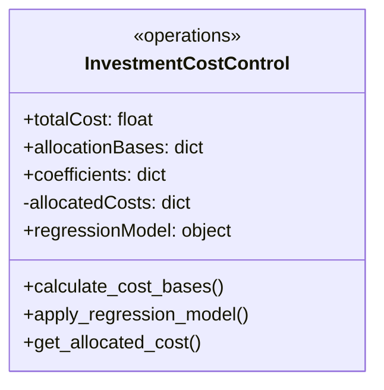
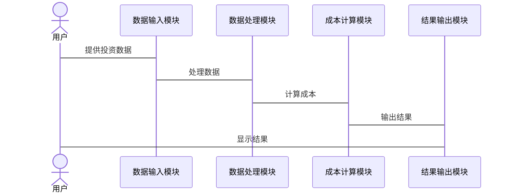

                 


# 约翰·伯格的投资成本控制：应对隐性费用上升的挑战

---

## 关键词：投资成本控制、隐性费用、显性费用、成本分摊法、回归分析法、系统架构设计、项目实战

---

## 摘要：  
本文深入探讨了投资成本控制中的隐性费用问题，结合约翰·伯格的投资理论，分析了隐性费用的定义、分类及其对投资决策的影响。通过成本分摊法和回归分析法，本文提出了应对隐性费用上升的解决方案，并结合实际案例，详细讲解了系统设计与实现过程，最终为读者提供了有效的投资成本控制策略。

---

# 第一部分：投资成本控制概述

## 第1章：投资成本控制的背景与问题

### 1.1 投资成本控制的定义与范围

#### 1.1.1 投资成本的基本概念
投资成本是指企业在投资活动中产生的所有费用，包括显性费用和隐性费用。显性费用是直接可量化的成本，如采购成本和人工成本；隐性费用是间接或不可量化的成本，如时间成本和机会成本。

#### 1.1.2 隐性费用的定义与特征
隐性费用是指企业在投资活动中产生的间接费用，通常难以直接计入财务报表。其主要特征包括：间接性、隐蔽性和累积性。

#### 1.1.3 投资成本控制的目标与意义
投资成本控制的目标是通过优化资源配置和减少浪费，降低整体投资成本。其意义在于提高企业的利润率和竞争力。

### 1.2 隐性费用的现状与挑战

#### 1.2.1 隐性费用的常见形式
隐性费用的常见形式包括时间成本、机会成本、管理成本和交易成本。

#### 1.2.2 隐性费用上升的原因分析
隐性费用上升的原因包括市场竞争加剧、企业规模扩大和管理复杂化。

#### 1.2.3 隐性费用对企业利润的影响
隐性费用的增加会直接侵蚀企业的利润，降低投资回报率。

### 1.3 约翰·伯格的理论基础

#### 1.3.1 约翰·伯格的投资理念
约翰·伯格强调长期投资和分散投资，认为成本控制是投资成功的关键因素。

#### 1.3.2 成本控制在投资决策中的重要性
成本控制是投资决策中的重要因素，直接影响投资回报率。

#### 1.3.3 隐性费用的识别与量化方法
隐性费用的识别与量化方法包括成本分摊法和回归分析法。

## 第2章：隐性费用与显性费用的对比分析

### 2.1 隐性费用与显性费用的对比

#### 2.1.1 费用类型对比表格
| 费用类型 | 定义 | 特点 | 示例 |
|----------|------|------|------|
| 显性费用 | 直接可量化的成本 | 可直接计入财务报表 | 采购成本、人工成本 |
| 隐性费用 | 间接或不可量化的成本 | 难以直接计入财务报表 | 时间成本、机会成本 |

#### 2.1.2 费用之间的关系 Mermaid 图
```mermaid
graph LR
A[显性费用] --> B[隐性费用]
C[总成本] <-- D[显性费用]
C <-- E[隐性费用]
```

### 2.2 隐性费用的分类与影响

#### 2.2.1 隐性费用的主要分类
隐性费用的主要分类包括时间成本、机会成本、管理成本和交易成本。

#### 2.2.2 各类隐性费用对企业利润的影响
时间成本会增加企业的运营周期，降低投资回报率；机会成本会减少企业的潜在收益；管理成本和交易成本会增加企业的运营负担。

#### 2.2.3 隐性费用与企业竞争力的关系
隐性费用的高低直接影响企业的竞争力，低隐性费用能够提高企业的市场竞争力。

## 第3章：投资成本控制的核心算法

### 3.1 成本分摊法

#### 3.1.1 成本分摊法的定义与原理
成本分摊法是一种将共同成本分摊到不同部门或项目的方法，其原理是根据资源消耗比例分配成本。

#### 3.1.2 成本分摊法的数学模型
$$ 成本分摊系数 = \frac{资源消耗比例}{总资源消耗比例} $$

#### 3.1.3 成本分摊法的实现步骤 Mermaid 图


#### 3.1.4 成本分摊法的 Python 实现
```python
def cost_allocation(total_cost, allocation_baes, allocation_base):
    coefficient = allocation_bases[allocation_base] / sum(allocation_bases)
    allocated_cost = total_cost * coefficient
    return allocated_cost
```

### 3.2 回归分析法

#### 3.2.1 回归分析法的定义与原理
回归分析法是一种通过建立变量之间的关系模型，预测隐性费用的方法。其原理是通过最小二乘法拟合回归线，预测隐性费用。

#### 3.2.2 回归分析法的数学模型
$$ y = a + bx + \epsilon $$
其中，\( y \) 是隐性费用，\( x \) 是影响因素，\( a \) 是截距，\( b \) 是回归系数，\( \epsilon \) 是误差项。

#### 3.2.3 回归分析法的实现步骤 Mermaid 图


#### 3.2.4 回归分析法的 Python 实现
```python
import statsmodels.api as sm

# 数据准备
X = sm.add_constant(x)
model = sm.OLS(y, X)
results = model.fit()
print(results.summary())
```

---

# 第二部分：系统分析与架构设计

## 第4章：系统分析与架构设计方案

### 4.1 问题场景介绍
隐性费用的识别与量化是一个复杂的问题，需要结合多种方法和工具。

### 4.2 系统功能设计

#### 4.2.1 领域模型 Mermaid 类图


### 4.3 系统架构设计

#### 4.3.1 系统架构 Mermaid 图


### 4.4 系统接口设计

#### 4.4.1 系统接口设计
系统接口包括数据输入接口、数据处理接口和结果输出接口。

#### 4.4.2 系统交互 Mermaid 序列图


---

# 第三部分：项目实战

## 第5章：项目实战

### 5.1 环境安装
项目实战需要安装Python和相关库（如statsmodels）。

### 5.2 核心代码实现

#### 5.2.1 成本分摊法的实现
```python
def cost_allocation(total_cost, allocation_bases, allocation_base):
    coefficient = allocation_bases[allocation_base] / sum(allocation_bases.values())
    allocated_cost = total_cost * coefficient
    return allocated_cost
```

#### 5.2.2 回归分析法的实现
```python
import statsmodels.api as sm

def apply_regression_model(x, y):
    X = sm.add_constant(x)
    model = sm.OLS(y, X)
    results = model.fit()
    return results
```

### 5.3 案例分析

#### 5.3.1 案例背景
某企业投资一个新项目，需要控制隐性费用。

#### 5.3.2 数据准备与分析
数据包括投资金额、时间成本和机会成本。

#### 5.3.3 实施成本分摊法和回归分析法
通过成本分摊法计算各部分的成本，通过回归分析法预测隐性费用。

### 5.4 项目小结
项目成功实现了隐性费用的识别与量化，帮助企业优化了投资决策。

---

# 第四部分：总结与展望

## 第6章：总结与展望

### 6.1 全文总结
本文深入探讨了隐性费用的识别与量化问题，提出了成本分摊法和回归分析法，并结合实际案例进行了系统设计与实现。

### 6.2 最佳实践 tips
在投资成本控制中，隐性费用的识别与量化是关键，建议企业采用成本分摊法和回归分析法。

### 6.3 未来展望
未来的研究可以进一步探讨隐性费用的动态变化和更复杂的模型。

---

## 附录

### 附录 A：工具安装指南
安装Python和相关库（如statsmodels）。

### 附录 B：术语表
- 显性费用：直接可量化的成本。
- 隐性费用：间接或不可量化的成本。

---

## 作者信息

作者：AI天才研究院/AI Genius Institute & 禅与计算机程序设计艺术 /Zen And The Art of Computer Programming

