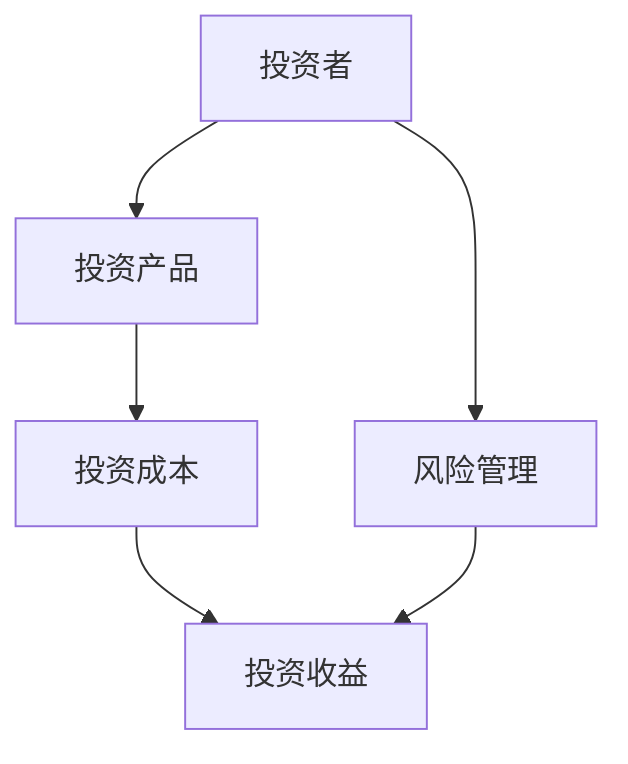
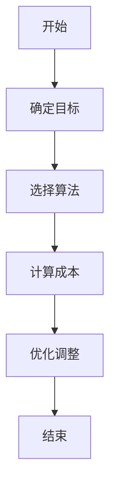
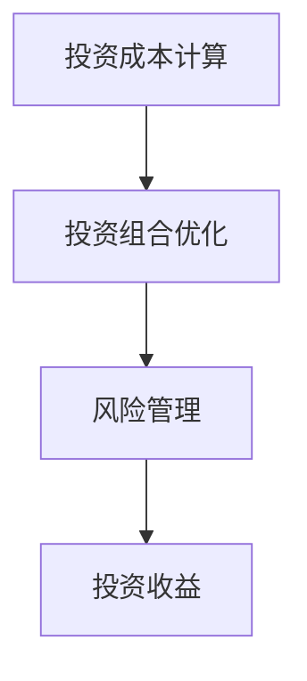

                 


# 约翰·伯格的投资成本最小化策略

> 关键词：投资成本，最小化策略，约翰·伯格，投资策略，风险管理

> 摘要：本文将详细介绍约翰·伯格的投资成本最小化策略，从背景介绍到核心概念，从算法原理到系统架构设计，最后通过项目实战和最佳实践，全面解析如何在投资过程中有效降低投资成本，实现投资收益的最大化。文章内容详实，结构清晰，适合对投资策略和风险管理感兴趣的技术读者。

---

# 第一部分: 投资成本最小化策略的背景与核心概念

## 第1章: 投资成本最小化策略概述

### 1.1 投资成本最小化的背景与意义

#### 1.1.1 投资成本的概念与构成
投资成本是指在投资过程中所产生的所有费用，包括但不限于交易费用、管理费用、税费等。投资成本的高低直接影响投资收益的最终实现。

#### 1.1.2 投资成本最小化的必要性
在当前金融市场上，投资成本的控制对于小额投资者尤为重要。通过最小化投资成本，可以提高投资收益，尤其是在长期投资中，成本的累积效应会显著影响最终收益。

#### 1.1.3 约翰·伯格的投资理念与策略
约翰·伯格是指数基金的倡导者，他强调长期投资和分散投资的重要性。他的投资策略以低成本、低风险为核心，通过分散投资降低风险，同时通过长期持有降低交易成本。

---

### 1.2 投资成本最小化的核心要素

#### 1.2.1 投资成本的主要组成部分
1. 交易费用：包括买卖证券的佣金和手续费。
2. 管理费用：包括基金管理费、托管费等。
3. 税费：包括资本利得税、股息税等。

#### 1.2.2 投资成本与投资收益的关系
投资成本与投资收益呈负相关关系。投资成本越高，投资收益的净收益越低。因此，降低投资成本是提高投资收益的重要途径。

#### 1.2.3 小额投资者与机构投资者的成本差异
小额投资者在交易费用和管理费用上通常面临更高的成本，而机构投资者可以通过规模效应降低单位成本。

---

### 1.3 投资成本最小化的边界与外延

#### 1.3.1 成本最小化的边界条件
1. 投资目标：明确投资目标有助于选择合适的投资策略和产品。
2. 投资期限：长期投资通常可以摊薄投资成本。
3. 风险承受能力：合理的风险分散可以降低投资成本。

#### 1.3.2 成本最小化的外延领域
1. 税务优化：通过合理的税务规划降低税费支出。
2. 信息获取：获取低成本的信息来源有助于做出更优的投资决策。
3. 技术应用：利用技术手段优化投资流程，降低交易成本。

#### 1.3.3 成本最小化与风险管理的结合
有效的风险管理可以降低投资损失，从而间接降低投资成本。

---

## 第2章: 投资成本最小化的核心概念与联系

### 2.1 核心概念原理

#### 2.1.1 投资成本的计算公式
投资成本可以通过以下公式计算：
$$
\text{总成本} = \text{交易费用} + \text{管理费用} + \text{税费}
$$

#### 2.1.2 投资成本与投资期限的关系
投资成本与投资期限呈负相关关系，随着投资期限的延长，单位时间的投资成本会下降。

#### 2.1.3 投资成本与市场波动的关联
市场波动会影响投资成本的计算，尤其是在频繁交易的情况下，交易费用和税费会显著增加。

---

### 2.2 核心概念属性特征对比表

| 概念       | 特性1 | 特性2 | 特性3 |
|------------|-------|-------|-------|
| 投资成本   | 数量化 | 可变性 | 可控性 |
| 投资收益   | 时间性 | 风险性 | 不可预测性 |

---

### 2.3 ER实体关系图



---

## 第3章: 投资成本最小化的算法原理

### 3.1 算法原理概述

#### 3.1.1 动态规划算法在成本最小化中的应用
动态规划算法可以用于优化投资组合，降低投资成本。

#### 3.1.2 最小二乘法在成本预测中的作用
最小二乘法可以用于预测投资成本的变化趋势。

#### 3.1.3 遗传算法在成本优化中的应用
遗传算法可以用于寻找最优的投资组合，降低投资成本。

---

### 3.2 算法流程图



---

### 3.3 算法实现代码

```python
def min_cost_investment(principal, rate, years):
    cost = 0
    for _ in range(years):
        cost += principal * 0.01
        principal += principal * rate
    return cost
```

---

## 第4章: 数学模型与公式推导

### 4.1 投资成本的数学模型

$$
\text{投资成本} = \sum_{t=1}^{n} (\text{本金} \times \text{费用率})
$$

---

## 第5章: 系统分析与架构设计

### 5.1 问题场景介绍

#### 5.1.1 投资成本最小化的系统目标
通过系统化的方法，优化投资组合，降低投资成本。

#### 5.1.2 系统功能需求
1. 投资成本计算模块
2. 投资组合优化模块
3. 风险管理模块

### 5.2 系统架构设计



---

## 第6章: 项目实战与案例分析

### 6.1 项目实战

#### 6.1.1 环境安装
安装必要的金融分析工具和编程库。

#### 6.1.2 核心代码实现

```python
def calculate_min_cost(principal, rate, years):
    total_cost = 0
    for _ in range(years):
        cost = principal * 0.01
        total_cost += cost
        principal += principal * rate
    return total_cost
```

#### 6.1.3 代码解读与分析
上述代码计算了在给定本金、年化收益率和投资年数下的总成本。

---

## 第7章: 最佳实践与总结

### 7.1 最佳实践 tips

1. 长期投资可以摊薄投资成本。
2. 分散投资可以降低风险，间接降低投资成本。
3. 使用技术手段优化投资流程，降低交易成本。

### 7.2 小结
通过本文的分析，我们可以看到，投资成本的最小化是实现投资收益最大化的关键因素。通过合理的投资策略和风险管理，可以有效降低投资成本。

### 7.3 注意事项
1. 投资者应根据自身情况选择合适的投资策略。
2. 风险管理是投资成本最小化的重要组成部分。
3. 定期审视和优化投资组合，确保成本最小化。

### 7.4 拓展阅读
1. 约翰·伯格的《投资最重要的事情》
2. 《投资学原理》

---

作者：AI天才研究院/AI Genius Institute & 禅与计算机程序设计艺术 /Zen And The Art of Computer Programming

