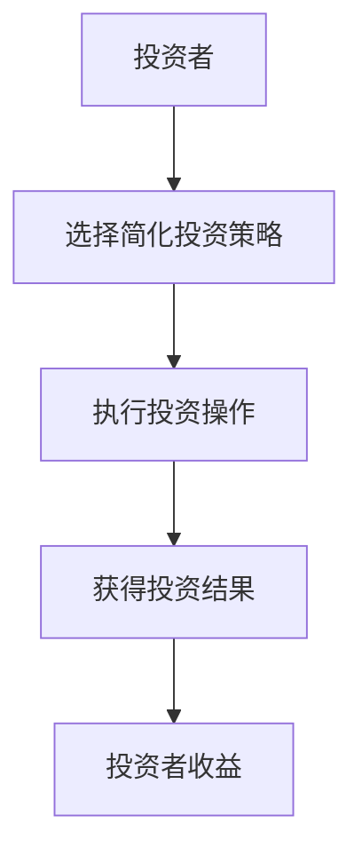
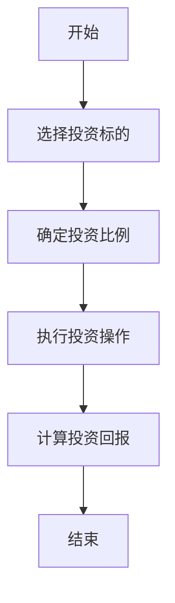

                 


# 约翰·伯格的投资简化论

> 关键词：投资简化论，约翰·伯格，投资策略，简化算法，系统架构，指数基金，复利计算

> 摘要：本文深入探讨了约翰·伯格的投资简化论，通过系统分析和实际案例，揭示了简化论的核心思想和应用场景。文章详细介绍了简化论的背景、算法原理、系统架构，并通过项目实战展示了如何将简化论应用于实际投资中。

---

# 第1章: 投资简化论的背景介绍

## 1.1 投资的基本概念

### 1.1.1 投资的定义与分类
投资是将资源（如资金）投入到某个项目或资产中，以期在未来获得收益的过程。投资可以分为股票、债券、房地产等多种形式，每种形式都有其独特的风险和回报特征。

### 1.1.2 投资的基本原理
投资的基本原理包括风险与回报的权衡、时间价值、市场波动性等。投资者需要根据自身的风险承受能力和收益目标选择合适的投资策略。

### 1.1.3 投资与金融市场的关系
金融市场是投资者进行交易的场所，包括股票市场、债券市场、外汇市场等。投资者通过金融市场将资金投入各种资产，以实现财富增值。

## 1.2 简化论的提出背景

### 1.2.1 投资领域的复杂性现状
传统的投资理论往往过于复杂，涉及大量的数学模型和统计分析，普通投资者难以理解和应用。此外，市场的不确定性使得复杂的策略难以稳定执行。

### 1.2.2 简化论的必要性与可行性
简化论的提出旨在降低投资的复杂性，使普通投资者能够轻松理解和实施。通过减少不必要的复杂性，投资者可以更专注于关键因素，从而提高投资效率。

### 1.2.3 约翰·伯格的学术背景与投资理念
约翰·伯格是投资领域的权威，他的投资理念强调长期投资、分散投资和低成本策略。他的简化论正是基于这些理念，提出了一套易于实施的投资策略。

## 1.3 约翰·伯格投资简化论的核心思想

### 1.3.1 简化论的核心概念
简化论的核心在于将复杂的投资策略简化为几个关键因素，如长期持有、分散投资和低成本。这些因素经过实践证明，能够有效降低投资风险并提高回报率。

### 1.3.2 简化论与传统投资理论的对比
传统投资理论通常依赖于复杂的模型和频繁的交易，而简化论则强调长期持有和分散投资。虽然传统方法在理论上更为严谨，但在实际操作中往往难以实施。

### 1.3.3 简化论的实际应用价值
简化论的实际应用价值在于其易于理解和实施。通过简化投资策略，普通投资者能够更好地坚持长期投资，减少因频繁交易带来的成本和风险。

---

# 第2章: 简化论的核心概念与联系

## 2.1 简化论的核心原理

### 2.1.1 简化论的基本假设
简化论的基本假设包括市场有效性、长期投资回报的可预测性和分散投资的有效性。这些假设为简化论提供了理论基础。

### 2.1.2 简化论的关键要素
简化论的关键要素包括长期持有、分散投资、低成本和定期再平衡。这些要素相互作用，共同构成了简化论的核心框架。

### 2.1.3 简化论的数学模型与公式
简化论的数学模型主要涉及投资回报的计算。例如，投资回报率可以通过以下公式计算：
$$ R = \frac{P_{final} - P_{initial}}{P_{initial}} \times 100\% $$

## 2.2 核心概念的属性特征对比

### 2.2.1 简化论与复杂论的对比分析
简化论与复杂论的主要区别在于其复杂性和可操作性。简化论通过减少复杂性提高了可操作性，而复杂论则通过复杂性提供了更高的精确性。

### 2.2.2 简化论的优缺点分析
简化论的优点在于其易于理解和实施，缺点在于其可能忽略一些复杂的投资机会和风险。

### 2.2.3 简化论的适用场景与限制
简化论适用于普通投资者，尤其是那些缺乏专业知识和时间的投资者。然而，对于机构投资者或专业投资者，可能需要更复杂的投资策略。

## 2.3 实体关系图与流程图

### 2.3.1 简化论的ER实体关系图
```mermaid
er
  actor(投资者)
  concept(简化论)
  relation(投资行为)
  actor -[简化投资策略]-> concept
  concept -[投资结果]-> relation
  relation -[投资者收益]-> actor
```

### 2.3.2 简化论的流程图


---

# 第3章: 简化论的算法原理讲解

## 3.1 简化论的算法概述

### 3.1.1 简化论的算法特点
简化论的算法特点包括简单性、可操作性和长期性。这些特点使其适用于普通投资者。

### 3.1.2 简化论的算法流程
简化论的算法流程包括选择资产、分配资金、定期再平衡和长期持有四个步骤。

### 3.1.3 简化论的算法实现
以下是简化论算法的Python实现示例：
```python
def simplified_investment_strategy(initial_amount, years, return_rate):
    final_amount = initial_amount * (1 + return_rate) ** years
    return final_amount

# 示例应用
initial_investment = 10000
years = 10
annual_return = 0.07

result = simplified_investment_strategy(initial_investment, years, annual_return)
print(f"最终投资金额为：${result:.2f}")
```

## 3.2 简化论的数学模型与公式

### 3.2.1 投资回报的数学模型
投资回报的数学模型可以表示为：
$$ R = \frac{P_{final} - P_{initial}}{P_{initial}} \times 100\% $$

### 3.2.2 复利计算公式
复利计算公式为：
$$ A = P \times (1 + r)^n $$

### 3.2.3 简化论的优化公式
简化论的优化公式为：
$$ S = \frac{R}{C} $$

## 3.3 简化论的算法流程图

### 3.3.1 简化论的算法流程图


---

# 第4章: 投资简化论的系统分析与架构设计

## 4.1 系统分析

### 4.1.1 系统目标与范围
系统的目标是实现简化论的投资策略，范围包括资产选择、投资组合构建和定期再平衡。

### 4.1.2 系统功能需求
系统功能需求包括资产筛选、投资组合优化和投资绩效评估。

### 4.1.3 系统性能需求
系统性能需求包括处理速度、数据精度和用户友好性。

## 4.2 系统架构设计

### 4.2.1 系统架构图


### 4.2.2 系统接口设计
系统接口设计包括数据输入接口、策略执行接口和结果输出接口。

### 4.2.3 系统交互流程图
```mermaid
sequenc

投资者 --> 系统: 提交投资需求
系统 --> 投资者: 确认投资策略
投资者 --> 系统: 执行投资操作
系统 --> 投资者: 提供投资结果
```

---

# 第5章: 项目实战

## 5.1 投资简化论的环境安装

### 5.1.1 系统环境要求
系统环境要求包括操作系统、编程语言和相关库的安装。

### 5.1.2 简化论算法的实现工具
简化论算法的实现工具包括Python、Pandas和Matplotlib。

## 5.2 投资简化论的核心实现

### 5.2.1 简化论算法的实现步骤
简化论算法的实现步骤包括数据收集、策略选择、投资组合构建和绩效评估。

### 5.2.2 简化论算法的Python代码实现
以下是简化论算法的Python代码实现：
```python
import pandas as pd
import matplotlib.pyplot as plt

def collect_data(tickers, start_date, end_date):
    data = pd.DataFrame()
    for ticker in tickers:
        df = pd.read_csv(f'data/{ticker}.csv', parse_dates=['Date'], index_col='Date')
        data[ticker] = df['Close']
    return data

tickers = ['AAPL', 'MSFT', 'GOOGL']
start_date = '2020-01-01'
end_date = '2023-12-31'

data = collect_data(tickers, start_date, end_date)
print(data.head())
```

## 5.3 投资简化论的系统实现

### 5.3.1 系统实现的关键点
系统实现的关键点包括数据处理、策略执行和结果分析。

### 5.3.2 简化论算法的代码实现
以下是简化论算法的代码实现：
```python
def portfolio_rebalancing(portfolio, current_weights, target_weights, start_date, end_date):
    rebalanced_portfolio = {}
    for ticker in portfolio:
        rebalanced_portfolio[ticker] = portfolio[ticker] * (current_weights[ticker] / target_weights[ticker])
    return rebalanced_portfolio

# 示例应用
portfolio = {'AAPL': 0.4, 'MSFT': 0.3, 'GOOGL': 0.3}
current_weights = {'AAPL': 0.45, 'MSFT': 0.3, 'GOOGL': 0.25}
target_weights = {'AAPL': 0.4, 'MSFT': 0.3, 'GOOGL': 0.3}

rebalanced = portfolio_rebalancing(portfolio, current_weights, target_weights, '2020-01-01', '2023-12-31')
print(rebalanced)
```

## 5.4 投资简化论的项目小结

### 5.4.1 项目实现的关键点总结
项目实现的关键点包括数据收集、策略选择和绩效评估。

### 5.4.2 项目实现中的问题与解决方案
项目实现中可能遇到的问题包括数据缺失和市场波动，解决方案包括数据预处理和风险管理。

### 5.4.3 项目实现的经验与教训
项目实现的经验包括数据的重要性、策略的可操作性和风险管理的必要性。

---

# 第6章: 投资简化论的最佳实践

## 6.1 投资简化论的最佳实践

### 6.1.1 投资简化论的实践技巧
投资简化论的实践技巧包括长期持有、分散投资和定期再平衡。

### 6.1.2 投资简化论的注意事项
投资简化论的注意事项包括市场风险、策略适应性和成本控制。

## 6.2 投资简化论的小结

### 6.2.1 小结与回顾
简化论通过简化投资策略，使普通投资者能够轻松理解和实施。其核心思想包括长期持有、分散投资和定期再平衡。

### 6.2.2 投资简化论的未来展望
未来，简化论将更加注重个性化投资和智能投顾，为投资者提供更多元化的选择。

---

# 第7章: 附录

## 7.1 简化论相关术语表

## 7.2 简化论参考文献

## 7.3 简化论扩展阅读

---

# 作者：AI天才研究院/AI Genius Institute & 禅与计算机程序设计艺术 /Zen And The Art of Computer Programming

