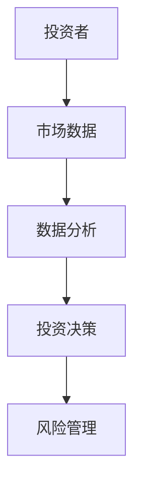

                 


# 约翰·伯格的投资简化论：应对金融产品复杂化的挑战

## 关键词：
- 投资简化论
- 金融产品复杂化
- 约翰·伯格
- 风险管理
- 资产配置

## 摘要：
本文探讨了约翰·伯格提出的投资简化论，旨在应对金融产品复杂化带来的挑战。通过分析简化论的核心概念、算法原理、系统架构以及实际案例，本文为投资者提供了一种更清晰、更有效的投资策略。文章详细解释了简化论的背景、原理及其在实际投资中的应用，帮助读者理解如何在复杂的金融市场中做出明智的投资决策。

---

# 第1章: 金融产品复杂化的背景与挑战

## 1.1 金融产品的演变历程
### 1.1.1 从简单到复杂的金融产品演变
- 早期金融产品的简单性：股票和债券的基本结构。
- 金融创新的驱动：衍生品、ETF、杠杆基金的出现。
- 产品复杂化的原因：市场需求、技术进步、金融工具的多样化。

### 1.1.2 金融创新与复杂化的驱动因素
- 技术进步：数据处理能力的提升推动了复杂金融产品的开发。
- 市场需求：投资者对多样化收益的需求。
- 监管环境：宽松的监管政策促进了金融创新。

### 1.1.3 金融产品复杂化带来的问题
- 投资者理解难度增加。
- 风险管理的复杂性提升。
- 信息不对称加剧。

## 1.2 投资简化论的提出与意义
### 1.2.1 简化论的核心思想
- 简化投资决策过程，关注核心因素。
- 降低复杂性，提高可操作性。

### 1.2.2 简化论在投资领域的应用价值
- 提高投资决策的效率。
- 减少因复杂性导致的错误决策。
- 帮助投资者更好地管理风险。

### 1.2.3 简化论与金融创新的关系
- 简化论并非否定金融创新，而是提供一种应对复杂性的方法。
- 在复杂化与简化之间找到平衡点。

## 1.3 约翰·伯格的投资理念
### 1.3.1 伯格的投资哲学
- 长期投资，价值投资。
- 避免短期波动，关注长期收益。

### 1.3.2 伯格的长期投资策略
- 分散投资：通过多样化降低风险。
- 低成本投资：避免高额交易费用。
- 长期持有：减少频繁交易带来的成本。

### 1.3.3 伯格对简化论的贡献
- 提出简化投资的核心理念。
- 强调长期投资和分散投资的重要性。

## 1.4 本章小结
- 金融产品的复杂化带来了投资决策的挑战。
- 简化论为应对这些挑战提供了一种解决方案。
- 约翰·伯格的投资理念是简化论的重要组成部分。

---

# 第2章: 投资简化论的核心概念与原理

## 2.1 简化论的基本原理
### 2.1.1 简化论的定义与内涵
- 简化论：通过简化复杂系统的核心要素，降低系统的复杂性。
- 核心思想：抓住关键因素，忽略次要因素。

### 2.1.2 简化论的核心要素
- 关键变量：影响投资决策的主要因素。
- 系统简化：将复杂系统分解为简单模块。
- 可操作性：简化后的系统易于理解和操作。

### 2.1.3 简化论与复杂系统的关联
- 复杂系统的不可预测性。
- 简化论在复杂系统中的应用：提取核心要素。

## 2.2 简化论在投资中的应用
### 2.2.1 简化论的投资策略
- 长期投资：关注长期趋势，忽略短期波动。
- 分散投资：通过多样化降低风险。

### 2.2.2 简化论与风险管理
- 风险管理的核心要素：识别、评估、控制。
- 简化论在风险管理中的应用：关注主要风险来源。

### 2.2.3 简化论与资产配置的关系
- 资产配置的核心：根据风险承受能力和收益目标分配资产。
- 简化论在资产配置中的应用：简化资产类别，降低复杂性。

## 2.3 投资简化论的数学模型
### 2.3.1 简化论的基本公式
$$E(r) = \beta \cdot (R_m - R_f) + R_f$$
- 其中，$E(r)$为预期收益，$\beta$为贝塔系数，$R_m$为市场收益，$R_f$为无风险收益。

### 2.3.2 简化论的数学推导
- 资产定价模型（CAPM）的简化应用。
- 通过贝塔系数衡量资产的系统性风险。

### 2.3.3 简化论的验证与应用
- 实证分析：验证简化论的有效性。
- 应用案例：简化论在实际投资中的应用。

## 2.4 本章小结
- 简化论的核心原理是抓住关键因素，忽略次要因素。
- 简化论在投资中的应用包括长期投资、分散投资和风险管理。
- 数学模型为简化论提供了理论支持。

---

# 第3章: 投资简化论的系统分析与架构设计

## 3.1 投资系统的基本构成
### 3.1.1 投资系统的定义
- 投资系统：由投资者、金融产品、市场环境等构成的复杂系统。

### 3.1.2 投资系统的组成部分
- 投资者：决策主体。
- 金融产品：投资对象。
- 市场环境：宏观经济、政策环境等。

### 3.1.3 投资系统的核心功能
- 信息处理：分析市场数据，评估投资机会。
- 决策制定：基于分析结果做出投资决策。
- 风险管理：监控和控制投资风险。

## 3.2 简化论在投资系统中的应用
### 3.2.1 简化论的系统架构
- 分层架构：将系统分解为多个层次，分别处理不同层次的问题。
- 模块化设计：将系统划分为多个模块，每个模块处理特定功能。

### 3.2.2 简化论的模块划分
- 数据采集模块：收集市场数据。
- 数据分析模块：分析数据，提取关键信息。
- 投资决策模块：基于分析结果做出投资决策。

### 3.2.3 简化论的系统流程
- 数据采集 → 数据分析 → 投资决策 → 风险管理。

## 3.3 系统架构的Mermaid图


## 3.4 本章小结
- 投资系统由多个部分构成，简化论通过模块化设计降低系统的复杂性。
- 简化论的系统架构为投资决策提供了清晰的流程。

---

# 第4章: 投资简化论的算法原理与实现

## 4.1 简化论的算法原理
### 4.1.1 简化论的基本算法
- 简化算法：提取关键变量，忽略次要变量。
- 优化算法：通过优化模型降低复杂性。

### 4.1.2 简化论的优化算法
- 线性回归：用于分析变量之间的关系。
- 主成分分析：用于提取数据的主要特征。

### 4.1.3 简化论的实现步骤
1. 收集数据：获取相关市场数据。
2. 数据分析：提取关键变量。
3. 建立模型：构建简化模型。
4. 验证模型：通过实证分析验证模型的有效性。

## 4.2 简化论的数学模型
### 4.2.1 简化论的核心公式
$$r_i = \alpha + \beta \cdot r_m + \epsilon$$
- 其中，$r_i$为个股收益，$r_m$为市场收益，$\epsilon$为误差项。

### 4.2.2 简化论的优化模型
$$\min \beta^2 \quad \text{subject to} \quad r_i = \alpha + \beta \cdot r_m + \epsilon$$

### 4.2.3 简化论的验证与应用
- 实证分析：通过历史数据验证简化模型的有效性。
- 应用案例：简化论在实际投资中的应用。

## 4.3 简化论的Python实现
### 4.3.1 数据准备
```python
import pandas as pd
data = pd.read_csv('market_data.csv')
```

### 4.3.2 数据分析
```python
from sklearn.decomposition import PCA
pca = PCA(n_components=2)
principal_components = pca.fit_transform(data)
```

### 4.3.3 模型建立
```python
from sklearn.linear_model import LinearRegression
model = LinearRegression()
model.fit(principal_components, data['target'])
```

## 4.4 本章小结
- 简化论的算法原理包括简化算法和优化算法。
- 数学模型为简化论提供了理论基础。
- Python代码展示了简化论的实际应用。

---

# 第5章: 投资简化论的项目实战

## 5.1 项目背景
### 5.1.1 项目目标
- 通过简化论分析指数基金。

## 5.2 项目实施
### 5.2.1 数据收集
- 数据来源：公开市场数据。
- 数据处理：清洗和整理数据。

### 5.2.2 数据分析
- 使用简化论提取关键变量。
- 构建简化模型。

### 5.2.3 投资决策
- 基于简化模型做出投资决策。
- 监控和调整投资组合。

## 5.3 实际案例分析
### 5.3.1 案例背景
- 某指数基金的历史表现。

### 5.3.2 分析过程
- 数据分析：提取关键变量。
- 模型构建：建立简化模型。
- 投资决策：基于模型做出决策。

## 5.4 项目小结
- 项目实战展示了简化论在实际投资中的应用。
- 简化论能够有效降低投资决策的复杂性。

---

# 第6章: 投资简化论的最佳实践与总结

## 6.1 小结
- 简化论的核心思想是抓住关键因素，忽略次要因素。
- 简化论在投资中的应用包括长期投资、分散投资和风险管理。

## 6.2 注意事项
- 避免过度简化：忽略关键变量可能导致错误决策。
- 结合实际情况：根据市场环境调整简化策略。

## 6.3 拓展阅读
- 《约翰·伯格的投资指南》
- 《投资学基础》

## 6.4 本章总结
- 简化论为应对金融产品复杂化提供了有效解决方案。
- 投资者应结合实际情况，灵活运用简化论。

---

# 作者：AI天才研究院/AI Genius Institute & 禅与计算机程序设计艺术 /Zen And The Art of Computer Programming

