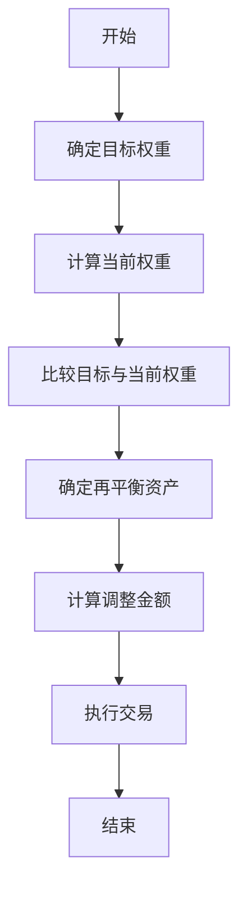
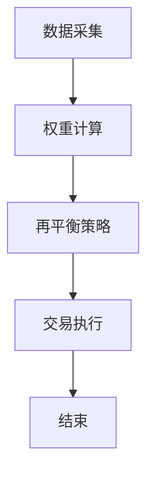

                 


# 约翰·伯格的投资组合再平衡：应对市场剧烈波动的策略

## 关键词：投资组合再平衡，市场波动，约翰·伯格，投资组合优化，风险管理

## 摘要：  
投资组合再平衡是投资管理中的核心策略之一，尤其是在市场剧烈波动的情况下。本文通过分析约翰·伯格的投资理念，结合现代投资组合理论，详细探讨投资组合再平衡的背景、核心概念、算法原理、系统架构设计、项目实战以及最佳实践。通过本文，读者将能够理解如何在市场波动中优化投资组合，降低风险，实现长期稳健的投资收益。

---

## 第一部分: 投资组合再平衡的背景与核心概念

### 第1章: 投资组合再平衡概述

#### 1.1 投资组合再平衡的定义与背景  
投资组合再平衡是投资管理中的一个重要过程，旨在根据市场变化和个人投资目标的调整，重新调整投资组合的资产配置比例，以优化风险和收益的平衡。  
- **定义**：投资组合再平衡是指定期或不定期地调整投资组合中各资产类别的权重，使其符合预先设定的目标投资策略。  
- **背景**：市场波动、投资者风险偏好变化、投资目标调整等因素都会导致投资组合偏离预定目标，因此需要通过再平衡来恢复投资组合的最优状态。  

#### 1.2 市场波动与投资组合风险  
- **市场波动的定义与度量**：市场波动通常通过资产价格的短期剧烈变化来衡量，常用波动率（标准差）来量化。  
- **波动性对投资组合风险的影响**：波动性会导致投资组合的实际收益偏离预期收益，增加投资风险。  
- **不同市场环境下的再平衡策略**：在牛市中，再平衡可以防止收益过高的资产比例过大；在熊市中，再平衡可以避免资产损失过大。

#### 1.3 投资组合再平衡的类型  
- **定期再平衡**：按固定时间间隔（如季度、半年）进行的再平衡，适用于市场环境相对稳定的场景。  
- **事件驱动再平衡**：当市场发生重大事件（如金融危机）时，触发的再平衡。  
- **指数化再平衡**：根据市场指数的变化进行定期调整，以保持与指数一致的配置比例。  
- **动态再平衡**：根据市场变化实时调整资产配置比例。

### 第2章: 投资组合再平衡的核心概念与数学模型

#### 2.1 投资组合优化的数学模型  
- **均值-方差优化模型**：由哈里·马科维茨提出，旨在在给定风险下最大化收益，或在给定收益下最小化风险。  
  $$\text{目标函数：} \min_w \sigma^2 \quad \text{在} \quad \sum_{i=1}^n w_i = 1$$  
  其中，\( w_i \) 为资产 \( i \) 的权重，\( \sigma^2 \) 为投资组合的方差。  
- **风险平价模型**：将风险分配到不同资产类别中，使每类资产的风险贡献相等。  
  $$\text{目标函数：} \min_w \sum_{i=1}^n (w_i \sigma_i)^2 \quad \text{在} \quad \sum_{i=1}^n w_i = 1$$  
  其中，\( \sigma_i \) 为资产 \( i \) 的波动率。  

#### 2.2 投资组合再平衡的数学公式  
- **投资组合权重的计算公式**：  
  $$w_i = \frac{a_i}{\sum_{j=1}^n a_j}$$  
  其中，\( a_i \) 为资产 \( i \) 的当前市场价值，\( w_i \) 为目标权重。  
- **再平衡调整的数学表达**：  
  $$\Delta w_i = w_i^{\text{目标}} - w_i^{\text{当前}}$$  
  其中，\( \Delta w_i \) 为需要调整的资产 \( i \) 的权重。

#### 2.3 投资组合再平衡的流程图  


### 第3章: 投资组合再平衡的算法与实现

#### 3.1 基于均值-方差优化的再平衡算法  
- **算法步骤**：  
  1. 确定目标权重。  
  2. 计算当前权重。  
  3. 比较目标权重与当前权重，确定需要调整的资产。  
  4. 计算调整金额并执行交易。  
- **算法实现的Python代码**：  
  ```python
  import numpy as np
  from scipy.optimize import minimize
  
  # 示例：两资产投资组合优化
  def portfolio_variance(weights, covariance_matrix):
      return np.dot(weights.T, np.dot(covariance_matrix, weights))
  
  def optimize_portfolio(weights, covariance_matrix):
      # 目标函数：最小化投资组合方差
      def objective(x):
          return portfolio_variance(x, covariance_matrix)
  
      # 约束条件：权重之和为1
      cons = ({'type': 'eq', 'fun': lambda x: np.sum(x) - 1})
  
      # 使用SLSQP方法求解
      result = minimize(objective, weights, method='SLSQP', constraints=cons)
      return result.x
  
  # 示例数据
  mu = [0.1, 0.2]
  sigma = [[0.2, 0.1], [0.1, 0.3]]
  initial_weights = [0.5, 0.5]
  
  # 优化投资组合
  optimal_weights = optimize_portfolio(initial_weights, sigma)
  print("最优权重：", optimal_weights)
  ```

#### 3.2 风险平价优化算法  
- **算法原理**：风险平价模型通过优化风险贡献，使每类资产的风险贡献相等。  
- **算法实现的Python代码**：  
  ```python
  import numpy as np
  
  def risk_parity(weights, covariance_matrix):
      # 计算风险贡献
      sigma = np.sqrt(np.dot(weights.T, np.dot(covariance_matrix, weights)))
      risk_contribution = np.dot(weights, covariance_matrix) / sigma
      return risk_contribution
  
  def optimize_risk_parity(n_assets, covariance_matrix):
      # 初始化权重
      initial_weights = np.array([1.0/n_assets] * n_assets)
  
      # 优化目标：最小化风险贡献的平方和
      def objective(weights):
          risk_contri = risk_parity(weights, covariance_matrix)
          return np.sum(risk_contri**2)
  
      # 约束条件：权重之和为1
      cons = [{'type': 'eq', 'fun': lambda w: np.sum(w) - 1}]
  
      # 使用SLSQP方法求解
      from scipy.optimize import minimize
      result = minimize(objective, initial_weights, method='SLSQP', constraints=cons)
      return result.x
  
  # 示例数据
  n_assets = 2
  sigma = [[0.2, 0.1], [0.1, 0.3]]
  
  # 优化风险平价投资组合
  optimal_weights = optimize_risk_parity(n_assets, sigma)
  print("最优权重：", optimal_weights)
  ```

#### 3.3 动态再平衡算法  
- **算法步骤**：  
  1. 实时监控市场数据。  
  2. 计算当前投资组合的权重。  
  3. 比较当前权重与目标权重，确定需要调整的资产。  
  4. 计算调整金额并执行交易。  

---

## 第二部分: 投资组合再平衡的系统分析与架构设计

### 第4章: 系统功能设计

#### 4.1 问题场景介绍  
投资组合再平衡系统需要实时或定期监控市场数据，分析投资组合的当前状态，并根据预设策略进行调整。  

#### 4.2 系统功能设计  
- **功能模块**：  
  1. 数据采集模块：实时获取市场数据。  
  2. 权重计算模块：计算投资组合的当前权重。  
  3. 再平衡策略模块：根据目标策略确定调整资产。  
  4. 交易执行模块：执行调整交易。  

#### 4.3 系统架构设计  


---

## 第三部分: 投资组合再平衡的项目实战

### 第5章: 项目实战

#### 5.1 环境安装  
- **Python环境**：安装Python 3.x，安装必要的库（如NumPy、SciPy、Matplotlib）。  
- **数据源**：使用Yahoo Finance获取市场数据。  

#### 5.2 核心实现源代码  
```python
import pandas as pd
import numpy as np
from scipy.optimize import minimize
import yfinance as yf

# 下载数据
tickers = ['AAPL', 'MSFT', 'GOOGL']
data = yf.download(tickers, start='2020-01-01', end='2023-12-31')['Adj Close']
data = data.pct_change().dropna()

# 计算协方差矩阵
covariance_matrix = data.cov().values

# 优化投资组合
def optimize_portfolio(weights, covariance_matrix):
    def objective(x):
        return np.dot(x.T, np.dot(covariance_matrix, x))
    cons = [{'type': 'eq', 'fun': lambda x: np.sum(x) - 1}]
    result = minimize(objective, weights, method='SLSQP', constraints=cons)
    return result.x

# 示例
initial_weights = [1/3, 1/3, 1/3]
optimal_weights = optimize_portfolio(initial_weights, covariance_matrix)
print("最优权重：", optimal_weights)
```

---

## 第四部分: 投资组合再平衡的最佳实践与小结

### 第6章: 最佳实践

#### 6.1 小结  
投资组合再平衡是应对市场波动的重要策略，通过定期或动态调整资产配置比例，可以有效降低风险并提高收益。

#### 6.2 注意事项  
- **再平衡的时机**：选择合适的时机进行再平衡，避免频繁交易带来的成本。  
- **再平衡的成本**：考虑交易费用和税务成本，避免不必要的损失。  
- **再平衡的策略**：根据市场环境和个人风险偏好选择合适的再平衡策略。  

#### 6.3 拓展阅读  
- 哈里·马科维茨的《投资组合理论》。  
- 约翰·伯格的《投资组合的周期性再平衡》。

---

## 作者：AI天才研究院/AI Genius Institute & 禅与计算机程序设计艺术 /Zen And The Art of Computer Programming

