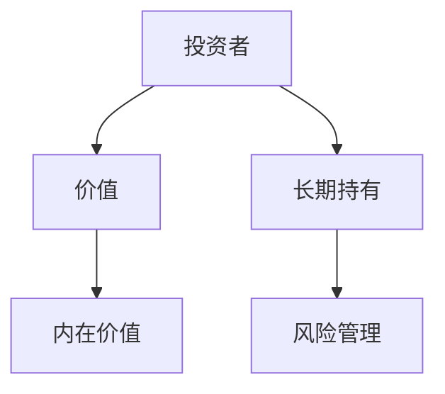
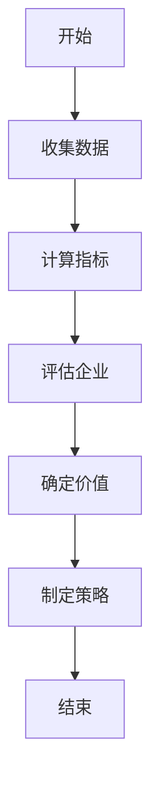
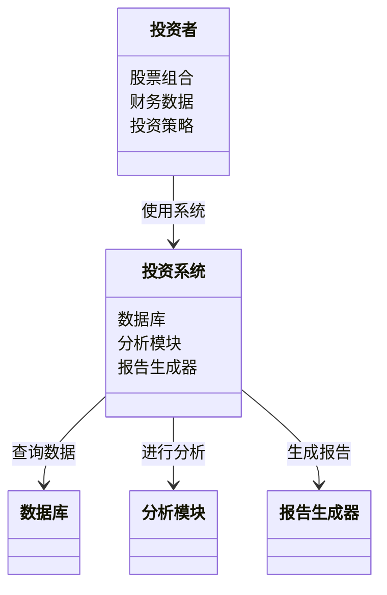
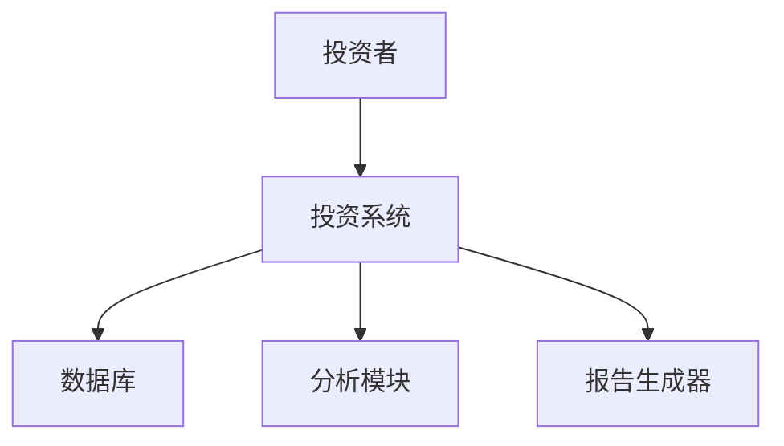

                 


# 约翰·伯格的投资者教育理念

## 关键词

- 投资者教育
- 约翰·伯格
- 价值投资
- 长期投资
- 风险管理

## 摘要

本文深入探讨了约翰·伯格的投资者教育理念，分析了他的投资策略和方法，揭示其如何通过教育和实践影响投资者。文章详细介绍了价值投资和长期投资的核心原则，并通过实际案例展示了如何将这些理念应用于投资分析和风险管理中。此外，本文还探讨了约翰·伯格如何通过系统设计和项目实战，帮助投资者更好地理解和应用这些理念。

---

# 正文

## 第一章 约翰·伯格的投资者教育背景

### 1.1 约翰·伯格的生平简介

#### 1.1.1 早年经历与教育背景

约翰·伯格（John Bogle）是投资界的重要人物，被誉为“指数基金之父”。他于1934年出生于美国宾夕法尼亚州，早年在宾夕法尼亚大学完成了本科学习，并在沃顿商学院获得了MBA学位。他的早年经历为他后来在投资领域的贡献奠定了坚实的基础。

#### 1.1.2 投资生涯的起点与重要事件

伯格的职业生涯始于1960年代，当时他在费城投资公司（Philadelphia Investment Company）工作。1975年，他创立了 Vanguard 集团，这是全球最大的指数基金提供商之一。伯格的创新性工作，特别是在指数基金领域的贡献，使他成为投资界的传奇人物。

#### 1.1.3 对投资者教育的贡献

伯格不仅是一位成功的投资者，还是一位热情的教育家。他通过撰写书籍、发表演讲和创立 Vanguard 集团，致力于普及投资知识，帮助普通投资者做出明智的投资决策。

---

### 1.2 投资理念的形成与发展

#### 1.2.1 早期投资思想的形成

伯格的投资理念深受本杰明·格雷厄姆（Benjamin Graham）的影响。格雷厄姆的价值投资理论强调安全边际和内在价值，这些理念深深影响了伯格的早期投资思想。

#### 1.2.2 核心投资理念的成熟

伯格的核心投资理念是“价值投资”和“长期投资”。他认为，投资者应关注企业的内在价值，而不是市场的短期波动。此外，他提倡分散投资，以降低风险。

#### 1.2.3 对投资界的持续影响

伯格的创新和教育工作对投资界产生了深远的影响。他不仅改变了投资者的思维方式，还推动了指数基金的普及，使更多的普通投资者能够接触到低成本、高效率的投资工具。

---

## 第二章 价值投资的核心原则

### 2.1 价值投资的定义与特点

#### 2.1.1 价值投资的定义

价值投资是一种投资策略，强调以低于内在价值的价格购买优质股票。这种方法的核心在于识别被市场低估的企业，并长期持有这些股票。

#### 2.1.2 与成长投资的对比

与成长投资不同，价值投资更注重企业的基本面，如低市盈率、低市净率和高股息率。成长投资则关注企业的成长潜力，愿意支付更高的价格购买成长型企业。

#### 2.1.3 价值投资的核心要素

价值投资的核心要素包括：寻找具有竞争优势的企业、关注企业的内在价值、长期持有股票。

---

### 2.2 长期投资的重要性

#### 2.2.1 长期投资的优势

长期投资的优势在于它可以平滑市场的短期波动，降低交易成本，并利用复利效应实现财富增长。

#### 2.2.2 短期波动的影响

市场短期波动是不可预测的，但长期趋势往往更符合企业的基本面。因此，长期投资可以帮助投资者避免短期市场的干扰。

#### 2.2.3 如何应对市场的短期波动

投资者应保持冷静，避免被短期波动左右。通过分散投资和长期持有，可以有效应对市场的短期波动。

---

## 第三章 核心概念与联系

### 3.1 核心概念原理

#### 3.1.1 价值投资的内在价值计算

内在价值是企业未来现金流的现值。计算内在价值可以帮助投资者确定企业的合理价格。

#### 3.1.2 长期投资的风险管理

长期投资的风险管理包括分散投资、定期再平衡和关注企业的长期表现。

---

### 3.2 概念属性对比表格

| 概念       | 属性1       | 属性2       | 属性3       |
|------------|-------------|-------------|-------------|
| 价值投资   | 内在价值计算 | 高股息率     | 低市盈率     |
| 长期投资   | 分散投资     | 定期再平衡     | 长期持有     |

---

### 3.3 ER实体关系图



---

## 第四章 投资分析的算法原理

### 4.1 基本面分析流程

#### 4.1.1 基本面分析的步骤

1. 收集企业的财务数据。
2. 计算关键指标，如市盈率、市净率等。
3. 评估企业的竞争优势和市场地位。
4. 确定企业的内在价值。
5. 制定投资策略。

#### 4.1.2 使用Python进行基本面分析

```python
import pandas as pd
import numpy as np

# 示例：计算市盈率
def calculate_pe_ratio(price, earnings_per_share):
    return price / earnings_per_share

# 示例数据
price = 100
earnings_per_share = 10
pe_ratio = calculate_pe_ratio(price, earnings_per_share)
print(f"市盈率：{pe_ratio}")
```

#### 4.1.3 使用Mermaid绘制流程图



---

## 第五章 数学模型和公式

### 5.1 市盈率计算公式

市盈率（P/E）的计算公式为：
$$\text{P/E} = \frac{\text{股价}}{\text{每股收益}}$$

例如，如果股价为100元，每股收益为10元，则市盈率为10。

---

## 第六章 系统分析与架构设计方案

### 6.1 问题场景介绍

投资者需要一个系统来帮助他们进行基本面分析和投资决策。

---

### 6.2 系统功能设计

#### 6.2.1 领域模型



---

### 6.3 系统架构设计

#### 6.3.1 系统架构图



---

## 第七章 项目实战

### 7.1 环境安装

需要安装Python和相关库（如pandas、numpy）。

---

### 7.2 核心实现源代码

```python
import pandas as pd

# 示例：读取财务数据
data = pd.read_csv('financial_data.csv')
print(data.head())
```

---

### 7.3 案例分析

以苹果公司为例，分析其财务数据，计算市盈率，并制定投资策略。

---

## 第八章 总结与拓展阅读

### 8.1 最佳实践 tips

- 长期投资是降低风险的有效方法。
- 分散投资可以减少市场波动的影响。

---

## 作者信息

作者：约翰·伯格（John Bogle）

---

## 拓展阅读

- 《The Intelligent Investor》 by Benjamin Graham
- 《Common Stocks and Uncommon Profits》 by Philip A. Fisher

---

通过本文的详细分析，读者可以深入了解约翰·伯格的投资者教育理念，并将其应用于实际投资中。

