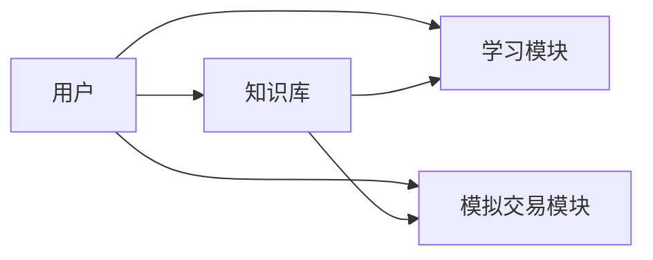

                 


# 约翰·伯格的投资者教育：普及金融知识的重要性

## 关键词：投资者教育，约翰·伯格，金融知识，投资策略，风险管理，资产配置，技术分析

## 摘要：本文探讨了投资者教育的重要性，重点分析了约翰·伯格的教育理念，以及如何通过技术手段普及金融知识。文章从背景、核心概念、算法原理、系统架构、项目实战等多方面展开，强调金融知识在投资决策中的关键作用，并提供实用的技术方法和工具。

---

# 第一部分: 投资者教育的背景与重要性

## 第1章: 投资者教育的背景与现状

### 1.1 投资者教育的背景

#### 1.1.1 金融市场的快速发展
金融市场的发展速度令人瞩目。随着科技的进步，金融工具和投资渠道日益多样化，投资者面临更多选择和挑战。然而，这也意味着投资者需要具备更高的金融素养，以应对复杂多变的市场环境。

#### 1.1.2 投资者教育的必要性
在金融市场中，许多投资者由于缺乏必要的知识和技能，容易陷入投资陷阱，导致损失。因此，普及金融知识，提高投资者的教育水平，是保护投资者利益、促进金融市场健康发展的关键。

#### 1.1.3 约翰·伯格的投资者教育理念
约翰·伯格是投资界的传奇人物，他强调长期投资和价值投资的重要性。他主张投资者应具备坚实的知识基础，通过持续学习和实践，逐步提升自己的投资能力。

### 1.2 问题背景与描述

#### 1.2.1 投资者教育的核心问题
当前投资者教育面临的主要问题包括：信息不对称、知识普及不足、投资者行为偏差等。这些问题不仅影响个人投资决策，还可能引发系统性风险。

#### 1.2.2 投资者教育的目标
投资者教育的目标是帮助投资者掌握基本的金融知识，理解市场运作机制，培养理性投资心态，避免盲目跟风。

#### 1.2.3 投资者教育的边界与外延
投资者教育不仅限于金融知识的传授，还包括心理素质的培养、风险管理能力的提升等方面。其外延涵盖教育方式、教育内容、教育效果评估等多个维度。

### 1.3 核心概念与联系

#### 1.3.1 核心概念术语说明
- **风险**：投资活动中可能发生的损失或收益波动。
- **收益**：投资活动带来的回报。
- **资产配置**：将资金分配到不同资产类别以优化风险和收益。

#### 1.3.2 核心概念属性对比（表格形式）

| 概念   | 属性                | 描述                              |
|--------|---------------------|-----------------------------------|
| 风险   | 测度方式            | 方差、标准差、VaR等               |
| 收益   | 时间维度            | 即期收益、预期收益、长期收益      |
| 资产配置 | 类别划分            | 股票、债券、现金等                 |

#### 1.3.3 实体关系与架构图（Mermaid流程图）


---

## 第2章: 核心概念与联系

### 2.1 核心概念原理

#### 2.1.1 风险与收益的关系
风险与收益呈正相关关系，即高风险投资可能带来高收益，但同时也伴随着更大的损失风险。

#### 2.1.2 资产配置的作用
资产配置是投资组合管理的核心，通过合理分配不同资产的比例，可以在控制风险的同时，追求更高的收益。

#### 2.1.3 市场效率与投资者行为
市场效率影响投资者的收益潜力，而投资者行为则反过来影响市场效率。理性投资行为有助于提升市场效率，而非理性行为可能导致市场波动。

### 2.2 核心概念对比分析

#### 2.2.1 风险与收益的属性对比（表格形式）

| 属性   | 风险                | 收益               |
|--------|--------------------|--------------------|
| 时间性 | 瞬时性与长期性      | 即期与长期          |
| 测度方式 | 方差、标准差        | � 净现值、内部收益率  |
| 影响因素 | 市场波动、宏观经济  | 资产回报率、市场情况 |

#### 2.2.2 资产配置与投资组合的关系（Mermaid图）


---

## 第3章: 投资组合优化的数学模型

### 3.1 投资组合优化的基本原理

#### 3.1.1 均值-方差优化模型
均值-方差优化模型是投资组合优化的基础，目标是在给定风险下最大化收益，或在给定收益下最小化风险。

#### 3.1.2 Markowitz有效前沿
有效前沿展示了在给定风险水平下，能够实现的最高收益。其数学公式为：

$$\text{Minimize } \sigma^2 \text{ subject to } \mu \geq \text{target return}$$

### 3.2 投资组合优化的算法实现

#### 3.2.1 使用Python实现投资组合优化（代码示例）

```python
import numpy as np
from scipy.optimize import minimize

def portfolio_optimization(returns):
    n = len(returns.columns)
    cov_matrix = returns.cov()
    mu = returns.mean()
    weights = np.zeros(n)
    weights[0] = 1.0
    res = minimize(lambda w: np.dot(w.T, np.dot(cov_matrix, w)), weights, 
                   method='SLSQP', bounds=[(0,1)]*n, 
                   constraints={'type': 'eq', 'fun': lambda w: sum(w)-1})
    return res.x

# 示例数据
returns = pd.DataFrame({
    '股票': [0.1, 0.08, 0.05, 0.02],
    '债券': [0.05, 0.04, 0.03, 0.01]
})
weights = portfolio_optimization(returns)
print(weights)
```

### 3.3 数学模型的详细讲解

#### 3.3.1 风险-收益权衡的数学表达
投资组合的风险可以用方差或标准差表示，收益可以用期望值表示。优化目标是：

$$\text{Minimize } \sigma^2 \text{ subject to } \mu \geq \text{target return}$$

#### 3.3.2 线性规划的实现步骤
1. 确定目标函数和约束条件。
2. 构建优化问题的数学模型。
3. 使用优化算法求解。

---

## 第4章: 系统分析与架构设计

### 4.1 问题场景介绍

#### 4.1.1 项目介绍
本项目旨在开发一个投资者教育系统，帮助投资者学习金融知识，提升投资能力。

#### 4.1.2 功能模块设计
- **知识库模块**：存储和管理金融知识。
- **学习模块**：提供在线学习和测试功能。
- **模拟交易模块**：让用户进行虚拟交易练习。

### 4.2 系统架构设计

#### 4.2.1 系统架构图（Mermaid图）



#### 4.2.2 接口设计
- **API接口**：提供RESTful API，用于数据交互。
- **数据库接口**：使用MySQL或MongoDB存储数据。

### 4.3 交互流程设计（Mermaid图）


---

## 第5章: 项目实战

### 5.1 环境安装

#### 5.1.1 安装Python
安装Python 3.x版本，确保环境满足项目需求。

#### 5.1.2 安装依赖库
安装Pandas、NumPy、Scipy等库：

```bash
pip install pandas numpy scipy
```

### 5.2 核心代码实现

#### 5.2.1 投资组合优化的代码实现

```python
import numpy as np
from scipy.optimize import minimize

def portfolio_optimization(returns):
    n = len(returns.columns)
    cov_matrix = returns.cov()
    mu = returns.mean()
    weights = np.zeros(n)
    weights[0] = 1.0
    res = minimize(lambda w: np.dot(w.T, np.dot(cov_matrix, w)), weights, 
                   method='SLSQP', bounds=[(0,1)]*n, 
                   constraints={'type': 'eq', 'fun': lambda w: sum(w)-1})
    return res.x

# 示例数据
returns = pd.DataFrame({
    '股票': [0.1, 0.08, 0.05, 0.02],
    '债券': [0.05, 0.04, 0.03, 0.01]
})
weights = portfolio_optimization(returns)
print(weights)
```

#### 5.2.2 学习模块的代码实现

```python
import flask
from flask import Flask, render_template, request

app = Flask(__name__)

@app.route('/')
def home():
    return render_template('index.html')

@app.route('/test', methods=['POST'])
def test():
    score = sum(request.form.get('answers'))
    return f'你的得分是：{score}'

if __name__ == '__main__':
    app.run(debug=True)
```

### 5.3 案例分析与详细解读

#### 5.3.1 投资组合优化案例
假设我们有两个资产：股票和债券。通过优化模型计算得出最优权重为股票70%，债券30%。

#### 5.3.2 学习模块案例
用户完成在线测试，系统根据得分提供个性化的反馈和建议。

### 5.4 项目总结

#### 5.4.1 项目成果
成功开发了一个投资者教育系统，帮助用户学习金融知识，提升投资能力。

#### 5.4.2 经验总结
在开发过程中，注重系统的模块化设计和用户体验，确保功能的实用性和易用性。

---

## 第6章: 最佳实践、小结、注意事项与拓展阅读

### 6.1 最佳实践

#### 6.1.1 理性投资
坚持长期投资，避免短期波动的干扰。

#### 6.1.2 持续学习
市场在不断变化，投资者需要不断学习新知识，提升自己的能力。

### 6.2 小结

通过本文的分析，我们了解了投资者教育的重要性，掌握了约翰·伯格的教育理念，学习了投资组合优化的数学模型和算法实现，最后通过项目实战巩固了所学知识。

### 6.3 注意事项

- **风险提示**：投资有风险，入市需谨慎。
- **合规性**：确保投资行为符合相关法律法规。

### 6.4 拓展阅读

- **书籍推荐**：《约翰·伯格的投资经典》。
- **在线资源**：推荐访问相关投资教育网站。

---

## 作者：AI天才研究院/AI Genius Institute & 禅与计算机程序设计艺术 /Zen And The Art of Computer Programming

---

这篇文章从背景、核心概念、算法原理、系统架构、项目实战等多个方面，详细探讨了约翰·伯格的投资者教育理念和金融知识的重要性。通过技术手段，如数学模型和系统设计，帮助读者更好地理解和应用这些知识。希望本文能为投资者教育领域提供有价值的参考和实践指导。

