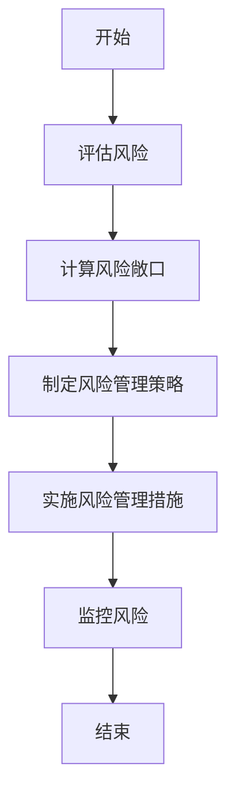
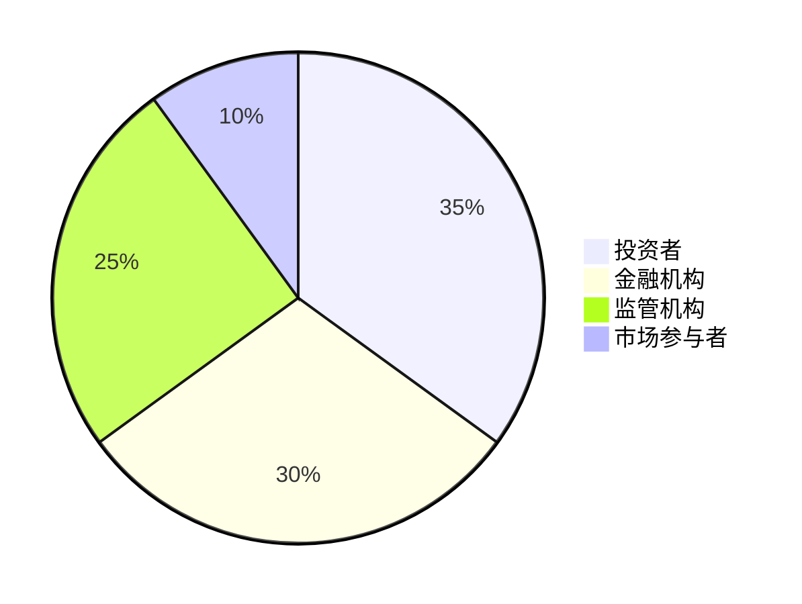
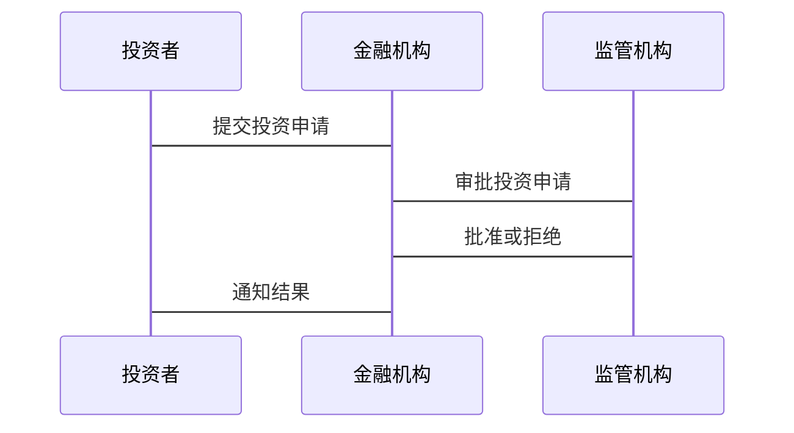

                 


# 约翰·伯格的投资者权益保护观

## 关键词：投资者权益保护，约翰·伯格，风险管理，公司治理，法律框架

## 摘要

投资者权益保护是投资领域的重要议题，而约翰·伯格作为投资界的权威人物，提出了许多深刻的见解。本文将从背景介绍、核心概念、算法原理、系统分析、项目实战等方面，详细探讨约翰·伯格的投资者权益保护观，结合实际案例和数学模型，分析其在现代投资中的应用。

---

## 目录大纲

1. 背景介绍  
   1.1 投资者权益保护的重要性  
   1.2 约翰·伯格的投资者权益保护观  
   1.3 投资者权益保护的法律与伦理框架  

2. 核心概念与联系  
   2.1 投资者权益保护的核心概念  
   2.2 投资者权益保护的核心概念与联系  

3. 投资者权益保护的算法与数学模型  
   3.1 投资者权益保护的算法原理  
   3.2 投资者权益保护的数学模型与公式  

4. 投资者权益保护的系统分析与架构设计  
   4.1 投资者权益保护的系统分析  
   4.2 投资者权益保护的系统架构设计  

5. 投资者权益保护的项目实战  
   5.1 项目环境与工具安装  
   5.2 项目核心实现  

---

## 正文

### 第1章：背景介绍

#### 1.1 投资者权益保护的重要性

投资者权益保护是确保市场公平、透明和有效运作的基础。投资者在金融市场中面临各种风险，包括市场风险、信用风险和操作风险。保护投资者权益不仅有助于维护市场的信任，还能促进资本市场的健康发展。通过法律和制度的完善，投资者可以更好地保护自己的利益，减少损失。

---

#### 1.2 约翰·伯格的投资者权益保护观

约翰·伯格是投资领域的传奇人物，他的投资理念深刻影响了现代投资理论。伯格强调长期投资、分散化和低成本投资策略。他认为，投资者权益保护的核心在于透明度和公平性。伯格的投资者权益保护观主要包括以下几点：

1. **透明度**：投资者需要充分了解投资产品的风险、收益和管理费用。
2. **公平性**：投资者应享有平等的待遇，避免任何形式的歧视或欺诈。
3. **风险管理**：投资者应采取适当的风险管理措施，以降低潜在损失。

伯格的这些观点为投资者权益保护提供了理论基础和实践指导。

---

#### 1.3 投资者权益保护的法律与伦理框架

投资者权益保护的法律框架包括相关法律法规的制定和执行。例如，《证券法》和《公司治理准则》为投资者提供了法律保障。此外，伦理框架要求金融机构和上市公司遵守道德规范，避免欺诈和不公正行为。

### 第2章：核心概念与联系

#### 2.1 投资者权益保护的核心概念

投资者权益保护的核心概念包括以下几点：

1. **安全性**：确保投资者的资金安全，避免因欺诈或管理不当导致的损失。
2. **透明性**：要求金融机构和上市公司公开相关信息，以便投资者做出明智决策。
3. **公平性**：确保投资者在市场中享有平等的权利和机会。

---

#### 2.2 投资者权益保护的核心概念与联系

投资者权益保护的核心概念与多个方面密切相关。例如，透明性与市场信任密切相关，公平性与市场参与度密切相关。以下是核心概念的对比分析：

| 核心概念 | 安全性 | 透明性 | 公平性 |
|----------|--------|--------|--------|
| 属性     | 风险控制 | 信息披露 | 权利平等 |
| 联系     | 安全性是透明性和公平性的基础 | 透明性是安全性的重要保障 | 公平性是市场健康发展的关键 |

### 第3章：算法与数学模型

#### 3.1 投资者权益保护的算法原理

投资者权益保护的算法原理主要涉及风险评估和投资组合优化。以下是用Mermaid表示的保护机制流程图：



---

#### 3.2 投资者权益保护的数学模型与公式

数学模型在投资者权益保护中起着重要作用。例如，风险评估可以使用资本资产定价模型（CAPM）进行计算：

$$ E(r_i) = r_f + \beta_i (E(r_m) - r_f) $$

其中，\( E(r_i) \) 是资产的预期回报率，\( r_f \) 是无风险利率，\( \beta_i \) 是资产的贝塔系数，\( E(r_m) \) 是市场预期回报率。

### 第4章：系统分析与架构设计

#### 4.1 投资者权益保护的系统分析

投资者权益保护的系统分析包括功能设计和架构设计。以下是用Mermaid表示的系统架构图：



---

#### 4.2 投资者权益保护的系统架构设计

系统架构设计包括模块划分和交互流程。以下是用Mermaid表示的系统交互流程图：



---

### 第5章：项目实战

#### 5.1 项目环境与工具安装

项目实战需要搭建开发环境并安装相关工具。以下是环境安装步骤：

1. 安装Python和相关库（如NumPy和Pandas）。
2. 下载并安装投资分析软件（如Excel或R）。
3. 配置开发环境，确保所有工具正常运行。

---

#### 5.2 项目核心实现

项目核心实现包括风险评估和投资组合优化。以下是核心代码实现：

```python
import numpy as np
import pandas as pd

# 示例数据
returns = np.array([0.05, 0.02, -0.01, 0.03, 0.04])

# 计算平均回报率
mean_return = np.mean(returns)
print(f"平均回报率：{mean_return}")

# 计算标准差
std_deviation = np.std(returns)
print(f"标准差：{std_deviation}")
```

---

## 结语

通过本文的详细分析，我们可以看到约翰·伯格的投资者权益保护观在现代投资中的重要性。从背景介绍到系统设计，再到项目实战，我们全面探讨了投资者权益保护的核心概念和实现方法。未来，随着金融市场的不断发展，投资者权益保护将变得更加复杂和重要，需要我们不断学习和创新。

---

## 作者

作者：AI天才研究院 & 禅与计算机程序设计艺术

---

**本文遵循CC BY 4.0 license**

