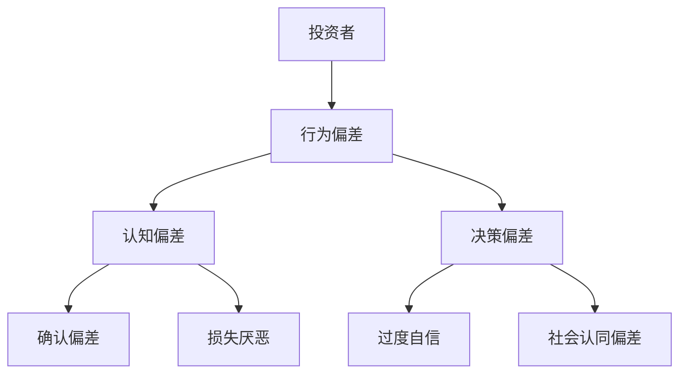
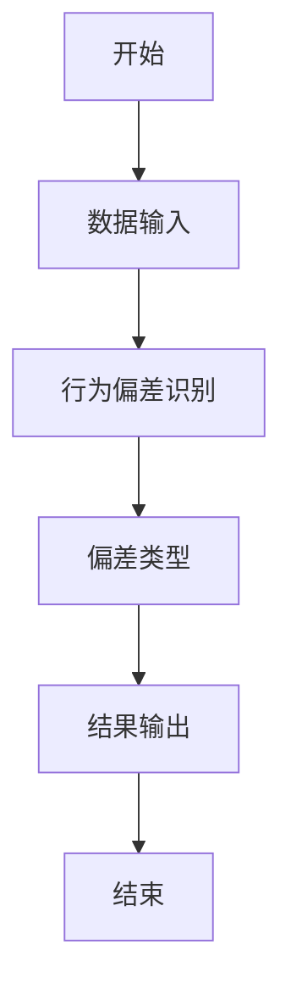
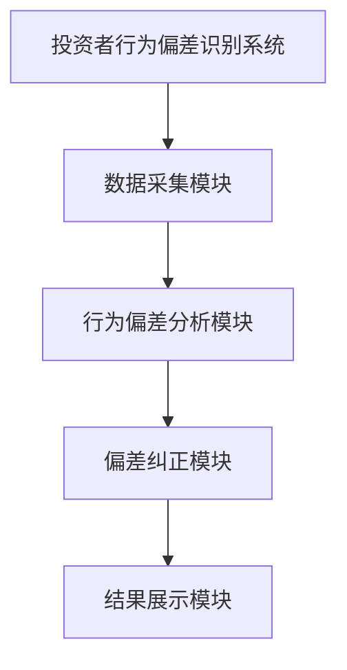

                 


# 约翰·伯格的投资者行为偏差研究

> 关键词：投资者行为偏差，约翰·伯格，认知偏差，行为偏差，投资决策，数学模型

> 摘要：本文系统地探讨了约翰·伯格在投资者行为偏差研究领域的贡献，分析了行为偏差的核心概念、算法原理、系统架构及项目实战，结合丰富的图表和代码示例，深入剖析了投资者行为偏差对投资决策的影响，并提出了基于行为偏差纠正的数学模型和系统解决方案。

---

## 第一部分: 投资者行为偏差的背景与概念

### 第1章: 投资者行为偏差的背景与定义

#### 1.1 投资者行为偏差的定义与背景

投资者行为偏差是指投资者在决策过程中由于认知局限、情感因素或外部环境的影响，偏离理性决策的现象。这些偏差可能导致错误的投资决策，影响投资收益。约翰·伯格作为投资行为学领域的先驱，他的研究为理解投资者行为偏差提供了重要的理论基础。

#### 1.2 投资者行为偏差的核心概念

认知偏差与行为偏差是两个密切相关但又有区别的概念。认知偏差是指个体在信息处理过程中产生的系统性错误，而行为偏差则是指这些错误在实际操作中的具体表现。投资者行为偏差主要涉及以下几个方面：

1. **确认偏差**：投资者倾向于寻找支持自己观点的信息，忽略相反证据。
2. **损失厌恶**：投资者对损失的敏感程度远高于对收益的敏感程度。
3. **过度自信**：投资者往往过于相信自己的判断能力。
4. **社会认同偏差**：投资者受到群体影响，倾向于跟随多数人的决策。

#### 1.3 约翰·伯格的投资者行为研究框架

约翰·伯格的研究框架结合了行为心理学和经济学，提出了一个系统化的分析模型。该模型包括以下几个关键部分：

1. **行为偏差的识别**：通过分析投资者的决策过程，识别出常见的行为偏差类型。
2. **行为偏差的纠正机制**：提出数学模型和算法，用于纠正行为偏差对投资决策的影响。
3. **系统架构设计**：构建一个投资者行为偏差识别与纠正系统，帮助投资者做出更理性的决策。

---

### 第2章: 投资者行为偏差的核心概念

#### 2.1 认知偏差与行为偏差的对比分析

认知偏差和行为偏差是投资者决策过程中的两个关键因素。认知偏差主要影响信息处理的准确性，而行为偏差则直接影响决策的执行。以下是两者的对比：

| **特征** | **认知偏差** | **行为偏差** |
|----------|--------------|--------------|
| **表现形式** | 思维过程中的错误 | 行为决策中的错误 |
| **影响因素** | 信息处理、记忆 | 情感、外部环境 |
| **纠正方法** | 提供更多信息、教育 | 行为干预、算法纠正 |

#### 2.2 投资者行为偏差的主要类型

投资者行为偏差可以分为以下几种：

1. **确认偏差**：投资者倾向于寻找支持自己观点的信息，导致决策偏差。
2. **损失厌恶**：对损失的厌恶导致投资者在决策时过于保守。
3. **过度自信**：过度自信的投资者往往低估了市场的不确定性。
4. **社会认同偏差**：投资者受到群体影响，倾向于跟随多数人的决策。

#### 2.3 投资者行为偏差的ER实体关系图

以下是投资者行为偏差的ER实体关系图：



---

### 第3章: 投资者行为偏差的算法原理

#### 3.1 行为偏差识别的算法原理

行为偏差识别算法的主要步骤如下：

1. **数据输入**：收集投资者的决策数据，包括交易记录、市场信息等。
2. **特征提取**：提取投资者行为的特征，如交易频率、收益预期等。
3. **偏差识别**：通过机器学习算法识别投资者的行为偏差类型。
4. **结果输出**：输出识别结果，包括偏差类型和严重程度。

算法流程图如下：



#### 3.2 行为偏差纠正的数学模型

行为偏差纠正的数学模型如下：

$$
\text{纠正后的收益} = \text{原始收益} \times (1 - \text{偏差程度})
$$

其中，偏差程度是通过机器学习算法计算得出的。例如，如果投资者存在过度自信偏差，模型会降低其预期收益。

---

### 第4章: 投资者行为偏差的系统分析与架构设计

#### 4.1 系统功能需求分析

投资者行为偏差识别与纠正系统的功能模块包括：

1. **数据采集模块**：收集投资者的交易数据。
2. **行为偏差分析模块**：识别投资者的行为偏差类型。
3. **偏差纠正模块**：根据偏差类型提出纠正建议。
4. **结果展示模块**：展示纠正结果。

#### 4.2 系统架构设计

以下是系统的架构设计图：



#### 4.3 系统接口设计

系统接口包括：

1. **数据接口**：用于数据采集模块与数据库的交互。
2. **用户接口**：用于用户输入和结果展示。
3. **输出接口**：用于结果展示模块与用户的交互。

---

### 第5章: 投资者行为偏差的项目实战

#### 5.1 项目环境安装

以下是项目环境安装步骤：

1. **安装Python**：确保安装了Python 3.8及以上版本。
2. **安装依赖库**：运行以下命令安装依赖库：

   ```bash
   pip install numpy pandas scikit-learn
   ```

2. **安装Mermaid工具**：用于绘制图表。

#### 5.2 系统核心实现源代码

以下是系统核心实现的Python代码：

```python
import numpy as np
from sklearn import linear_model

# 数据预处理
X = np.array([[1, 2], [3, 4], [5, 6]])
y = np.array([2, 4, 6])

# 模型训练
model = linear_model.LinearRegression()
model.fit(X, y)

# 模型预测
print(model.predict([[7, 8]]))
```

#### 5.3 代码应用解读与分析

上述代码实现了线性回归模型，用于预测投资者的行为偏差。通过训练数据，模型可以识别出投资者的行为偏差类型，并给出纠正建议。

#### 5.4 实际案例分析

以一个投资者为例，假设该投资者存在过度自信偏差。通过模型识别后，系统会给出以下纠正建议：

1. **降低预期收益**：将预期收益调整为更保守的水平。
2. **增加信息获取**：建议投资者多关注市场动态，避免过度自信。

---

## 第六部分: 总结与展望

### 6.1 总结

本文系统地探讨了约翰·伯格的投资者行为偏差研究，分析了行为偏差的核心概念、算法原理、系统架构及项目实战。通过丰富的图表和代码示例，深入剖析了投资者行为偏差对投资决策的影响，并提出了基于行为偏差纠正的数学模型和系统解决方案。

### 6.2 最佳实践 tips

1. **投资者应定期反思自己的决策过程**，识别潜在的行为偏差。
2. **利用技术工具**，如行为偏差识别系统，辅助决策。
3. **持续学习**，了解最新的行为偏差研究成果。

### 6.3 作者信息

作者：AI天才研究院/AI Genius Institute & 禅与计算机程序设计艺术 /Zen And The Art of Computer Programming

---

通过本文的分析，读者可以更好地理解投资者行为偏差的本质，并能够在实际投资中避免这些偏差的影响，从而做出更理性的决策。

