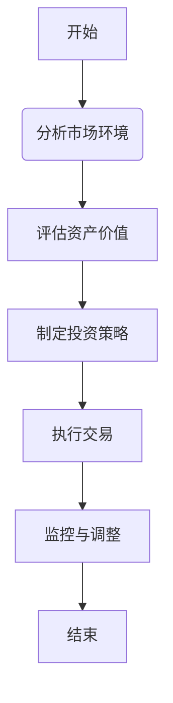
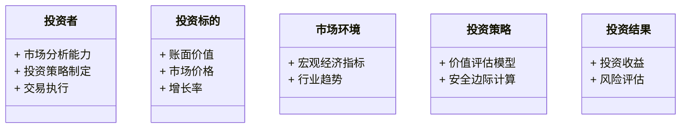

                 


# 约翰·伯格的投资者行为分析

## 关键词：约翰·伯格，价值投资，投资者行为，投资哲学，投资策略

## 摘要：  
约翰·伯格（John C. Bogle）是价值投资领域的传奇人物，他以其独特的投资哲学和长期视角闻名。本文将深入分析伯格的投资者行为模式，探讨其核心理念、策略和行为特征，结合实际案例和系统架构，为现代投资者提供深度分析和启示。

---

## 第1章：约翰·伯格的生平与投资哲学

### 1.1 约翰·伯格的生平简介  
- **早年经历**：伯格出生于1934年，早年在宾夕法尼亚大学学习，后转向哥伦比亚大学，师从本杰明·格雷厄姆（Benjamin Graham）。  
- **职业生涯**：他创立了 Vanguard 集团，推动了指数基金的发展，改变了传统投资行业格局。  
- **哲学核心**：伯格坚信“简单就是美”，主张通过长期持有优质资产，实现复利增长。  

### 1.2 投资哲学的核心要素  
- **长期视角**：伯格反对频繁交易，主张长期持有，减少交易成本。  
- **安全边际**：他强调购买低估资产，留有安全边际，降低投资风险。  
- **纪律性**：伯格的投资纪律性是其成功的关键，他严格遵守价值投资原则。  

### 1.3 伯格与彼得·林奇的对比  
- **投资风格**：林奇偏爱成长股，而伯格更注重价值与风险平衡。  
- **交易频率**：林奇倾向于高频交易，伯格则坚持低频交易。  
- **风险管理**：林奇注重行业趋势，伯格更关注资产的安全边际。  

---

## 第2章：投资者行为的核心概念

### 2.1 投资者行为的核心要素  
- **投资目标**：明确投资目标，如保值、增值或获取现金流。  
- **风险偏好**：评估自身的风险承受能力，制定相应的投资策略。  
- **信息处理**：投资者如何处理市场信息，影响决策质量。  

### 2.2 伯格投资行为的特征分析  
- **长期视角**：伯格的投资周期通常超过十年，避免短期波动干扰。  
- **价值导向**：他倾向于购买市场价格低于内在价值的资产。  
- **纪律性**：严格遵守投资纪律，避免情绪化决策。  

### 2.3 伯格行为与其他投资者的对比  
- **短期交易者**：高频交易者容易受市场波动影响，风险较高。  
- **技术分析者**：依赖图表和技术指标，忽视基本面分析。  
- **价值投资者**：伯格代表了价值投资的纪律性和长期视角，但也有其独特之处。  

---

## 第3章：伯格投资行为的ER实体关系图

```mermaid
er
  actor(投资者)
  entity(投资标的)
  entity(市场环境)
  entity(投资策略)
  entity(投资结果)
  relation(投资者 -> 投资策略: 制定策略)
  relation(投资者 -> 市场环境: 分析环境)
  relation(投资者 -> 投资标的: 选择资产)
  relation(投资策略 -> 投资结果: 实现目标)
  relation(市场环境 -> 投资结果: 影响结果)
```

---

## 第4章：算法原理讲解

### 4.1 投资策略的算法流程图



### 4.2 价值评估模型的Python代码实现

```python
def value_intrinsic_analysis(stock_price, book_value, dividend_yield, growth_rate):
    # 计算内在价值
    intrinsic_value = book_value * (1 + growth_rate) / (1 - dividend_yield)
    return intrinsic_value

# 示例应用
stock_price = 50
book_value = 30
dividend_yield = 0.05
growth_rate = 0.1

intrinsic_value = value_intrinsic_analysis(stock_price, book_value, dividend_yield, growth_rate)
print(f"股票的内在价值为：{intrinsic_value}")
```

### 4.3 数学模型与公式

$$ \text{内在价值} = \frac{\text{账面价值} \times (1 + \text{增长率})}{1 - \text{股息率}} $$

---

## 第5章：系统分析与架构设计

### 5.1 系统功能设计



### 5.2 系统架构设计


---

## 第6章：项目实战

### 6.1 实际案例分析

假设伯格投资某公司，其账面价值为 $30，市场价格为 $50，股息率为5%，增长率为10%。计算其内在价值：

$$ \text{内在价值} = \frac{30 \times 1.1}{1 - 0.05} = 35.29 $$

市场价格高于内在价值，因此不建议投资。

### 6.2 代码实现与分析

```python
def calculate_margin_of_safety(stock_price, intrinsic_value):
    margin = (intrinsic_value - stock_price) / intrinsic_value
    return margin

# 示例计算
stock_price = 50
intrinsic_value = 35.29

margin = calculate_margin_of_safety(stock_price, intrinsic_value)
print(f"安全边际为：{margin}")
```

---

## 第7章：最佳实践

### 7.1 小结

- **长期视角**：坚持长期投资，避免短期波动干扰。  
- **价值导向**：选择市场价格低于内在价值的资产。  
- **纪律性**：严格遵守投资纪律，避免情绪化决策。  

### 7.2 注意事项

- **风险管理**：任何时候都要考虑安全边际，避免过度杠杆。  
- **持续学习**：投资是一项终身学习的事业，需不断更新知识。  

### 7.3 拓展阅读

- 《投资最重要的事》——约翰·伯格的著作，深入阐述其投资哲学。  
- 《证券分析》——本杰明·格雷厄姆的经典著作，价值投资的奠基之作。  

---

## 作者：AI天才研究院 & 禅与计算机程序设计艺术

