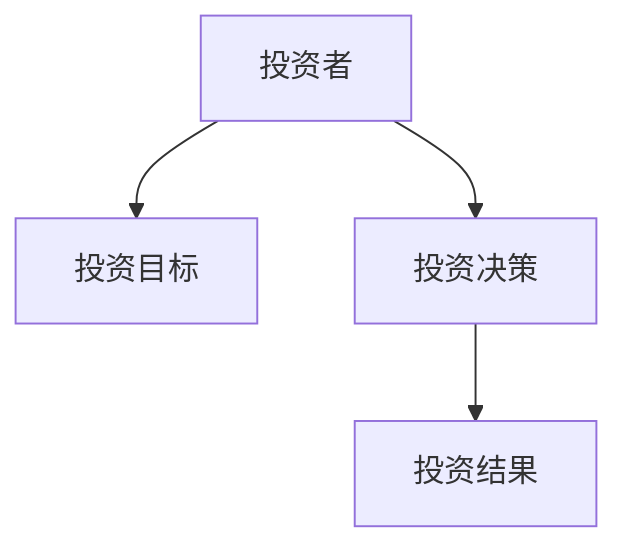
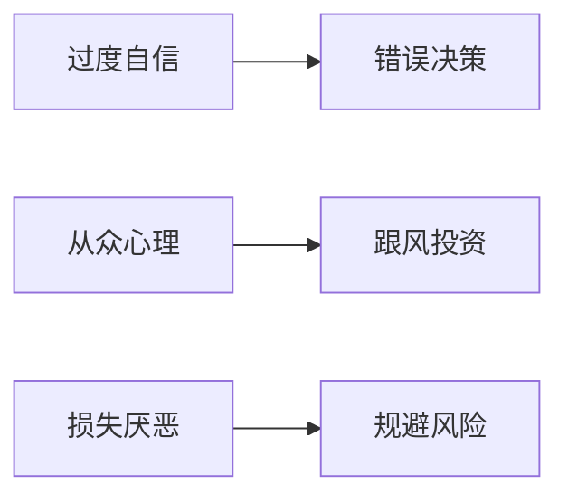
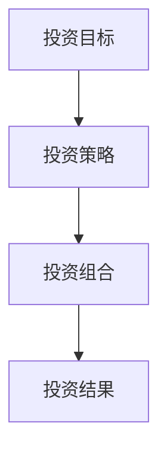

                 


# 约翰·伯格的投资者行为学观点

## 关键词：投资者行为学，约翰·伯格，价值投资，长期投资，行为偏差，投资组合管理

## 摘要：本文深入探讨了约翰·伯格的投资者行为学观点，分析了他的投资哲学、行为模型以及克服行为偏差的策略。通过数学模型和系统架构的阐述，结合实际案例，为读者提供了全面的理解和应用指南。

---

# 第1章: 投资者行为学概述

## 1.1 投资者行为学的定义与研究领域

投资者行为学是研究投资者在不同市场环境和心理状态下如何做出投资决策的学科。它关注投资者的决策过程、行为模式以及这些行为对投资结果的影响。

### 1.1.1 投资者行为学的定义
投资者行为学通过分析投资者的心理、情绪和认知偏差，揭示其在金融市场中的行为规律。它结合心理学、经济学和金融学的理论，帮助投资者更好地理解自身决策过程。

### 1.1.2 投资者行为学的研究范围
- 投资者的决策过程和行为模式
- 不同市场环境下的投资者行为
- 投资者认知偏差对决策的影响
- 投资者情绪对市场波动的影响

### 1.1.3 投资者行为学的重要性
理解投资者行为有助于投资者避免常见错误，优化决策过程，提高投资收益。

## 1.2 约翰·伯格的投资者行为学观点

### 1.2.1 伯格的学术背景与投资理念
约翰·伯格是指数基金的先驱，强调长期投资和价值投资。他认为，市场波动和短期投机会增加投资风险，而长期持有优质资产可以实现稳定收益。

### 1.2.2 伯格对投资者行为学的贡献
伯格通过实证研究揭示了投资者行为中的常见偏差，如过度自信和从众心理，并提出了克服这些偏差的策略。

### 1.2.3 伯格观点的核心思想
- 长期投资是降低风险、实现财富增长的有效方式。
- 分散投资可以减少单一资产的风险。
- 投资者应避免过度交易和情绪化决策。

## 1.3 本章小结
本章介绍了投资者行为学的基本概念和研究范围，重点阐述了约翰·伯格的核心观点，为后续分析奠定了基础。

---

# 第2章: 投资者行为的核心概念

## 2.1 投资者行为的核心要素

### 2.1.1 投资目标的设定
明确的投资目标是投资行为的起点，包括短期目标和长期目标。

### 2.1.2 投资决策的过程
从信息收集到决策执行，投资决策涉及多个步骤和因素。

### 2.1.3 投资结果的评估
评估投资结果需要考虑收益、风险和时间因素。

## 2.2 投资者行为的分类与对比

### 2.2.1 理性投资者与非理性投资者
- 理性投资者：基于充分信息和逻辑分析做出决策。
- 非理性投资者：受情绪和认知偏差影响做出决策。

### 2.2.2 主动投资者与被动投资者
- 主动投资者：积极选股，追求超额收益。
- 被动投资者：通过指数基金等工具，追求市场平均收益。

### 2.2.3 长期投资者与短期投资者
- 长期投资者：关注资产的长期增值。
- 短期投资者：追求短期收益，风险较高。

## 2.3 投资者行为的实体关系图



## 2.4 本章小结
本章分析了投资者行为的核心要素和分类，帮助读者更好地理解投资行为的复杂性。

---

# 第3章: 约翰·伯格的投资哲学与行为模型

## 3.1 伯格的投资哲学

### 3.1.1 价值投资的核心理念
伯格认为，投资应关注企业的内在价值，而非市场的短期波动。

### 3.1.2 长期投资的重要性
长期持有优质资产，避免频繁交易带来的成本和风险。

### 3.1.3 分散投资的风险控制
通过投资多样化资产降低风险，避免过度依赖单一投资标的。

## 3.2 伯格的行为模型

### 3.2.1 投资者心理分析
伯格分析了投资者的常见心理状态，如贪婪和恐惧，并强调了情绪控制的重要性。

### 3.2.2 行为偏差的识别
- 过度自信：高估自身判断能力，可能导致错误决策。
- 从众心理：盲目跟随市场趋势，增加投资风险。
- 损失厌恶：过度关注潜在损失，影响投资决策。

### 3.2.3 理性决策的实现
通过建立合理的决策框架和长期投资策略，减少行为偏差的影响。

## 3.3 伯格行为模型的数学表达

### 3.3.1 投资收益的期望值公式
$$E[R] = \sum p_i R_i$$

### 3.3.2 风险与收益的权衡公式
$$\text{夏普比率} = \frac{E[R - R_f]}{\sigma}$$

## 3.4 本章小结
本章详细阐述了伯格的投资哲学和行为模型，为理解其观点提供了理论基础。

---

# 第4章: 投资者行为偏差与克服策略

## 4.1 常见投资者行为偏差

### 4.1.1 过度自信偏差
投资者往往高估自身能力，导致错误决策。

### 4.1.2 从众心理偏差
盲目跟随市场趋势，增加投资风险。

### 4.1.3 损失厌恶偏差
过度关注潜在损失，影响投资决策。

## 4.2 行为偏差的数学模型



## 4.3 克服行为偏差的策略

### 4.3.1 提高自我认知
通过反思和学习，了解自身的行为偏差。

### 4.3.2 建立决策框架
制定明确的投资计划和决策规则，减少情绪影响。

### 4.3.3 培养长期视角
关注长期投资目标，避免短期波动的干扰。

## 4.4 本章小结
本章分析了常见行为偏差及其克服策略，帮助投资者做出更理性的决策。

---

# 第5章: 投资组合管理与行为优化

## 5.1 投资组合管理的核心原则

### 5.1.1 分散投资的重要性
通过投资多样化资产降低风险。

### 5.1.2 风险与收益的平衡
在追求收益的同时，合理控制风险。

### 5.1.3 定期再平衡的必要性
定期调整投资组合，确保与投资目标一致。

## 5.2 投资组合管理的数学模型

### 5.2.1 投资组合的预期收益公式
$$E[R_p] = \sum w_i E[R_i]$$

### 5.2.2 投资组合的风险公式
$$\sigma_p = \sqrt{\sum w_i^2 \sigma_i^2 + 2 \sum w_i w_j \sigma_{ij}}$$

## 5.3 系统架构设计



## 5.4 本章小结
本章探讨了投资组合管理的核心原则和优化策略，帮助投资者实现长期收益目标。

---

# 第6章: 项目实战与案例分析

## 6.1 环境安装与工具准备
- 安装Python和必要的库（如numpy、pandas）。

## 6.2 核心实现源代码

```python
import numpy as np
import pandas as pd

# 示例：构建一个简单的投资组合
returns = np.array([0.1, 0.05, -0.02, 0.08, 0.03])
weights = np.array([0.3, 0.2, 0.1, 0.2, 0.2])

expected_return = np.sum(weights * returns)
volatility = np.std(returns)
sharpe_ratio = (expected_return - np.mean(returns)) / volatility

print(f"预期收益：{expected_return:.2f}%")
print(f"波动率：{volatility:.2f}%")
print(f"夏普比率：{sharpe_ratio:.2f}")
```

## 6.3 案例分析
以伯格的指数基金为例，分析其长期表现和投资策略。

## 6.4 项目小结
通过实际案例分析，验证了伯格观点的有效性和实用性。

---

# 第7章: 结论与展望

## 7.1 结论
本文全面探讨了约翰·伯格的投资者行为学观点，分析了他的投资哲学、行为模型以及克服行为偏差的策略。

## 7.2 注意事项
- 避免过度自信和从众心理。
- 建立长期投资目标，定期调整投资组合。
- 通过分散投资降低风险。

## 7.3 拓展阅读
建议阅读伯格的经典著作《投资的常识》和相关投资者行为学的文献。

---

# 作者：AI天才研究院/AI Genius Institute & 禅与计算机程序设计艺术 /Zen And The Art of Computer Programming

---

以上是《约翰·伯格的投资者行为学观点》的技术博客文章的完整内容，涵盖从理论到实践的各个方面，帮助读者全面理解伯格的投资理念和行为模型。

