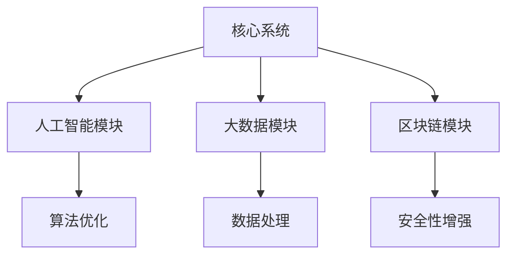

                 


# 约翰·伯格的指数化革命

> 关键词：指数化革命，约翰·伯格，人工智能，大数据，区块链，指数级增长，系统架构设计

> 摘要：本文深入探讨了指数化革命的概念、核心原理、技术应用以及系统架构设计。通过分析指数级增长的数学模型、人工智能、大数据和区块链等领域的技术发展，结合实际项目案例，详细阐述了指数化革命的实现过程和未来趋势。

---

## 第一部分: 指数化革命的背景与概念

### 第1章: 指数化革命的定义与背景

#### 1.1 指数化革命的定义
##### 1.1.1 指数化革命的核心概念
指数化革命是指技术进步的速度呈指数级增长的现象，其核心在于技术的加速改进和广泛应用。这种增长模式不同于线性增长，具有爆发性和不可预测性。

##### 1.1.2 指数化革命的技术驱动力
指数化革命的核心驱动力包括人工智能、大数据、区块链等技术的快速发展。这些技术的相互作用和融合，使得技术进步的速度呈指数级增长。

##### 1.1.3 指数化革命的社会影响
指数化革命对社会经济发展、产业变革、就业结构等方面产生了深远影响。它不仅改变了人们的生活方式，还重新定义了人类社会的组织形式。

#### 1.2 指数化革命的背景
##### 1.2.1 技术发展的历史脉络
从工业革命到数字革命，技术进步一直是推动社会发展的核心动力。指数化革命是数字革命的延续，其标志是技术进步速度的指数级增长。

##### 1.2.2 当前技术革命的特征
当前技术革命的特征包括技术的快速迭代、人工智能的崛起、大数据的广泛应用以及区块链技术的创新。这些特征共同推动了指数化革命的形成。

##### 1.2.3 指数化革命的全球化趋势
指数化革命不再是局部现象，而是全球性的技术变革。技术的跨国界传播和应用，使得指数化革命的影响遍及全球。

### 第2章: 指数化革命的核心概念与联系

#### 2.1 指数化革命的核心原理
##### 2.1.1 指数级增长的数学模型
指数级增长可以用数学公式表示为：$y = a \cdot b^t$，其中$a$是初始值，$b$是增长率，$t$是时间。这种模型描述了技术进步速度的快速增加。

##### 2.1.2 技术进步的加速效应
指数化革命的核心在于技术进步的加速效应。每一代技术的进步都为下一代技术的发展提供了基础，形成了一种加速循环。

##### 2.1.3 系统复杂性的指数级提升
随着技术的进步，系统的复杂性也呈指数级增长。这种复杂性要求我们在系统设计和管理上采取更加高效的方法。

#### 2.2 核心概念对比分析
##### 2.2.1 指数化革命与传统技术革命的对比
| 特征         | 指数化革命                | 传统技术革命               |
|--------------|--------------------------|---------------------------|
| 进展速度      | 指数级增长                | 线性增长                   |
| 技术融合      | 高度融合                  | 较低融合                   |
| 影响范围      | 全球性                     | 局部性                     |

##### 2.2.2 指数化革命的核心特征
指数化革命的核心特征包括技术的快速迭代、系统的高度复杂性以及应用的广泛性。

##### 2.2.3 指数化革命的系统架构


### 第3章: 指数化革命的核心技术与应用

#### 3.1 人工智能与指数化革命
##### 3.1.1 人工智能的指数级发展
人工智能的进步速度是指数级的，其核心在于算法的不断优化和计算能力的提升。

##### 3.1.2 人工智能在指数化革命中的应用
人工智能在指数化革命中的应用包括智能决策、自动化生产、智能客服等领域。

##### 3.1.3 人工智能的未来趋势
人工智能将继续推动指数化革命的发展，其应用范围将进一步扩大。

#### 3.2 大数据与指数化革命
##### 3.2.1 大数据的指数级增长
大数据的规模和复杂性呈指数级增长，这为数据分析和处理提出了更高的要求。

##### 3.2.2 大数据在指数化革命中的作用
大数据在指数化革命中的作用包括支持决策、优化流程、提升效率等。

##### 3.2.3 大数据的处理与分析技术
大数据的处理与分析技术包括数据清洗、数据建模、数据可视化等。

#### 3.3 区块链与指数化革命
##### 3.3.1 区块链的指数级发展
区块链技术的进步速度是指数级的，其核心在于去中心化和安全性。

##### 3.3.2 区块链在指数化革命中的应用
区块链在指数化革命中的应用包括金融支付、智能合约、供应链管理等。

##### 3.3.3 区块链的未来趋势
区块链将继续推动指数化革命的发展，其应用范围将进一步扩大。

---

## 第二部分: 指数化革命的算法原理

### 第4章: 指数化革命的算法基础

#### 4.1 指数级增长的数学模型
指数级增长的数学模型可以用以下公式表示：
$$y = a \cdot b^t$$
其中，$y$表示系统的输出，$a$是初始值，$b$是增长率，$t$是时间。

#### 4.2 机器学习算法与指数化革命
##### 4.2.1 机器学习的基本原理
机器学习是一种通过数据训练模型的技术，其核心在于模型的不断优化和适应能力的提升。

##### 4.2.2 机器学习在指数化革命中的应用
机器学习在指数化革命中的应用包括智能推荐、图像识别、自然语言处理等领域。

##### 4.2.3 机器学习的未来发展趋势
机器学习将继续推动指数化革命的发展，其应用范围将进一步扩大。

### 第5章: 指数化革命的系统架构设计

#### 5.1 系统架构设计的基本原则
##### 5.1.1 系统架构的模块划分
系统架构设计的基本原则包括模块划分、层次结构、可扩展性等。

##### 5.1.2 系统架构的层次结构
系统架构的层次结构包括数据层、业务层、表现层等。

##### 5.1.3 系统架构的可扩展性
系统架构的可扩展性是指数化革命中系统设计的重要原则。

#### 5.2 指数化革命的系统架构图


#### 5.3 系统架构的优化策略
系统架构的优化策略包括模块化设计、分布式架构、安全性增强等。

### 第6章: 指数化革命的系统接口与交互

#### 6.1 系统接口设计的基本原则
##### 6.1.1 系统接口的标准化设计
系统接口设计的基本原则包括标准化设计、兼容性设计、安全性设计等。

##### 6.1.2 系统接口的兼容性设计
系统接口的兼容性设计是指数化革命中系统设计的重要原则。

##### 6.1.3 系统接口的安全性设计
系统接口的安全性设计是指数化革命中系统设计的重要原则。

#### 6.2 系统交互流程的设计
##### 6.2.1 系统交互的流程图
系统交互流程的设计包括用户请求、系统处理、结果返回等步骤。

##### 6.2.2 系统交互的优化策略
系统交互的优化策略包括减少响应时间、提高系统吞吐量、优化用户体验等。

##### 6.2.3 系统交互的未来发展趋势
系统交互的未来发展趋势包括智能化交互、个性化交互、实时交互等。

---

## 第三部分: 指数化革命的项目实战

### 第7章: 指数化革命的项目实战

#### 7.1 项目环境的安装与配置
##### 7.1.1 开发环境的搭建
指数化革命的项目实战需要搭建高效的开发环境，包括安装必要的软件和工具。

##### 7.1.2 项目依赖的安装
项目实战需要安装必要的依赖包，例如Python的机器学习库、大数据处理库等。

##### 7.1.3 项目开发工具的配置
项目实战需要配置开发工具，例如PyCharm、Jupyter Notebook等。

#### 7.2 项目核心实现
##### 7.2.1 系统功能设计
项目核心实现包括系统功能设计、算法实现、数据处理等。

##### 7.2.2 系统功能的实现代码
以下是一个简单的指数化模型实现代码：
```python
import numpy as np

def exponential_growth(a, b, t):
    return a * (b ** t)

a = 1
b = 2
t = 5
result = exponential_growth(a, b, t)
print(result)  # 输出：32
```

##### 7.2.3 代码应用解读与分析
上述代码实现了指数级增长模型，其中$a$是初始值，$b$是增长率，$t$是时间。代码通过计算得出结果，展示了指数级增长的特点。

#### 7.3 项目小结
##### 7.3.1 项目实现的成果
项目实战展示了指数化革命的核心概念和技术应用。

##### 7.3.2 项目实现的经验总结
项目实战的经验总结包括系统设计的优化、算法实现的技巧、项目管理的方法等。

##### 7.3.3 项目实现的未来改进方向
项目实战的未来改进方向包括进一步优化算法、扩展系统功能、提升系统性能等。

---

## 第四部分: 指数化革命的最佳实践与未来展望

### 第8章: 指数化革命的最佳实践

#### 8.1 技术选型与优化
指数化革命的技术选型与优化是系统设计的重要环节，需要根据具体需求选择合适的技术方案。

#### 8.2 系统设计与实现
指数化革命的系统设计与实现需要遵循模块化设计、分布式架构等原则。

#### 8.3 系统维护与优化
指数化革命的系统维护与优化是确保系统长期稳定运行的重要环节。

### 第9章: 指数化革命的未来展望

#### 9.1 未来技术趋势
指数化革命的未来趋势包括人工智能的进一步发展、大数据的广泛应用、区块链技术的创新等。

#### 9.2 技术融合与创新
指数化革命的技术融合与创新是推动技术进步的重要动力。

#### 9.3 对人类社会的影响
指数化革命将对人类社会产生深远影响，包括经济结构的调整、就业市场的变化、社会关系的重构等。

---

## 作者信息

作者：AI天才研究院/AI Genius Institute & 禅与计算机程序设计艺术 /Zen And The Art of Computer Programming

---

本文通过详细探讨指数化革命的概念、核心原理、技术应用以及系统架构设计，展示了指数化革命的重要性和未来发展趋势。希望读者通过本文能够更好地理解指数化革命的本质，并在实际项目中加以应用。

