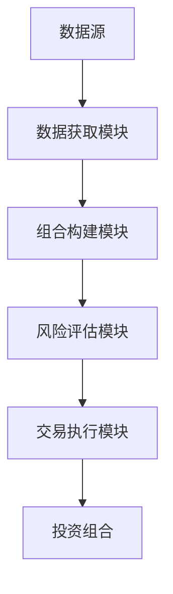

                 


# 约翰·伯格的指数基金投资理念

> 关键词：指数基金，投资理念，约翰·伯格，分散化投资，长期收益，风险管理

> 摘要：本文详细探讨了约翰·伯格的指数基金投资理念，从指数基金的基本概念、核心优势、数学模型，到系统的构建与实现，以及实战案例分析，全面解析了伯格的投资哲学和实践方法。

---

## 第一部分: 约翰·伯格的指数基金投资理念概述

### 第1章: 指数基金投资的背景与意义

#### 1.1 投资市场的基本问题
##### 1.1.1 传统投资的局限性
传统的投资方式往往依赖于市场预测和主动管理，但这些方法存在以下问题：
- **市场预测的不确定性**：市场波动难以预测，导致投资决策风险高。
- **高昂的管理费用**：主动管理型基金的管理费用较高，长期累积后会影响收益。
- **投资组合的集中风险**：集中投资于少数股票或行业，风险较大。

##### 1.1.2 现代投资组合理论的提出
现代投资组合理论（MPT）由哈里·马科维茨提出，强调通过分散化投资来降低风险。该理论指出，投资者可以通过合理配置资产，实现收益与风险的最佳平衡。

##### 1.1.3 指数基金的兴起与发展趋势
随着技术的进步和市场的成熟，指数基金因其低成本、高透明度和分散化的特点，逐渐成为投资者的首选。指数基金的兴起标志着从主动管理向被动管理的转变。

#### 1.2 约翰·伯格与指数基金的关联
##### 1.2.1 约翰·伯格的学术贡献
约翰·伯格是指数基金领域的先驱，他通过研究发现，大多数主动管理型基金难以长期跑赢市场指数，而指数基金则能够以低成本实现市场平均收益。

##### 1.2.2 索罗维基指数基金的创新
伯格领导的富达基金开发了最早的指数基金之一——索罗维基指数基金，这种基金以低成本和高透明度著称，成为现代指数基金的鼻祖。

##### 1.2.3 伯格对指数基金理念的推广
伯格通过大量研究和实践，向投资者普及了指数基金的优势，推动了指数基金在全球范围内的普及。

#### 1.3 指数基金的核心优势
##### 1.3.1 分散化投资的风险控制
通过投资于市场中的代表性指数，指数基金能够有效分散个股或行业的风险，降低投资组合的波动性。

##### 1.3.2 低成本的优势
指数基金的管理费用远低于主动管理型基金，长期来看，低成本能够显著提升净收益。

##### 1.3.3 长期稳定的收益表现
指数基金能够捕捉市场平均收益，长期来看，其收益表现稳定且可预测。

### 第2章: 指数基金的基本概念与原理

#### 2.1 指数基金的定义与分类
##### 2.1.1 指数基金的定义
指数基金是一种跟踪特定市场指数的基金，其投资组合按照指数的成分股和权重进行配置，以实现与指数相似的收益。

##### 2.1.2 主流指数基金类型
- **股票指数基金**：跟踪股票指数，如标普500指数。
- **债券指数基金**：跟踪债券指数，如美国国债指数。
- **宽基指数基金**：涵盖多个行业的广泛市场指数。
- **窄基指数基金**：专注于某一特定行业或领域的指数。

##### 2.1.3 指数基金与主动管理型基金的区别
- **目标**：指数基金追求市场平均收益，主动管理型基金追求超越市场的超额收益。
- **费用**：指数基金费用低，主动管理型基金费用高。
- **风险**：指数基金风险分散，主动管理型基金风险集中。

#### 2.2 指数基金的核心原理
##### 2.2.1 市场有效性的假设
有效市场假说认为，市场价格已经反映了所有可获得的信息，因此主动管理难以跑赢市场。

##### 2.2.2 指数基金的构建逻辑
- **成分股选择**：基于指数成分股的构成。
- **权重分配**：按照指数中各成分股的权重进行配置。
- **定期再平衡**：定期调整投资组合，以保持与指数一致。

##### 2.2.3 指数基金的跟踪误差分析
跟踪误差是指指数基金的实际收益与目标指数收益之间的差异，反映了基金与指数的偏离程度。

#### 2.3 指数基金的风险与收益分析
##### 2.3.1 指数基金的风险来源
- **市场风险**：整体市场波动对指数基金的影响。
- **流动性风险**：部分成分股流动性不足可能影响基金的操作。
- **再平衡风险**：频繁调整可能导致交易成本增加。

##### 2.3.2 指数基金的收益模型
指数基金的收益主要来源于指数成分股的资本增值和股息收益。其收益与指数表现高度相关。

##### 2.3.3 指数基金与市场波动的关系
指数基金能够反映市场波动，但其分散化的特点降低了单一资产波动对整体投资组合的影响。

---

## 第二部分: 指数基金的数学模型与公式

### 第3章: 指数基金的数学模型与公式

#### 3.1 指数基金的收益模型
##### 3.1.1 指数基金收益的计算公式
$$
\text{指数基金收益} = \sum_{i=1}^{n} w_i \times r_i
$$
其中，\(w_i\) 是第 \(i\) 个成分股的权重，\(r_i\) 是第 \(i\) 个成分股的收益率。

##### 3.1.2 指数基金收益与市场指数的关系
指数基金的收益与目标指数的收益密切相关，通常可以通过以下公式表示：
$$
R_{\text{基金}} = \beta R_{\text{指数}} + \alpha
$$
其中，\(\beta\) 是基金与指数的相关性系数，\(\alpha\) 是基金相对于指数的超额收益。

##### 3.1.3 指数基金收益的波动性分析
指数基金的收益波动性可以通过标准差来衡量：
$$
\sigma_{\text{基金}} = \sqrt{\sum_{i=1}^{n} w_i^2 \sigma_i^2 + \sum_{i \neq j} w_i w_j \sigma_{ij}}
$$
其中，\(\sigma_i^2\) 是第 \(i\) 个成分股的方差，\(\sigma_{ij}\) 是第 \(i\) 和第 \(j\) 个成分股的协方差。

#### 3.2 指数基金的风险模型
##### 3.2.1 风险的定义与度量
风险通常用标准差或最大回撤来衡量。

##### 3.2.2 指数基金的风险调整后收益
夏普比率用于衡量风险调整后的收益：
$$
\text{夏普比率} = \frac{R_p - R_f}{\sigma_p}
$$
其中，\(R_p\) 是基金的平均收益，\(R_f\) 是无风险利率，\(\sigma_p\) 是基金收益的标准差。

##### 3.2.3 风险分散化的效果分析
分散化投资可以有效降低非系统性风险，但系统性风险（市场风险）无法通过分散化消除。

#### 3.3 指数基金的夏普比率
##### 3.3.1 夏普比率的定义
夏普比率衡量的是单位风险超额收益。

##### 3.3.2 夏普比率的计算公式
$$
\text{夏普比率} = \frac{E[R_x - R_f]}{\sigma_x}
$$
其中，\(E[R_x - R_f]\) 是基金的超额收益期望值，\(\sigma_x\) 是超额收益的标准差。

##### 3.3.3 夏普比率的实际应用
通过比较不同基金的夏普比率，可以评估其风险调整后的收益表现。

---

## 第三部分: 指数基金的系统架构与实现

### 第4章: 指数基金的系统架构与实现

#### 4.1 指数基金的系统架构
##### 4.1.1 系统功能模块划分
- **数据获取模块**：从市场数据源获取指数成分股的价格和成交量数据。
- **组合构建模块**：根据指数权重构建投资组合。
- **风险评估模块**：计算投资组合的风险指标，如夏普比率和最大回撤。
- **交易执行模块**：根据策略执行买卖交易。

##### 4.1.2 系统数据流图


##### 4.1.3 系统架构的优缺点分析
优点：
- **透明性**：指数基金的投资逻辑清晰，易于理解和复制。
- **可扩展性**：适用于不同规模和类型的投资组合。

缺点：
- **缺乏灵活性**：无法适应市场的快速变化。
- **依赖于指数设计**：指数成分股和权重的调整可能影响基金表现。

#### 4.2 指数基金的投资组合管理
##### 4.2.1 投资组合的构建逻辑
- **成分股选择**：基于指数成分股的构成。
- **权重分配**：按照指数中各成分股的权重进行配置。
- **定期再平衡**：定期调整投资组合，以保持与指数一致。

##### 4.2.2 投资组合的动态调整
- **再平衡策略**：定期调整投资组合，以应对市场变化或成分股权重的变化。
- **风险控制**：根据市场波动调整投资组合的风险敞口。

##### 4.2.3 投资组合的风险控制
- **分散化**：通过投资于多个成分股降低风险。
- **杠杆使用**：谨慎使用杠杆以避免过度风险。

#### 4.3 指数基金的交易与风险管理

##### 4.3.1 指数基金的交易策略
- **被动跟踪**：严格按照指数成分股和权重进行投资。
- **主动调整**：根据市场变化进行微调，以优化收益或降低风险。

##### 4.3.2 指数基金的风险管理
- **止损策略**：设定止损点以限制最大亏损。
- **动态再平衡**：根据市场波动调整投资组合。

---

## 第五部分: 实战与应用

### 第5章: 指数基金的实战与应用

#### 5.1 指数基金的环境安装
##### 5.1.1 投资环境的选择
- **选择合适的指数**：根据投资目标选择合适的指数，如标普500、沪深300等。
- **选择合适的指数基金**：根据费用、流动性、跟踪误差等因素选择基金。

##### 5.1.2 投资工具的准备
- **投资平台**：选择可靠的交易平台，如 brokerage accounts 或 ETF 平台。
- **数据源**：获取指数成分股的历史数据和实时数据。

#### 5.2 指数基金的核心实现
##### 5.2.1 代码实现
```python
import pandas as pd
import numpy as np

# 假设我们有指数成分股的数据
index_components = pd.read_csv('index_components.csv')
weights = pd.read_csv('weights.csv')

# 根据权重构建投资组合
portfolio = index_components.mul(weights['weight'].values)
portfolio = portfolio.sum(axis=1)
```

##### 5.2.2 代码解读与分析
- **数据读取**：从CSV文件中读取指数成分股和权重数据。
- **投资组合构建**：根据权重对成分股进行加权平均，得到投资组合的价值分布。

#### 5.3 指数基金的案例分析
##### 5.3.1 案例背景
假设我们选择跟踪标普500指数的指数基金，投资期限为10年。

##### 5.3.2 投资组合表现
通过历史数据分析，计算指数基金的年化收益、波动率和夏普比率。

##### 5.3.3 风险管理策略
根据市场波动调整投资组合的再平衡频率，以降低风险。

#### 5.4 本章小结
通过实战案例，我们可以看到指数基金的投资逻辑和实际操作步骤。通过合理的投资组合管理和风险管理，指数基金能够实现稳定的收益。

---

## 第六部分: 最佳实践与小结

### 第6章: 最佳实践、小结与注意事项

#### 6.1 最佳实践
##### 6.1.1 投资者教育
投资者需要理解指数基金的基本原理和风险收益特征。

##### 6.1.2 长期投资
指数基金适合长期投资，避免频繁交易和短期波动的影响。

##### 6.1.3 成本控制
选择费用低的指数基金，长期来看能够显著提升净收益。

#### 6.2 小结
约翰·伯格的指数基金投资理念强调分散化、低成本和长期投资。通过指数基金，投资者可以以较低的成本实现市场平均收益，同时有效控制风险。

#### 6.3 注意事项
- **市场风险**：指数基金无法避免系统性风险。
- **流动性风险**：部分指数基金可能流动性不足。
- **再平衡成本**：频繁的再平衡可能增加交易成本。

---

## 作者：AI天才研究院/AI Genius Institute & 禅与计算机程序设计艺术 /Zen And The Art of Computer Programming

---

这篇文章系统地介绍了约翰·伯格的指数基金投资理念，从基本概念到数学模型，再到系统实现和实战应用，全面解析了指数基金的投资逻辑和实际操作方法。希望读者通过本文能够更好地理解指数基金的优势，并能够在实际投资中加以应用。

