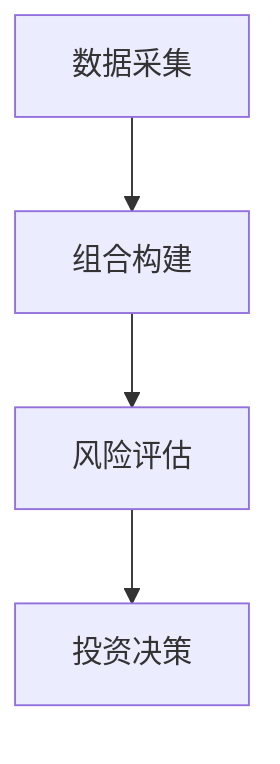

                 


# 约翰·伯格的指数基金投资理论

## 关键词：指数基金，被动投资，风险管理，投资组合，夏普比率，金融数学，投资策略

## 摘要：指数基金作为一种被动投资工具，以其低风险、低成本和高透明度著称。本文将详细探讨约翰·伯格的指数基金投资理论，从基本概念到数学模型，再到实际应用，帮助读者全面理解指数基金的投资策略和风险管理方法。通过系统化的分析和案例研究，本文旨在为投资者提供科学的决策支持，帮助他们在复杂多变的金融市场中实现稳健投资。

---

## 第一章：指数基金投资理论的背景与核心概念

### 1.1 指数基金的基本概念

指数基金是一种被动管理型基金，旨在跟踪特定市场指数的表现。其核心理念是通过复制指数的成分股构成，以实现与市场同步增长的投资收益。指数基金的主要优势在于其分散化投资和低成本运作。

#### 1.1.1 什么是指数基金？

指数基金的投资策略基于被动管理，即基金经理不会主动选股或择时，而是严格按照选定的指数成分股进行配置。例如，标普500指数基金将投资于标普500指数中的500家上市公司，按其市值权重分配资金。

#### 1.1.2 指数基金的起源与发展

指数投资的概念最早由约翰·伯格提出，他在《投资常识》一书中详细阐述了被动投资的优势。指数基金的发展经历了从理论到实践的演变，如今已成为全球范围内最受欢迎的投资工具之一。

#### 1.1.3 指数基金的核心特征

- **分散化**：通过投资多个成分股，降低个股风险。
- **低成本**：被动管理减少了交易成本和管理费用。
- **透明化**：投资者可以实时查看基金的持仓情况。

### 1.2 指数基金与传统投资的区别

#### 1.2.1 主动管理型基金的优缺点

主动管理型基金由基金经理主动选股和择时，其优点是可以获得超额收益，缺点是管理费用高、交易成本大，且难以持续跑赢市场。

#### 1.2.2 指数基金的被动管理策略

被动管理意味着指数基金完全复制目标指数的成分股，避免了人为决策的干扰，从而降低了管理风险。

#### 1.2.3 两者的成本与收益对比

| 投资方式 | 成本 | 收益 |
|----------|------|------|
| 主动管理 | 高   | 可能高 |
| 被动管理 | 低   | 稳定 |

---

## 第二章：指数基金的核心概念与原理

### 2.1 指数基金的构建逻辑

#### 2.1.1 指数基金的成分股选择

指数基金的成分股由目标指数决定，例如，标普500指数基金将投资于500家美国大公司，按市值加权。

#### 2.1.2 指数基金的权重分配

指数基金中的每只股票的投资比例与其在指数中的权重成正比。例如，如果一只股票在指数中占5%，则该股票在基金中的投资比例也是5%。

#### 2.1.3 指数基金的再平衡机制

为了保持与指数一致，指数基金会定期调整持仓，以反映指数成分股的变化，这称为再平衡。

### 2.2 指数基金的跟踪误差

#### 2.2.1 什么是跟踪误差

跟踪误差是指数基金的实际收益与目标指数收益之间的差异，反映了基金对指数的偏离程度。

#### 2.2.2 跟踪误差的影响因素

- 市场波动
- 成分股调整
- 交易成本

### 2.3 指数基金的成本结构

#### 2.3.1 指数基金的管理费用

被动管理的费用较低，通常为每年0.1%到0.5%。

#### 2.3.2 指数基金的交易成本

指数基金通过大量交易复制指数，但交易成本较低，因为其交易量大，可以享受更好的交易条件。

#### 2.3.3 成本对收益的影响

降低管理费用和交易成本可以提高基金的净收益。

---

## 第三章：指数基金的数学模型与风险评估

### 3.1 指数基金的收益模型

#### 3.1.1 指数基金的预期收益计算

预期收益可以通过指数的历史平均回报率估算。

#### 3.1.2 指数基金的历史收益分析

通过分析过去的表现，可以评估指数基金的风险和收益。

#### 3.1.3 指数基金的未来收益预测

使用历史数据和统计模型进行预测。

### 3.2 指数基金的风险评估

#### 3.2.1 方差与标准差的计算

方差衡量收益的波动性，标准差是方差的平方根。

$$ \text{方差} = \frac{\sum (x_i - \mu)^2}{n} $$
$$ \text{标准差} = \sqrt{\text{方差}} $$

#### 3.2.2 贝塔系数与阿尔法系数

贝塔系数衡量基金相对于市场的波动性，阿尔法系数衡量超额收益。

### 3.3 指数基金的夏普比率

#### 3.3.1 夏普比率的定义

夏普比率衡量单位风险下的超额收益。

#### 3.3.2 夏普比率的计算公式

$$ \text{夏普比率} = \frac{E(r_i) - r_f}{\sigma_i} $$

其中，\( E(r_i) \) 是基金的预期收益，\( r_f \) 是无风险利率，\( \sigma_i \) 是基金的收益标准差。

---

## 第四章：指数基金的系统分析与架构设计

### 4.1 指数基金的投资组合管理

#### 4.1.1 投资组合的构建逻辑

根据指数成分股构建投资组合，按权重分配资金。

#### 4.1.2 投资组合的再平衡策略

定期调整持仓，以保持与指数一致。

#### 4.1.3 投资组合的风险管理

通过分散化降低风险，定期监控市场波动。

### 4.2 指数基金的系统架构

#### 4.2.1 系统架构的模块划分

- 数据采集模块
- 组合构建模块
- 风险评估模块

#### 4.2.2 系统架构的流程图



---

## 第五章：指数基金的项目实战

### 5.1 指数基金的实际案例分析

#### 5.1.1 如何选择指数基金

选择与个人投资目标一致的指数，关注费用率。

#### 5.1.2 定投策略的实施

定期定额投资，分散风险，长期积累收益。

### 5.2 指数基金的代码实现

#### 5.2.1 计算投资回报率的Python代码

```python
import pandas as pd
import yfinance as yf

# 下载指数数据
data = yf.download('^SP500', start='2020-01-01', end='2023-12-31')

# 计算每日收益
data['Return'] = data['Adj Close'].pct_change()

# 计算年化收益率
annual_return = data['Return'].mean() * 250

print(f"年化收益率: {annual_return * 100}%")
```

---

## 第六章：指数基金的总结与最佳实践

### 6.1 总结

指数基金以其低风险、低成本和高透明度，成为个人投资者的理想选择。

### 6.2 最佳实践 tips

- 长期投资，避免频繁交易。
- 关注费用率，选择低成本基金。
- 定期再平衡，保持与指数一致。

### 6.3 小结

指数基金的投资策略简单有效，适合长期稳健投资。

### 6.4 注意事项

- 市场波动可能影响短期收益。
- 需要选择合适的指数和基金。

### 6.5 拓展阅读

推荐阅读《投资常识》和《指数投资策略》。

---

## 作者：AI天才研究院 & 禅与计算机程序设计艺术

---

通过以上结构，我们可以系统地了解约翰·伯格的指数基金投资理论，并将其应用于实际投资中，帮助投资者实现稳健的财务增长。

