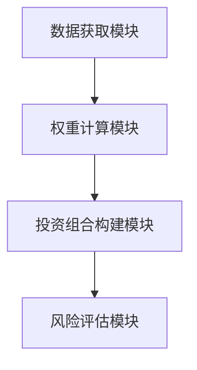
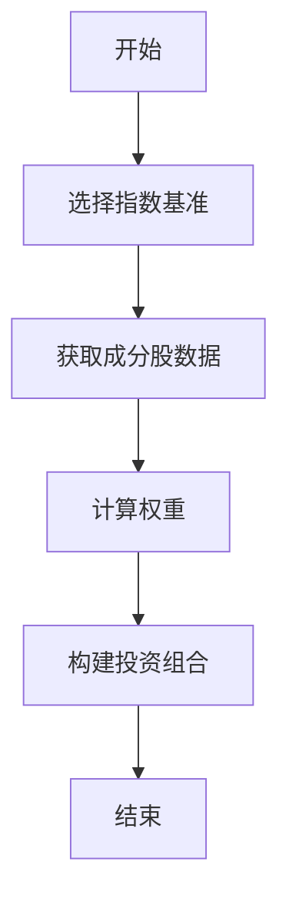

                 


# 约翰·伯格的指数基金构建原则

## 关键词：指数基金，约翰·伯格，被动投资，夏普比率，系统架构，数学模型

## 摘要：  
本文详细阐述了约翰·伯格在指数基金构建领域的核心原则，从指数基金的基本概念到构建原理，再到系统架构与实战应用，全面解析了指数基金的投资策略。通过数学模型、算法流程图和系统架构图的详细展示，结合实际案例分析，深入探讨了指数基金的优化策略与风险管理方法，为读者提供了一套系统化的指数基金构建指南。

---

# 第一部分: 指数基金构建的背景与核心概念

## 第1章: 指数基金的基本概念与背景

### 1.1 指数基金的定义与特点
#### 1.1.1 指数基金的定义  
指数基金是一种以特定指数为基准，通过复制指数成分股的组合来实现投资收益的基金。其核心目标是**复制指数的收益**，而非主动追求超越市场的超额收益。

#### 1.1.2 指数基金的核心特点
- **被动投资**：指数基金通过复制指数成分股来降低人为干预，减少交易成本和管理费用。
- **分散化投资**：通过投资指数中的所有成分股，降低个股风险，实现风险分散。
- **低费用**：由于采用被动投资策略，指数基金的管理费用通常低于主动管理型基金。
- **长期稳定收益**：指数基金通过长期持有分散化的投资组合，实现市场平均收益。

#### 1.1.3 指数基金与主动管理型基金的区别  
| 指标 | 指数基金 | 主动管理型基金 |
|------|----------|----------------|
| 投资策略 | 被动复制指数 | 主动选股、择时 |
| 管理费用 | 低 | 高 |
| 风险 | 低（分散化） | 高（集中化） |
| 收益目标 | 追求市场平均收益 | 追求超额收益 |

### 1.2 指数基金的历史与发展
#### 1.2.1 指数投资的起源  
指数投资的概念最早可以追溯到20世纪30年代，**本杰明·格雷厄姆**和**戴维·多德**提出的“价值投资”理念为指数投资奠定了基础。然而，指数基金的实际应用始于20世纪70年代，随着计算机技术的进步，指数基金的构建和管理变得更加高效。

#### 1.2.2 约翰·伯格的贡献  
约翰·伯格是指数基金领域的先驱，他于1975年创立了第一只真正意义上的指数基金——**先锋500指数基金**。伯格的贡献在于：
1. 提出了“**低成本、广泛分散化**”的投资理念。
2. 通过数学模型优化了指数基金的构建方法。
3. 证明了指数基金能够长期跑赢大多数主动管理型基金。

#### 1.2.3 指数基金的全球发展现状  
目前，指数基金在全球范围内得到了广泛应用，尤其是在美国市场，指数基金的管理规模已经超过主动管理型基金。指数基金的普及得益于其低费用、低风险和长期稳定的收益。

### 1.3 指数基金的市场应用
#### 1.3.1 机构投资者的指数基金应用  
机构投资者（如养老基金、保险公司）通过配置指数基金实现资产的分散化管理，降低投资风险。

#### 1.3.2 个人投资者的指数基金选择  
个人投资者可以通过选择跟踪市场指数的指数基金，轻松实现长期财富增值，无需频繁交易和选股。

#### 1.3.3 指数基金在不同经济周期的表现  
在经济繁荣期，指数基金能够充分捕捉市场收益；在经济衰退期，指数基金由于分散化投资，能够有效降低损失。

---

## 第2章: 指数基金的核心原理与数学模型

### 2.1 指数基金的构建原理
#### 2.1.1 被动投资的核心理念  
指数基金的核心理念是**被动复制指数**。通过投资指数中的所有成分股，并按照成分股权重进行配置，指数基金能够最大限度地复制指数的收益。

#### 2.1.2 指数基金的复制误差  
复制误差是指指数基金的实际收益与指数收益之间的差异，主要来源于：
1. **交易成本**：频繁买卖成分股会产生佣金和买卖价差。
2. **再平衡成本**：定期调整投资组合权重会产生额外成本。
3. **流动性成本**：某些成分股流动性不足，可能导致交易成本增加。

#### 2.1.3 指数基金的费用结构  
指数基金的费用主要包括：
1. **管理费用**：基金管理公司的管理费。
2. **托管费用**：基金托管银行的托管费。
3. **交易成本**：买卖成分股产生的佣金和价差。

### 2.2 指数基金的数学模型
#### 2.2.1 指数基金的收益计算公式  
指数基金的收益可以通过以下公式计算：
$$ R = \sum_{i=1}^{n} w_i R_i $$
其中，\( w_i \) 是第 \( i \) 只成分股的权重，\( R_i \) 是第 \( i \) 只成分股的收益。

#### 2.2.2 指数基金的风险评估模型  
指数基金的风险可以通过**方差**来衡量：
$$ \sigma^2 = \sum_{i=1}^{n} \sum_{j=1}^{n} w_i w_j \sigma_{ij} $$
其中，\( \sigma_{ij} \) 是第 \( i \) 只和第 \( j \) 只成分股的协方差。

#### 2.2.3 夏普比率的应用  
夏普比率衡量了投资组合的风险调整后收益：
$$ Sharpe\ Ratio = \frac{E[R - R_f]}{\sigma} $$
其中，\( R \) 是投资组合的收益，\( R_f \) 是无风险利率，\( \sigma \) 是投资组合的收益标准差。

### 2.3 本章小结  
指数基金的核心原理在于通过被动复制指数实现收益，同时通过分散化投资降低风险。数学模型的应用为指数基金的收益和风险评估提供了理论基础。

---

## 第3章: 指数基金的构建与优化

### 3.1 指数基金的构建步骤
#### 3.1.1 确定指数基准  
选择一个合适的指数作为基准，例如标普500指数。

#### 3.1.2 选择成分股  
根据指数的成分股列表，获取每只成分股的权重和价格数据。

#### 3.1.3 计算权重分配  
根据成分股权重，计算每只成分股的配置比例。

#### 3.1.4 构建投资组合  
按照计算出的权重分配，购买相应的成分股，完成投资组合的构建。

### 3.2 指数基金的优化策略
#### 3.2.1 成本最小化优化  
通过减少交易成本和托管费用，降低指数基金的总成本。

#### 3.2.2 风险收益优化  
通过调整成分股权重，优化投资组合的风险收益比。

#### 3.2.3 流动性优化  
选择流动性较高的成分股，降低交易成本和流动性风险。

### 3.3 指数基金的再平衡策略
#### 3.3.1 定期再平衡的必要性  
由于市场波动和成分股权重的变化，需要定期对投资组合进行再平衡，以保持与指数的一致性。

#### 3.3.2 再平衡的频率选择  
通常建议每年进行一次再平衡，以降低交易成本和管理复杂性。

#### 3.3.3 再平衡的成本分析  
再平衡的频率越高，交易成本和流动性成本可能越高，因此需要在成本和收益之间进行权衡。

### 3.4 本章小结  
指数基金的构建与优化是一个复杂的过程，需要综合考虑成本、风险和流动性等因素。通过科学的优化策略和再平衡策略，可以最大限度地提高指数基金的收益。

---

## 第4章: 指数基金的系统架构与实现

### 4.1 指数基金管理系统架构
#### 4.1.1 系统功能模块划分  
- 数据获取模块：获取指数成分股数据。
- 权重计算模块：计算每只成分股的权重。
- 投资组合构建模块：根据权重构建投资组合。
- 风险评估模块：评估投资组合的风险。

#### 4.1.2 系统架构图  


### 4.2 指数基金的算法实现
#### 4.2.1 指数计算流程图  


#### 4.2.2 核心代码实现  
```python
import pandas as pd
import numpy as np

def calculate_weights(index_data):
    # 计算每只成分股的权重
    total_market_cap = sum(index_data['market_cap'])
    weights = index_data['market_cap'] / total_market_cap
    return weights

def build_portfolio(index_data):
    weights = calculate_weights(index_data)
    portfolio = {}
    for i in range(len(index_data)):
        portfolio[index_data['ticker'][i]] = weights[i]
    return portfolio

# 示例数据
index_data = pd.DataFrame({
    'ticker': ['AAPL', 'MSFT', 'GOOGL', 'AMZN'],
    'market_cap': [2.4, 2.7, 1.9, 1.7]
})

portfolio = build_portfolio(index_data)
print(portfolio)
```

### 4.3 系统接口设计
#### 4.3.1 API接口定义  
- `GET /index_data`：获取指数成分股数据。
- `POST /calculate_weights`：计算成分股权重。
- `POST /build_portfolio`：构建投资组合。

#### 4.3.2 接口调用流程  
1. 用户通过API获取指数成分股数据。
2. 用户调用`calculate_weights`接口，计算每只成分股的权重。
3. 用户调用`build_portfolio`接口，构建投资组合。

### 4.4 本章小结  
通过系统架构设计和算法实现，可以高效地构建指数基金的投资组合，并进行风险评估。

---

## 第5章: 指数基金的实战应用与案例分析

### 5.1 环境安装与配置
#### 5.1.1 数据获取工具安装  
安装Pandas、NumPy等数据分析工具。

#### 5.1.2 开发环境配置  
配置Python开发环境，安装必要的库和工具。

### 5.2 核心代码实现
#### 5.2.1 指数计算代码  
```python
import pandas as pd
import numpy as np

def calculate_weights(index_data):
    total_market_cap = sum(index_data['market_cap'])
    weights = index_data['market_cap'] / total_market_cap
    return weights

def build_portfolio(index_data):
    weights = calculate_weights(index_data)
    portfolio = {}
    for i in range(len(index_data)):
        portfolio[index_data['ticker'][i]] = weights[i]
    return portfolio

# 示例数据
index_data = pd.DataFrame({
    'ticker': ['AAPL', 'MSFT', 'GOOGL', 'AMZN'],
    'market_cap': [2.4, 2.7, 1.9, 1.7]
})

portfolio = build_portfolio(index_data)
print(portfolio)
```

### 5.3 项目实战分析
#### 5.3.1 案例分析  
假设我们选择标普500指数作为基准，计算每只成分股的权重，并构建投资组合。

#### 5.3.2 代码应用解读  
通过代码实现指数基金的构建过程，验证理论的可行性。

### 5.4 本章小结  
通过实战案例分析和代码实现，可以验证指数基金构建方法的可行性，并为实际应用提供参考。

---

# 作者：AI天才研究院/AI Genius Institute & 禅与计算机程序设计艺术 /Zen And The Art of Computer Programming

