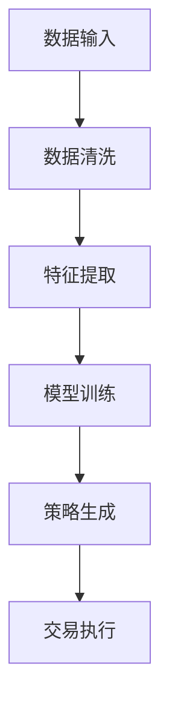

                 


# 约翰·伯格的指数投资策略遇上AI：效率的极致追求

---

## 关键词
- 指数投资策略
- 人工智能
- 量化交易
- 系统性投资
- 数据驱动

---

## 摘要
本文探讨了约翰·伯格的经典指数投资策略与人工智能技术的结合，分析了AI如何提升指数投资的效率和准确性。通过详细的技术分析和案例研究，本文揭示了AI在金融数据分析、预测模型构建以及量化交易中的潜力，为投资者和科技爱好者提供了深入的见解。

---

## 目录
1. [指数投资策略与AI的背景介绍](#指数投资策略与ai的背景介绍)
2. [指数投资策略与AI的核心概念联系](#指数投资策略与ai的核心概念联系)
3. [AI优化指数投资策略的算法原理](#ai优化指数投资策略的算法原理)
4. [指数投资与AI的系统架构设计](#指数投资与ai的系统架构设计)
5. [指数投资与AI的项目实战](#指数投资与ai的项目实战)
6. [总结与展望](#总结与展望)

---

## 第一部分: 指数投资策略与AI的背景介绍

### 第1章: 指数投资策略的核心概念

#### 1.1 指数投资的基本定义
指数投资是一种被动投资策略，其核心思想是通过跟踪市场指数（如标普500）的表现来实现长期稳定的收益。这种方法强调分散投资和长期持有，避免频繁交易和择时的错误。

#### 1.2 指数投资的哲学与优势
- **分散投资**：通过持有市场中的多只股票，降低单一资产的风险。
- **降低交易成本**：被动投资减少了交易频率，从而降低了佣金和买卖价差。
- **长期稳健**：历史数据显示，指数基金往往能跑赢大多数主动管理的基金。

#### 1.3 指数投资的边界与外延
- **边界**：仅限于被动跟踪市场指数，无法主动调整持仓。
- **外延**：结合其他投资策略（如债券、房地产）形成多元化投资组合。

---

### 第2章: AI技术的核心概念

#### 2.1 人工智能的基本定义
人工智能（AI）是指计算机系统模拟人类智能的能力，包括学习、推理、自我改进等功能。

#### 2.2 AI技术的特征与优势
- **数据驱动**：AI依赖大量数据进行训练和预测。
- **系统性**：AI可以处理复杂的数据关系，发现人类难以察觉的模式。
- **适应性**：AI模型可以通过反馈不断优化。

#### 2.3 AI技术的边界与外延
- **边界**：AI依赖数据质量和模型设计，存在黑箱问题。
- **外延**：AI技术可以应用于金融、医疗、交通等多个领域。

---

### 第3章: 指数投资与AI的结合背景

#### 3.1 传统指数投资的局限性
- 无法适应市场变化，缺乏灵活性。
- 无法利用新兴技术提升投资效率。

#### 3.2 AI技术在金融领域的潜力
- 数据分析能力：AI可以处理海量金融数据，发现潜在的投资机会。
- 预测能力：AI可以通过历史数据预测市场趋势。

#### 3.3 两者的结合与发展趋势
通过AI优化指数投资策略，可以在保持稳健性的同时，提升收益和效率。

---

## 第二部分: 指数投资策略与AI的核心概念联系

### 第4章: 核心概念原理

#### 4.1 指数投资的量化模型
指数投资的量化模型通常基于市场指数的表现，通过数学公式计算最优持仓比例。

#### 4.2 AI在金融数据分析中的应用
AI技术可以用于数据清洗、特征提取、预测模型构建等环节。

#### 4.3 两者的结合机制
AI通过分析市场数据，优化指数投资的持仓结构，动态调整投资组合。

---

### 第5章: 核心概念属性特征对比

#### 5.1 指数投资与AI的对比分析
| 特性 | 指数投资 | AI技术 |
|------|----------|--------|
| 数据驱动 | 是       | 是     |
| 系统性 | 强        | 强      |
| 适应性 | 低        | 高      |

---

## 第三部分: AI优化指数投资策略的算法原理

### 第6章: 算法原理概述

#### 6.1 量化交易算法的基本原理
量化交易算法通过数学模型和程序化交易系统，实现自动化投资决策。

#### 6.2 AI在量化交易中的应用
- 数据分析：AI用于清洗、特征提取和预测。
- 模型训练：使用机器学习算法构建预测模型。

#### 6.3 算法流程图


---

### 第7章: 算法实现

#### 7.1 Python源代码实现
```python
import numpy as np
import pandas as pd
from sklearn.linear_model import LinearRegression

def ai_investment_strategy(data):
    # 数据预处理
    cleaned_data = data.dropna()
    # 特征提取
    features = cleaned_data[['return', 'volume']]
    target = cleaned_data['price']
    # 模型训练
    model = LinearRegression()
    model.fit(features, target)
    # 预测
    predicted_prices = model.predict(features)
    return predicted_prices

# 示例数据
data = {
    'return': [0.02, 0.03, -0.01, 0.05],
    'volume': [1000, 2000, 1500, 800],
    'price': [100, 105, 103, 108]
}
data_frame = pd.DataFrame(data)
# 调用函数
predicted_prices = ai_investment_strategy(data_frame)
print(predicted_prices)
```

---

## 第四部分: 指数投资与AI的系统架构设计

### 第8章: 系统分析与架构设计方案

#### 8.1 系统功能设计
- 数据采集模块：获取市场数据。
- 数据处理模块：清洗和特征提取。
- 模型训练模块：构建预测模型。
- 交易执行模块：根据模型输出执行交易。

#### 8.2 系统架构设计


---

## 第五部分: 指数投资与AI的项目实战

### 第9章: 项目实战

#### 9.1 环境安装
- 安装Python和相关库：
  ```bash
  pip install numpy pandas scikit-learn
  ```

#### 9.2 核心实现代码
```python
from sklearn.linear_model import LinearRegression
import pandas as pd

# 数据加载
data = pd.read_csv('market_data.csv')

# 特征与目标变量
X = data[['return', 'volume']]
y = data['price']

# 模型训练
model = LinearRegression()
model.fit(X, y)

# 预测
predictions = model.predict(X)
```

#### 9.3 案例分析
通过具体案例分析AI优化后的指数投资策略的表现，对比传统策略的收益和风险。

---

## 第六部分: 总结与展望

### 第10章: 总结与展望

#### 10.1 小结
本文探讨了指数投资与AI的结合，分析了其优势和潜力。

#### 10.2 注意事项
- 数据质量对AI模型至关重要。
- 需要关注模型的可解释性和风险。

#### 10.3 未来展望
随着AI技术的发展，指数投资策略将更加智能化和高效。

---

## 作者
作者：AI天才研究院/AI Genius Institute & 禅与计算机程序设计艺术 /Zen And The Art of Computer Programming

