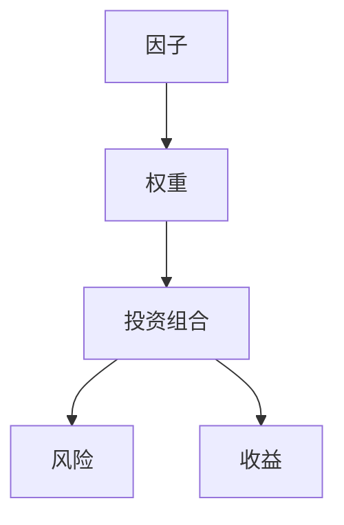
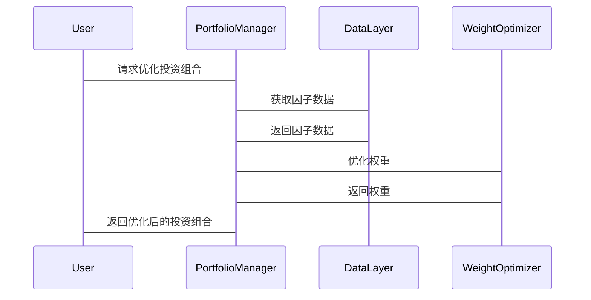

                 


# 约翰·伯格的指数革命：智能beta策略的兴起

## 关键词：智能beta策略，指数基金，多因子模型，风险平价，指数增强

## 摘要：  
智能beta策略是一种结合被动投资和主动策略的新型投资方法，通过多因子模型和算法优化实现投资组合的智能化管理。本文将详细探讨智能beta策略的背景、核心概念、算法原理、系统架构及实际应用，结合数学公式和案例分析，帮助读者全面理解智能beta策略的兴起及其在投资领域的广泛应用。

---

# 第一部分：智能beta策略的背景与核心概念

## 第1章：指数革命的背景与智能beta策略的兴起

### 1.1 指数革命的背景

#### 1.1.1 传统投资与指数基金的历史演变  
- 传统投资的局限性：主动管理成本高、难以长期跑赢指数。  
- 指数基金的崛起：低成本、分散风险的优势。  
- 约翰·伯格的贡献： Vanguard集团的成立与指数基金的推广。

#### 1.1.2 智能beta策略的定义与特点  
- 智能beta策略的定义：结合被动投资与主动策略的智能投资方法。  
- 核心特点：多因子模型、风险平价、动态调整。  
- 智能beta与传统beta的区别：  
  | 特性 | 传统beta | 智能beta |  
  |------|----------|----------|  
  | 策略 | 简单的市值加权 | 多因子优化 |  
  | 风险 | 无法控制 | 可控 |  

#### 1.1.3 智能beta策略的核心要素与边界  
- 核心要素：因子选择、权重分配、动态调整。  
- 边界：避免过度优化、控制交易成本、防范黑天鹅事件。

### 1.2 智能beta策略的兴起

#### 1.2.1 传统beta策略的局限性  
- 成本高：主动管理费用高昂。  
- 风险不可控：传统指数基金无法主动管理风险。  
- 低效性：难以适应市场变化。

#### 1.2.2 智能beta策略的优势与应用场景  
- 优势：低成本、风险可控、收益增强。  
- 应用场景：机构投资、个人理财、市场中性策略。

#### 1.2.3 智能beta策略的未来发展趋势  
- 技术驱动：AI与大数据的应用。  
- 市场认可度提高：投资者逐渐接受智能beta策略。  
- 全球化：智能beta策略在新兴市场的应用。

---

## 第2章：智能beta策略的核心概念

### 2.1 智能beta策略的原理

#### 2.1.1 多因子模型的构建与应用  
- 多因子模型的构建：如何选择因子？  
- 典型因子：市值、价值、动量、股息率等。  
- 因子权重的分配：基于因子的风险贡献。

#### 2.1.2 风险平价策略的数学模型  
- 风险平价的定义：每个因子的风险贡献相等。  
- 数学公式：  
  $$ \text{权重}_i = \frac{\sigma_i}{\sum_{j} \sigma_j} $$  
  其中，$\sigma_i$ 是因子i的风险贡献。

#### 2.1.3 指数增强策略的核心逻辑  
- 指数增强的目标：在跟踪指数的同时获得超额收益。  
- 方法：利用多因子模型优化权重。

### 2.2 智能beta策略的数学模型

#### 2.2.1 多因子模型的数学公式  
- 多因子回归模型：  
  $$ R_i = \alpha + \beta_1 F_1 + \beta_2 F_2 + \dots + \beta_n F_n + \epsilon $$  
  其中，$F_j$ 是因子，$\beta_j$ 是因子的系数。

#### 2.2.2 风险平价模型的数学推导  
- 风险平价模型的优化目标：  
  $$ \min_{w} \sum_{i=1}^n w_i^2 \sigma_i^2 \quad \text{subject to} \quad \sum_{i=1}^n w_i = 1 $$  
  解得：  
  $$ w_i = \frac{\sigma_i}{\sum_{j} \sigma_j} $$  

#### 2.2.3 指数增强策略的优化算法  
- 基于拉格朗日乘数法的优化：  
  $$ \max \mu^T w - \lambda (w^T \Sigma w) $$  

### 2.3 智能beta策略的实体关系图  


---

## 第3章：智能beta策略的系统架构与技术实现

### 3.1 系统架构设计

#### 3.1.1 系统功能设计  
- 数据采集：因子数据、市场数据。  
- 因子筛选：基于统计显著性和经济意义。  
- 权重优化：基于多因子模型或风险平价模型。  
- 投资组合管理：动态调整权重。  

#### 3.1.2 系统架构设计  


#### 3.1.3 系统交互设计  


### 3.2 系统实现细节

#### 3.2.1 环境安装  
- Python环境：安装numpy、pandas、scipy、matplotlib。  
- 其他工具：因子数据来源（如Yahoo Finance API）。  

#### 3.2.2 核心实现代码  
```python
import numpy as np
import pandas as pd
from scipy.optimize import minimize

def risk_parity_weights(cov_matrix, target_std=1):
    def objective(weights):
        return np.sum(weights**2 * np.diag(cov_matrix))
    def constraint(weights):
        return np.sum(weights) - 1
    weights = np.ones(cov_matrix.shape[0]) / cov_matrix.shape[0]
    res = minimize(objective, weights, method='SLSQP', constraints={'type': 'eq', 'fun': constraint})
    return res.x

# 示例
data = pd.read_csv('factor_data.csv')
cov_matrix = data.cov()
weights = risk_parity_weights(cov_matrix)
print(weights)
```

#### 3.2.3 代码解读与分析  
- 数据输入：读取因子数据。  
- 风险平价权重计算：使用优化算法求解权重。  
- 输出结果：得到优化后的权重。  

### 3.3 系统性能优化

#### 3.3.1 并行计算  
- 使用并行计算加速优化过程。  

#### 3.3.2 离线缓存  
- 缓存常用数据，减少实时计算开销。  

---

## 第4章：智能beta策略的项目实战

### 4.1 项目背景与目标

#### 4.1.1 项目背景  
- 数据来源：某股票市场的因子数据。  
- 项目目标：构建一个智能beta投资组合。  

### 4.2 项目实现

#### 4.2.1 环境安装  
- Python 3.8+  
- numpy, pandas, scipy, matplotlib  

#### 4.2.2 核心实现代码  
```python
import numpy as np
import pandas as pd
from scipy.optimize import minimize

# 示例数据
data = pd.DataFrame({
    'MktCap': [1, 2, 3, 4, 5],
    'Value': [5, 4, 3, 2, 1],
    'Momentum': [3, 4, 5, 6, 7]
})

# 计算协方差矩阵
cov_matrix = data.cov()

# 风险平价权重计算
def objective(weights):
    return np.sum(weights**2 * np.diag(cov_matrix))
def constraint(weights):
    return np.sum(weights) - 1
weights = np.ones(len(cov_matrix.columns)) / len(cov_matrix.columns)
res = minimize(objective, weights, method='SLSQP', constraints={'type': 'eq', 'fun': constraint})

# 输出结果
print("Optimized weights:", res.x)
```

#### 4.2.3 代码解读与分析  
- 数据输入：因子数据。  
- 协方差矩阵计算：因子之间的协方差。  
- 风险平价权重计算：优化算法求解权重。  

### 4.3 项目小结

---

## 第5章：智能beta策略的最佳实践与未来展望

### 5.1 最佳实践

#### 5.1.1 数据选择与预处理  
- 数据来源的可靠性：选择可靠的因子数据。  
- 数据清洗：处理缺失值和异常值。  

#### 5.1.2 模型选择与优化  
- 根据市场环境选择合适的模型。  
- 定期重新优化投资组合。  

### 5.2 小结与注意事项

#### 5.2.1 小结  
- 智能beta策略的优势：低成本、风险可控、收益增强。  
- 智能beta策略的局限性：需要依赖模型的有效性。  

#### 5.2.2 注意事项  
- 避免过度优化：防止过拟合。  
- 控制交易成本：频繁交易可能增加成本。  
- 防范黑天鹅事件：建立风险预警机制。  

### 5.3 未来展望

#### 5.3.1 技术驱动：AI与大数据  
- 利用AI算法优化因子选择与权重分配。  

#### 5.3.2 市场认可度提高  
- 更多投资者接受智能beta策略。  

#### 5.3.3 全球化：智能beta策略的应用拓展  
- 在新兴市场中的应用潜力。  

---

## 作者：AI天才研究院/AI Genius Institute & 禅与计算机程序设计艺术/Zen And The Art of Computer Programming

