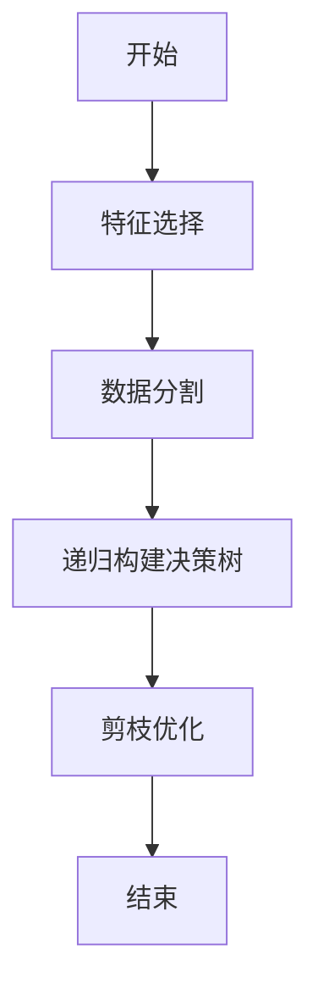
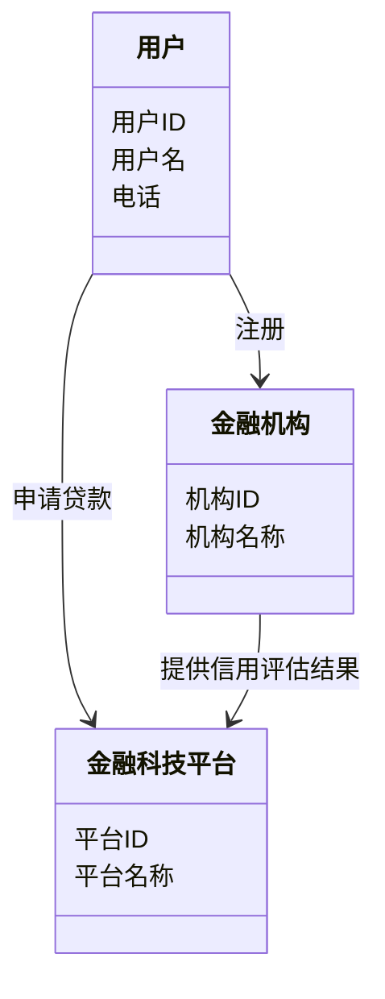
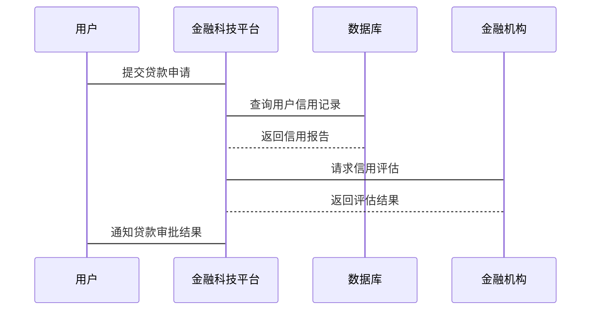

                 


# 《约翰·伯格的普惠金融理念：金融科技带来的机遇与挑战》

## 关键词：普惠金融，金融科技，约翰·伯格，算法原理，系统架构设计，项目实战

## 摘要：  
本文以约翰·伯格的普惠金融理念为核心，结合金融科技的发展，深入探讨普惠金融在现代金融体系中的机遇与挑战。通过分析普惠金融的核心概念、金融科技的赋能作用，以及实际的算法实现和系统架构设计，本文为读者提供全面的理论与实践指导。从问题背景到解决方案，从算法原理到系统实现，本文旨在帮助读者理解普惠金融与金融科技的结合方式，以及如何在实际应用中推动普惠金融的发展。

---

# 第一部分: 普惠金融的背景与核心理念

## 第1章: 普惠金融的定义与演进

### 1.1 普惠金融的定义
#### 1.1.1 普惠金融的核心概念
普惠金融（Inclusive Finance）是一种旨在为所有社会成员提供平等金融服务的金融模式。它强调金融的包容性，不仅包括传统金融机构的服务对象，还覆盖低收入群体、小微企业和个人创业者等被传统金融体系忽视的群体。

#### 1.1.2 普惠金融的历史发展
普惠金融的概念起源于20世纪70年代，最初关注于为低收入人群提供基础金融服务。随着信息技术的发展，普惠金融逐步与金融科技（FinTech）相结合，通过技术创新降低服务成本，扩大服务范围。

#### 1.1.3 普惠金融的目标与意义
普惠金融的目标是实现金融的广泛覆盖、高效利用和可持续发展。其意义在于通过金融手段促进社会公平，支持经济发展，特别是在欠发达地区推动经济增长。

### 1.2 金融科技的定义与特点
#### 1.2.1 金融科技的核心概念
金融科技（FinTech）是利用技术手段优化或替代传统金融服务的创新模式。它通过大数据、人工智能、区块链等技术，提升金融服务的效率和体验。

#### 1.2.2 金融科技与传统金融的区别
- **服务模式**：传统金融依赖分支机构和人工服务，而金融科技通过线上平台实现自动化服务。
- **成本**：金融科技降低了运营成本，提高了服务效率。
- **技术驱动**：金融科技以技术创新为核心，传统金融则更依赖金融业务经验。

#### 1.2.3 金融科技的三大支柱
- 数据驱动：通过大数据分析优化金融服务。
- 技术赋能：利用人工智能、区块链等技术提升服务效率。
- 用户体验：通过技术创新提供更便捷的金融服务。

### 1.3 普惠金融与金融科技的结合
#### 1.3.1 普惠金融的痛点与挑战
- 服务成本高：传统金融机构在服务低收入人群时成本较高。
- 信息不对称：缺乏有效的信用评估手段。
- 覆盖范围有限：传统金融难以覆盖偏远地区。

#### 1.3.2 金融科技如何解决普惠金融的问题
- 通过大数据分析降低信用风险。
- 利用人工智能优化贷款审批流程。
- 通过移动支付技术扩大金融服务覆盖范围。

#### 1.3.3 普惠金融与金融科技的协同发展
金融科技为普惠金融提供了技术支撑，而普惠金融为金融科技提供了市场空间。两者的协同发展能够实现金融服务的全面覆盖和高效运营。

## 1.4 本章小结  
本章通过定义和分析普惠金融与金融科技的核心概念，揭示了两者结合的重要性和必要性。金融科技通过技术创新解决了普惠金融的痛点，而普惠金融的目标也为金融科技提供了发展方向。

---

## 第2章: 普惠金融的核心概念与联系

### 2.1 普惠金融的核心概念
#### 2.1.1 普惠金融的四个支柱
1. **可及性**：确保金融服务能够覆盖所有人群。
2. **可负担性**：降低金融服务成本，使低收入人群能够承受。
3. **可持续性**：确保金融服务的长期性和稳定性。
4. **安全性**：保障金融交易的安全性和用户隐私。

#### 2.1.2 普惠金融的三大目标
1. 提供基础金融服务。
2. 促进金融教育普及。
3. 支持小微企业发展。

#### 2.1.3 普惠金融的三大原则
1. 公平性：确保所有人群享有平等的金融服务。
2. 效益性：通过技术创新提高服务效率。
3. 可持续性：确保金融服务的长期稳定。

### 2.2 普惠金融与金融科技的关系
#### 2.2.1 普惠金融与金融科技的协同效应
- **数据驱动**：金融科技通过大数据分析，帮助金融机构更好地评估信用风险。
- **技术赋能**：金融科技通过人工智能优化贷款审批流程，降低运营成本。
- **用户交互**：金融科技通过移动支付和在线平台，提高用户获取金融服务的便捷性。

#### 2.2.2 金融科技对普惠金融的赋能作用
- 提供信用评估技术，解决信息不对称问题。
- 降低服务成本，扩大服务覆盖范围。
- 提高金融服务效率，优化用户体验。

#### 2.2.3 普惠金融与金融科技的相互促进
- 普惠金融为金融科技提供了市场空间。
- 金融科技为普惠金融提供了技术支撑。

### 2.3 普惠金融的核心要素对比分析
#### 2.3.1 普惠金融与传统金融的对比分析
| **维度**       | **普惠金融**             | **传统金融**             |
|----------------|--------------------------|--------------------------|
| 服务对象       | 全体社会成员             | 高净值客户和大型企业     |
| 服务成本       | 低                       | 高                       |
| 服务效率       | 高                       | 低                       |
| 技术依赖       | 高                       | 低                       |

#### 2.3.2 金融科技与传统技术的对比分析
| **维度**       | **金融科技**             | **传统技术**             |
|----------------|--------------------------|--------------------------|
| 技术类型       | 大数据、人工智能、区块链 | 传统IT系统               |
| 创新性         | 高                       | 低                       |
| 对普惠金融的贡献 | 高                       | 低                       |

#### 2.3.3 普惠金融与金融科技的对比分析
| **维度**       | **普惠金融**             | **金融科技**             |
|----------------|--------------------------|--------------------------|
| 核心目标       | 提供平等金融服务           | 优化金融服务             |
| 技术依赖       | 高                       | 高                       |
| 目标群体       | 全体社会成员             | 金融机构和金融科技公司   |

### 2.4 普惠金融的ER实体关系图
```mermaid
erDiagram
    actor 用户 {
        string 用户ID
        string 用户名
        string 密码
        string 电话
    }
    actor 金融机构 {
        string 机构ID
        string 机构名称
        string 机构类型
    }
    actor 金融科技平台 {
        string 平台ID
        string 平台名称
        string 平台类型
    }
    user 用户 --> 关系 金融服务关系
    金融机构 --> 关系 金融服务关系
    金融科技平台 --> 关系 金融服务关系
    关系 金融服务关系 {
        string 关系ID
        date 关系建立时间
        date 关系终止时间
    }
```

---

## 第3章: 金融科技算法原理讲解

### 3.1 选择风控模型
#### 3.1.1 决策树算法原理
决策树是一种常用的机器学习算法，用于分类和回归问题。在普惠金融中，决策树常用于信用评估和贷款审批。

#### 3.1.2 决策树算法的数学模型
决策树的构建过程涉及信息熵和信息增益的概念。信息熵用于衡量数据的不确定性，信息增益用于选择最优的特征分裂。

#### 3.1.3 决策树算法的实现步骤
1. **特征选择**：计算每个特征的信息增益，选择信息增益最大的特征作为分裂节点。
2. **数据分割**：根据选择的特征将数据集分割成子集。
3. **递归构建**：对子集重复特征选择和数据分割的过程，直到叶子节点无法进一步分割。
4. **剪枝优化**：为避免过拟合，对决策树进行剪枝处理。

#### 3.1.4 决策树算法的Python实现
```python
from sklearn.tree import DecisionTreeClassifier
from sklearn.model_selection import train_test_split
from sklearn.metrics import accuracy_score

# 数据预处理
X = dataset.drop('target', axis=1)
y = dataset['target']
X_train, X_test, y_train, y_test = train_test_split(X, y, test_size=0.2)

# 模型训练
model = DecisionTreeClassifier()
model.fit(X_train, y_train)

# 模型预测
y_pred = model.predict(X_test)

# 模型评估
print("Accuracy:", accuracy_score(y_test, y_pred))
```

### 3.2 决策树算法的流程图


---

## 第4章: 系统分析与架构设计方案

### 4.1 系统场景介绍
本系统旨在通过金融科技手段，实现普惠金融的全面覆盖。系统包括用户注册、信用评估、贷款申请、资金发放等功能。

### 4.2 系统功能设计
#### 4.2.1 领域模型


#### 4.2.2 系统架构设计


#### 4.2.3 系统接口设计
- 用户端接口：`POST /api/register`
- 金融机构接口：`POST /api/credit_assessment`
- 金融科技平台接口：`POST /api/loan_application`

#### 4.2.4 系统交互流程


---

## 第5章: 项目实战

### 5.1 环境安装
- **Python版本**：3.8+
- **依赖库**：`scikit-learn`, `pandas`, `numpy`
- **安装命令**：
  ```bash
  pip install scikit-learn pandas numpy
  ```

### 5.2 系统核心实现
#### 5.2.1 决策树模型实现
```python
from sklearn.tree import DecisionTreeClassifier
from sklearn.metrics import accuracy_score
from sklearn.model_selection import train_test_split

# 数据加载
data = pd.read_csv('data.csv')
X = data.drop('target', axis=1)
y = data['target']

# 数据分割
X_train, X_test, y_train, y_test = train_test_split(X, y, test_size=0.2)

# 模型训练
model = DecisionTreeClassifier()
model.fit(X_train, y_train)

# 模型预测
y_pred = model.predict(X_test)

# 模型评估
print("Accuracy:", accuracy_score(y_test, y_pred))
```

#### 5.2.2 系统接口实现
```python
from flask import Flask, request, jsonify

app = Flask(__name__)

@app.route('/api/register', methods=['POST'])
def register():
    data = request.json
    # 处理注册逻辑
    return jsonify({'status': 'success', 'message': '注册成功'})

@app.route('/api/loan_application', methods=['POST'])
def loan_application():
    data = request.json
    # 处理贷款申请逻辑
    return jsonify({'status': 'success', 'message': '贷款申请已提交'})

if __name__ == '__main__':
    app.run(debug=True)
```

### 5.3 案例分析
#### 5.3.1 案例背景
某偏远地区的小企业缺乏融资渠道，通过金融科技平台申请贷款，利用决策树算法进行信用评估，最终获得贷款支持。

#### 5.3.2 案例分析
通过金融科技平台，企业提交贷款申请，平台利用决策树算法进行信用评估，金融机构提供评估结果，最终完成贷款发放。

### 5.4 项目小结
本项目通过金融科技手段，实现了普惠金融的信用评估和贷款发放功能。系统设计合理，功能完善，为普惠金融的实践提供了技术支持。

---

## 第6章: 最佳实践与小结

### 6.1 最佳实践
- **数据安全**：确保用户数据的安全性和隐私性。
- **技术选型**：根据具体需求选择合适的技术方案。
- **用户体验**：优化系统交互，提高用户体验。

### 6.2 小结
本文通过分析普惠金融的核心理念和金融科技的赋能作用，结合实际案例，详细讲解了普惠金融与金融科技的结合方式。从算法原理到系统架构设计，再到项目实战，本文为读者提供了全面的理论与实践指导。

### 6.3 注意事项
- 在实际应用中，需注意数据安全和隐私保护。
- 系统设计时，需充分考虑可扩展性和可维护性。
- 项目实施过程中，需结合具体需求进行技术调整。

### 6.4 拓展阅读
- 《金融科技：技术与创新》
- 《普惠金融：理论与实践》
- 《算法导论》

---

# 作者：AI天才研究院/AI Genius Institute & 禅与计算机程序设计艺术 /Zen And The Art of Computer Programming

