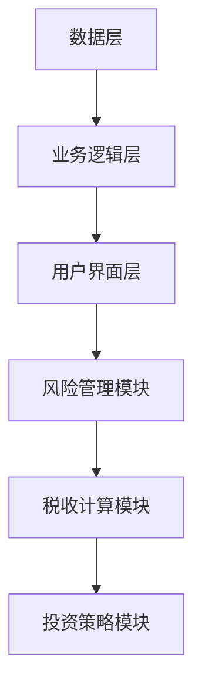

                 


# 约翰·伯格的税收效率投资策略

## 关键词：
- 税收效率
- 投资策略
- 税法优化
- 财务规划
- 税后现金流
- 投资组合优化

## 摘要：
本文系统地探讨了约翰·伯格提出的税收效率投资策略，从核心概念、算法原理、系统架构到项目实战，深入剖析了如何通过优化税务规划来提升投资效率。文章结合理论与实践，详细介绍了税收效率的数学模型、投资策略的优化算法，以及系统的架构设计，并通过具体案例展示了如何在实际项目中应用这些策略。最后，总结了最佳实践和未来研究方向，为读者提供了全面的指导。

---

## 第一部分：税收效率投资策略的背景与核心概念

### 第1章：税收效率投资策略的背景与问题背景

#### 1.1 税收效率投资策略的定义与问题背景
- 1.1.1 什么是税收效率投资策略
  - 税收效率：通过优化税务规划降低税负，最大化投资收益。
  - 投资策略：基于税收优化的投资决策框架。
- 1.1.2 税收效率投资策略的核心问题
  - 如何在投资决策中考虑税法影响。
  - 如何平衡税后现金流与风险。
- 1.1.3 税收效率与投资策略的联系
  - 税收效率是投资策略的重要优化方向。
  - 投资策略是税收效率实现的手段。

#### 1.2 税收效率投资策略的核心概念
- 1.2.1 核心概念的定义
  - 税收效率：税后现金流的最大化。
  - 投资策略：基于税收优化的资产配置。
- 1.2.2 核心概念的属性特征
  - 税收效率：税率、抵扣、退税。
  - 投资策略：风险、收益、流动性。
- 1.2.3 核心概念的对比分析
  - 税收效率与投资策略的对比表格：
    | 比较维度 | 税收效率 | 投资策略 |
    |----------|----------|----------|
    | 目标     | 最小化税负 | 最大化收益 |
    | 方法     | 税法优化 | 资产配置 |
    | 结果     | 提高净收益 | 降低风险 |
  - ER实体关系图：
    ```mermaid
    graph TD
      A[纳税人] --> B[投资行为]
      B --> C[税务影响]
      C --> D[净收益]
    ```

---

## 第二部分：税收效率投资策略的算法原理

### 第2章：税收效率投资策略的算法原理

#### 2.1 算法原理的数学模型
- 2.1.1 税收效率的数学模型
  - 税后现金流公式：
    $$\text{税后现金流} = \text{总收入} \times (1 - \text{税率})$$
  - 投资收益公式：
    $$\text{净收益} = \text{税后现金流} - \text{投资成本}$$
- 2.1.2 投资策略的数学模型
  - 资产配置模型：
    $$\text{最优资产组合} = \argmin_{w} \sum_{i=1}^{n} w_i \times \text{风险系数}$$
- 2.1.3 综合优化模型
  - 综合优化公式：
    $$\max \sum_{i=1}^{n} w_i \times r_i - \sum_{i=1}^{n} w_i \times t_i$$
    其中，\( w_i \) 是投资权重，\( r_i \) 是收益率，\( t_i \) 是税率。

#### 2.2 算法的详细讲解
- 2.2.1 税收效率的计算公式
  - 示例：假设总收入为100万元，税率为20%。
    $$\text{税后现金流} = 100 \times (1 - 0.2) = 80 \text{万元}$$
- 2.2.2 投资策略的优化算法
  - 示例：两资产配置问题。
    $$\text{最优权重} = \argmin_w \left( w \times r_1 + (1 - w) \times r_2 \right)$$
- 2.2.3 综合优化的实现步骤
  1. 确定资产的收益率和税率。
  2. 建立优化目标函数。
  3. 使用拉格朗日乘数法求解。

---

## 第三部分：税收效率投资策略的系统架构设计

### 第3章：税收效率投资策略的系统架构设计

#### 3.1 系统分析与设计
- 3.1.1 问题场景的介绍
  - 税收效率优化的业务场景。
  - 投资策略的系统需求。
- 3.1.2 系统功能的设计
  - 税收计算模块。
  - 投资策略模块。
  - 风险管理模块。
- 3.1.3 系统架构的实现
  - 分层架构：数据层、业务逻辑层、用户界面层。

#### 3.2 系统架构的 mermaid 图


---

## 第四部分：税收效率投资策略的项目实战

### 第4章：税收效率投资策略的项目实战

#### 4.1 项目环境的安装与配置
- 4.1.1 环境要求
  - Python 3.8以上版本。
  - NumPy、Pandas库。
- 4.1.2 工具安装
  - 安装Jupyter Notebook。
  - 安装必要的Python库。
- 4.1.3 数据准备
  - 收益率数据。
  - 税率数据。

#### 4.2 核心代码实现
- 4.2.1 税收效率的计算代码
  ```python
  import numpy as np

  def tax_efficiency(tax_rate, income):
      return income * (1 - tax_rate)
  ```

- 4.2.2 投资策略的优化代码
  ```python
  import numpy as np
  from scipy.optimize import minimize

  def investment_strategy(weights, returns):
      risk = np.sum(weights * returns)
      return -risk
  ```

#### 4.3 案例分析与代码解读
- 案例分析：假设两种资产，收益率分别为10%和15%，税率分别为15%和20%。
  - 计算税后现金流。
  - 使用优化算法确定最优权重。

---

## 第五部分：总结与展望

### 第5章：总结与展望

#### 5.1 最佳实践与小结
- 最佳实践：
  - 定期审查税务规划。
  - 保持对税法变化的关注。
- 小结：
  - 税收效率投资策略的核心是优化税务规划。
  - 投资策略是实现税收效率的重要手段。

#### 5.2 注意事项与未来趋势
- 注意事项：
  - 税法变化可能影响策略效果。
  - 风险管理是策略成功的关键。
- 未来趋势：
  - 税收效率与人工智能的结合。
  - 全球化背景下的跨境投资策略。

---

## 附录

### 附录A：术语表
- 税收效率：税后现金流的最大化。
- 投资策略：基于税收优化的资产配置。

### 附录B：公式索引
- 税后现金流公式：
  $$\text{税后现金流} = \text{总收入} \times (1 - \text{税率})$$

### 附录C：代码库链接
- 示例代码：[GitHub链接](https://github.com/yourusername/tax-efficiency-investment-strategy)

---

## 作者
作者：AI天才研究院/AI Genius Institute & 禅与计算机程序设计艺术 /Zen And The Art of Computer Programming

