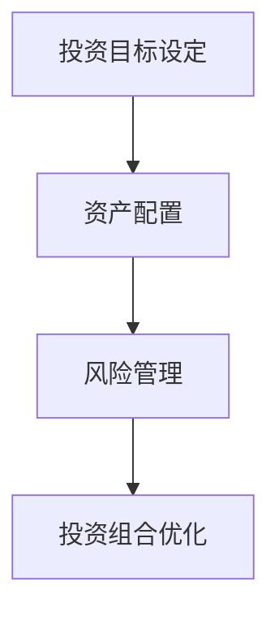

                 


# 约翰·伯格的简单投资法则

> **关键词**：约翰·伯格，简单投资法则，投资回报，指数基金，风险管理，投资系统，长期投资  
>
> **摘要**：约翰·伯格是投资领域的传奇人物，他提出的简单投资法则强调长期投资、分散投资和低成本投资。本文从投资的基本概念出发，详细分析了约翰·伯格的投资理念，探讨了简单投资法则的核心概念、数学模型、系统架构以及实际应用。通过对比分析、数学证明和项目实战，本文深入揭示了简单投资法则的有效性和科学性，为投资者提供了实用的指导和建议。

---

## 第1章: 投资的基本概念与背景

### 1.1 投资的基本概念

#### 1.1.1 什么是投资
投资是将资金投入到资产中以期获得未来收益的行为。投资的核心目标是通过资产增值实现财富增长。投资可以分为金融投资和实物投资，金融投资包括股票、债券、基金等，实物投资包括房地产、黄金等。

#### 1.1.2 投资的基本原则
- 长期性：投资不是短期交易，而是长期持有的过程。
- 分散性：通过多元化投资降低风险。
- 风险管理：合理评估和控制投资风险。
- 成本控制：降低投资成本以提高收益。

#### 1.1.3 投资的分类与特点
投资可以分为主动投资和被动投资。主动投资强调择时和选股，风险高、成本高；被动投资强调跟踪市场指数，风险低、成本低。简单投资法则属于被动投资的一种，注重长期稳定回报。

---

### 1.2 约翰·伯格与他的投资理念

#### 1.2.1 约翰·伯格的生平简介
约翰·伯格（John C. Bogle）是美国著名投资家，被誉为“指数基金之父”。他是先锋基金（Vanguard）的创始人，倡导低成本、低风险的投资方式。

#### 1.2.2 伯格的投资哲学
伯格认为，市场是不可预测的，投资者无法通过短期交易获得超额收益。他主张通过长期持有低成本指数基金实现财富增长，强调纪律性和耐心。

#### 1.2.3 伯格与指数基金的关联
伯格是指数基金的倡导者，他创立的先锋基金公司是全球最大的指数基金管理公司。指数基金通过跟踪市场指数实现收益，费用低、风险分散，适合长期投资。

---

## 第2章: 简单投资法则的核心概念

### 2.1 简单投资法则的定义

#### 2.1.1 简单投资法则的内涵
简单投资法则是指通过长期持有低成本指数基金实现财富增值的投资策略。它强调分散投资、低成本和长期性。

#### 2.1.2 简单投资法则的核心要素
- **长期性**：避免短期交易，坚持长期持有。
- **分散性**：通过指数基金分散投资风险。
- **低成本**：选择费用低的基金，降低投资成本。

### 2.2 简单投资法则的特点

#### 2.2.1 长期性
长期投资可以避免市场短期波动的影响，通过复利效应实现财富增长。

#### 2.2.2 分散性
通过投资指数基金，投资者可以分散个股风险，降低整体投资组合的波动性。

#### 2.2.3 低成本
低成本意味着更高的净收益，长期来看，低管理费和托管费对投资回报有显著影响。

### 2.3 简单投资法则与其他投资方法的对比

#### 2.3.1 主动投资与被动投资的对比
| 对比维度 | 主动投资 | 被动投资 |
|----------|----------|----------|
| 投资目标 | 超额收益 | 跟踪指数 |
| 成本     | 高       | 低       |
| 风险     | 高       | 低       |
| 可预测性 | 低       | 高       |

#### 2.3.2 简单投资法则的优势
- 简单易懂，易于操作。
- 成本低，收益稳定。
- 风险分散，适合长期投资。

#### 2.3.3 简单投资法则的局限性
- 无法在短期内获得超额收益。
- 受市场整体表现影响，无法避免系统性风险。

---

## 第3章: 简单投资法则的数学模型与公式

### 3.1 投资回报的计算公式

#### 3.1.1 复利计算公式
复利计算公式为：
$$
FV = PV \times (1 + r)^n
$$
其中，FV为终值，PV为现值，r为年化收益率，n为投资年数。

#### 3.1.2 投资回报率的计算
投资回报率（ROI）计算公式为：
$$
ROI = \frac{总收益}{初始投资} \times 100\%
$$

#### 3.1.3 投资组合的收益计算
投资组合的预期收益可以表示为：
$$
E(R_p) = \sum w_i \times E(R_i)
$$
其中，$w_i$为资产i的权重，$E(R_i)$为资产i的预期收益率。

### 3.2 风险与收益的数学模型

#### 3.2.1 风险的定义与度量
风险可以通过标准差来衡量，公式为：
$$
\sigma = \sqrt{\frac{1}{n-1} \sum_{i=1}^{n} (x_i - \bar{x})^2}
$$
其中，$\bar{x}$为平均收益，$x_i$为各期收益。

#### 3.2.2 风险与收益的关系
根据现代投资组合理论，收益与风险之间存在正相关关系，可以通过无风险利率、市场风险溢价和贝塔系数进行描述：
$$
E(R_i) = R_f + \beta_i \times (R_m - R_f)
$$

#### 3.2.3 马科维茨投资组合理论
马科维茨的投资组合理论通过优化投资组合的收益和风险，找到最优资产配置。

---

## 第4章: 简单投资法则的系统分析与架构设计

### 4.1 投资系统的总体架构

#### 4.1.1 系统模块划分
- 投资目标设定模块
- 资产配置模块
- 风险管理模块

#### 4.1.2 系统功能设计
- 数据采集与处理
- 投资组合优化
- 风险评估与预警

#### 4.1.3 系统架构图（Mermaid）



### 4.2 系统功能设计

#### 4.2.1 投资目标设定模块
- 设定投资目标（如保值、增值）。
- 确定投资期限。

#### 4.2.2 资产配置模块
- 选择指数基金。
- 确定投资比例。

#### 4.2.3 风险管理模块
- 监控投资组合风险。
- 设置止损点。

### 4.3 系统接口设计

#### 4.3.1 数据接口设计
- 数据来源：市场数据、基金数据。
- 数据处理：清洗、转换。

#### 4.3.2 用户交互接口设计
- 界面友好，操作简便。

#### 4.3.3 系统监控接口设计
- 实时监控投资组合。
- 风险预警。

---

## 第5章: 简单投资法则的项目实战

### 5.1 环境安装与配置

#### 5.1.1 投资分析工具的安装
- 安装Python编程环境。
- 安装数据分析库（如Pandas、NumPy）。

#### 5.1.2 数据源的获取与配置
- 数据来源：Yahoo Finance。
- 数据格式：CSV。

### 5.2 核心代码实现

#### 5.2.1 环境安装
```bash
pip install pandas numpy matplotlib
```

#### 5.2.2 数据获取与处理
```python
import pandas as pd
import numpy as np

# 获取指数数据
data = pd.read_csv('index_data.csv')
data.head()
```

#### 5.2.3 投资组合优化
```python
# 计算指数基金的收益率
returns = data['Adj Close'].pct_change().dropna()
print(returns.mean())
```

### 5.3 案例分析

#### 5.3.1 投资目标设定
- 投资目标：年化收益5%。
- 投资期限：10年。

#### 5.3.2 资产配置
- 选择标普500指数基金。
- 投资比例：100%。

#### 5.3.3 风险管理
- 监控基金净值。
- 设置止损点。

---

## 第6章: 最佳实践与小结

### 6.1 投资的注意事项
- 长期投资需要耐心和纪律。
- 选择低成本基金。
- 定期审视投资组合。

### 6.2 未来趋势
- 数字化投资工具的普及。
- 智能投顾的发展。

### 6.3 拓展阅读
- 《投资最重要的简单常识》。
- 约翰·伯格的其他著作。

---

**作者**：AI天才研究院/AI Genius Institute & 禅与计算机程序设计艺术 /Zen And The Art of Computer Programming

