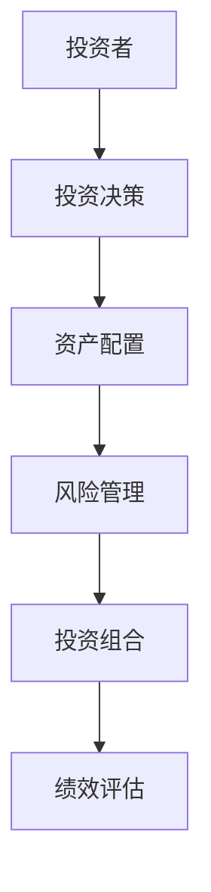
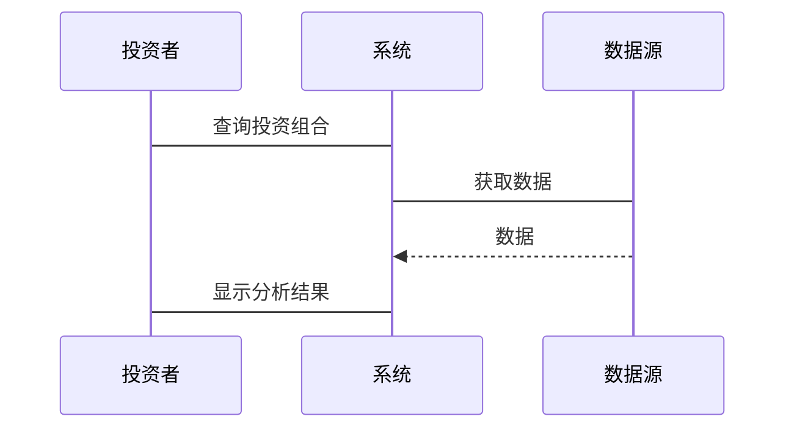

                 


# 约翰·伯格的简单投资法则：为什么简单胜于复杂

> 关键词：投资法则，简单投资，约翰·伯格，资产配置，风险管理，长期投资

> 摘要：本文深入探讨约翰·伯格的简单投资法则，分析其核心理念，包括资产配置、风险管理、长期投资等策略，结合技术语言和实际案例，展示简单投资的高效性和可操作性。

---

## 第一部分: 投资的基础概念与背景

### 第1章: 投资的基本概念

#### 1.1 投资的定义与分类

**1.1.1 投资的定义**  
投资是指将资金投入某种资产或项目，期望在未来获得超过初始投入的回报。投资可以是金融资产（如股票、债券）或实物资产（如房地产）。

**1.1.2 投资的分类**  
投资可以分为以下几类：  
- **金融投资**：包括股票、债券、基金等。  
- **实物投资**：包括房地产、黄金等。  
- **风险投资**：高风险高回报的投资，如创业公司的股权。  
- **固定收益投资**：如国债、银行存款等，回报相对稳定。

**1.1.3 投资的核心要素**  
- **资金**：投资的本金。  
- **时间**：投资的时间跨度影响回报。  
- **风险与收益**：投资的潜在收益与风险成正比。

---

#### 1.2 问题背景与问题描述

**1.2.1 当前投资环境的复杂性**  
现代投资环境复杂多变，涉及全球经济、政治、技术等多方面因素，投资者面临信息过载和决策疲劳。

**1.2.2 投资者面临的挑战**  
- 信息过载：投资者需要处理大量信息，但难以筛选。  
- 市场波动：短期市场波动可能导致决策失误。  
- 情绪影响：投资者情绪（贪婪与恐惧）影响决策。  

**1.2.3 问题解决的必要性**  
简化投资策略，降低复杂性，帮助投资者做出更明智的决策。

---

#### 1.3 简单投资法则的背景

**1.3.1 约翰·伯格的生平简介**  
约翰·伯格是美国著名投资家，指数基金之父，以其简单、低成本的投资策略闻名。

**1.3.2 约翰·伯格的投资理念**  
伯格强调长期投资和分散投资，认为市场波动无法预测，简单策略更可靠。

**1.3.3 简单投资法则的核心思想**  
- **长期持有**：避免频繁交易，降低费用和税收。  
- **分散投资**：通过指数基金分散风险。  
- **低成本**：选择低管理费的基金，长期复利效应显著。

---

### 第2章: 简单投资法则的核心概念

#### 2.1 核心概念与原理

**2.1.1 资产配置的重要性**  
资产配置是将资金分配到不同资产类别（股票、债券、现金等），以平衡风险和收益。

**2.1.2 分散投资的风险控制**  
通过投资不同资产和行业，降低特定资产或行业带来的风险。

**2.1.3 长期投资的复利效应**  
长期持有优质资产，复利效应使收益呈指数增长。

---

#### 2.2 简单投资法则的属性特征对比

**2.2.1 简单投资与复杂投资的对比**  
| 特性         | 简单投资      | 复杂投资      |
|--------------|---------------|---------------|
| 策略复杂度    | 低            | 高            |
| 风险控制      | 高            | 中            |
| 成本          | 低            | 高            |
| 透明度        | 高            | 低            |

**2.2.2 高风险投资与低风险投资的对比**  
高风险投资可能带来高回报，但波动性大，适合风险承受能力强的投资者。低风险投资回报稳定，适合保守型投资者。

**2.2.3 短期投资与长期投资的对比**  
短期投资受市场波动影响大，长期投资利用复利效应，收益更稳定。

---

#### 2.3 投资系统的ER实体关系图

```mermaid
entity InvestmentSystem {
  id
  investor
  asset_class
  risk_level
  return_rate
}
```

---

## 第二部分: 投资分析方法

### 第3章: 投资分析方法

#### 3.1 基本面分析

**3.1.1 基本面分析的定义**  
基本面分析通过研究公司的财务状况、行业地位等因素，评估其投资价值。

**3.1.2 基本面分析的关键指标**  
- **市盈率（P/E）**：股价与每股收益的比率。  
- **市净率（P/B）**：股价与每股净资产的比率。  
- **股息率**：股息与股价的比率。

**3.1.3 基本面分析的步骤**  
1. 研究公司财务报表。  
2. 分析行业前景。  
3. 评估管理团队。  
4. 计算关键指标。  

---

#### 3.2 技术分析

**3.2.1 技术分析的定义**  
技术分析通过研究历史价格和成交量，预测未来价格走势。

**3.2.2 技术分析的主要工具**  
- **K线图**：显示价格波动的图表。  
- **移动平均线**：平滑价格波动的指标。  
- **RSI指标**：衡量超买或超卖状态。

**3.2.3 技术分析的优缺点**  
- 优点：提供短期价格走势的信号。  
- 缺点：忽视基本面因素，可能受市场情绪影响。

---

### 第4章: 投资系统与架构设计方案

#### 4.1 投资系统架构



---

## 第三部分: 项目实战

### 第5章: 项目实战与案例分析

#### 5.1 环境安装与系统核心实现

**5.1.1 环境安装**  
- 操作系统：Linux/Windows/MacOS。  
- 开发工具：Python、Jupyter Notebook。  
- 依赖库：pandas、numpy、matplotlib。

**5.1.2 核心实现代码**

```python
import pandas as pd
import numpy as np
import matplotlib.pyplot as plt

# 示例数据：模拟股票价格
data = {'日期': ['2023-01-01', '2023-01-02', '2023-01-03', '2023-01-04'],
        '价格': [100, 102, 98, 105]}
df = pd.DataFrame(data)

# 绘制K线图
plt.figure(figsize=(10, 6))
plt.plot(df['日期'], df['价格'], label='股票价格')
plt.title('股票价格走势')
plt.xlabel('日期')
plt.ylabel('价格')
plt.legend()
plt.show()
```

#### 5.2 系统交互设计与流程



---

## 第四部分: 总结与最佳实践

### 第6章: 总结与小结

#### 6.1 总结

- 约翰·伯格的简单投资法则强调长期持有、分散投资和低成本。  
- 通过基本面和技术分析，投资者可以更好地做出决策。  
- 投资系统的设计需要考虑架构和交互流程，确保高效和透明。

---

#### 6.2 最佳实践 tips

1. **长期投资**：避免频繁交易，利用复利效应。  
2. **分散投资**：通过指数基金降低风险。  
3. **低成本投资**：选择管理费低的基金。  
4. **定期审视**：定期检查投资组合，调整资产配置。  
5. **持续学习**：关注市场动态，提升投资知识。

---

## 作者信息

作者：AI天才研究院/AI Genius Institute & 禅与计算机程序设计艺术 /Zen And The Art of Computer Programming

---

# 结语

约翰·伯格的简单投资法则提醒我们，复杂的投资策略并不总是最佳选择。通过长期持有、分散投资和低成本策略，投资者可以实现稳健的回报。希望本文能为投资者提供有价值的见解，帮助他们在复杂的投资环境中做出明智的决策。

