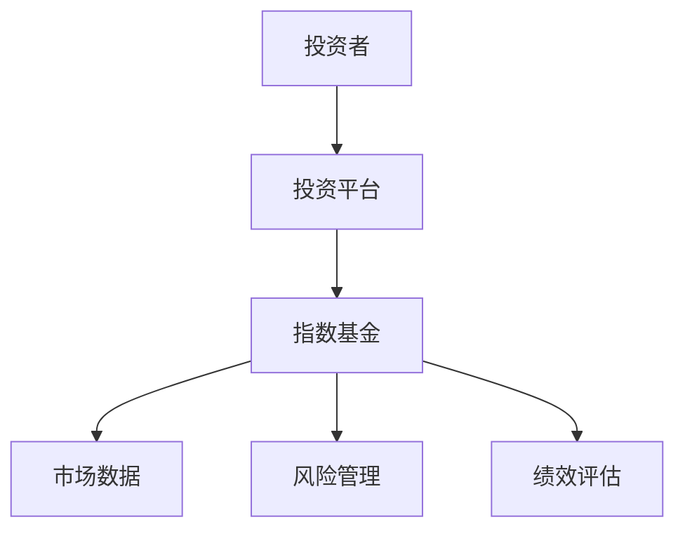
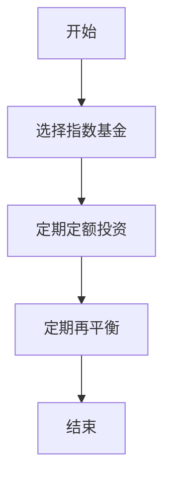

                 

# 约翰·伯格的被动投资哲学

## 关键词
- 被动投资, 约翰·伯格, 指数基金, 长期投资, 成本控制, 风险管理

## 摘要
本文深入探讨约翰·伯格的被动投资哲学，分析其核心理念、策略和实证结果。通过介绍被动投资的背景、理论基础、指数基金策略、风险管理及实证分析，结合数学模型和图表，为读者提供全面的被动投资知识。文章结构清晰，内容详实，适合投资爱好者和专业人士阅读。

## 第一部分: 被动投资的哲学基础

### 第1章: 被动投资的背景与核心理念

#### 1.1 被动投资的背景介绍
- 现代金融市场的演变：从早期的个人投资者到机构投资者的转变，推动了被动投资的发展。
- 被动投资的起源与发展：20世纪70年代，约翰·伯格等人提出指数基金概念，开启了被动投资的新纪元。
- 约翰·伯格的贡献与影响：伯格通过 Vanguard 革新了低成本指数基金，降低了投资门槛，普及了被动投资理念。

#### 1.2 被动投资的核心概念
- 长期投资与买入并持有策略：强调时间复利效应，避免频繁交易，降低交易成本。
- 分散投资与风险控制：通过投资多样化资产降低特定风险，实现风险与收益的最佳平衡。
- 成本控制与投资效率：低成本是被动投资的核心优势，费用低廉使长期收益最大化。

#### 1.3 被动投资与主动投资的对比
- 投资理念的差异：被动投资遵循市场均值回归，主动投资追求超额收益。
- 风险与收益的对比：被动投资风险较低，收益稳定；主动投资波动较大，收益不稳定。
- 管理费用与投资绩效的分析：被动投资费用低，长期绩效更优，主动投资费用高，难以超越市场表现。

### 第2章: 指数基金的投资策略

#### 2.1 指数基金的核心优势
- 指数基金的定义与特点：跟踪市场指数，分散投资，费用低。
- 指数基金的成本优势：管理费用低，整体投资成本更优。
- 指数基金的风险分散能力：通过广泛投资分散非系统性风险，降低整体风险。

#### 2.2 指数基金的构建与管理
- 指数基金的构建原理：选择代表性的市场指数，如标普500，涵盖市场大部分市值。
- 指数基金的权重分配：采用市值加权，确保每只股票的权重与其市值相符。
- 指数基金的定期再平衡：定期调整持仓，保持与指数构成一致，降低偏离风险。

#### 2.3 指数基金的税收优化
- 税收的影响与优化策略：资本利得税较低，长期持有减少税务负担。
- 税收递延与指数基金的优势：利用税收递延政策，降低税务成本。
- 税收环境的变化与应对：关注税收政策变化，合理调整投资策略。

## 第三部分: 被动投资的实证分析

### 第3章: 被动投资的实证研究

#### 3.1 被动投资的长期收益分析
- 长期收益的计算方法：采用几何平均回报率，考虑复利效应。
- 不同市场环境下的收益表现：牛市表现稳健，熊市跌幅较小，长期收益累积效应显著。
- 收益的波动性与稳定性：收益波动较小，长期趋势稳定。

#### 3.2 被动投资的风险调整后收益
- 夏普比率的计算与应用：夏普比率衡量单位风险超额收益，被动投资夏普比率较高。
- 特雷诺比率的分析：特雷诺比率衡量风险调整后的超额收益，被动投资表现优异。
- 风险调整后收益的比较：被动投资在相同风险下收益更高，性价比更优。

#### 3.3 被动投资的市场适应性
- 不同市场周期下的表现：经济衰退期表现稳定，经济复苏期收益增长显著。
- 市场波动对被动投资的影响：市场剧烈波动时，被动投资风险较低，长期收益不受短期波动影响。
- 市场环境变化的应对策略：保持长期投资策略，避免频繁调整，降低交易成本。

### 第4章: 被动投资的风险管理

#### 4.1 被动投资的市场风险
- 市场波动对投资组合的影响：被动投资通过分散投资降低市场风险，整体波动较小。
- 经济周期对被动投资的影响：经济周期波动中，被动投资表现稳定，具备较强的抗跌性。
- 黑天鹅事件的应对策略：被动投资通过分散投资降低尾部风险，但需关注系统性风险。

#### 4.2 被动投资的流动性风险
- 资产流动性对投资的影响：被动投资选择高流动性的资产，确保资金流动性。
- 大额赎回对基金的影响：指数基金规模大，流动性好，赎回压力较小。
- 流动性管理策略：保持足够的流动性储备，应对可能出现的赎回需求。

#### 4.3 被动投资的费用风险
- 管理费用对投资收益的影响：低管理费用使被动投资长期收益最大化。
- 其他费用的分析：如托管费、交易费等，被动投资整体费用优势明显。
- 费用控制策略：选择低成本指数基金，降低投资费用，提升净收益。

## 第五部分: 结论与未来展望

### 第5章: 结论与未来展望

#### 5.1 被动投资的成功案例
- 约翰·伯格的经典案例：Vanguard指数基金的成功运作，长期稳定的收益表现。
- 被动投资的广泛应用：机构和个人投资者逐渐转向被动投资策略，市场占比持续增长。

#### 5.2 被动投资的未来趋势
- 技术进步对被动投资的影响：大数据和AI技术的应用，优化投资组合，降低投资成本。
- 市场环境的变化：全球化和金融创新推动被动投资产品多样化，适应不同投资者需求。
- 被动投资的持续优化：通过技术创新和产品创新，提升被动投资的效率和效果。

#### 5.3 被动投资的适用人群
- 机构投资者：利用被动投资降低管理成本，优化资产配置。
- 个人投资者：适合长期理财规划，通过被动投资实现财富稳步增长。
- 退休基金：被动投资适合长期目标，保障资金安全，实现稳健收益。

---

## 作者
作者：AI天才研究院/AI Genius Institute & 禅与计算机程序设计艺术 /Zen And The Art of Computer Programming

---

### 附录: 数学公式与图表

#### 附录A: 被动投资收益计算公式

$$
\text{年化收益} = \left( \prod_{i=1}^{n} (1 + r_i) \right)^{\frac{1}{n}} - 1
$$

其中，\( r_i \) 是每年的收益率，\( n \) 是年数。

#### 附录B: 夏普比率计算公式

$$
\text{夏普比率} = \frac{E[\text{收益} - \text{无风险收益}]}{\text{收益的标准差}}
$$

---

### 附录C: 系统架构图

---

### 附录D: 投资策略流程图

---

### 附录E: 指数基金构建步骤

---

## 结语
约翰·伯格的被动投资哲学不仅是一种投资策略，更是一种长期稳健的投资理念。通过指数基金的低成本和分散投资，投资者可以实现财富的稳步增长。被动投资的成功在于其简单有效的策略，适合各类投资者，包括机构和个人。未来，随着技术的进步和市场的演变，被动投资将继续优化，为投资者提供更多选择和更好的回报。

---

