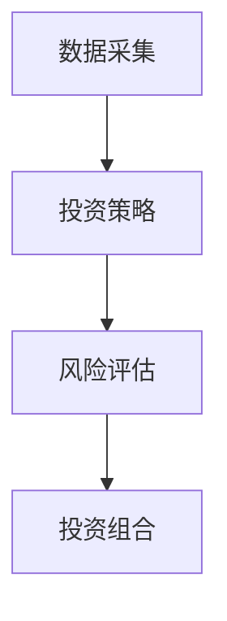

                 


# 约翰·伯格的被动投资策略：为什么简单常常胜过复杂

> **关键词**：被动投资、约翰·伯格、指数基金、成本控制、投资策略、风险管理  
> **摘要**：本文深入探讨了约翰·伯格的被动投资策略，分析了其核心理念、数学模型、系统架构及实际应用。通过简单明了的策略，伯格证明了长期投资和低成本控制的重要性，展示了为什么简单常常胜过复杂的策略。

---

## 第1章: 被动投资策略的背景与概念

### 1.1 被动投资的定义与特点

#### 1.1.1 被动投资的定义
被动投资是一种投资策略，旨在通过跟踪市场指数或特定资产类别来实现长期收益，而不是试图通过频繁交易或预测市场走势来获取超额收益。其核心在于“买入并持有”，通过分散投资来降低风险。

#### 1.1.2 被动投资的核心特点
- **低成本**：被动投资通过减少交易频率和管理费用，降低了整体成本。
- **低风险**：通过分散投资，被动投资降低了单一资产的风险。
- **长期稳定**：被动投资追求市场平均收益，避免了短期波动带来的损失。

#### 1.1.3 被动投资与主动投资的区别
- **目标**：被动投资追求市场平均收益，主动投资追求超额收益。
- **方法**：被动投资通过指数基金等工具，主动投资通过选股和择时。
- **成本**：被动投资成本低，主动投资成本高。

### 1.2 约翰·伯格的被动投资理念

#### 1.2.1 约翰·伯格的背景介绍
约翰·伯格是美国著名的投资专家， Vanguard集团的创始人。他提倡被动投资，认为长期投资和分散投资是实现财富增长的最佳方式。

#### 1.2.2 约翰·伯格的投资哲学
伯格认为，市场是不可预测的，投资者无法通过频繁交易或选股获得稳定的超额收益。相反，通过低成本的指数基金和长期持有，投资者可以实现稳定的收益。

#### 1.2.3 约翰·伯格的被动投资策略
伯格的策略核心是通过指数基金实现分散投资，降低交易成本和管理费用，从而最大化长期收益。

---

## 第2章: 被动投资的核心策略

### 2.1 指数基金的投资策略

#### 2.1.1 指数基金的定义
指数基金是一种跟踪市场指数的基金，如标普500指数。其目标是通过复制指数的表现，实现与市场同步的收益。

#### 2.1.2 指数基金的优势
- **分散风险**：通过投资多个资产，降低单一资产的风险。
- **低成本**：指数基金的管理费用较低，适合长期投资。
- **简单易懂**：投资者无需复杂的选股和择时决策。

#### 2.1.3 指数基金的分类
- **股票指数基金**：跟踪股票指数。
- **债券指数基金**：跟踪债券指数。
- **多元资产指数基金**：同时投资股票和债券。

### 2.2 成本控制的重要性

#### 2.2.1 投资成本的定义
投资成本包括管理费用、交易费用和其他相关费用。低成本策略是被动投资的核心之一。

#### 2.2.2 成本对投资收益的影响
长期来看，低成本策略能够显著提高净收益。例如，假设两只基金的年收益相同，但一只的管理费用为1%，另一只为0.5%，长期来看，低成本基金的收益会更高。

#### 2.2.3 如何降低投资成本
- **选择低成本基金**：优先选择管理费用低的指数基金。
- **减少交易频率**：被动投资通过长期持有减少交易成本。
- **定期定额投资**：分散投资金额，降低市场波动影响。

---

## 第3章: 被动投资的数学模型与算法原理

### 3.1 投资组合的数学模型

#### 3.1.1 投资组合的定义
投资组合是指投资者持有的多种资产的组合，旨在通过分散投资降低风险。

#### 3.1.2 投资组合的优化模型
现代投资组合理论（MPT）是被动投资的重要基础。MPT通过优化资产配置，使投资组合在相同风险下收益最大化，或在相同收益下风险最小化。

#### 3.1.3 投资组合的风险与收益分析
风险与收益的关系可以用夏普比率（Sharpe Ratio）来衡量。夏普比率越高，投资组合的性价比越高。

### 3.2 被动投资的算法实现

#### 3.2.1 被动投资的算法选择
被动投资的核心算法是指数基金的复制算法，即通过跟踪指数成分股的权重进行投资。

#### 3.2.2 被动投资算法的实现步骤
1. 确定跟踪的指数。
2. 计算指数成分股的权重。
3. 根据权重分配资金，构建投资组合。
4. 定期再平衡投资组合，以保持与指数一致。

#### 3.2.3 被动投资算法的优缺点
- **优点**：简单易行，成本低，风险可控。
- **缺点**：无法获得超额收益，适合长期稳健投资者。

---

## 第4章: 被动投资系统的架构设计

### 4.1 系统功能模块设计

#### 4.1.1 数据采集模块
负责收集市场指数数据、基金价格数据等。

#### 4.1.2 投资策略模块
根据指数数据，计算投资组合的权重和配置。

#### 4.1.3 风险评估模块
评估投资组合的风险，如波动率、夏普比率等。

### 4.2 系统架构图


---

## 第5章: 被动投资的项目实战

### 5.1 环境搭建与数据准备

#### 5.1.1 环境安装
需要安装Python、Pandas、NumPy等工具。

#### 5.1.2 数据源选择
选择标普500指数的成分股数据和历史价格数据。

#### 5.1.3 数据清洗与预处理
对数据进行清洗，处理缺失值和异常值。

### 5.2 投资组合优化的代码实现

#### 5.2.1 代码框架
```python
import pandas as pd
import numpy as np

# 数据加载
data = pd.read_csv('index_data.csv')

# 计算指数权重
weights = data['weight'].values

# 构建投资组合
portfolio = data['components'].values * weights
```

#### 5.2.2 核心算法实现
```python
def calculate_weights(components, prices):
    # 计算各成分股的权重
    total = sum(prices)
    weights = [price / total for price in prices]
    return weights

# 示例计算
components = ['AAPL', 'MSFT', 'GOOGL']
prices = [300, 250, 200]
weights = calculate_weights(components, prices)
```

#### 5.2.3 代码测试与优化
通过回测和风险评估，验证投资组合的收益和风险是否符合预期。

---

## 第6章: 被动投资的最佳实践与总结

### 6.1 约翰·伯格策略的总结

#### 6.1.1 简单策略的优势
简单策略易于执行，成本低，风险可控。

#### 6.1.2 长期投资的重要性
长期持有投资组合能够摊薄成本，获得稳定收益。

#### 6.1.3 成本控制的关键作用
低成本策略能够显著提高净收益，尤其是在长期投资中。

### 6.2 被动投资的注意事项

#### 6.2.1 风险控制
通过分散投资和定期再平衡，降低投资组合的风险。

#### 6.2.2 市场波动的影响
市场波动对被动投资影响较小，但需要定期调整投资组合。

#### 6.2.3 投资组合的定期调整
定期再平衡投资组合，以保持与指数一致。

### 6.3 拓展阅读与进一步学习

#### 6.3.1 推荐书籍
- 《投资学》（Charles P. Jones）
- 《指数投资入门》（John C. Bogle）

#### 6.3.2 在线资源
- 网站：Vanguard、Morningstar
- 论文：现代投资组合理论相关研究

#### 6.3.3 实践项目建议
- 开发一个指数基金投资组合管理系统。
- 实现投资组合的定期再平衡功能。

---

## 作者：AI天才研究院/AI Genius Institute & 禅与计算机程序设计艺术 /Zen And The Art of Computer Programming

