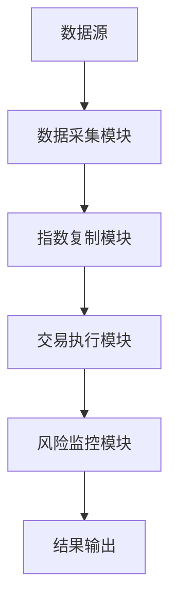

                 


# 约翰·伯格的被动投资：ETF时代的新发展

> 关键词：被动投资, ETF, 投资策略, 资产配置, 市场指数

> 摘要：本文系统地探讨了被动投资在现代金融中的发展，重点分析了ETF（交易所交易基金）作为被动投资的核心工具。通过详细阐述ETF的运作机制、分类、风险收益分析、投资策略及实际应用，本文为读者提供了全面了解被动投资在ETF时代发展的理论与实践知识。结合实际案例分析和代码实现，帮助投资者掌握被动投资的核心理念和操作方法。

---

## 第一部分: 被动投资的背景与核心概念

### 第1章: 被动投资的背景与发展

#### 1.1 被动投资的起源与发展

被动投资是一种长期投资策略，其核心理念是通过模仿市场整体表现来实现投资收益，而非通过选股或择时来主动管理投资组合。被动投资的起源可以追溯到20世纪70年代，当时美国 Vanguard 集团的创始人约翰·伯格（John Bogle）提出并推广了指数基金的概念。被动投资的核心理念是通过分散投资来降低风险，并通过长期持有来获得市场的平均收益。

被动投资与主动投资的主要区别在于其管理方式和目标。主动投资试图通过精选个股或择时交易来超越市场指数的表现，而被动投资则通过跟踪特定的市场指数来实现与市场同步增长。被动投资的哲学是相信市场是有效的，即市场的价格反映了所有可获得的信息，因此试图通过主动管理来战胜市场的难度较大，成本也较高。

被动投资的发展得益于技术的进步和市场效率的提高。随着交易所交易基金（ETF）的兴起，被动投资变得更加便捷和高效。ETF作为一种在交易所上市交易的基金，具有透明度高、费用低、流动性好等特点，成为被动投资的主要工具之一。

---

#### 1.2 ETF的基本概念与运作机制

ETF（交易所交易基金）是一种在交易所上市交易的开放式基金，其特点是跟踪特定的指数、行业、 commodities 或其他资产类别，并通过在交易所上市交易提供了一种类似于股票的交易方式。

ETF 的运作机制主要依赖于指数复制策略。指数复制是指通过复制目标指数的成分股构成和权重，来实现对目标指数的跟踪。ETF 的管理人通常会采用完全复制、抽样复制或优化复制等方法，以尽可能减少跟踪误差（即 ETF 的实际收益与目标指数收益之间的差异）。

ETF 的主要特点包括：

1. **透明性**：ETF 的持仓信息公开，投资者可以随时查看其成分股及其权重。
2. **流动性**：ETF 在交易所上市交易，具有较高的流动性，投资者可以随时买卖。
3. **分散风险**：通过投资于广泛的资产组合，ETF 可以有效分散非系统性风险。
4. **低成本**：ETF 的管理费用通常低于主动管理型基金，因为其采用被动投资策略。
5. **灵活性**：投资者可以根据市场情况灵活调整投资组合，通过买卖 ETF 来实现资产配置。

---

#### 1.3 ETF 在被动投资中的地位

ETF 在被动投资中占据重要地位，主要体现在以下几个方面：

1. **核心投资工具**：ETF 是被动投资者的主要投资工具之一，广泛应用于指数投资和资产配置。
2. **降低交易成本**：通过投资 ETF，投资者可以以较低的成本获得广泛分散的投资组合。
3. **提高投资效率**：ETF 的上市交易特性使得投资者可以像买卖股票一样方便地买卖 ETF，提高了投资的效率。

通过 ETF，被动投资者可以轻松实现对市场的广泛覆盖，并通过定期再平衡来维持投资组合的分散性和稳定性。

---

### 第2章: ETF 的核心概念与分类

#### 2.1 ETF 的分类与特点

ETF 可以按照多种标准进行分类，以下是几种常见的分类方式：

1. **按投资标的分类**：
   - 股票型 ETF：跟踪股票指数，如标普500指数 ETF。
   - 债券型 ETF：跟踪债券指数，如美国国债 ETF。
   - 商品型 ETF：投资于大宗商品，如黄金 ETF。
   - 汇率型 ETF：跟踪汇率指数，如欧元/美元汇率 ETF。

2. **按市场类型分类**：
   - 国内市场 ETF：投资于本国市场的资产，如中国 A 股 ETF。
   - 国际市场 ETF：投资于海外市场，如新兴市场 ETF。

3. **按投资策略分类**：
   - 主动型 ETF：试图通过主动管理来超越指数表现。
   - 被动型 ETF：通过复制指数来实现投资目标。

---

#### 2.2 ETF 的运作原理

ETF 的运作机制包括以下几个关键步骤：

1. **指数选择**：ETF 管理人选择一个特定的指数作为跟踪目标，例如标普500指数。
2. **成分股复制**：管理人通过购买目标指数的成分股，并按照指数的权重进行配置，以尽量减少跟踪误差。
3. **上市交易**：ETF 在交易所上市交易，投资者可以通过经纪人买卖 ETF。
4. **日常管理**：管理人定期调整 ETF 的持仓，以保持与目标指数的一致性。

ETF 的运作机制依赖于高效的交易系统和严格的风险控制，以确保 ETF 的实际表现与目标指数保持一致。

---

#### 2.3 ETF 的风险与收益分析

1. **收益来源**：ETF 的收益来源于其跟踪的指数表现，通常包括资本收益和股息收益。
2. **主要风险**：
   - 市场风险：指数本身的表现波动可能影响 ETF 的收益。
   - 流动性风险：在某些情况下，ETF 可能面临流动性不足的问题，导致买卖价差加大。
   - 跟踪误差风险：由于复制指数的成本和限制，ETF 的实际收益可能与指数收益存在差异。

通过合理的资产配置和风险分散，投资者可以有效降低 ETF 投资的风险。

---

### 第3章: ETF 的投资策略与应用

#### 3.1 被动投资中的 ETF 配置策略

被动投资的核心是通过长期持有 ETF 来实现对市场的广泛覆盖。以下是几种常见的 ETF 配置策略：

1. **核心-卫星策略**：
   - 核心部分：投资于宽基指数 ETF，如标普500 ETF，作为投资组合的核心配置。
   - 卫星部分：投资于其他 ETF 或个股，以增强收益或对冲风险。

2. **定期再平衡策略**：
   - 定期检查投资组合的配置比例，根据市场变化进行调整，以维持目标配置。

3. **成本控制策略**：
   - 选择费用较低的 ETF，长期来看，费用的积累效应会对收益产生显著影响。

---

#### 3.2 ETF 的风险控制与绩效评估

1. **风险控制**：
   - 通过分散投资降低非系统性风险。
   - 定期监控 ETF 的跟踪误差和流动性风险。

2. **绩效评估**：
   - 比较 ETF 的实际收益与目标指数收益，评估其跟踪误差和超额收益。
   - 通过 Sharpe 比率等指标衡量 ETF 的风险调整后收益。

---

## 第二部分: ETF 的算法原理与系统架构

### 第4章: ETF 的算法原理

#### 4.1 ETF 的指数复制算法

指数复制是 ETF 运作的核心算法，主要包括以下步骤：

1. **目标指数选择**：选择一个特定的指数作为跟踪目标。
2. **成分股选择**：根据指数的成分股和权重，选择相应的股票或其他资产。
3. **复制策略选择**：采用完全复制、抽样复制或优化复制等方法。
4. **动态调整**：定期调整持仓，以保持与指数的一致性。

---

#### 4.2 ETF 的风险控制算法

风险控制是 ETF 运作的重要环节，主要包括：

1. **流动性监控**：实时监控 ETF 的交易量和买卖价差，确保流动性充足。
2. **跟踪误差监控**：定期计算 ETF 的跟踪误差，并根据需要进行调整。
3. **市场风险对冲**：通过金融衍生工具对冲系统性风险。

---

### 第5章: ETF 的系统架构

#### 5.1 系统功能设计

1. **数据采集模块**：采集目标指数的成分股和权重数据。
2. **指数复制模块**：根据数据进行指数复制。
3. **交易执行模块**：执行买卖交易，确保持仓与指数一致。
4. **风险监控模块**：实时监控风险指标，确保系统稳定运行。

---

#### 5.2 系统架构图



---

#### 5.3 系统接口设计

1. **数据接口**：与指数数据源对接，获取实时数据。
2. **交易接口**：与交易所系统对接，执行买卖交易。
3. **监控接口**：与风险监控系统对接，实时更新风险指标。

---

### 第6章: 项目实战

#### 6.1 环境安装

1. **安装 Python 环境**：使用 Anaconda 安装 Python 3.8 及以上版本。
2. **安装依赖库**：安装 pandas、numpy、matplotlib 等数据分析库。

---

#### 6.2 核心代码实现

```python
import pandas as pd
import numpy as np

# 示例：计算 ETF 的跟踪误差
def calculate_tracking_error(ETF_return, index_return):
    # 计算跟踪误差
    tracking_error = np.std(ETF_return - index_return)
    return tracking_error

# 示例：计算夏普比率
def calculate_sharpe_ratio(returns, risk_free_rate):
    excess_returns = returns - risk_free_rate
    sharpe_ratio = np.mean(excess_returns) / np.std(excess_returns)
    return sharpe_ratio

# 示例：ETF 配置优化
def optimize_etf_allocation(asset_returns, risk_tolerance):
    # 使用均值-方差优化模型
    pass  # 简化示例，实际实现需要更复杂的优化算法
```

---

#### 6.3 案例分析

1. **案例背景**：假设我们选择跟踪标普500指数的 ETF，如 VOO。
2. **数据获取**：获取 VOO 和标普500指数的历史收益率数据。
3. **计算跟踪误差**：使用上述代码计算 VOO 的跟踪误差。
4. **夏普比率计算**：计算 VOO 的夏普比率，评估其风险调整后收益。

---

## 第三部分: 最佳实践与总结

### 第7章: 最佳实践与注意事项

#### 7.1 投资策略建议

1. **长期持有**：被动投资的核心是长期持有 ETF，避免频繁交易。
2. **分散投资**：通过配置不同类型的 ETF 来分散风险。
3. **定期再平衡**：定期检查投资组合，根据市场变化进行调整。

---

#### 7.2 风险管理

1. **关注流动性风险**：选择流动性较高的 ETF，避免在市场流动性不足时出现较大买卖价差。
2. **监控跟踪误差**：定期检查 ETF 的跟踪误差，确保其与目标指数保持一致。

---

### 第8章: 总结与展望

被动投资作为一种长期投资策略，在 ETF 时代得到了新的发展。通过 ETF，投资者可以以较低的成本实现广泛的资产分散，降低投资风险。未来，随着技术的进步和市场的进一步发展，ETF 的应用将更加广泛，被动投资也将继续在投资领域发挥重要作用。

---

## 作者

作者：AI天才研究院/AI Genius Institute & 禅与计算机程序设计艺术 /Zen And The Art of Computer Programming

