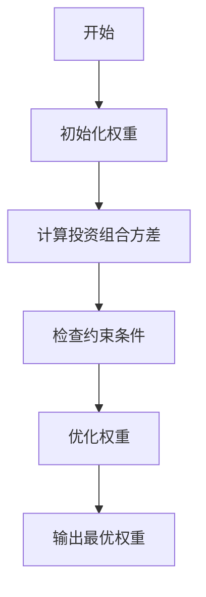
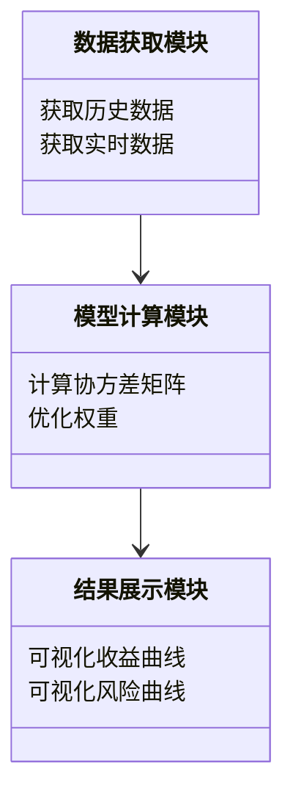

                 


# 约翰·伯格的资产配置建议

> 关键词：资产配置，投资组合，风险管理，收益最大化，现代投资组合理论

> 摘要：本文将详细探讨约翰·伯格的资产配置策略，从背景、原理、算法、数学模型到实际应用，逐步分析其核心思想和实践方法。通过理论与实践相结合的方式，帮助读者理解如何通过科学的资产配置实现收益与风险的平衡。

---

# 第一部分：资产配置的背景与重要性

## 第1章：资产配置的基本概念

### 1.1 什么是资产配置
- 资产配置是指将资金分配到不同的资产类别（如股票、债券、房地产等）中，以实现投资目标的过程。
- 资产配置的核心目标是在控制风险的前提下，最大化收益。

### 1.2 资产配置的重要性
- 通过分散投资降低风险。
- 在不同的市场环境下，不同的资产类别表现不同，合理配置可以平滑波动。
- 资产配置是投资组合管理的基础。

### 1.3 资产配置与投资目标的关系
- 投资目标决定了资产配置的策略。
- 长期目标通常需要更高的风险承受能力，短期目标则需要更保守的配置。

---

## 第2章：资产配置的核心概念与联系

### 2.1 资产配置的原理
- 风险与收益的平衡是资产配置的核心。
- 不同资产类别的风险和收益特征决定了它们在组合中的权重。

### 2.2 资产配置的核心概念对比
- **资产类别对比**：
  | 资产类别 | 风险 | 收益 | 流动性 |
  |----------|------|------|--------|
  | 股票     | 高   | 高   | 低     |
  | 债券     | 中   | 中   | 高     |
  | 房地产   | 中高 | 中高 | 低     |
  | 现金     | 低   | 低   | 高     |
- **资产相关性分析**：资产之间的相关性越低，风险分散效果越好。

### 2.3 资产配置的动态调整
- 市场环境变化需要及时调整配置。
- 定期再平衡是维持目标配置的重要手段。

---

## 第3章：资产配置的算法原理

### 3.1 现代投资组合理论（MPT）
- **马科维茨的有效前沿理论**：通过优化投资组合的风险和收益，找到最优配置。
- **均值-方差优化模型**：通过数学公式计算出最优资产权重。

### 3.2 资产配置的算法实现

#### 使用Python实现资产配置算法
```python
import numpy as np
import pandas as pd
from scipy.optimize import minimize

# 示例数据：资产的期望收益、协方差矩阵
n_assets = 4
returns = np.array([0.1, 0.05, 0.15, 0.08])
cov_matrix = np.array([
    [0.02, 0.01, 0.015, 0.01],
    [0.01, 0.03, 0.02, 0.015],
    [0.015, 0.02, 0.03, 0.02],
    [0.01, 0.015, 0.02, 0.04]
])

# 定义优化目标函数
def portfolio_variance(weights, covariance):
    return (weights.T @ covariance @ weights)

# 约束条件：权重之和为1
def weight_sum(weights):
    return np.sum(weights) - 1

# 初始猜测：等权重
initial_weights = np.array([0.25, 0.25, 0.25, 0.25])

# 使用最小二乘法优化
result = minimize(portfolio_variance, initial_weights, args=cov_matrix, 
                 constraints={'type': 'eq', 'fun': weight_sum})

# 输出最优权重
print("最优权重：", result.x)
print("最小方差：", result.fun)
```

#### 使用mermaid绘制算法流程图


---

## 第4章：资产配置的数学模型与公式

### 4.1 均值-方差优化模型
- **数学公式**：
  $$ \text{最小化 } w^T \Sigma w $$
  $$ \text{约束 } \sum w_i = 1 $$
  其中，\( w \) 是权重向量，\( \Sigma \) 是协方差矩阵。

### 4.2 资产配置的数学公式
- **期望收益**：
  $$ \text{收益 } = \sum w_i r_i $$
  其中，\( r_i \) 是第 \( i \) 个资产的期望收益。

---

# 第二部分：资产配置的系统分析与架构设计

## 第5章：系统功能设计

### 5.1 问题场景介绍
- 投资者希望根据市场环境动态调整资产配置。
- 系统需要提供数据获取、模型计算和结果展示的功能。

### 5.2 系统功能设计
- **数据获取模块**：获取各资产的历史数据和实时数据。
- **模型计算模块**：使用均值-方差模型计算最优配置。
- **结果展示模块**：可视化投资组合的风险和收益。

#### 使用mermaid绘制系统架构图


---

## 第6章：系统架构设计

### 6.1 系统架构设计
- **分层架构**：
  - 数据层：存储资产数据。
  - 业务逻辑层：处理数据和计算模型。
  - 表现层：展示结果。

#### 使用mermaid绘制系统架构图
```mermaid
archi
    client --> app: HTTP请求
    app --> db: 查询数据
    app --> service: 计算最优配置
    service --> db: 更新数据
    service --> frontend: 返回结果
```

---

# 第三部分：资产配置的项目实战

## 第7章：环境安装与代码实现

### 7.1 环境安装
- Python 3.8+
- pip install numpy pandas scipy

### 7.2 核心代码实现
```python
import numpy as np
import pandas as pd
from scipy.optimize import minimize

# 示例数据：资产的期望收益、协方差矩阵
n_assets = 4
returns = np.array([0.1, 0.05, 0.15, 0.08])
cov_matrix = np.array([
    [0.02, 0.01, 0.015, 0.01],
    [0.01, 0.03, 0.02, 0.015],
    [0.015, 0.02, 0.03, 0.02],
    [0.01, 0.015, 0.02, 0.04]
])

# 定义优化目标函数
def portfolio_variance(weights, covariance):
    return (weights.T @ covariance @ weights)

# 约束条件：权重之和为1
def weight_sum(weights):
    return np.sum(weights) - 1

# 初始猜测：等权重
initial_weights = np.array([0.25, 0.25, 0.25, 0.25])

# 使用最小二乘法优化
result = minimize(portfolio_variance, initial_weights, args=cov_matrix, 
                 constraints={'type': 'eq', 'fun': weight_sum})

# 输出最优权重
print("最优权重：", result.x)
print("最小方差：", result.fun)
```

---

## 第8章：项目小结与注意事项

### 8.1 项目小结
- 资产配置是投资组合管理的核心。
- 通过科学的算法和模型，可以实现风险与收益的平衡。

### 8.2 注意事项
- 定期再平衡是维持资产配置的重要手段。
- 需要根据市场变化及时调整策略。

---

# 第四部分：最佳实践与总结

## 第9章：最佳实践

### 9.1 风险管理
- 定期评估投资组合的风险。
- 设置止损点。

### 9.2 长期投资
- 长期投资可以降低短期波动的影响。
- 定期定额投资可以帮助平滑成本。

---

## 第10章：总结与展望

### 10.1 总结
- 资产配置是投资成功的关键。
- 通过科学的方法和持续的优化，可以实现收益与风险的平衡。

### 10.2 展望
- 结合人工智能技术，资产配置将更加智能化。
- 更加个性化的配置策略将成为可能。

---

# 作者

作者：AI天才研究院/AI Genius Institute & 禅与计算机程序设计艺术 /Zen And The Art of Computer Programming

