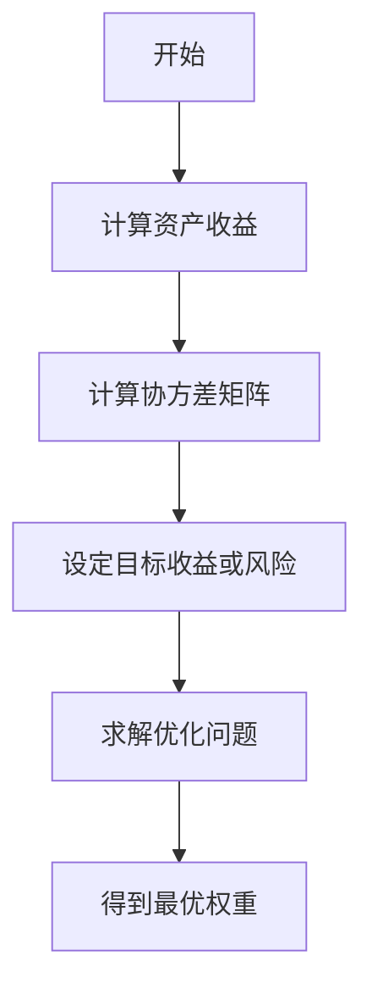
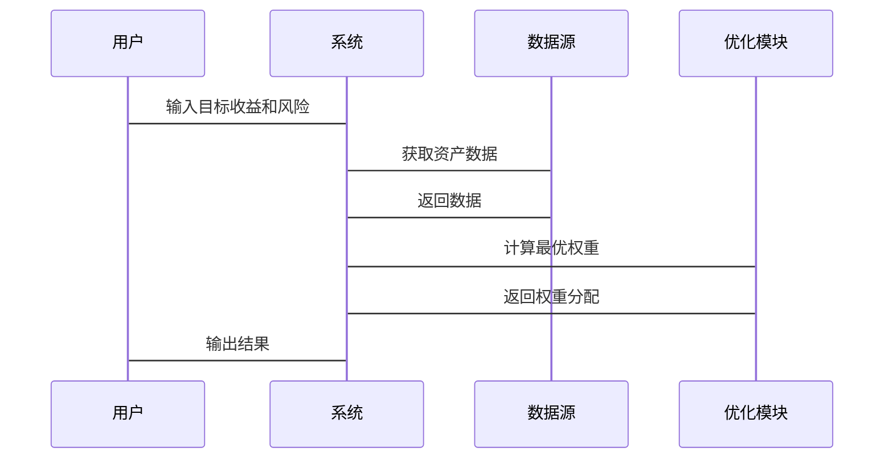

                 


# 约翰·伯格的资产配置理论

> 关键词：资产配置理论、约翰·伯格、投资组合管理、现代投资组合理论、有效前沿、风险收益平衡、动态资产配置

> 摘要：本文系统地介绍约翰·伯格的资产配置理论，从理论基础到实际应用，涵盖资产配置的基本概念、数学模型、实证分析及策略应用。通过详细讲解，帮助读者理解如何通过科学的资产分配实现投资收益与风险的最优平衡。

---

## 第一部分: 引言

### 第1章: 资产配置的基本概念与重要性

#### 1.1 资产配置的定义与核心要素

##### 1.1.1 资产配置的定义
资产配置是指将投资组合中的资金分配到不同的资产类别（如股票、债券、房地产等），以实现风险和收益的最佳平衡。它通过分散投资降低风险，同时最大化收益。

##### 1.1.2 资产配置的核心要素
资产配置的核心要素包括：
- **资产类别**：股票、债券、现金等。
- **权重分配**：每类资产在组合中的比例。
- **时间跨度**：配置的短期或长期性质。
- **风险承受能力**：投资者对风险的容忍度。
- **目标收益**：预期的投资回报率。

| 资产配置核心要素 | 定义 |
|-------------------|------|
| 资产类别         | 投资的种类，如股票、债券等 |
| 权重分配         | 各类资产在组合中的比例 |
| 时间跨度         | 配置的时间框架，如长期或短期 |
| 风险承受能力     | 投资者对风险的承受能力 |
| 目标收益         | 预期的投资回报目标 |

##### 1.1.3 资产配置的重要性
资产配置是投资组合管理的核心，直接影响投资结果。合理的资产配置可以分散风险，平衡收益，帮助投资者在不同市场环境下保持稳定的投资表现。

#### 1.2 资产配置的背景与问题背景

##### 1.2.1 投资者面临的资产选择问题
投资者在选择资产时面临多重挑战，如市场波动、通货膨胀、经济周期变化等。如何在复杂环境中做出最优决策是资产配置的核心问题。

##### 1.2.2 资产配置在投资组合管理中的作用
资产配置通过分散投资降低风险，优化收益。它帮助投资者在不同市场条件下调整资产结构，实现长期投资目标。

##### 1.2.3 资产配置的边界与外延
资产配置的边界包括可投资的资产类别和市场环境，外延则涉及动态调整和全球化配置。

#### 1.3 资产配置的历史发展与现状

##### 1.3.1 资产配置的起源与发展
资产配置起源于20世纪50年代的现代投资组合理论（MPT），随后逐渐发展为系统的理论框架。

##### 1.3.2 当代资产配置的主要流派
主要流派包括基于均值-方差模型的配置、风险平价配置和基于因素模型的配置。

##### 1.3.3 约翰·伯格的资产配置理论的独特性
约翰·伯格结合市场周期和长期趋势，提出动态资产配置策略，强调风险管理和长期视角。

---

### 第2章: 约翰·伯格的资产配置理论概述

#### 2.1 约翰·伯格的生平与学术贡献

##### 2.1.1 约翰·伯格的学术背景
约翰·伯格是资产配置领域的权威，其研究成果对投资理论和实践有深远影响。

##### 2.1.2 约翰·伯格的主要著作与研究成果
伯格的著作《战胜市场》和《投资组合的最优分配》奠定了他的理论基础。

##### 2.1.3 约翰·伯格在资产配置领域的影响力
伯格的理论被广泛应用于机构投资和个人理财，成为现代投资的重要组成部分。

#### 2.2 资产配置理论的核心概念与联系

##### 2.2.1 资产配置理论的核心概念
- **风险**：资产收益的波动性。
- **收益**：资产的预期回报。
- **相关性**：不同资产之间的收益波动关系。

##### 2.2.2 核心概念的属性特征对比表格
| 概念       | 属性       | 特征描述                     |
|------------|------------|------------------------------|
| 风险       | 测度        | 方差、标准差                 |
| 收益       | 预测值     | 均值、预期收益               |
| 相关性     | 矩阵       | 资产之间的协方差             |

##### 2.2.3 ER实体关系图架构的 Mermaid 流程图
```mermaid
erd
    投资者 <--- 投资组合 <--- 资产配置
    资产配置 <---- 风险
    资产配置 <---- 收益
    资产配置 <---- 相关性
```

---

## 第二部分: 理论基础与模型构建

### 第3章: 现代投资组合理论与有效前沿

#### 3.1 现代投资组合理论的概述

##### 3.1.1 投资组合理论的基本假设
MPT假设市场是有效的，投资者是理性的，资产收益符合正态分布。

##### 3.1.2 投资组合理论的核心模型
均值-方差模型，通过优化资产组合的风险和收益。

##### 3.1.3 有效前沿的定义与性质
有效前沿是所有最优投资组合的集合，代表在特定风险下最高的收益。

#### 3.2 约翰·伯格的资产配置理论与有效前沿的关系

##### 3.2.1 约翰·伯格理论对有效前沿的继承与创新
伯格在MPT基础上引入动态调整和风险平价概念。

##### 3.2.2 约翰·伯格理论的独特视角
伯格强调长期趋势和周期性因素对资产配置的影响。

##### 3.2.3 理论的数学模型与公式
$$ \text{收益} = w^T \mu $$
$$ \text{风险} = w^T \Sigma w $$

其中，$w$ 是权重向量，$\mu$ 是收益向量，$\Sigma$ 是协方差矩阵。

### 第4章: 资产配置的数学模型与算法原理

#### 4.1 资产配置的数学模型

##### 4.1.1 均值-方差优化模型
使用拉格朗日乘数法求解最优权重。

##### 4.1.2 风险平价模型
将风险分配到各类资产，确保每类资产的风险贡献相等。

##### 4.1.3 多因子模型
考虑多个风险因子，如市值、价值、动量等。

#### 4.2 算法原理讲解

##### 4.2.1 均值-方差优化的 Mermaid 流程图


##### 4.2.2 Python代码实现
```python
import numpy as np
from scipy.optimize import minimize

# 示例数据：收益和协方差矩阵
mu = np.array([0.1, 0.05])
Sigma = np.array([[0.2, 0.1], [0.1, 0.3]])

# 定义优化函数
def portfolio_opt(w, mu, Sigma):
    return (w.T @ mu)[0]  # 最大化收益

# 约束条件：权重之和为1，非负约束
cons = ({'type': 'eq', 'fun': lambda w: np.sum(w) - 1},
        {'type': 'ineq', 'fun': lambda w: w[i] >= 0 for i in range(len(w))})

# 初始权重
w0 = np.array([0.5, 0.5])

# 求解优化问题
result = minimize(lambda w: -portfolio_opt(w, mu, Sigma), w0, constraints=cons)

# 输出结果
print("最优权重:", result.x)
```

---

### 第5章: 系统分析与架构设计

#### 5.1 系统功能设计

##### 5.1.1 领域模型的 Mermaid 类图


#### 5.2 系统架构设计

##### 5.2.1 系统架构的 Mermaid 序列图


---

## 第三部分: 项目实战

### 第6章: 项目实战与案例分析

#### 6.1 环境安装与数据准备

##### 6.1.1 环境安装
安装必要的Python库，如numpy、pandas、scipy。

##### 6.1.2 数据准备
获取历史资产收益数据，如股票和债券的收益数据。

#### 6.2 核心实现与代码解读

##### 6.2.1 简单资产配置实现
```python
import numpy as np

# 示例数据
mu = np.array([0.1, 0.05])
Sigma = np.array([[0.2, 0.1], [0.1, 0.3]])

# 定义优化函数
def portfolio_opt(w, mu, Sigma):
    return (w.T @ mu)[0]

# 约束条件
cons = ({'type': 'eq', 'fun': lambda w: np.sum(w) - 1},
        {'type': 'ineq', 'fun': lambda w: w[i] >= 0 for i in range(len(w))})

# 初始权重
w0 = np.array([0.5, 0.5])

# 求解优化问题
result = minimize(lambda w: -portfolio_opt(w, mu, Sigma), w0, constraints=cons)

# 输出结果
print("最优权重:", result.x)
```

##### 6.2.2 动态调整实现
根据市场变化动态调整资产配置权重。

#### 6.3 案例分析与结果解读

##### 6.3.1 案例分析
假设市场出现波动，调整股票和债券的比例以降低风险。

##### 6.3.2 结果解读
分析调整后的投资组合在不同市场环境下的表现。

#### 6.4 项目小结

##### 6.4.1 成功经验总结
动态调整和风险平价策略的有效性。

##### 6.4.2 问题与不足
模型假设的限制，如市场有效性假设可能不成立。

---

## 第四部分: 总结与展望

### 第7章: 总结与展望

#### 7.1 理论总结

##### 7.1.1 核心要点回顾
资产配置是投资组合管理的核心，动态调整和风险平价是关键。

##### 7.1.2 理论的独特性
伯格理论结合了市场周期和长期趋势，提供了实用的策略。

#### 7.2 应用总结

##### 7.2.1 成功经验总结
通过合理配置，投资者可以在不同市场环境下保持稳定收益。

##### 7.2.2 小结
动态资产配置和风险平价是值得推广的策略。

#### 7.3 未来展望

##### 7.3.1 理论与技术的发展
结合机器学习和大数据分析，提升配置模型的预测能力。

##### 7.3.2 应用领域扩展
将资产配置理论应用到更多领域，如房地产和私募基金。

---

## 作者

作者：AI天才研究院/AI Genius Institute & 禅与计算机程序设计艺术 /Zen And The Art of Computer Programming

---

通过以上详细的结构和内容安排，这篇文章系统地介绍了约翰·伯格的资产配置理论，从基础概念到高级应用，为读者提供了全面的视角和实用的指导。

