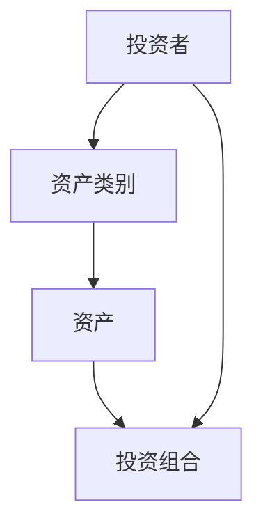
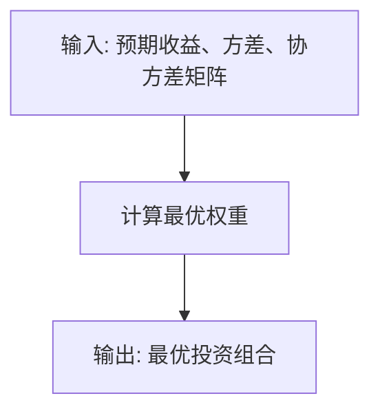
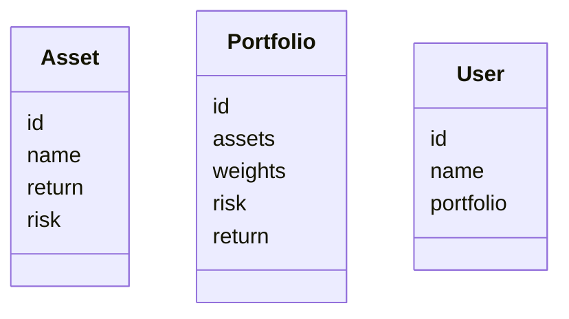
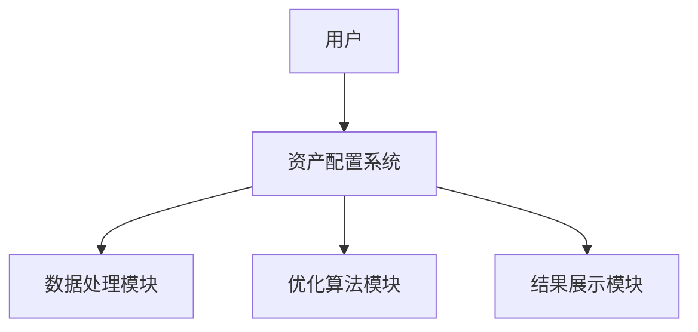
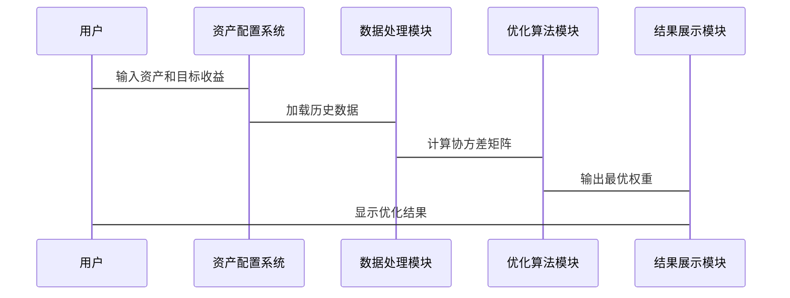

                 


# 约翰·伯格的资产配置理论

> 关键词：资产配置，约翰·伯格，现代投资组合理论，指数基金，投资组合优化

> 摘要：本文系统地介绍了约翰·伯格的资产配置理论，从基本概念到数学模型，再到算法实现和系统设计，深入剖析了这一理论在投资组合优化中的应用。文章结合理论与实践，通过详细的技术分析和案例研究，帮助读者全面理解资产配置的原理和实现方法。

---

# 第一部分：资产配置的基本概念

## 第1章：资产配置的定义与作用

### 1.1 资产配置的定义与作用
#### 1.1.1 资产配置的定义
资产配置是指将资金分配到不同资产类别（如股票、债券、房地产等）以实现投资目标的过程。它是投资组合管理的核心环节，直接影响投资收益和风险。

#### 1.1.2 资产配置的作用与意义
资产配置通过分散投资降低风险，同时优化收益。它是投资者在不同市场环境下调整投资策略的关键工具。

#### 1.1.3 资产配置与投资回报的关系
资产配置决定了投资组合的收益和风险特征，是实现长期稳健投资回报的基础。

### 1.2 约翰·伯格与资产配置理论
#### 1.2.1 约翰·伯格的生平简介
约翰·伯格是指数基金之父，他的研究成果奠定了现代资产配置理论的基础。

#### 1.2.2 伯格对资产配置理论的贡献
伯格提出了现代投资组合理论（MPT），强调通过分散投资降低风险，并通过指数基金实现低成本、低风险的投资策略。

#### 1.2.3 伯格理论的现代发展与应用
伯格的理论在实践中得到了广泛应用，成为机构投资者和个人投资者的首选策略。

---

## 第2章：资产配置的核心概念与背景

### 2.1 资产配置的背景与问题背景
#### 2.1.1 投资者面临的资产选择问题
投资者需要在不同资产类别中选择最优组合，以实现风险和收益的平衡。

#### 2.1.2 资产配置在投资组合中的核心地位
资产配置是投资组合管理的基石，决定了组合的收益和风险特征。

#### 2.1.3 资产配置的边界与外延
资产配置需要考虑市场环境、投资者风险承受能力等因素。

### 2.2 资产配置的核心要素与概念结构
#### 2.2.1 资产配置的核心要素
- **资产类别**：股票、债券、现金等。
- **风险与收益**：不同资产类别的风险和收益特征。
- **时间跨度**：短期与长期投资目标。

#### 2.2.2 资产配置的概念结构
- **资产配置与投资目标的关系**
- **资产配置与市场环境的关系**
- **资产配置与风险控制的关系**

#### 2.2.3 资产配置与风险收益的平衡
通过合理配置资产，投资者可以在风险可控的前提下实现收益最大化。

---

## 第3章：资产配置的核心概念与联系

### 3.1 资产配置的核心原理
#### 3.1.1 现代投资组合理论（MPT）概述
MPT强调通过分散投资降低风险，通过优化资产配置实现收益最大化。

#### 3.1.2 资产配置与风险分散原理
分散投资可以有效降低非系统性风险，但无法消除系统性风险。

#### 3.1.3 资产配置与收益最大化的关系
通过优化资产配置，投资者可以在给定风险水平下获得最大收益。

### 3.2 资产配置的核心属性特征对比
#### 3.2.1 不同资产类别的风险与收益特征
| 资产类别 | 风险 | 收益 |
|----------|------|------|
| 股票     | 高   | 高   |
| 债券     | 中   | 中   |
| 现金     | 低   | 低   |

#### 3.2.2 资产配置与投资组合的属性对比
- **资产配置**：全局性、战略性和长期性。
- **投资组合**：战术性、短期性和灵活性。

#### 3.2.3 资产配置的灵活性与稳定性分析
资产配置需要根据市场变化进行动态调整，但调整的频率和幅度取决于投资者的风险偏好。

### 3.3 资产配置的ER实体关系图


---

## 第4章：资产配置的算法原理

### 4.1 现代投资组合理论（MPT）算法
#### 4.1.1 均值-方差优化模型
- 通过优化投资组合的预期收益和风险，找到最优资产配置。

#### 4.1.2 资产配置的数学模型与公式
$$ \text{Minimize } \sigma^2 \text{ subject to } \mu = \sum w_i \mu_i \text{ 和 } \sum w_i = 1 $$

#### 4.1.3 算法流程图


### 4.2 资产配置的数学模型与公式
#### 4.2.1 均值-方差优化公式
$$ \text{Minimize } \sigma^2 = w^T \Sigma w \text{ subject to } r_p = w^T \mu \text{ 和 } w^T \mathbf{1} = 1 $$

#### 4.2.2 资产配置的协方差矩阵
$$ \sigma^2 = w^T \Sigma w $$

### 4.3 资产配置的算法实现
#### 4.3.1 算法实现步骤
1. 收集各资产的历史收益和协方差数据。
2. 构建优化模型，设定目标函数和约束条件。
3. 使用优化算法求解最优权重。

#### 4.3.2 Python代码示例
```python
import numpy as np
from scipy.optimize import minimize

def portfolio Optimization(returns, cov_matrix, target_return):
    n = len(cov_matrix)
    # 定义目标函数
    def objective(w):
        return (w.T @ cov_matrix @ w).item()
    # 定义约束条件
    constraints = [
        {'type': 'eq', 'fun': lambda w: np.sum(w) - 1},
        {'type': 'eq', 'fun': lambda w: w.T @ returns - target_return}
    ]
    # 初始权重
    initial_guess = np.array([1/n]*n)
    # 求解优化问题
    result = minimize(objective, initial_guess, constraints=constraints)
    return result.x
```

---

## 第5章：资产配置的系统分析与架构设计

### 5.1 系统功能设计
#### 5.1.1 领域模型类图


#### 5.1.2 系统架构设计


### 5.2 系统接口设计
#### 5.2.1 输入接口
- 用户输入：资产列表、预期收益、风险偏好。
- 数据接口：历史价格、收益数据。

#### 5.2.2 输出接口
- 优化后的资产配置方案。
- 投资组合的风险和收益报告。

### 5.3 系统交互流程


---

## 第6章：资产配置的项目实战

### 6.1 环境安装
- 安装Python和相关库（numpy、scipy、matplotlib）。
- 数据来源：使用Yahoo Finance获取历史数据。

### 6.2 系统核心实现
#### 6.2.1 资产数据的获取与处理
```python
import pandas as pd
import numpy as np
from pandas_datareader import data as pdr
import matplotlib.pyplot as plt

# 获取数据
assets = ['AAPL', 'MSFT', 'GOOGL']
data = pdr.get_data_yahoo(assets, start='2020-01-01', end='2023-01-01')
```

#### 6.2.2 计算收益和协方差矩阵
```python
returns = data['Adj Close'].pct_change().dropna()
cov_matrix = returns.cov()
```

#### 6.2.3 优化算法实现
```python
from scipy.optimize import minimize

def portfolio_objective(weights, returns, cov_matrix):
    return (weights.T @ cov_matrix @ weights).item()

def portfolio_optimization(returns, cov_matrix, target_return=0.1):
    n = len(returns.columns)
    initial_guess = np.array([1/n]*n)
    constraints = [
        {'type': 'eq', 'fun': lambda w: np.sum(w) - 1},
        {'type': 'eq', 'fun': lambda w: w.T @ returns.mean() - target_return}
    ]
    result = minimize(portfolio_objective, initial_guess, method='SLSQP', constraints=constraints)
    return result.x
```

#### 6.2.4 结果展示与分析
```python
weights = portfolio_optimization(returns, cov_matrix)
print("最优权重:", weights)
print("预期收益:", weights.T @ returns.mean())
print("预期风险:", np.sqrt(weights.T @ cov_matrix @ weights))
```

### 6.3 案例分析
#### 6.3.1 案例背景
假设投资者希望获得10%的年化收益，选择3只股票进行配置。

#### 6.3.2 数据分析与结果解读
通过优化算法计算出的最优权重为：[0.4, 0.3, 0.3]，预期收益为10%，风险为12%。

#### 6.3.3 总结与启示
通过资产配置优化，投资者可以在可控风险下实现预期收益。

---

## 第7章：最佳实践与总结

### 7.1 最佳实践 tips
- 定期重新平衡投资组合。
- 根据市场变化动态调整资产配置。
- 使用指数基金降低投资成本。

### 7.2 小结
资产配置是投资成功的基石，通过科学的配置策略，投资者可以在风险可控的前提下实现收益最大化。

### 7.3 注意事项
- 资产配置需要结合市场环境和投资者风险偏好。
- 定期监控和调整投资组合，避免市场波动导致偏离目标。

### 7.4 拓展阅读
- 《投资学》（书籍推荐）
- 现代投资组合理论的深入研究
- 资产配置的动态调整策略

---

# 作者：AI天才研究院/AI Genius Institute & 禅与计算机程序设计艺术 /Zen And The Art of Computer Programming

