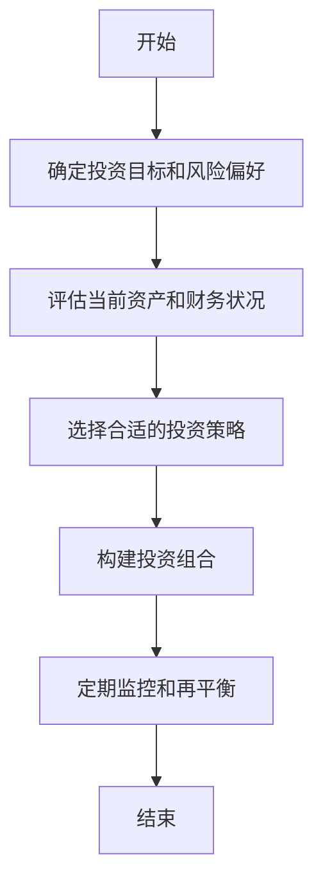
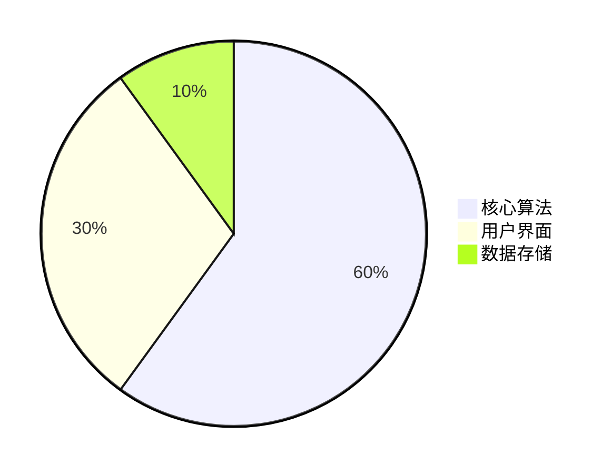

                 


# 约翰·伯格的退休投资建议：长期规划的重要性

> 关键词：退休投资、长期规划、资产配置、投资策略、约翰·伯格、复利效应、风险管理

> 摘要：本文将详细探讨约翰·伯格的退休投资理念，重点分析长期规划在退休投资中的重要性。通过数学模型、算法优化和系统架构设计，结合实际案例分析，为读者提供科学的退休投资策略和实践指导。

---

## 第一部分: 退休投资的重要性

### 第1章: 退休投资的背景与现状

#### 1.1 退休投资的重要性

- **从传统退休规划到现代投资理念的转变**
  - 传统退休规划依赖于固定收益和社保，现代投资理念强调主动管理和资产增值。
  - 长期投资的复利效应是实现财富积累的关键。

- **退休投资的核心目标与关键因素**
  - 核心目标：在退休时拥有稳定的收入来源，保障生活质量。
  - 关键因素：资产配置、风险控制、时间跨度和通货膨胀应对。

- **长期规划在退休投资中的战略意义**
  - 长期规划能够有效分散风险，平滑市场波动。
  - 通过复利效应，实现财富的可持续增长。

#### 1.2 现代退休投资的挑战

- **通货膨胀与经济波动的影响**
  - 通货膨胀会侵蚀购买力，投资收益需要跑赢通胀。
  - 经济波动可能导致投资组合短期亏损，影响长期收益。

- **寿命延长与医疗费用的变化**
  - 平均寿命延长，退休资金需要支撑更长时间的支出。
  - 医疗费用上升，增加了退休开支的不确定性。

- **社会保障体系的变革与个人责任**
  - 社会保障体系的变化可能导致未来养老金减少。
  - 个人需要承担更多责任，提前规划退休资金。

#### 1.3 约翰·伯格的投资理念

- **伯格的投资哲学与长期规划**
  - 价值投资：注重企业基本面，长期持有优质资产。
  - 分散投资：通过多样化配置降低风险。
  - 长期持有：避免频繁交易，减少费用和税务负担。

- **价值投资与分散投资的核心思想**
  - 价值投资：寻找被市场低估的优质企业，长期持有。
  - 分散投资：通过投资不同资产类别和行业，降低特定风险。

- **长期持有与复利效应的实践**
  - 复利效应：时间越长，收益增长越快。
  - 长期持有：避免短期波动影响，实现稳定增长。

---

## 第二部分: 退休投资的核心概念

### 第2章: 退休投资的规划方法

#### 2.1 退休投资规划的基本步骤

- **目标设定与需求分析**
  - 设定退休目标：明确退休年龄、期望生活水平。
  - 需求分析：估算退休后的年支出，考虑通货膨胀。

- **资产状况与风险承受能力评估**
  - 评估当前资产规模和收入来源。
  - 分析风险承受能力：根据年龄、收入稳定性等确定风险偏好。

- **投资策略的选择与制定**
  - 根据目标和风险承受能力，选择合适的投资策略。
  - 制定长期投资计划，定期评估和调整。

#### 2.2 资产配置与风险控制

- **资产配置的原理与方法**
  - 资产配置：将资金分配到不同资产类别（股票、债券、房地产等）以分散风险。
  - 方法：基于风险偏好和目标，确定各类资产的配置比例。

- **风险与收益的平衡策略**
  - 高风险高收益：适合年轻投资者或风险承受能力强的人群。
  - 低风险低收益：适合接近退休年龄的投资者。

- **不同生命周期阶段的资产分配**
  - 年轻阶段：高风险资产比例较高，追求高收益。
  - 中年阶段：平衡型资产配置，逐步降低风险。
  - 退休阶段：保守型资产配置，注重保值和稳定收益。

#### 2.3 投资组合的构建与管理

- **核心资产与卫星资产的配置**
  - 核心资产：长期持有的优质股票和债券。
  - 卫星资产：用于短期调整和风险对冲的资产，如现金和 commodities。

- **定期再平衡与动态调整**
  - 定期再平衡：根据市场变化和目标调整资产配置。
  - 动态调整：根据个人财务状况和市场环境，及时调整投资策略。

- **费用控制与税务优化**
  - 降低管理费用和交易费用，提高净收益。
  - 利用税务优惠账户（如 IRA）进行投资，降低税务负担。

---

## 第三部分: 退休投资的数学模型与算法

### 第3章: 财务模型与数学公式

#### 3.1 财务模型的构建

- **现金流贴现模型**
  - 使用现金流贴现法估算企业价值。
  - 公式：$$企业价值 = \sum_{t=1}^{n} \frac{CF_t}{(1 + r)^t}$$

- **投资回报率的计算**
  - 内部收益率（IRR）：$$IRR = r \text{ 满足 } \sum_{t=1}^{n} \frac{CF_t}{(1 + r)^t} = 0$$

- **复利计算公式**
  - 复利计算：$$A = P(1 + r)^t$$
  - 其中，A为终值，P为本金，r为年利率，t为时间。

#### 3.2 投资组合优化的数学模型

- **均值-方差优化**
  - 最优化目标：$$\min \sigma^2 \text{ 在 } \mu \text{ 固定}$$
  - 约束条件：$$\sum_{i=1}^{n} w_i = 1$$

- **Markowitz有效前沿**
  - 有效前沿：所有风险调整后收益最优的投资组合。
  - 使用均值-方差模型计算。

- **资本资产定价模型（CAPM）**
  - 公式：$$E(r_i) = r_f + \beta_i (r_m - r_f)$$

#### 3.3 算法流程图



---

## 第四部分: 系统分析与架构设计

### 第4章: 退休投资规划系统架构

#### 4.1 系统功能模块

- **用户需求分析与功能模块划分**
  - 用户模块：输入个人信息和财务状况。
  - 计算模块：计算退休需求和投资计划。
  - 报告模块：生成投资建议和财务报告。

- **系统功能流程图**

```mermaid
graph TD
    User --> Input: 输入个人信息和财务状况
    Input --> Calculator: 计算退休需求和投资计划
    Calculator --> Report: 生成投资建议和财务报告
    Report --> Output: 输出报告
```

- **模块之间的交互关系**
  - 用户输入信息到系统，系统根据算法生成投资计划，反馈给用户。

#### 4.2 系统架构设计

- **使用 Mermaid 绘制系统架构图**



- **数据流与控制流设计**
  - 数据流：用户输入 -> 计算模块 -> 输出报告。
  - 控制流：用户选择 -> 系统响应 -> 执行操作。

- **系统性能与可扩展性分析**
  - 性能：高效的算法和优化的代码。
  - 可扩展性：支持更多用户和功能扩展。

---

## 第五部分: 项目实战

### 第5章: 退休投资规划系统实现

#### 5.1 环境安装

- Python 3.8 或更高版本
- 导入必要的库：numpy、pandas、scipy

#### 5.2 核心实现源代码

```python
import numpy as np
import pandas as pd

def calculate Retirement Plan:
    # 输入参数
    age = int(input("请输入您的当前年龄："))
    retirement_age = int(input("请输入退休年龄："))
    annual_income = float(input("请输入当前年收入："))
    desired_lifestyle = float(input("请输入退休后每年所需生活费："))
    
    # 计算剩余工作年数
    working_years = retirement_age - age
    # 假设每年储蓄率
    savings_rate = 0.3  # 假设每年储蓄收入的30%
    # 计算需要的总储蓄
    total_savings_needed = desired_lifestyle * 25  # 25倍法则
    
    # 计算每年需要储蓄的金额
    annual_savings = total_savings_needed / working_years
    print(f"您需要每年储蓄：{annual_savings:.2f} 元")
    
    # 计算投资回报
    growth_rate = 0.07  # 假设年均回报率7%
    future_value = annual_savings * ((1 + growth_rate) ** working_years - 1) / growth_rate
    print(f"到退休时，您将拥有：{future_value:.2f} 元")
```

---

## 第六部分: 总结与注意事项

### 6.1 总结

- **长期规划的重要性**
  - 通过科学的资产配置和风险管理，实现退休投资的稳健增长。
  - 复利效应是长期投资的核心驱动力。

### 6.2 注意事项

- **定期评估与调整**
  - 定期检查投资组合的表现，根据市场变化和个人财务状况进行调整。
  - 避免频繁交易，减少费用和税务负担。

### 6.3 拓展阅读

- **《投资最重要的少数事》——约翰·伯格**
- **《证券分析》——本杰明·格雷厄姆**

---

作者：AI天才研究院/AI Genius Institute & 禅与计算机程序设计艺术 /Zen And The Art of Computer Programming

