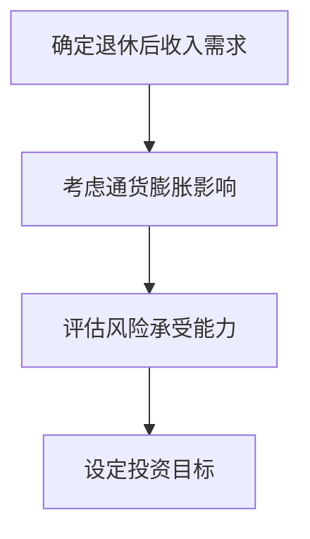
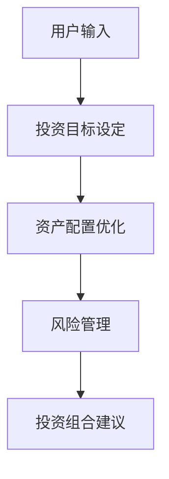

                 


# 约翰·伯格的退休投资规划方法

## 关键词：退休投资规划，指数基金，投资策略，风险管理，财务自由

## 摘要：本文详细介绍了约翰·伯格的退休投资规划方法，探讨了低成本指数基金投资策略，强调长期投资的重要性。通过系统分析和实际案例，展示了如何制定有效的退休投资计划，帮助个人实现财务自由。

---

## 第1章：背景介绍

### 1.1 问题背景与目标人群

#### 1.1.1 退休投资规划的必要性
退休投资规划是确保晚年财务安全的关键。随着寿命延长和医疗费用增加，充足的退休资金至关重要。许多人在退休后可能面临收入减少，因此及早规划至关重要。

#### 1.1.2 目标人群的特征分析
目标人群包括中高收入者、自由职业者和企业员工。这些人群通常有稳定收入，具备投资能力。退休投资规划对他们实现财务自由至关重要。

#### 1.1.3 退休投资规划的核心目标
- 确保退休后有足够的收入来源。
- 降低通货膨胀对购买力的影响。
- 实现资产保值和增值。

### 1.2 退休投资规划的基本概念与原则

#### 1.2.1 投资规划的基本框架
- 投资目标设定：明确退休后的收入需求。
- 资产配置：分散投资以降低风险。
- 风险管理：控制波动，确保资金安全。

#### 1.2.2 投资规划的核心原则
- 长期投资：避免频繁交易，降低费用。
- 分散投资：降低单一资产风险。
- 定期审视：根据市场变化调整策略。

#### 1.2.3 投资规划的边界与外延
- 投资范围：股票、债券、房地产等。
- 时间范围：从当前到退休后若干年。
- 金额范围：覆盖基本生活开支到奢侈消费。

#### 1.2.4 投资规划的概念结构与核心要素
- 投资目标：资金需求和风险承受能力。
- 资产配置：各类资产的分配比例。
- 投资策略：定投、分散投资等方法。
- 风险管理：止损机制和再平衡策略。

---

## 第2章：核心概念与联系

### 2.1 投资目标设定与资产配置

#### 2.1.1 投资目标设定
- 确定退休后的收入需求：基本生活开支、医疗费用等。
- 考虑通货膨胀：确保购买力不下降。
- 评估风险承受能力：根据年龄和收入情况。

#### 2.1.2 资产配置的核心要素
- 风险与收益：高风险资产如股票，收益高；低风险资产如债券，收益稳定。
- 资产类别：股票、债券、房地产信托基金（REITs）、现金等。
- 时间跨度：短期、中期、长期投资比例。

#### 2.1.3 资产配置的对比分析

| 资产类型 | 风险 | 收益 | 流动性 |
|----------|------|------|--------|
| 股票     | 高   | 高   | 低     |
| 债券     | 中   | 中   | 中     |
| REITs    | 中   | 中   | 高     |
| 现金     | 低   | 低   | 高     |

#### 2.1.4 目标设定的mermaid流程图



---

## 第3章：数学模型与算法原理

### 3.1 现代投资组合理论与风险控制

#### 3.1.1 投资组合理论概述
- 核心假设：资产收益符合正态分布。
- 理论基础：投资组合的风险和收益可以通过资产间的协方差矩阵来优化。

#### 3.1.2 投资组合优化模型

目标函数：最大化收益，最小化风险。

数学模型：

$$
\text{Minimize } \sigma^2 \text{ subject to } E(r) \geq r_{\text{target}}
$$

其中：
- $\sigma^2$ 是投资组合的方差（风险）。
- $E(r)$ 是投资组合的期望收益。
- $r_{\text{target}}$ 是目标收益。

#### 3.1.3 算法实现

```python
import numpy as np
import pandas as pd
from sklearn.covariance import EmpiricalCovariance

def portfolio_optimization(returns):
    cov = EmpiricalCovariance().fit(returns)
    cov_matrix = cov.covariance_
    returns_mean = returns.mean()
    
    # 使用均值-方差优化
    n = len(returns.columns)
    inv_cov = np.linalg.inv(cov_matrix)
    weights = inv_cov.dot(returns_mean) / (inv_cov.dot(returns_mean).sum())
    
    return weights
```

---

## 第4章：系统分析与架构设计

### 4.1 退休投资规划系统的构建

#### 4.1.1 系统功能设计

- 投资目标设定模块：用户输入退休需求和风险偏好。
- 资产配置优化模块：基于用户输入优化资产配置。
- 风险管理模块：监控投资组合风险，提供调整建议。

#### 4.1.2 系统架构图



---

## 第5章：项目实战

### 5.1 环境安装与配置

#### 5.1.1 Python环境安装
- 下载Python 3.8以上版本。
- 安装必要的库：pandas, numpy, matplotlib, yfinance。

#### 5.1.2 数据获取与处理
使用yfinance获取股票数据，计算收益和协方差矩阵。

```python
import yfinance as yf
import pandas as pd

# 下载数据
data = yf.download(['AAPL', 'GOOGL', 'MSFT'], start='2020-01-01', end='2023-12-31')
returns = data['Adj Close'].pct_change().dropna()
```

### 5.2 核心算法实现

#### 5.2.1 投资组合优化代码

```python
import numpy as np
import pandas as pd
from sklearn.covariance import EmpiricalCovariance

def portfolio_optimization(returns):
    cov = EmpiricalCovariance().fit(returns)
    cov_matrix = cov.covariance_
    returns_mean = returns.mean()
    
    inv_cov = np.linalg.inv(cov_matrix)
    weights = inv_cov.dot(returns_mean) / (inv_cov.dot(returns_mean).sum())
    
    return weights

# 示例
weights = portfolio_optimization(returns)
print("优化后的权重：", weights)
```

---

## 第6章：总结与展望

### 6.1 最佳实践 tips

- 定期审视和调整投资组合。
- 选择低成本的指数基金。
- 避免频繁交易和市场 timing。

### 6.2 小结

约翰·伯格的退休投资规划方法强调低成本和长期投资，通过系统化的方法实现财务自由。

### 6.3 注意事项

- 充分了解投资产品的风险。
- 定期再平衡投资组合。
- 考虑税务影响。

### 6.4 拓展阅读

- 《指数基金投资策略》
- 约翰·伯格的《投资常识》

---

## 作者：AI天才研究院/AI Genius Institute & 禅与计算机程序设计艺术 /Zen And The Art of Computer Programming

