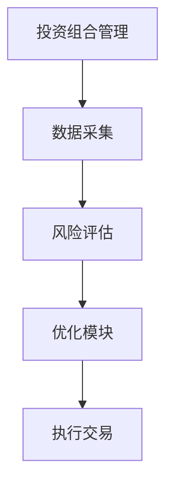
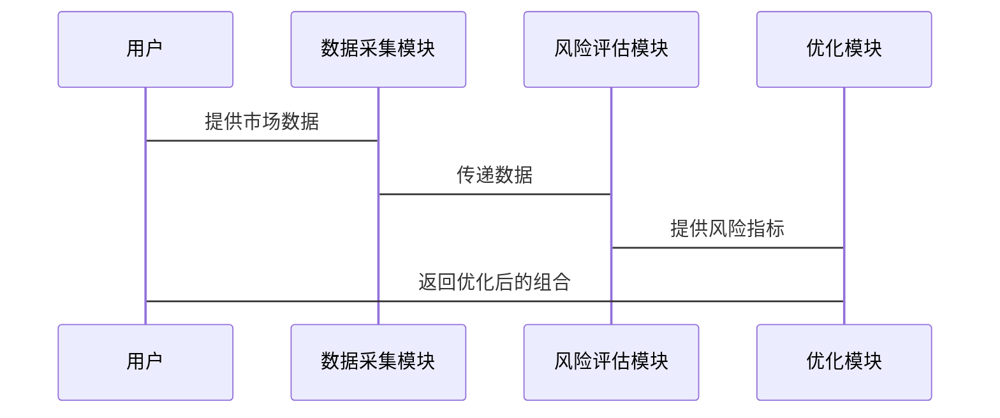

                 

# 约翰·伯格的遗产：被动投资的未来

## 关键词：被动投资，约翰·伯格，指数基金，ETF，风险管理，投资策略

## 摘要：  
本文探讨约翰·伯格对被动投资的深远影响，分析被动投资的核心概念、策略、系统架构及风险管理，结合实际案例和量化模型，展望被动投资的未来趋势。

---

# 第一部分：被动投资的背景与发展

## 第1章：约翰·伯格的遗产

### 1.1 约翰·伯格的生平与贡献

约翰·伯格（John C. Bogle）是被动投资领域的先驱，1975年创立了先锋集团（Vanguard Group），推动了指数基金的发展。他的贡献包括：
- 创立先锋集团，倡导低成本投资。
- 提出“买入并持有”的投资策略。
- 推动指数基金普及，降低投资门槛。

### 1.2 被动投资的起源与演变

被动投资起源于20世纪70年代，核心理念是复制市场指数，而非主动选股。其优势包括分散风险、低成本和长期稳定回报。被动投资在全球范围内发展迅速，尤其是在机构和个人投资者中。

---

# 第二部分：被动投资的核心概念与策略

## 第2章：被动投资的基本概念

### 2.1 被动投资的定义与特点

被动投资是指通过复制指数表现来构建投资组合，其特点包括：
- 分散风险：通过投资整个市场或指数成分股，降低个股风险。
- 低成本：管理费用低，适合长期投资。

### 2.2 被动投资与主动投资的对比

- 投资目标：被动投资追求市场平均收益，主动投资追求超越市场。
- 成本：被动投资费用低，主动投资费用高。
- 风险：被动投资风险较低，主动投资波动较大。

## 第3章：被动投资的策略与应用

### 3.1 指数基金的投资策略

指数基金通过跟踪特定指数（如标普500）构建投资组合，其优势在于分散风险和低成本。选择指数基金时需考虑跟踪误差和管理费用。

### 3.2 ETF的应用

ETF（交易所交易基金）具有灵活性和低成本，适合短期交易和多样化投资。ETF涵盖多种资产类别，如股票、债券和商品。

---

# 第三部分：被动投资的系统分析与架构设计

## 第4章：被动投资的系统分析

### 4.1 投资组合管理的系统架构

投资组合管理系统包括数据采集、风险评估和优化模块。系统架构图如下：

### 4.2 系统接口与交互设计

系统接口设计需考虑模块间交互，如数据输入、风险评估和交易执行。交互流程图如下：

---

# 第四部分：被动投资的风险管理与优化

## 第5章：被动投资的风险管理

### 5.1 市场风险与流动性风险

市场风险是被动投资的主要风险，可通过多样化投资降低。流动性风险在ETF中较低，但在某些情况下可能影响流动性。

### 5.2 风险管理策略

- 多样化投资：分散于不同资产和行业。
- 定期再平衡：调整投资组合以保持目标配置。

---

## 第五部分：被动投资的技术分析与量化投资

## 第6章：被动投资的技术分析

### 6.1 技术分析与被动投资的结合

技术分析用于辅助被动投资策略，如通过趋势指标调整投资组合。夏普比率用于评估投资组合的风险调整后收益。

### 6.2 量化投资策略

因子投资是被动投资的一种形式，通过筛选特定因子（如价值、动量）构建投资组合。数学模型用于优化投资组合。

---

## 第六部分：被动投资的未来趋势与挑战

## 第7章：被动投资的未来趋势

### 7.1 ESG投资的兴起

ESG（环境、社会、治理）投资成为趋势，被动投资需整合ESG因子。

### 7.2 智能投顾的应用

人工智能技术用于优化投资组合，提供个性化建议。

---

## 结语

被动投资凭借其低成本和稳定性，将继续在投资领域发挥重要作用。未来，随着技术进步和ESG投资的兴起，被动投资将更加多样化和智能化。

---

## 作者

作者：AI天才研究院 & 禅与计算机程序设计艺术

