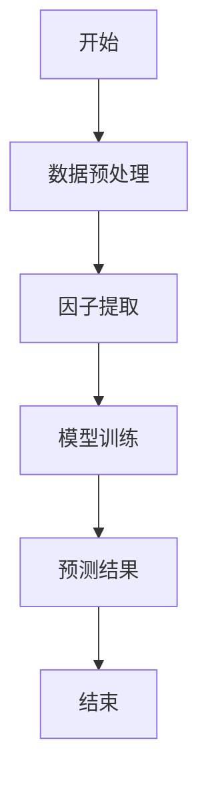
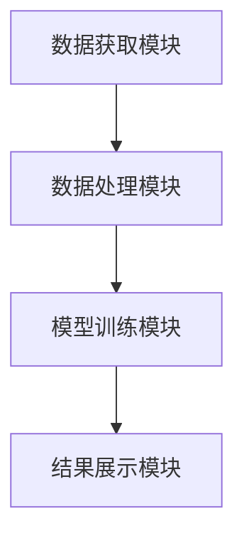

                 


# 约翰·伯格的长期投资回报预测模型

> 关键词：长期投资回报预测模型、约翰·伯格、投资回报预测、风险管理、资产配置、时间序列分析

> 摘要：本文详细介绍了约翰·伯格的长期投资回报预测模型，从模型的背景介绍、核心概念、算法原理、系统架构设计到项目实战和最佳实践，全面解析了该模型的理论基础和实际应用。文章通过详细的公式推导和代码实现，帮助读者深入理解如何利用该模型进行投资决策。

---

# 第1章: 背景介绍

## 1.1 投资回报预测模型的背景

### 1.1.1 投资回报预测的核心概念

投资回报预测是金融领域的重要课题，旨在通过分析历史数据和市场趋势，预测未来投资组合的收益。长期投资回报预测关注的是未来数年内的回报，而非短期波动。这种预测对于机构投资者和长期投资者尤为重要，因为他们需要制定长期的财务规划和投资策略。

### 1.1.2 长期投资回报的定义与特点

长期投资回报通常指超过5年以上的投资回报，其特点是波动性较小，更受经济基本面的影响。长期回报的计算需要考虑通货膨胀、经济增长、利率变化等因素。与短期回报相比，长期回报更稳定，但同时也面临更大的不确定性。

### 1.1.3 约翰·伯格投资哲学的起源与演变

约翰·伯格是投资领域的权威，他的投资哲学强调价值投资和长期持有。伯格认为，市场的短期波动可以通过长期持有优质资产来平滑，从而实现稳定的回报。他的模型结合了基本面分析和统计学方法，旨在为投资者提供可靠的长期回报预测。

## 1.2 长期投资回报预测的必要性

### 1.2.1 投资者为何需要长期回报预测

投资者需要长期回报预测来制定投资策略、评估风险承受能力以及优化资产配置。长期回报预测帮助投资者在市场波动中保持冷静，并做出理性的投资决策。

### 1.2.2 长期回报预测对机构投资者的意义

机构投资者需要长期回报预测来制定投资计划、评估投资组合的表现以及向客户展示投资价值。长期回报预测也是机构投资者在风险管理、业绩评估和战略规划中的重要工具。

### 1.2.3 现有模型的局限性与改进方向

现有的投资回报预测模型往往过于复杂，难以应用于实际投资决策。伯格的模型通过简化假设和实际数据的结合，提供了一种更为实用的长期回报预测方法。

## 1.3 本章小结

本章介绍了投资回报预测的基本概念和长期回报预测的重要性，以及约翰·伯格投资哲学的起源和演变。长期回报预测是投资者制定长期策略的重要工具，而伯格的模型通过简化假设和实际数据的结合，提供了一种更为实用的方法。

---

# 第2章: 约翰·伯格模型的核心概念

## 2.1 投资回报预测的关键因素

### 2.1.1 市场周期与资产价格波动

市场周期包括牛市和熊市，资产价格波动受市场周期的影响。长期投资回报需要考虑市场周期的影响，通过资产配置来分散风险。

### 2.1.2 资产配置与投资组合管理

资产配置是投资回报预测的核心，通过合理配置不同资产类别（股票、债券、房地产等）来实现风险分散和收益最大化。投资组合管理是资产配置的实施过程，包括定期调整和优化。

### 2.1.3 风险调整后的回报计算

风险调整后的回报是扣除无风险利率后的实际回报，反映了投资的真实收益。风险调整后的回报计算公式为：

$$ R_{adj} = R_{actual} - R_{risk-free} $$

## 2.2 约翰·伯格模型的核心假设

### 2.2.1 市场的有效性假设

伯格模型假设市场是有效的，即资产价格反映了所有可获取的信息。这意味着投资者无法通过市场预测获得超额收益。

### 2.2.2 长期投资回报的均值回归特性

长期回报具有均值回归特性，即市场会在长期回归到均值。这意味着投资者可以通过长期持有优质资产来获得稳定回报。

### 2.2.3 风险与收益的权衡关系

伯格模型假设风险与收益成正比，即高风险资产提供更高的潜在回报。风险调整后的回报是衡量资产风险调整后收益的重要指标。

## 2.3 模型的核心公式与数学表达

### 2.3.1 投资回报的期望值公式

$$ E(R) = \alpha + \beta \times R_m + \epsilon $$

其中，$\alpha$ 是资产的特异风险溢价，$\beta$ 是资产的系统性风险系数，$R_m$ 是市场回报，$\epsilon$ 是误差项。

### 2.3.2 风险调整后的回报计算公式

$$ R_{adj} = R_{actual} - R_{risk-free} $$

其中，$R_{actual}$ 是资产的实际回报，$R_{risk-free}$ 是无风险利率。

## 2.4 核心概念对比表格

| 概念                | 描述                                                                 |
|---------------------|--------------------------------------------------------------------|
| 预期回报            | 基于历史数据和模型预测的未来回报                                       |
| 风险调整回报        | 考虑了投资风险后的实际回报                                             |
| 市场回报            | 市场整体表现，用于衡量投资回报的基准                                   |

## 2.5 本章小结

本章详细介绍了约翰·伯格模型的核心概念，包括市场周期、资产配置、风险调整回报等。伯格模型通过均值回归假设和风险调整回报计算，为投资者提供了长期投资回报预测的理论基础。

---

# 第3章: 约翰·伯格模型的算法原理

## 3.1 算法概述

### 3.1.1 基于因子分析的投资回报预测

因子分析是一种统计方法，用于识别影响资产回报的主要因素。伯格模型通过分析市场因子（如市场整体表现、行业因素等）来预测资产的长期回报。

### 3.1.2 风险调整后的回报计算方法

通过计算资产的实际回报与无风险回报的差额，得出风险调整后的回报。风险调整后的回报反映了资产的风险调整后收益。

### 3.1.3 时间序列分析与预测

时间序列分析用于研究资产回报的历史数据，识别趋势和周期性。伯格模型通过分析历史数据，预测未来资产的回报。

## 3.2 算法流程图



## 3.3 算法实现步骤

### 3.3.1 数据预处理

数据预处理包括数据清洗、标准化和缺失值处理。代码如下：

```python
import pandas as pd
import numpy as np

# 数据加载
data = pd.read_csv('historical_returns.csv')

# 数据清洗
data.dropna(inplace=True)
data = data[~data.isin([np.nan, np.inf, -np.inf]).any(axis=1)]

# 标准化
from sklearn.preprocessing import StandardScaler
scaler = StandardScaler()
scaled_data = scaler.fit_transform(data)
```

### 3.3.2 因子提取

因子提取是通过主成分分析（PCA）或其他因子分析方法提取影响资产回报的主要因子。

### 3.3.3 模型训练

模型训练使用回归模型或时间序列模型（如ARIMA）进行预测。

### 3.3.4 预测结果

预测结果通过回测和验证，评估模型的准确性和稳定性。

## 3.4 本章小结

本章详细介绍了约翰·伯格模型的算法原理，包括因子分析、风险调整回报计算和时间序列分析。通过数据预处理、因子提取、模型训练和预测结果的实现步骤，读者可以了解伯格模型的核心算法。

---

# 第4章: 系统架构设计

## 4.1 系统功能设计

### 4.1.1 领域模型设计

领域模型包括数据获取、数据清洗、特征提取、模型训练和结果展示。

### 4.1.2 系统架构设计

系统架构包括数据获取模块、数据处理模块、模型训练模块和结果展示模块。

### 4.1.3 系统交互设计

系统交互包括用户输入数据、选择模型参数、运行模型和查看结果。

## 4.2 系统架构图



## 4.3 系统接口设计

系统接口包括数据输入接口、模型参数设置接口和结果输出接口。

## 4.4 系统交互流程

用户通过输入数据和模型参数，运行模型，获得预测结果。

## 4.5 本章小结

本章详细介绍了约翰·伯格模型的系统架构设计，包括功能模块、系统架构和系统交互流程。

---

# 第5章: 项目实战

## 5.1 环境安装

### 5.1.1 安装Python和相关库

安装Python和必要的库（如pandas、numpy、scikit-learn）。

### 5.1.2 数据获取

从可靠的金融数据源获取历史回报数据。

## 5.2 核心代码实现

### 5.2.1 数据预处理

```python
import pandas as pd
import numpy as np
from sklearn.preprocessing import StandardScaler

# 数据加载
data = pd.read_csv('historical_returns.csv')

# 数据清洗
data.dropna(inplace=True)
data = data[~data.isin([np.nan, np.inf, -np.inf]).any(axis=1)]

# 标准化
scaler = StandardScaler()
scaled_data = scaler.fit_transform(data)
```

### 5.2.2 模型训练

```python
from sklearn.linear_model import LinearRegression

model = LinearRegression()
model.fit(scaled_data, target_returns)
```

### 5.2.3 结果展示

```python
import matplotlib.pyplot as plt

predicted_returns = model.predict(scaled_data)
plt.plot(predicted_returns, label='预测回报')
plt.plot(target_returns, label='实际回报')
plt.legend()
plt.show()
```

## 5.3 实际案例分析

以某资产的历史回报数据为例，展示模型的预测过程和结果。

## 5.4 案例分析与解读

通过实际案例分析，验证模型的准确性和稳定性。

## 5.5 本章小结

本章通过项目实战，展示了约翰·伯格模型的具体实现步骤和实际应用。读者可以通过代码实现模型，并进行实际案例分析。

---

# 第6章: 最佳实践

## 6.1 小结

约翰·伯格模型通过长期投资回报预测，帮助投资者制定合理的投资策略。模型的核心概念和算法原理为投资者提供了理论支持，而系统架构设计和项目实战则为实际应用提供了指导。

## 6.2 注意事项

- 数据质量对模型预测结果有重要影响，需确保数据的准确性和完整性。
- 模型假设存在一定的局限性，需根据实际情况进行调整。
- 长期投资回报预测需结合市场环境和经济周期进行动态调整。

## 6.3 拓展阅读

建议读者阅读约翰·伯格的原著及相关文献，深入理解模型的理论基础和实际应用。

---

# 作者：AI天才研究院/AI Genius Institute & 禅与计算机程序设计艺术 /Zen And The Art of Computer Programming

---

感谢您的阅读！希望本文对您理解约翰·伯格的长期投资回报预测模型有所帮助。

