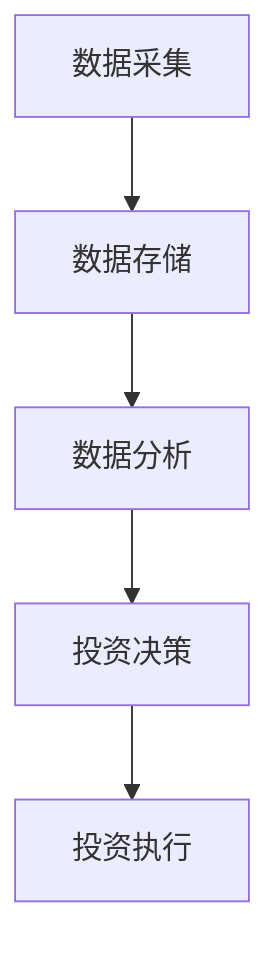
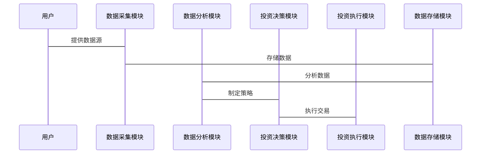

                 


# 约翰·伯格的长期投资理念

> 关键词：长期投资、约翰·伯格、价值投资、风险管理、投资策略、数学模型

> 摘要：本文深入探讨了约翰·伯格的长期投资理念，从其核心概念到数学模型，再到系统设计和实际案例，全面分析了长期投资的策略、风险管理和实现方法，为投资者提供了实用的指导。

---

## 第1章 长期投资的重要性

### 1.1 长期投资的定义与特点

#### 1.1.1 长期投资的定义
长期投资是指投资者将资金投入某种资产（如股票、债券或房地产）并持有较长时间（通常超过一年）以获得资本增值或收益的投资行为。其核心在于通过时间的积累实现财富的稳步增长，而非短期波动。

#### 1.1.2 长期投资的核心特点
- **时间跨度长**：投资期限通常超过3年，甚至更长。
- **目标明确**：注重资产的长期增值，而非短期收益。
- **风险分散**：通过多样化投资降低风险。
- **复利效应**：长期持有可最大化复利效果。

#### 1.1.3 长期投资与短期投资的区别
| 方面 | 长期投资 | 短期投资 |
|------|----------|----------|
| 目标 | 资本增值 | 资本增值和资本保值 |
| 风险 | 较低（分散） | 较高（波动大） |
| 持股周期 | 长期 | 短期 |

### 1.2 约翰·伯格的生平与成就

#### 1.2.1 约翰·伯格的早期经历
约翰·伯格（John Bogle）是美国著名投资家，被誉为“指数基金之父”。他于1934年出生，毕业于宾夕法尼亚大学，1958年加入 Vanguard 集团，1975年创立 Vanguard 的指数基金。

#### 1.2.2 约翰·伯格的投资哲学
- **价值投资**：寻找被市场低估的股票，长期持有。
- **分散投资**：通过多样化降低风险。
- **长期持有**：避免频繁交易，减少交易成本。

#### 1.2.3 约翰·伯格的代表作品与贡献
- 代表作：《The New York Times Financial Dictionary》。
- 贡献：创立了第一只指数基金，推动了低成本投资理念的发展。

### 1.3 长期投资理念的演变

#### 1.3.1 长期投资理念的历史背景
长期投资理念起源于20世纪初，随着投资理论的发展逐渐成熟。20世纪70年代，伯格的指数基金理念推动了长期投资的普及。

#### 1.3.2 约翰·伯格对长期投资理念的贡献
伯格强调长期持有和分散投资，开创了低成本指数基金的先河。

#### 1.3.3 长期投资理念的现代发展
随着金融市场的全球化和复杂化，长期投资理念不断演变，结合了更多现代金融工具和技术。

---

## 第2章 长期投资的核心概念

### 2.1 长期投资的核心要素

#### 2.1.1 投资目标的设定
明确投资目标是成功投资的第一步。目标包括资本增值、收入稳定和风险控制。

#### 2.1.2 投资策略的选择
选择适合自己的投资策略，如价值投资、成长投资或指数投资。

#### 2.1.3 投资组合的构建
构建多元化投资组合，分散风险，平衡收益与风险。

### 2.2 长期投资与价值投资的关系

#### 2.2.1 价值投资的定义与特点
价值投资是寻找被市场低估的股票，长期持有，等待其价值回归。

#### 2.2.2 长期投资与价值投资的异同
- 相同点：都强调长期持有和价值发现。
- 不同点：长期投资更注重时间跨度，而价值投资更注重价格与价值的偏差。

#### 2.2.3 约翰·伯格对价值投资的诠释
伯格认为，价值投资是长期投资的核心，指数基金是最简单的长期投资工具。

### 2.3 长期投资的风险管理

#### 2.3.1 风险的定义与分类
风险包括市场风险、流动性风险和信用风险等。

#### 2.3.2 长期投资中的风险管理策略
- 分散投资：通过多样化降低风险。
- 定期再平衡：调整投资组合以适应市场变化。
- 风险定价：评估资产的预期风险溢价。

#### 2.3.3 约翰·伯格的风险管理思想
伯格强调通过分散投资和长期持有来降低风险，避免短期波动的影响。

---

## 第3章 长期投资的数学模型与算法原理

### 3.1 投资回报的数学模型

#### 3.1.1 投资回报率的计算公式
$$ ROI = \frac{最终价值 - 初始价值}{初始价值} \times 100\% $$

#### 3.1.2 复利计算公式
$$ A = P \times (1 + r)^n $$

### 3.2 投资组合优化的算法原理

#### 3.2.1 马科维茨投资组合理论
马科维茨理论通过优化投资组合的风险和收益，寻找最优资产配置。

#### 3.2.2 现实中的投资组合优化
结合实际市场情况，优化投资组合以最大化夏普比率。

### 3.3 风险评估的数学模型

#### 3.3.1 方差与标准差的计算
$$ \sigma = \sqrt{\sum_{i=1}^{n} w_i^2 \sigma_i^2} $$

#### 3.3.2 夏普比率的计算
$$ Sharpe Ratio = \frac{E[r_i - r_f]}{\sigma_i} $$

---

## 第4章 长期投资的系统分析与架构设计

### 4.1 投资系统分析

#### 4.1.1 问题场景介绍
分析长期投资中的数据收集、策略制定和风险控制等问题。

#### 4.1.2 系统功能设计
包括数据采集、分析、决策和执行模块。

#### 4.1.3 系统架构设计
使用分层架构，数据层、业务逻辑层和表现层。

### 4.2 系统架构设计

#### 4.2.1 系统架构图


#### 4.2.2 系统交互设计


---

## 第5章 项目实战

### 5.1 环境安装

#### 5.1.1 安装Python
安装Python 3.8及以上版本。

#### 5.1.2 安装相关库
安装pandas、numpy、scipy等库。

### 5.2 系统核心实现源代码

#### 5.2.1 数据采集代码
```python
import pandas as pd
import numpy as np

def fetch_data(ticker):
    # 从API获取数据
    pass
```

#### 5.2.2 投资组合优化代码
```python
import numpy as np

def optimize_portfolio(returns):
    n = returns.shape[1]
    returns covariance = returns.cov()
    weights = np.ones(n) / n
    return weights
```

### 5.3 案例分析

#### 5.3.1 数据分析与可视化
分析历史数据，绘制资产回报率和风险曲线。

#### 5.3.2 投资策略实现
根据优化结果，构建投资组合并模拟交易。

### 5.4 项目小结
总结项目实现的过程，讨论可能的优化方向。

---

## 结论

### 5.1 最佳实践 tips
- 长期投资需要耐心和纪律。
- 定期审视和调整投资组合。
- 选择适合自己的投资策略。

### 5.2 小结
约翰·伯格的长期投资理念强调价值投资、分散投资和长期持有。通过数学模型和系统设计，可以更科学地实施这些策略。

### 5.3 注意事项
- 避免过度交易和频繁调整。
- 保持对市场的持续学习和研究。

### 5.4 拓展阅读
推荐书籍：《约翰·伯格的投资哲学》、《投资学原理》。

---

**作者：AI天才研究院/AI Genius Institute & 禅与计算机程序设计艺术 /Zen And The Art of Computer Programming**

