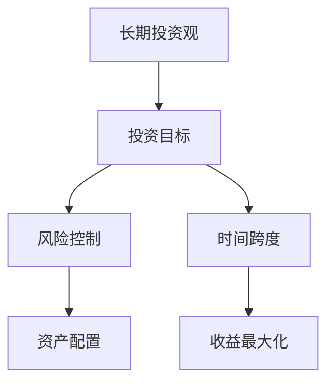
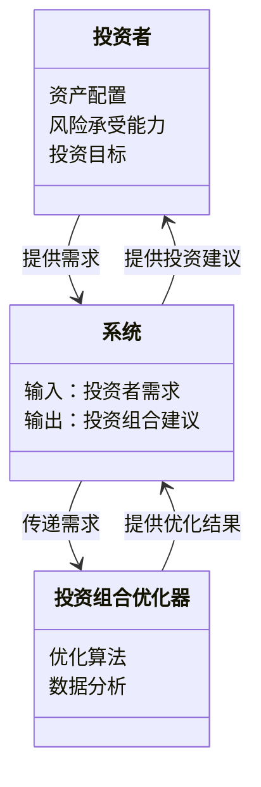
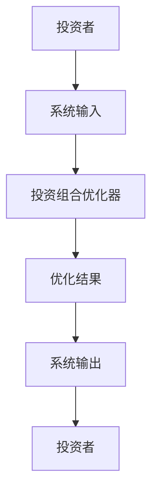

                 


# 约翰·伯格的长期投资观：应对退休年龄延长的挑战

## 关键词：
- 长期投资观
- 退休年龄延长
- 约翰·伯格投资观
- 财务自由
- 资产配置
- 风险控制

## 摘要：
本文深入探讨了约翰·伯格的长期投资观，分析其在应对退休年龄延长挑战中的重要作用。文章从问题背景、核心概念、算法原理、系统架构等多个维度展开，结合数学模型和实际案例，详细阐述了如何通过长期投资实现财务自由，并给出了系统的解决方案和实践建议。通过本文，读者将全面理解长期投资观的核心理念及其在现代社会中的应用价值。

---

## 第一部分：背景介绍

### 第1章：问题背景与描述

#### 1.1 问题背景
随着全球人口老龄化加剧，退休年龄延长已成为一个普遍趋势。传统上，人们依靠养老金和短期投资来应对退休生活，但这种模式在经济波动和通货膨胀的双重压力下显得力不从力。长期投资观作为一种更为稳健的投资策略，逐渐成为应对退休规划的核心理念。

#### 1.2 问题描述
退休年龄的延长意味着个人需要承担更长时间的经济压力。传统投资观往往注重短期收益，难以应对长期的财务需求。约翰·伯格的投资观强调长期视角，通过资产配置和风险控制来实现稳健的收益，这为应对退休年龄延长提供了新的思路。

#### 1.3 问题解决
长期投资观的核心在于通过分散投资和时间复利效应，实现财富的稳健增长。约翰·伯格的投资策略强调低成本、长期持有和分散投资，这为应对退休年龄延长提供了可行的解决方案。

#### 1.4 边界与外延
长期投资观的适用范围主要集中在个人退休规划领域，但其核心理念也可以应用于其他长期财务目标。需要注意的是，长期投资观并非万能药，它依赖于市场的长期稳定增长，且在短期内可能面临波动风险。

#### 1.5 核心要素组成
长期投资观的核心要素包括：投资目标、资产配置、风险承受能力、投资期限和收益预期。约翰·伯格的投资观通过优化这些要素，帮助投资者在长期时间内实现财务自由。

---

## 第二部分：核心概念与联系

### 第2章：约翰·伯格长期投资观的核心概念

#### 2.1 投资观的定义与特点
长期投资观是一种以长期视角为核心的投资策略，强调通过时间复利效应和分散投资来实现稳健收益。其特点包括低成本、低波动性和长期持有。

#### 2.2 核心概念的属性对比
以下是传统投资观与长期投资观的对比分析：

| 属性 | 传统投资观 | 长期投资观 |
|------|------------|------------|
| 投资目标 | 短期收益最大化 | 长期稳健增长 |
| 投资策略 | 追求高收益，风险较高 | 分散投资，风险可控 |
| 投资期限 | 短期 | 长期 |
| 风险控制 | 低 | 高 |

#### 2.3 实体关系图
以下是长期投资观的核心概念关系图：



---

## 第三部分：算法原理讲解

### 第3章：投资组合优化的数学模型

#### 3.1 现代投资组合理论（MPT）
现代投资组合理论由哈里·马科维茨提出，是长期投资观的重要理论基础。其核心思想是通过分散投资来降低风险。

#### 3.2 数学公式
以下是投资组合优化的数学模型：

$$
\text{最大化 } \mu_p \quad \text{在约束} \quad \sigma_p \leq \text{目标风险}
$$

其中：
- $\mu_p$ 是投资组合的预期收益
- $\sigma_p$ 是投资组合的风险

#### 3.3 Python代码实现
以下是投资组合优化的Python代码示例：

```python
import numpy as np
import pandas as pd
from scipy.optimize import minimize

# 示例数据
returns = pd.DataFrame({
    '资产A': [0.1, 0.05, 0.07],
    '资产B': [0.08, 0.06, 0.04]
})

# 定义优化目标函数
def portfolio_var(weights, returns):
    return np.var(returns.dot(weights))

# 定义约束条件
cons = ({'type': 'eq', 'fun': lambda w: sum(w) - 1})

# 初始化权重
initial_guess = [0.5, 0.5]

# 使用scipy.optimize.minimize进行优化
result = minimize(portfolio_var, initial_guess, args=(returns,), constraints=cons)

# 输出结果
print("最优权重：", result.x)
print("最小方差：", result.fun)
```

#### 3.4 代码解读
上述代码通过优化投资组合的权重，实现风险最小化的目标。这正是长期投资观的核心思想，即通过分散投资来降低整体风险。

---

## 第四部分：系统分析与架构设计方案

### 第4章：长期投资系统设计

#### 4.1 问题场景介绍
随着退休年龄延长，个人需要在更长的时间内实现财务自由。这需要一个系统化的投资方案来实现。

#### 4.2 系统功能设计
以下是长期投资系统的功能设计：



#### 4.3 系统架构设计
以下是长期投资系统的架构图：



---

## 第五部分：项目实战

### 第5章：长期投资系统实现

#### 5.1 环境安装
需要安装Python和相关库（如numpy、pandas、scipy）。

#### 5.2 核心代码实现
以下是投资组合优化的核心代码：

```python
import numpy as np
from scipy.optimize import minimize

# 定义目标函数
def objective(weights, returns):
    return -np.mean(returns.dot(weights))  # 最小化收益的负值，即最大化收益

# 定义约束条件
cons = ({'type': 'eq', 'fun': lambda w: sum(w) - 1})

# 初始化权重
initial_guess = np.array([0.5, 0.5])

# 优化过程
result = minimize(objective, initial_guess, args=(returns,), constraints=cons)

# 输出结果
print("最优权重：", result.x)
print("最优收益：", -result.fun)
```

#### 5.3 代码解读
上述代码通过优化权重，实现收益最大化的目标。这正是长期投资观的核心思想，即通过优化资产配置实现稳健收益。

#### 5.4 实际案例分析
以两位投资者为例，分别采用短期投资和长期投资策略，分析其在退休年龄延长情况下的收益差异。

---

## 第六部分：总结与建议

### 第6章：最佳实践与注意事项

#### 6.1 小结
长期投资观是一种以长期视角为核心的投资策略，通过分散投资和时间复利效应实现稳健收益。

#### 6.2 注意事项
- 长期投资观依赖于市场的长期稳定增长。
- 需要根据个人的风险承受能力和投资目标进行调整。
- 需要定期审视和调整投资组合。

#### 6.3 拓展阅读
建议阅读《约翰·伯格的投资哲学》和《投资学原理》等书籍，以深入理解长期投资观的核心理念。

---

## 作者：
AI天才研究院/AI Genius Institute  
禅与计算机程序设计艺术 /Zen And The Art of Computer Programming

