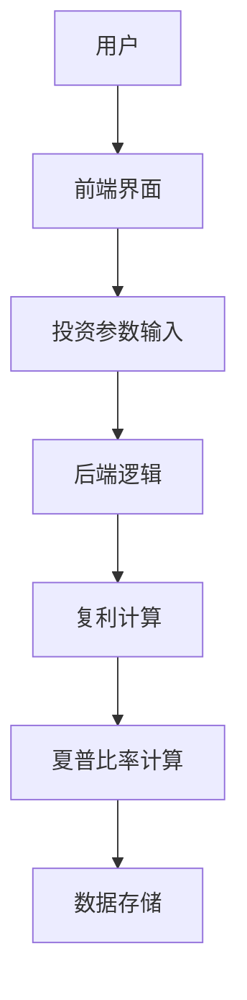

                 


# 约翰·伯格的长期投资观：时间是你的朋友

---

## 关键词：长期投资，约翰·伯格，时间价值，复利，风险管理，价值投资

---

## 摘要：  
约翰·伯格是投资领域的重要人物，他的长期投资理念强调时间的价值和复利的力量。本文从长期投资的基本原理、伯格的投资哲学、数学模型、风险管理、系统分析等方面展开，结合实际案例和系统架构，帮助读者全面理解并应用伯格的长期投资观。

---

## 第一部分: 长期投资的背景与基础

### 第1章: 长期投资的核心概念

#### 1.1 投资的基本原理  
投资是通过将资金投入到特定资产中，期望在未来获得超过初始投入的回报。长期投资强调持有资产的时间较长，旨在利用复利效应实现财富增长。  

**核心概念：**  
- **本金（Principal）**：初始投入的资金。  
- **收益（Return）**：投资的回报，包括资本增值和利息收入。  
- **复利（Compound Interest）**：将投资收益再投资，产生更多收益的过程。  

#### 1.2 约翰·伯格的投资哲学  
约翰·伯格是指数基金的倡导者，他主张通过长期持有低成本指数基金实现财富增长。他的投资理念基于价值投资和分散投资的原则。  

**关键点：**  
- **价值投资**：买入低于内在价值的资产，长期持有。  
- **分散投资**：通过投资多种资产降低风险。  
- **低成本投资**：选择管理费用低的投资工具，最大化收益。  

---

### 第2章: 长期投资的数学模型与公式

#### 2.1 复利的数学模型  
复利是长期投资的核心，其公式为：  
$$A = P(1 + r)^n$$  
其中，  
- \(P\) 是初始本金，  
- \(r\) 是年化收益率，  
- \(n\) 是投资年数，  
- \(A\) 是最终金额。  

**示例：**  
假设初始投入1万元，年化收益率为8%，投资30年，最终金额为：  
$$A = 10000(1 + 0.08)^{30} ≈ 10000 \times 7.189 = 71890$$  

#### 2.2 投资组合的优化模型  
马科维茨的投资组合理论通过优化资产配置降低风险。  
**夏普比率公式：**  
$$\text{夏普比率} = \frac{E[r_i - r_f]}{\sigma_i}$$  
其中，  
- \(E[r_i]\) 是投资组合的预期收益，  
- \(r_f\) 是无风险利率，  
- \(\sigma_i\) 是投资组合的收益标准差。  

---

## 第三部分: 长期投资的策略与实践

### 第5章: 投资风险管理

#### 5.2 风险管理的具体措施  
- **分散投资**：通过投资不同资产降低风险。  
- **定期复盘**：评估投资组合的表现并进行调整。  
- **风险管理模型**：使用VaR（在险价值）评估潜在损失。  

---

## 第四部分: 项目实战与系统分析

### 第6章: 投资系统的构建与实现

#### 6.2 系统架构设计  
- **前端界面**：用户输入投资参数。  
- **后端逻辑**：计算复利和夏普比率。  
- **数据存储**：保存投资数据。  

**系统架构图：**  


#### 6.3 投资组合优化代码  
```python
def compound_interest(principal, rate, years):
    return principal * (1 + rate) ** years

def sharpe_ratio(expected_return, risk_free_rate, std_deviation):
    return (expected_return - risk_free_rate) / std_deviation

# 示例
principal = 10000
rate = 0.08
years = 30
print(compound_interest(principal, rate, years))  # 输出：71890
```

---

## 第五部分: 心理因素与未来展望

### 第7章: 长期投资的心理因素

#### 7.1 投资中的心理误区  
- **贪婪与恐惧**：避免追涨杀跌。  
- **过度自信**：定期复盘和调整。  

---

## 第六部分: 未来展望

### 第8章: 长期投资的未来趋势

#### 8.1 技术的影响  
- **量化投资**：利用算法优化投资组合。  
- **人工智能**：预测市场趋势。  

---

## 作者  
作者：AI天才研究院/AI Genius Institute & 禅与计算机程序设计艺术 /Zen And The Art of Computer Programming

