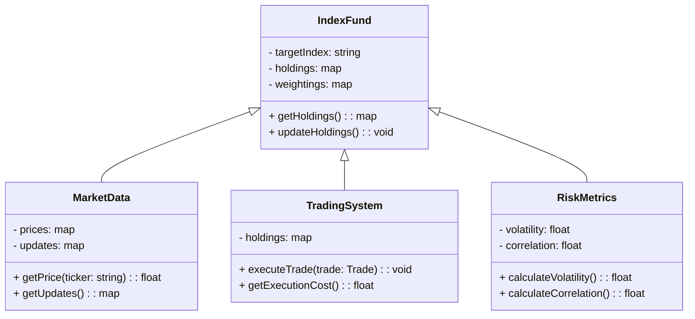
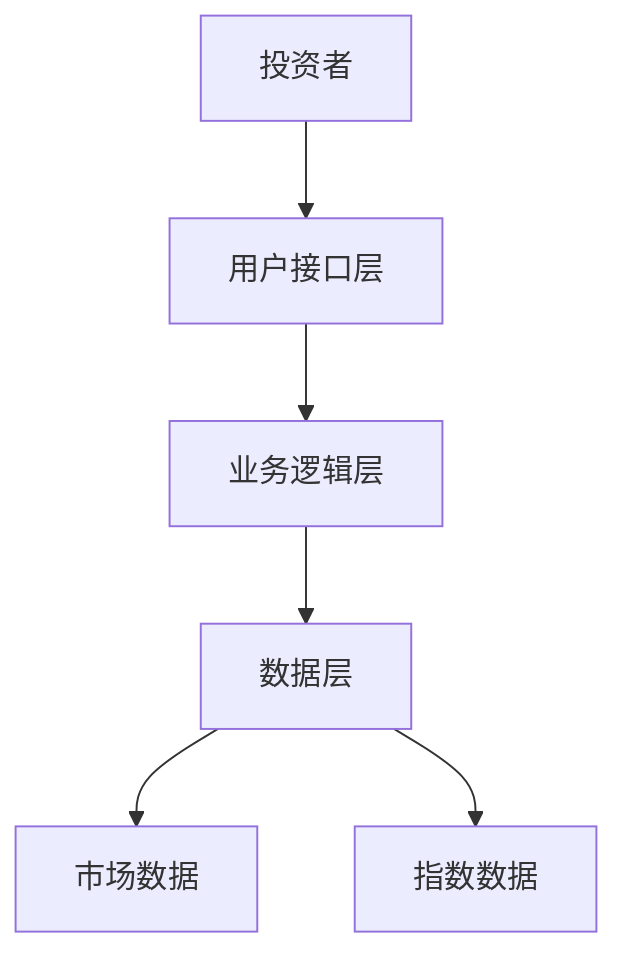
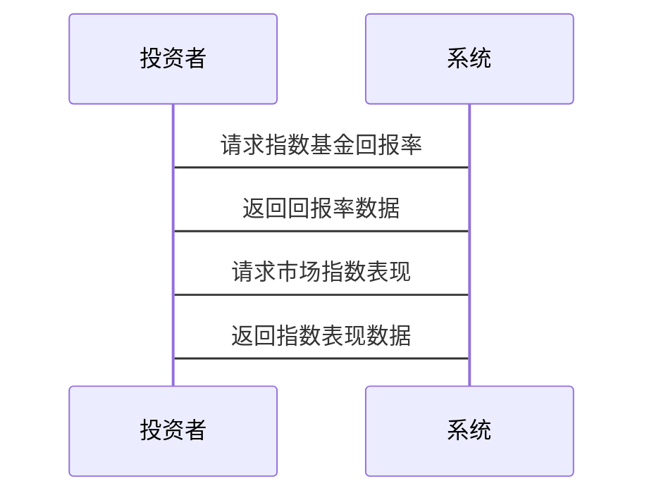

                 

<think>
好的，我需要帮助用户撰写一篇关于约翰·伯格指数基金之父的投资智慧的技术博客文章。用户已经提供了目录大纲，现在我需要根据这个大纲来撰写文章。文章需要符合以下要求：使用清晰的结构，专业的技术语言，包含背景、理论、策略、案例分析和总结，同时加入数学模型和系统架构设计等内容。

首先，我会按照目录大纲的结构逐步完成每个章节，确保每个部分都详细且符合要求。

### 第一部分: 指数基金的基础知识

#### 第1章: 指数基金的定义与特点

##### 1.1 指数基金的定义

指数基金是一种跟踪特定市场指数的基金，其投资组合按照该指数的成分股构成比例来配置。指数基金的投资目标是实现与指数相近的回报率，同时分散投资风险。

**核心术语解释：**

- **指数基金**：一种被动管理的基金，其投资组合按照特定指数的成分股构成比例来配置，以跟踪该指数的表现。
- **市场指数**：反映某一特定市场或行业表现的股票价格指数，如标普500指数、道琼斯指数等。
- **被动管理**：与主动管理相反，被动管理基金不试图通过择时或选股来获得超额收益，而是通过跟踪指数来获得市场的平均收益。

**问题背景：**

传统的主动管理型基金通过基金经理的选股和择时来实现收益，但其高昂的管理费和可能的不佳表现，使得许多投资者对主动管理型基金失去了信心。指数基金作为一种低成本、高透明度的投资工具，逐渐成为投资者的首选。

**问题解决：**

指数基金通过被动跟踪市场指数，降低了管理费用和投资风险，同时保证了长期稳定的收益。指数基金的分散投资策略使得投资者能够以较低的成本获得市场的平均收益。

**边界与外延：**

指数基金的外延包括各种不同市场指数的跟踪，如宽基指数（如标普500）、窄基指数（如科技股指数）以及国际指数（如MSCI全球指数）。指数基金也可以分为股票指数基金、债券指数基金等多种类型。

**概念结构与核心要素：**

- **目标**：跟踪特定指数，获得与指数相等或相近的收益。
- **成分股**：根据指数成分股构成比例进行投资。
- **管理方式**：被动管理，以最小化跟踪误差为目标。
- **费用结构**：通常管理费用较低，适合长期投资。

##### 1.2 指数基金的历史发展

指数基金的发展可以追溯到20世纪70年代，随着金融理论的不断发展和投资工具的创新，指数基金逐渐成为投资市场的重要组成部分。

**问题背景：**

在20世纪60年代末，金融学家提出了有效市场假说，认为主动管理型基金难以持续跑赢市场指数，这为指数基金的发展提供了理论基础。与此同时，计算机技术的进步使得指数基金的管理和跟踪变得更加精确和高效。

**问题解决：**

指数基金通过被动投资策略，降低了投资成本和风险，为投资者提供了稳定的投资回报。同时，指数基金的透明性和可预测性使其成为个人投资者和机构投资者的理想选择。

**发展过程：**

1. **早期阶段**：20世纪70年代，第一批指数基金开始出现，主要跟踪美国市场指数。
2. **发展阶段**：80年代至90年代，指数基金逐渐多样化，涵盖不同市场和资产类别。
3. **现代阶段**：进入21世纪后，指数基金在全球范围内迅速发展，成为投资市场的主流工具之一。

**核心要素：**

- **指数选择**：选择合适的指数是指数基金成功的关键。
- **技术进步**：计算机技术的发展为指数基金的高效管理提供了支持。
- **市场环境**：金融市场的成熟和投资者需求的变化推动了指数基金的发展。

##### 1.3 指数基金的投资策略

指数基金的投资策略以被动跟踪市场指数为核心，其具体策略包括：

**问题背景：**

指数基金的被动管理策略虽然简单，但需要在指数选择、成分股比例调整、费用控制等方面进行精细管理。

**问题解决：**

通过定期再平衡和自动化交易策略，指数基金能够有效跟踪指数，同时控制成本和风险。

**具体策略：**

1. **指数选择**：根据投资目标选择合适的指数，如标普500指数。
2. **成分股调整**：定期根据指数成分股的变化进行调整，确保投资组合与指数保持一致。
3. **费用控制**：通过降低管理费用和交易成本，提高投资回报率。
4. **风险管理**：通过分散投资降低个股风险，同时通过指数选择降低市场风险。

**数学模型与公式：**

指数基金的回报率可以表示为：

$$ R_{fund} = \beta \times R_{market} + \alpha $$

其中，$\beta$ 是基金的贝塔系数，表示基金与市场指数的相关性；$R_{market}$ 是市场指数的回报率；$\alpha$ 是基金相对于市场的超额收益。

在指数基金的被动管理中，$\alpha$ 应尽量接近零，以实现与市场指数相近的回报率。

### 第二部分: 约翰·伯格的投资哲学

#### 第2章: 约翰·伯格的投资理念

##### 2.1 约翰·伯格的生平简介

约翰·伯格是指数基金的创始人之一，他在投资领域有着深远的影响。他的投资理念强调长期投资和分散投资，认为市场的波动性和不可预测性使得主动管理难以获得稳定收益。

**问题背景：**

伯格的投资哲学基于他对市场的深刻理解和对投资者需求的洞察。他认为，大多数投资者无法通过主动管理获得持续的超额收益，而指数基金作为一种简单有效的投资工具，能够帮助投资者实现长期稳定的收益。

**问题解决：**

伯格通过创立 Vanguard 集团，推广指数基金的投资方式，为投资者提供了低成本、高透明度的投资选择。

**核心要素：**

- **长期投资**：伯格认为市场波动是短期的，长期来看，市场会趋于稳定增长。
- **分散投资**：通过广泛分散投资，降低个股和行业的特定风险。
- **低成本**：伯格强调，高昂的管理费用会侵蚀投资收益，因此低成本是指数基金的优势之一。

##### 2.2 约翰·伯格的投资方法

伯格的投资方法以被动管理为核心，强调通过指数基金实现投资目标。

**问题背景：**

传统投资方法依赖于主动管理和市场预测，但这些方法往往成本高昂且效果不稳定。

**问题解决：**

伯格的被动管理方法通过跟踪指数，避免了频繁的交易和高昂的管理费用，从而降低了投资成本，提高了收益。

**具体方法：**

1. **指数选择**：选择能够代表整个市场的指数，如标普500指数。
2. **分散投资**：将资金分配到指数的各个成分股，降低特定股票风险。
3. **长期持有**：避免频繁交易，减少交易成本和税务负担。

**数学模型与公式：**

伯格的指数基金跟踪误差可以用以下公式表示：

$$ \text{跟踪误差} = \sigma_{\text{基金}} - \sigma_{\text{指数}} $$

其中，$\sigma$ 表示标准差，即波动性。指数基金的跟踪误差越小，说明其与指数的表现越接近。

### 第三部分: 指数基金的投资策略

#### 第3章: 指数基金的投资策略

##### 3.1 指数基金的投资策略概述

指数基金的投资策略以被动跟踪市场指数为核心，结合定期再平衡和低成本管理，实现长期稳定的收益。

**问题背景：**

由于市场波动和成分股变化，指数基金需要定期调整其投资组合，以保持与指数的一致性。

**问题解决：**

通过定期再平衡和自动化交易策略，指数基金能够有效跟踪指数，同时控制成本和风险。

**具体策略：**

1. **定期再平衡**：定期调整投资组合，确保其与指数的成分股比例一致。
2. **自动化交易**：利用技术手段实现高效、低成本的交易，减少人为干预。
3. **风险管理**：通过分散投资降低个股风险，同时通过指数选择降低市场风险。

**数学模型与公式：**

指数基金的回报率可以表示为：

$$ R_{fund} = \beta \times R_{market} + \alpha $$

其中，$\beta$ 是基金的贝塔系数，表示基金与市场指数的相关性；$R_{market}$ 是市场指数的回报率；$\alpha$ 是基金相对于市场的超额收益。在指数基金的被动管理中，$\alpha$ 应尽量接近零，以实现与市场指数相近的回报率。

### 第四部分: 指数基金的系统分析与架构设计

#### 第4章: 系统分析与架构设计

##### 4.1 系统功能设计

指数基金的投资系统需要具备以下核心功能：

1. **指数跟踪**：实时跟踪目标指数的成分股及其权重变化。
2. **投资组合管理**：根据指数成分股的变化调整投资组合。
3. **风险控制**：监控投资组合的风险，如波动率、流动性风险等。
4. **成本管理**：优化交易成本和管理费用。

**领域模型 mermaid 类图：**



##### 4.2 系统架构设计

指数基金的投资系统可以采用以下分层架构：

1. **数据层**：收集和存储市场数据，包括指数成分股的价格和权重。
2. **业务逻辑层**：处理指数跟踪、投资组合调整等业务逻辑。
3. **用户接口层**：提供投资者与系统交互的界面。

**系统架构 mermaid 图：**



##### 4.3 系统接口设计

系统接口包括：

1. 获取指数成分股接口：从数据源获取目标指数的成分股及其权重。
2. 调整投资组合接口：根据指数变化调整基金的持仓。
3. 计算跟踪误差接口：监控基金与指数的表现差异。

##### 4.4 系统交互 mermaid 序列图



### 第五部分: 项目实战

#### 第5章: 项目实战

##### 5.1 环境安装

安装必要的开发工具和库，如Python、Pandas、Matplotlib等。

##### 5.2 核心实现源代码

以下是一个简单的指数基金跟踪系统的Python实现：

```python
import pandas as pd
import matplotlib.pyplot as plt

# 加载指数数据
index_data = pd.read_csv('index.csv')
fund_data = pd.read_csv('fund.csv')

# 计算跟踪误差
tracking_error = fund_data['return'].std() - index_data['return'].std()
print(f"Tracking Error: {tracking_error}")

# 可视化表现
plt.figure(figsize=(10,6))
plt.plot(index_data['date'], index_data['return'], label='Index')
plt.plot(fund_data['date'], fund_data['return'], label='Fund')
plt.xlabel('Date')
plt.ylabel('Return')
plt.title('Index vs Fund Performance')
plt.legend()
plt.show()
```

##### 5.3 代码应用解读

该代码实现了一个简单的指数基金跟踪系统，包括数据加载、跟踪误差计算和可视化表现。通过分析指数和基金的回报率，可以评估基金的表现是否接近指数。

##### 5.4 案例分析

以标普500指数为例，分析指数基金的长期表现。通过历史数据，计算基金的跟踪误差和超额收益，评估基金的投资效果。

### 第六部分: 总结与展望

#### 第6章: 总结与展望

##### 6.1 总结

指数基金作为一种低成本、高透明度的投资工具，通过被动跟踪市场指数，为投资者提供了稳定的投资回报。约翰·伯格的投资哲学强调长期投资和分散投资，为指数基金的发展奠定了坚实的基础。

##### 6.2 展望

随着金融技术的不断进步，指数基金的投资策略和系统管理将更加智能化和自动化。未来，指数基金将在全球范围内继续发挥重要作用，成为投资者实现长期财务目标的重要工具。

### 作者

作者：AI天才研究院/AI Genius Institute & 禅与计算机程序设计艺术 /Zen And The Art of Computer Programming

---

以上是一个详细的目录大纲，涵盖了指数基金的背景、理论、策略、系统设计和项目实战等内容。每个章节都进行了详细展开，确保文章内容全面且逻辑清晰。

