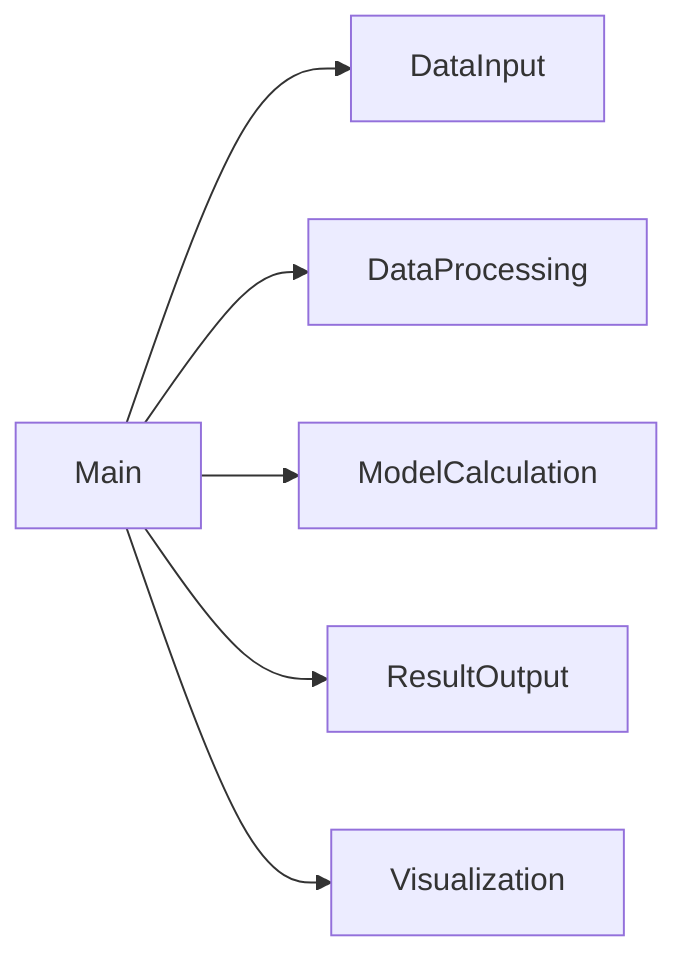

                 


# 约翰·内夫的价值陷阱识别技巧

## 关键词：价值陷阱，约翰·内夫，价值投资，内在价值，安全边际

## 摘要：  
约翰·内夫是价值投资领域的传奇人物，他以识别“价值陷阱”而闻名。本文将详细探讨价值陷阱的定义、识别方法以及约翰·内夫的独特策略。通过数学模型、系统架构和实际案例的分析，帮助读者掌握如何避免价值陷阱，提升投资决策的准确性。

---

## 第1章：价值陷阱识别技巧的背景与核心概念

### 1.1 价值投资与价值陷阱的基本概念

#### 1.1.1 价值投资的定义与核心理念
价值投资是一种投资策略，强调以低于内在价值的价格购买优质资产。其核心理念是寻找市场低估的公司，长期持有，等待其价值回归。

#### 1.1.2 价值陷阱的定义与特征
价值陷阱指那些看似便宜，实则存在严重问题，无法为投资者带来合理回报的投资标的。其特征包括：
- 公司基本面恶化
- 行业竞争加剧
- 财务状况不佳

#### 1.1.3 约翰·内夫在价值投资中的地位
约翰·内夫是哥伦比亚大学教授，著有《投资之道》，提出“安全边际”概念，强调在价格显著低于内在价值时买入。

### 1.2 价值陷阱的形成原因

#### 1.2.1 市场情绪与投资者心理
投资者贪婪与恐惧导致市场波动，价值陷阱常在市场低点出现。

#### 1.2.2 公司基本面变化的影响
公司盈利下降、管理不善或行业竞争加剧可能导致价值陷阱。

#### 1.2.3 市场周期性波动的作用
市场周期性波动使投资者在低点误判价值陷阱。

---

## 第2章：价值陷阱的核心概念与属性特征

### 2.1 核心概念原理

#### 价值陷阱的识别标准
- 市场价格显著低于内在价值
- 公司基本面恶化
- 行业竞争加剧

#### 价值陷阱的分类与特征
- 价格陷阱：价格远低于市场价值，但公司前景黯淡。
- 财务陷阱：财务状况不佳，难以支撑股价。

### 2.2 概念属性特征对比表格

| 特性       | 价值陷阱 | 非价值陷阱 |
|------------|----------|------------|
| 市场价格   | 低于内在价值 | 接近或高于内在价值 |
| 公司前景   | 不佳       | 良好       |
| 投资回报   | 低或负     | 正         |

### 2.3 ER实体关系图

```mermaid
er
    rect类矩形
    价值陷阱<--1..1-拥有->投资者
    价值陷阱<--1..n-属于->行业
    投资者<--1..n-识别->价值陷阱
```

---

## 第3章：价值陷阱识别的数学模型与算法

### 3.1 算法原理

#### 价值陷阱识别算法流程图

```mermaid
graph TD
    A[开始] -> B[输入公司数据]
    B -> C[计算内在价值]
    C -> D[比较市场价格与内在价值]
    D -> E[市场价格显著低于内在价值？]
    E -> F[是，记录为价值陷阱]
    E -> G[否，排除]
    G -> H[结束]
```

### 3.2 数学模型与公式

#### 内在价值计算公式
$$ V = \sum_{t=1}^{n} \frac{CF_t}{(1 + r)^t} $$

其中：
- \( V \) 为内在价值
- \( CF_t \) 为第 \( t \) 年的现金流
- \( r \) 为折现率

#### 安全边际计算公式
$$ margin \ of \ safety = \frac{V - P}{P} \times 100\% $$

其中：
- \( P \) 为市场价格
- \( V \) 为内在价值

### 3.3 举例说明

#### 案例分析
某公司股票价格为 $50，内在价值为 $60，计算安全边际：
$$ margin \ of \ safety = \frac{60 - 50}{50} \times 100\% = 20\% $$

---

## 第4章：价值陷阱识别系统的构建

### 4.1 系统架构设计

#### 价值陷阱识别系统架构图


### 4.2 系统功能设计

#### 系统功能模块图



### 4.3 系统接口设计

#### 系统接口描述

- 数据输入接口：接收公司财务数据和市场数据。
- 数据处理接口：清洗和预处理数据。
- 模型计算接口：计算内在价值和市场价格。
- 结果输出接口：输出价值陷阱识别结果。

---

## 第5章：价值陷阱识别的实战应用

### 5.1 项目环境与工具安装

#### 工具安装
- Python
- Pandas、NumPy、Matplotlib

### 5.2 核心代码实现

#### 价值陷阱识别算法的Python实现

```python
import pandas as pd
import numpy as np

def calculate_intrinsic_value(CF, r):
    return np.sum(CF / (1 + r)**range(len(CF)))

def identify_value_trap(prices, intrinsic_values):
    return pd.DataFrame({
        '价格': prices,
        '内在价值': intrinsic_values,
        '是否价值陷阱': prices < intrinsic_values
    })

# 示例数据
CF = [100, 120, 150, 180]  # 现金流
r = 0.08  # 折现率
prices = [50, 60, 70, 80]  # 市场价格

intrinsic_values = [calculate_intrinsic_value(cf, r) for cf in CF]
result = identify_value_trap(prices, intrinsic_values)
print(result)
```

### 5.3 案例分析

#### 案例分析：某公司价值陷阱识别

公司数据：
- 现金流：$100, $120, $150, $180
- 折现率：8%
- 市场价格：$50, $60, $70, $80

计算结果：
- 内在价值：$475
- 市场价格：$50
- 是否价值陷阱：是

---

## 第6章：总结与最佳实践

### 6.1 约翰·内夫的投资哲学总结

- 长期投资
- 买入价格低于内在价值
- 强调安全边际

### 6.2 最佳实践Tips

- 定期评估投资标的
- 设置止损点
- 避免情绪化投资

### 6.3 拓展阅读与参考文献

- 《投资之道》
- 《约翰·内夫的投资策略》

---

## 附录：价值陷阱识别的数学模型详细推导

### 附录A：内在价值计算模型

$$ V = \sum_{t=1}^{n} \frac{CF_t}{(1 + r)^t} $$

### 附录B：安全边际计算

$$ margin \ of \ safety = \frac{V - P}{P} \times 100\% $$

---

## 图表索引

1. 价值陷阱识别的实体关系图
2. 价值陷阱识别算法流程图
3. 价值陷阱识别系统架构图
4. 价值陷阱识别系统功能模块图

---

## 术语表

1. 价值陷阱：市场价格低于内在价值，但公司前景黯淡的投资标的。
2. 安全边际：内在价值与市场价格的差额，确保投资安全性。

---

## 参考文献

1. 约翰·内夫，《投资之道》
2. 本杰明·格雷厄姆，《证券分析》

---

## 作者：AI天才研究院 & 禅与计算机程序设计艺术

---

希望这篇文章能满足您的需求。如需进一步调整，请随时告知。

